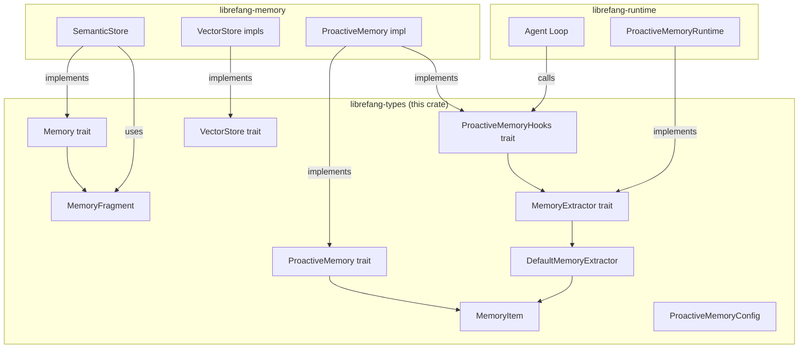
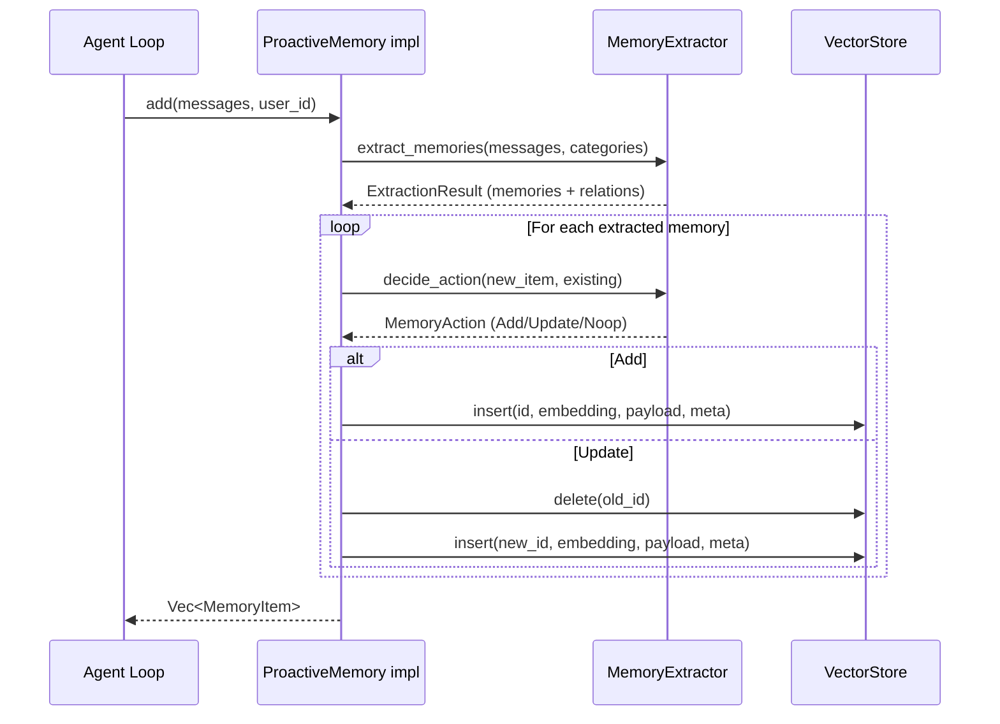

# Memory System — librefang-types-src

# Memory System — `librefang-types/src/memory.rs`

## Purpose

This module defines every type, trait, and helper that the rest of the memory subsystem depends on. It is the **type-only layer** — no storage backends, no database connections, no LLM calls live here. Other crates (`librefang-memory`, `librefang-runtime`) implement the traits and wire up real backends.

The module covers three concerns:

1. **Data structures** for storing and querying memory (`MemoryFragment`, `MemoryItem`, `Entity`, `Relation`, …)
2. **Trait abstractions** that decouple consumers from storage backends (`Memory`, `ProactiveMemory`, `VectorStore`, `MemoryExtractor`)
3. **Built-in algorithms** that any implementation can reuse (`cosine_similarity`, `text_similarity`, `DefaultMemoryExtractor`, default `decide_action` logic)

---

## Architecture Overview



---

## Memory Tiers

### `MemoryLevel`

Multi-level memory scoping. Each tier has a different lifecycle:

| Variant | Scope string | Lifecycle |
|---------|-------------|-----------|
| `User` | `"user_memory"` | Persists across sessions. Stores preferences, identity, expertise. |
| `Session` | `"session_memory"` | Current conversation only. TTL-gated (default 24 h). Stores task context. |
| `Agent` | `"agent_memory"` | Agent-specific learned behaviors. Persists like User but scoped to one agent. |

Construction helpers on `MemoryItem` map directly to these:

```rust
let user_mem = MemoryItem::user("Prefers dark mode");
let session_mem = MemoryItem::session("Debugging WebSocket reconnect logic");
let agent_mem = MemoryItem::agent("Always explain reasoning before giving code");
```

`MemoryLevel` parses flexibly — both `"user"` and `"user_memory"` resolve to `MemoryLevel::User`. Unknown strings default to `Session`.

---

## Core Data Structures

### `MemoryFragment`

The **internal storage unit** for the semantic store. A `MemoryFragment` is what gets persisted, embedded, and queried by the `Memory` trait's `remember`/`recall` operations.

Key fields:

| Field | Type | Purpose |
|-------|------|---------|
| `id` | `MemoryId` (UUID wrapper) | Unique identifier |
| `agent_id` | `AgentId` | Owning agent |
| `content` | `String` | Textual content |
| `embedding` | `Option<Vec<f32>>` | Populated by the semantic store's embedding driver |
| `metadata` | `HashMap<String, serde_json::Value>` | Arbitrary key-value pairs (category, peer_id, etc.) |
| `source` | `MemorySource` | Origin (Conversation, Document, Observation, …) |
| `confidence` | `f32` | 0.0–1.0 score, subject to exponential decay |
| `scope` | `String` | Collection name — maps to `MemoryLevel::scope_str()` or custom values |
| `modality` | `MemoryModality` | Text, Image, or MultiModal |
| `image_embedding` | `Option<Vec<f32>>` | Separate embedding for image payloads |

### `MemoryItem`

The **external-facing** memory type for the mem0-style `ProactiveMemory` API. Simpler than `MemoryFragment` — no embedding vectors, no internal IDs.

Use `MemoryItem::from_fragment(frag)` to convert from the internal representation. The conversion maps `MemoryFragment.scope` → `MemoryLevel`, extracts `category` from metadata, and populates access statistics.

Builder-style chainable methods:

```rust
let item = MemoryItem::user("Prefers concise answers")
    .with_category("communication_style")
    .with_metadata("channel", json!("slack"));
```

### `MemoryFilter`

Filter criteria passed to `recall` and `VectorStore::search`. Supports:

- `agent_id`, `source`, `scope` — identity filters
- `min_confidence` — quality gate
- `after`/`before` — time range
- `metadata` — arbitrary key-value match
- `peer_id` — per-user isolation in multi-user channels

Constructors: `MemoryFilter::agent(id)`, `MemoryFilter::scope("user_memory")`.

### Knowledge Graph Types

| Type | Role |
|------|------|
| `Entity` | Node: person, org, project, concept, etc. |
| `EntityType` | Enum including `Custom(String)` for extensibility |
| `Relation` | Directed edge with confidence score |
| `RelationType` | Enum: `WorksAt`, `KnowsAbout`, `Uses`, `PartOf`, `Custom(String)`, … |
| `GraphPattern` | Query template (source/relation/target filters + max depth) |
| `GraphMatch` | Query result: (source entity, relation, target entity) triple |
| `RelationTriple` | Lightweight (subject, relation, object) extracted from conversation |

---

## Traits

### `Memory` — Unified Agent Memory API

The high-level interface agents use. Abstracts over structured (key-value), semantic (vector), and graph storage:

| Method | Store | Description |
|--------|-------|-------------|
| `get` / `set` / `delete` | Key-value | Per-agent structured storage |
| `remember` | Semantic | Store a `MemoryFragment` with auto-embedding |
| `recall` | Semantic | Vector similarity search with optional `MemoryFilter` |
| `forget` | Semantic | Soft-delete by `MemoryId` |
| `add_entity` / `add_relation` / `query_graph` | Graph | Knowledge graph CRUD |
| `consolidate` | Maintenance | Merge duplicates, decay confidence |
| `export` / `import` | Maintenance | Serialize/deserialize all data (`Json` or `MessagePack`) |

### `ProactiveMemory` — mem0-Style API

Simplified, user-centric operations. Implementations live in `librefang-memory/src/proactive.rs`.

| Method | Description |
|--------|-------------|
| `search(query, user_id, limit)` | Semantic search scoped to a user |
| `add(messages, user_id)` | Extract + store memories from conversation messages |
| `add_with_level(messages, user_id, level)` | Same, but at a specific `MemoryLevel` |
| `get(user_id)` | Retrieve all user memories |
| `list(user_id, category)` | Filtered listing |
| `delete(memory_id, user_id)` | Remove by ID |
| `update(memory_id, user_id, content)` | Replace content, preserve metadata |

### `ProactiveMemoryHooks` — Auto-Memorize / Auto-Retrieve

Called by the agent loop (`librefang-runtime/src/agent_loop.rs`) before and after execution:

- **`auto_memorize`** — Runs after the agent finishes. Extracts facts from the conversation and stores them. Accepts `peer_id` for multi-user channel isolation.
- **`auto_retrieve`** — Runs before the agent starts. Loads relevant context given the incoming query.

### `VectorStore` — Pluggable Vector Backend

Abstracts the embedding storage layer so implementations can swap between SQLite (default), Qdrant, Pinecone, etc.

| Method | Description |
|--------|-------------|
| `insert(id, embedding, payload, metadata)` | Upsert a vector |
| `search(query_embedding, limit, filter)` | ANN search, descending by similarity |
| `delete(id)` | Remove by ID |
| `get_embeddings(ids)` | Batch fetch stored embeddings |
| `backend_name()` | Human-readable identifier (e.g. `"sqlite"`, `"qdrant"`) |

---

## `MemoryExtractor` Trait and Conflict Resolution

`MemoryExtractor` is the intelligence layer for the proactive memory system. It has two responsibilities:

1. **Extract** important facts and relationships from raw conversation messages
2. **Decide** what to do when a new memory conflicts with an existing one

### Extraction

Two methods:

- `extract_memories(messages, categories)` — Primary entry point
- `extract_memories_with_agent_id(messages, agent_id, categories)` — Preferred when the agent ID is known; allows implementations to route the LLM call through a forked agent turn for prompt cache reuse. Default delegates to `extract_memories`, ignoring the agent ID.

Both return an `ExtractionResult` containing:
- `memories: Vec<MemoryItem>` — Extracted facts
- `relations: Vec<RelationTriple>` — Relationship triples for the knowledge graph
- `has_content: bool` — Whether anything was found
- `conflicts: Vec<MemoryConflict>` — Detected contradictions

### Conflict Decision (`decide_action`)

The default implementation in the trait provides a **tiered heuristic** that any implementor can override:

```
1. Exact string match → Noop
2. Existing ⊃ new     → Noop (already covered)
3. New ⊃ existing     → Update (new is more complete)
4. Embedding available → cosine_similarity
   else               → Jaccard word overlap (text_similarity)
   ≥ 0.95             → Noop (near-duplicate)
   > threshold*       → Update (best candidate wins)
   otherwise          → Add
```

\* Threshold is `0.5` when both memories share the same category, `0.6` otherwise.

The `MemoryAction` enum captures the outcome:

```rust
pub enum MemoryAction {
    Add,                                          // No conflict
    Update { existing_id: String },               // Supersedes existing
    Noop,                                         // Duplicate / subsumed
}
```

When an `Update` action is taken and the old and new content appear contradictory (low similarity + negation patterns), a `MemoryConflict` is surfaced in the `MemoryAddResult` so callers can log or handle it.

### `DefaultMemoryExtractor`

A rule-based extractor that requires **no LLM**. It scans user messages for keyword patterns across four categories:

| Category | Example triggers |
|----------|-----------------|
| Preference | "I prefer …", "I never …", "My favorite …" |
| Personal detail | "My name is …", "I work at …", "I live in …" |
| Tool/technology | "I use …", "Our tech stack is …", "I code in …" |
| Project context | "I'm trying to …", "The bug is …" (session-level, >10 chars) |

Extraction uses `extract_after_pattern` to grab the phrase up to the first sentence boundary, avoiding storing entire messages. Internal dedup (`push_memory`) skips identical content.

The `format_context` method produces a natural-language preamble that instructs the agent to use remembered context naturally without meta-commentary ("based on my memory…").

---

## Similarity Functions

### `text_similarity(a, b) -> f32`

Jaccard word overlap. Tokenizes both strings on whitespace, computes intersection/union. Returns `0.0` for two empty strings (not `1.0`).

Used as a fallback when embeddings are unavailable.

### `cosine_similarity(a, b) -> f32`

Standard dot-product cosine similarity on `f32` slices. Returns:
- `1.0` for identical direction
- `0.0` for orthogonal or empty/mismatched vectors
- `-1.0` for opposite direction

---

## Configuration: `ProactiveMemoryConfig`

Controls the proactive memory subsystem. Loaded from `config.toml` under `[proactive_memory]`.

| Field | Default | Purpose |
|-------|---------|---------|
| `enabled` | `true` | Master toggle |
| `auto_memorize` | `true` | Extract after agent execution |
| `auto_retrieve` | `true` | Load context before agent execution |
| `max_retrieve` | `10` | Cap on memories per query |
| `extraction_threshold` | `0.7` | Confidence floor for near-duplicate detection |
| `extraction_model` | `None` | LLM model for extraction; `None` → rule-based |
| `extract_categories` | 7 defaults (communication_style, preference, expertise, …) | Restricts what the extractor looks for |
| `session_ttl_hours` | `24` | Auto-cleanup age for session memories |
| `duplicate_threshold` | `0.5` | Similarity floor for duplicate detection |
| `confidence_decay_rate` | `0.01` | Exponential decay per day (~70 days to halve) |
| `max_memories_per_agent` | `1000` | Eviction cap; `0` disables |

---

## Cross-Crate Integration Points

This module has no outgoing dependencies — it only defines types. The rest of the system consumes it:

| Consumer | What it uses |
|----------|-------------|
| `librefang-memory/src/proactive.rs` | `ProactiveMemory`, `ProactiveMemoryHooks` implementations; `MemoryAddResult`, `MemoryId`, `text_similarity`, `scope_str`, `Entity`, `Relation` |
| `librefang-memory/src/semantic.rs` | `MemoryFragment`, `VectorSearchResult` as return types |
| `librefang-memory/src/substrate.rs` | `ImportReport` from the `Memory::import` path |
| `librefang-runtime/src/proactive_memory.rs` | `ProactiveMemoryConfig`, `MemoryExtractor` implementation (LLM-backed); `ExtractionResult`, `RelationTriple`, `MemoryItem` for parsing LLM responses |
| `librefang-runtime/src/agent_loop.rs` | `MemoryFilter`, `MemoryFragment`, `MemoryId`, `scope_str` for proactive item → fragment conversion and recalled-memory setup |
| `librefang-runtime/src/context_engine.rs` | `MemoryFragment`, `MemoryFilter` for context ingestion |
| `src/routes/memory.rs` | `MemoryFragment` for update/delete flows |

---

## Operational Flows

### Adding a Memory (mem0-style)



### Auto-Memorize / Auto-Retrieve Cycle

1. **Before execution**: Agent loop calls `auto_retrieve(user_id, query, peer_id)`. Relevant memories are loaded and injected into the agent's context via `format_context`.
2. **After execution**: Agent loop calls `auto_memorize(user_id, conversation, peer_id)`. New facts are extracted and stored. Session memories older than `session_ttl_hours` are cleaned up. If `max_memories_per_agent` is exceeded, oldest/lowest-confidence memories are evicted.

### Confidence Decay

Memories not accessed lose confidence over time following exponential decay:

```
effective_confidence = confidence * e^(-confidence_decay_rate * days_since_access)
```

With the default rate of `0.01`, a memory retains ~50% confidence after ~70 days. Consolidation runs apply this decay and may merge or evict memories below threshold.