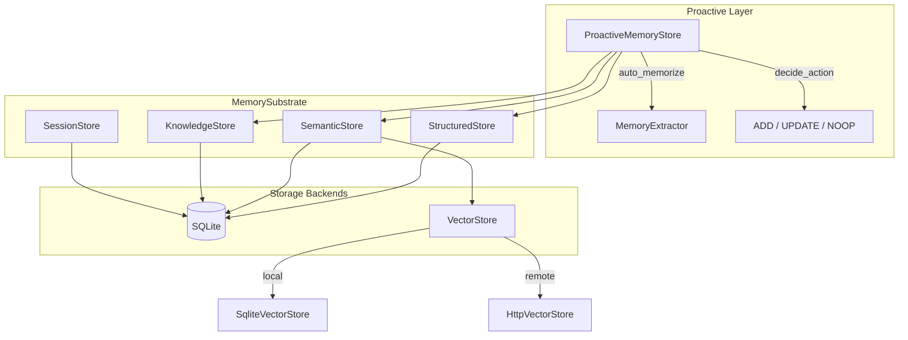

# Memory System

# Memory System (`librefang-memory`)

## Overview

The memory system provides persistent, multi-modal storage for LibreFang agents. It unifies three distinct storage paradigms behind a single `MemorySubstrate` facade:

- **Structured store** — per-agent key-value pairs for configuration, state, and indexed memory items
- **Semantic store** — free-text memories with optional vector embeddings for similarity search
- **Knowledge graph** — entities and relations supporting pattern-based graph queries

On top of these, a **proactive memory** layer (mem0-style) adds automatic extraction, deduplication, conflict detection, confidence decay, and eviction.

All data lives in SQLite. Vector operations are delegated to an injectable `VectorStore` backend — either the built-in `SqliteVectorStore` (cosine similarity over stored blobs) or `HttpVectorStore` (remote service).

## Architecture



## Key Components

### `MemorySubstrate` (`substrate.rs`)

The top-level entry point. Owns a single SQLite connection (wrapped in `Arc<Mutex<Connection>>`) and exposes all operations across every store. Created via:

- `MemorySubstrate::open(path, embedding_dim)` — opens/creates a database file
- `MemorySubstrate::open_in_memory(embedding_dim)` — in-memory database for tests
- `MemorySubstrate::open_with_chunking(path, embedding_dim, chunk_config)` — enables automatic text chunking for long documents

The substrate runs migrations on creation and provides methods like `remember`, `recall`, `recall_with_embedding`, `query_graph`, `save_session`, `task_post`, and `import`.

### Structured Store (`structured.rs`)

Per-agent key-value storage. Each key is scoped to an `AgentId`. Values are arbitrary `serde_json::Value`. Used for:

- Agent state persistence
- Memory item metadata (`memory:<id>` keys)
- Task queue entries
- Agent registration

Key methods: `set`, `get`, `delete`, `list_kv`, `remove_agent`.

### Semantic Store (`semantic.rs`)

Free-text memories with confidence scores, access tracking, scope classification, and optional vector embeddings. Each memory is a row in the `memories` table with:

| Column | Purpose |
|--------|---------|
| `content` | The memory text |
| `embedding` | Serialized `Vec<f32>` blob |
| `scope` | `user_memory`, `session_memory`, `agent_memory`, or `episodic` |
| `confidence` | 0.0–1.0 score, decayed over time |
| `accessed_at` / `access_count` | Tracks recency and frequency |
| `peer_id` | Per-user isolation within an agent |
| `modality` | `text` or future multimodal types |

**Search behavior** depends on whether embeddings are available:

- **With embeddings**: `recall_with_embedding` computes cosine similarity between the query embedding and stored embeddings, falling back to LIKE matching when no embedding exists for a memory.
- **Without embeddings**: `recall` uses SQL `LIKE` matching against content.

Key methods: `remember`, `remember_with_embedding`, `recall`, `recall_with_embedding`, `forget`, `update_content`, `get_by_id`, `lowest_confidence`, `count`.

### Knowledge Graph (`knowledge.rs`)

Stores entities (`EntityType::Person`, `Organization`, `Concept`, `Custom`, etc.) and typed relations (`WorksAt`, `Knows`, `RelatedTo`, etc.) in SQLite tables.

Important design detail: relations can reference entities **by ID or by name**. The MCP tool layer typically uses names, so the SQL JOINs in `query_graph` match on both `r.source_entity = s.id` and `r.source_entity = s.name`. This is covered by a regression test (`test_query_graph_relation_references_by_name`).

Key methods: `add_entity`, `add_relation`, `query_graph(GraphPattern)`, `has_relation`, `delete_by_agent`.

### Session Store (`session.rs`)

Manages conversation history per session and agent. Supports:

- **Standard sessions**: Per-session message lists with FTS5 full-text search
- **Canonical sessions**: Cross-channel persistent memory that merges messages from multiple channels (e.g., WhatsApp, API) for the same agent
- **JSONL mirrors**: Append-only log files for external consumption
- **Compaction**: Summarizes old messages to manage context window size

`canonical_context(agent_id, channel)` returns recent messages for a specific channel, enabling chat-scoped isolation while maintaining a shared agent memory.

### Text Chunker (`chunker.rs`)

Splits long documents into overlapping chunks for embedding-based storage. Splitting strategy (in priority order):

1. **Paragraph boundaries** (`\n\n`)
2. **Sentence boundaries** (`. `, `.\n`, `。`, `？`, `！`)
3. **Hard character limit** (Unicode-safe, respects char boundaries)

```rust
pub fn chunk_text(text: &str, max_size: usize, overlap: usize) -> Vec<String>
```

Overlap is applied by prepending the last `overlap` characters of the previous chunk to the next. When chunking is enabled on the substrate, `remember` automatically chunks text exceeding the configured limit and stores each chunk as a separate memory. Each chunk gets its own embedding (not shared).

### Proactive Memory (`proactive.rs`)

The mem0-style API layer. Implements the `ProactiveMemory` and `ProactiveMemoryHooks` traits.

**Core flow for `add()`**:

```
messages → MemoryExtractor::extract() → MemoryItem[]
    for each item:
        embed content (if driver available)
        search for similar existing memories (top 5)
        decide_action(item, existing) → ADD | UPDATE | NOOP
        execute action:
            ADD → semantic.remember + structured.set
            UPDATE → semantic.update_content (in-place) + conflict detection
            NOOP → skip (duplicate)
```

**Conflict detection**: When updating, the system compares old and new content for contradictory signals. If a conflict is detected, it's logged and flagged in metadata with a `version_history` chain.

**Auto-consolidation**: Runs every 10 `auto_memorize` calls per agent. Merges highly similar memories (>90% text similarity via Jaccard).

**Confidence decay**: Rate-limited to once per hour. Applies exponential decay:
```
new_confidence = confidence * e^(-decay_rate * days_since_access)
```
Frequently accessed memories get a boost: `* min(1.0 + log2(access_count), 2.0)`.

**Session TTL cleanup**: Also rate-limited to once per hour. Soft-deletes `session_memory` scope entries older than the configured TTL.

**Memory cap enforcement**: When `max_memories_per_agent` is set, adding memories that exceed the cap triggers eviction of the lowest-confidence memories.

**Export/Import**: `export_all` returns all memories as `Vec<MemoryExportItem>`. `import_memories` deduplicates against existing content (>90% similarity) before storing.

### Consolidation Engine (`consolidation.rs`)

Two-phase consolidation cycle:

1. **Decay**: Reduces confidence of memories not accessed in 7+ days by a configurable `decay_rate` factor (minimum floor: 0.1).
2. **Merge**: Compares all active memories pairwise (sorted by confidence descending). Pairs with >90% text similarity are merged — the lower-confidence memory is soft-deleted, and if it had higher confidence somehow, the keeper is lifted to that value. Capped at 100 merges per run to avoid O(n²) blowout.

Returns a `ConsolidationReport` with counts and duration.

### Decay (`decay.rs`)

Scope-based TTL deletion (hard delete, not soft):

| Scope | Behavior |
|-------|----------|
| `user_memory` | Never decays — permanent |
| `session_memory` | Deleted after `session_ttl_days` of no access |
| `agent_memory` | Deleted after `agent_ttl_days` of no access |

Accessing a memory (via `recall_with_embedding`) updates `accessed_at`, resetting the timer. Configured via `MemoryDecayConfig` with an `enabled` flag.

### HTTP Vector Store (`http_vector_store.rs`)

A `VectorStore` implementation that delegates to a remote HTTP service. Useful for plugging in Qdrant, Weaviate, or custom microservices.

Expected API contract:

| Method | Path | Purpose |
|--------|------|---------|
| POST | `/insert` | Store embedding + payload |
| POST | `/search` | Nearest-neighbor search |
| DELETE | `/delete` | Remove by ID |
| POST | `/get_embeddings` | Batch fetch embeddings |

### Migrations (`migration.rs`)

Versioned schema migrations using SQLite's `user_version` pragma. Currently at schema version 21. Each migration is idempotent (checks for existing columns/tables before altering). Key schema additions across versions:

- **v1**: Core tables (agents, sessions, memories, entities, relations, kv_store, task_queue)
- **v3**: Embedding column on memories
- **v5**: Canonical sessions for cross-channel memory
- **v9**: Performance indexes for proactive memory queries
- **v10**: `agent_id` on entities/relations for per-agent cleanup
- **v12**: FTS5 virtual table for session search
- **v13**: Prompt versioning and A/B testing tables
- **v15**: Multimodal memory columns (image_url, image_embedding, modality)
- **v16**: `peer_id` on memories/sessions for per-user isolation
- **v20–v21**: Task queue `claimed_at` and `retry_count` for stuck-task detection

### Memory Provider (`provider.rs`)

A plugin system with a `MemoryProvider` trait and `MemoryManager` that supports hot-swappable backends. Includes `NullMemoryProvider` for agents that don't need persistence.

## Usage Patterns

### Basic remember/recall

```rust
let substrate = MemorySubstrate::open_in_memory(1536)?;
let agent_id = AgentId(Uuid::new_v4());

// Store a memory
substrate.remember(agent_id, "User prefers dark mode", MemorySource::Conversation, "user_memory", HashMap::new())?;

// Recall memories
let results = substrate.recall("preferences", 10, Some(MemoryFilter::agent(agent_id)))?;
```

### With vector embeddings

```rust
// During substrate creation or later:
substrate.set_vector_store(Arc::new(SqliteVectorStore::new(conn, 1536)));

// Recall with embedding similarity
let query_embedding: Vec<f32> = embed("dark mode settings");
let results = substrate.recall_with_embedding("dark mode", 10, filter, Some(&query_embedding))?;
```

### Proactive memory (mem0-style)

```rust
let store = ProactiveMemoryStore::with_default_config(Arc::new(substrate))
    .with_embedding(embedding_driver);

// Auto-memorize from conversation
store.add(&messages, "user-123").await?;

// Search
let results = store.search("dark mode preferences", "user-123", 10).await?;

// Auto-retrieve context before agent execution
let context = store.auto_retrieve("user-123", "What are my settings?").await?;
```

### Knowledge graph queries

```rust
let knowledge = substrate.knowledge();
knowledge.add_entity(Entity { name: "Alice".into(), entity_type: EntityType::Person, ... }, "agent-1")?;
knowledge.add_relation(Relation { source: "Alice", relation: RelationType::WorksAt, target: "Acme", ... }, "agent-1")?;

let matches = knowledge.query_graph(GraphPattern {
    source: Some("Alice".into()),
    relation: Some(RelationType::WorksAt),
    target: None,
    max_depth: 1,
})?;
```

## Integration Points

The memory system is consumed by:

- **Agent loop** (`librefang-runtime/src/agent_loop.rs`): Calls `recall_with_embedding_async` to inject relevant memories into the LLM context, and `remember` to persist interaction facts after each turn.
- **Context engine** (`librefang-runtime/src/context_engine.rs`): Uses `MemorySubstrate` as the backing store for context assembly.
- **Session compactor** (`librefang-runtime/src/compactor.rs`): Reads session history for summarization.
- **Proactive memory init** (`librefang-runtime/src/proactive_memory.rs`): Constructs `ProactiveMemoryStore` with the appropriate extractor and embedding driver.
- **API routes** (`src/routes/memory.rs`): HTTP endpoints for memory CRUD call into `ProactiveMemoryStore` and `SemanticStore`.
- **Frontend queries** (`lib/queries/memory.ts`, `lib/queries/hands.ts`): Read memory stats via the `stats()` method.