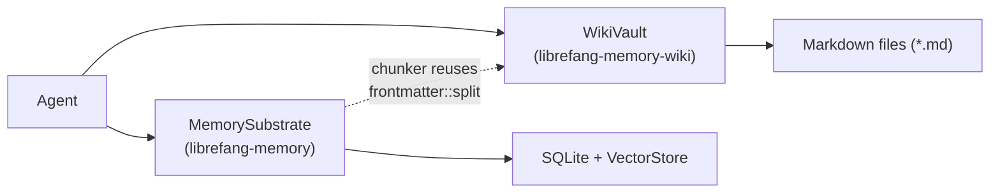

# Memory System

# Memory System

The Memory System provides LibreFang agents with durable, queryable state through two complementary storage layers: a structured persistence substrate and a human-editable knowledge vault.

## Sub-modules

| Sub-module | Role |
|---|---|
| [librefang-memory](librefang-memory-src.md) | Core persistence — SQLite-backed key/value and vector storage, plus decay, consolidation, idempotency, and usage metering services. |
| [librefang-memory-wiki](librefang-memory-wiki-src.md) | Markdown knowledge vault — durable, Obsidian-compatible pages with auditable provenance frontmatter. Off by default; operators opt in via configuration. |

## How the layers fit together

**librefang-memory** is the primary store. All structured agent state flows through the `MemorySubstrate` entry point into SQLite (WAL mode via `r2d2` + `rusqlite`) and a pluggable `VectorStore` backend (`SqliteVectorStore` for single-file deployment or `HttpVectorStore` for remote vector search).

**librefang-memory-wiki** sits alongside it as an optional, human-readable layer. Pages are plain Markdown with YAML frontmatter recording which agent, session, channel, and turn produced each claim — making every fact auditable without querying the database.

The two layers share a thin code-level dependency: the chunker in `librefang-memory` reuses the `frontmatter::split` function from `librefang-memory-wiki` when segmenting text. Otherwise they are independent — an agent can use either or both without coupling.

## Key cross-module workflows

- **Write path** — Agents persist structured memories through `MemorySubstrate` and, when the wiki is enabled, publish curated knowledge to `WikiVault` via `wiki_write`.
- **Read path** — Agents recall facts from the SQLite/vector substrate; operators and agents browse the wiki vault through `wiki_get` and `wiki_search`.
- **Consolidation & decay** — `librefang-memory` automatically merges similar memories, decays old ones, and enforces idempotency and usage quotas — all invisible to the wiki layer.