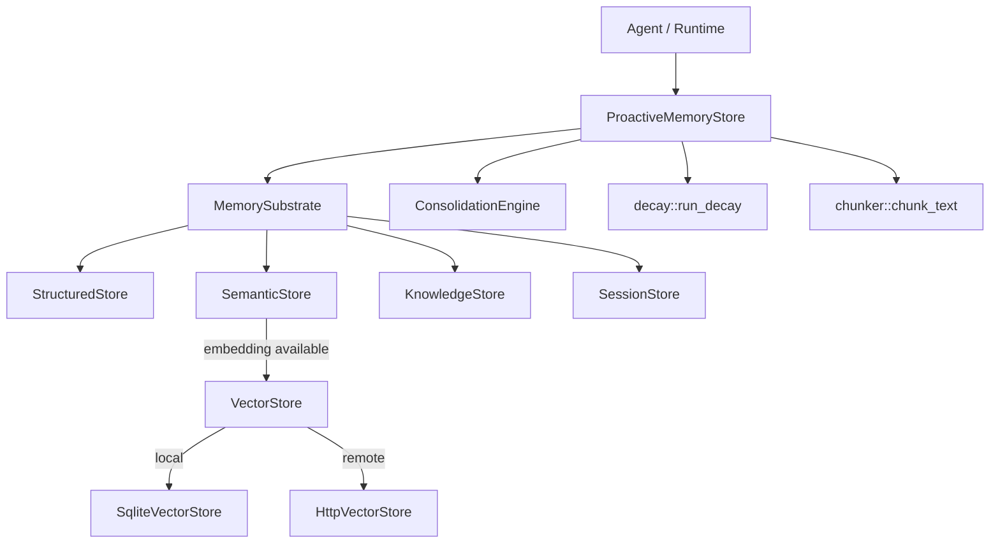

# Memory System

# Memory System (`librefang-memory`)

Persistent memory substrate for the LibreFang Agent Operating System. Agents read and write memories through a unified API that spans three storage layers — structured key-value, semantic text/vector search, and a knowledge graph — all backed by SQLite with optional external vector databases.

## Architecture

## Storage Layers

### Structured Store (`structured`)

Per-agent key-value store persisted in the `kv_store` SQLite table. Used for agent state, configuration blobs, and memory item metadata keyed as `memory:<id>`.

Primary operations: `set`, `get`, `delete`, `list_kv`, `remove_agent`.

### Semantic Store (`semantic`)

Stores arbitrary text memories with optional vector embeddings in the `memories` table. Supports both keyword (LIKE) search and vector similarity search depending on whether an embedding driver is configured.

Key methods:
- `remember` / `remember_with_embedding` — store a memory fragment
- `recall` — keyword-based retrieval
- `recall_with_embedding` — vector similarity retrieval, falls back to keyword search when no embedding is available
- `update_content` — in-place content update preserving ID and access stats
- `forget` / `forget_session_older_than_global` — soft/hard delete
- `lowest_confidence` — fetch N memories with lowest confidence (used for eviction)

Memories carry a `scope` field (`user_memory`, `session_memory`, `agent_memory`, `episodic`) that governs visibility and decay behavior.

### Knowledge Graph (`knowledge`)

SQLite-backed graph with `entities` and `relations` tables. Entities have an `entity_type` (Person, Organization, Concept, etc.) and arbitrary JSON properties. Relations connect two entities with a typed edge and a confidence score.

`query_graph` accepts a `GraphPattern` with optional source, relation type, and target filters. The JOIN matches entities by both ID and name, which is critical for the MCP tool path that references entities by name rather than UUID.

`has_relation` checks for duplicate edges before insertion.

### Session Store (`session`)

Manages conversation sessions in the `sessions` table with support for canonical cross-channel session history (`canonical_sessions` table). Each session stores a message log, optional label, and `peer_id` for per-user isolation.

Notable features:
- **Canonical sessions**: A single persistent conversation per agent that merges messages from multiple channels (WhatsApp, web, etc.), enabling cross-channel memory continuity.
- **FTS5 full-text search**: A virtual table `sessions_fts` enables full-text search over session content.
- **JSONL mirroring**: Sessions can be mirrored to a `.jsonl` file for external processing.
- **Session cleanup**: `cleanup_expired_sessions` removes old sessions based on configurable retention limits.

## Proactive Memory (`proactive`)

The mem0-style API layer that wraps `MemorySubstrate` with intelligent memory management. `ProactiveMemoryStore` implements two traits:

### `ProactiveMemory` — CRUD API

| Method | Description |
|--------|-------------|
| `search(query, user_id, limit)` | Semantic search across all memory levels for a user |
| `add(messages, user_id)` | Extract and store memories from conversation messages |
| `get(memory_id)` | Retrieve a single user-level memory |
| `delete(memory_id)` | Delete a memory by ID |
| `list(user_id, level, category)` | List memories with optional filters |
| `update(memory_id, content)` | Update memory content in-place |
| `export_all(agent_id)` | Export all memories as a flat JSON list |
| `import_memories(agent_id, items)` | Bulk import with duplicate detection |
| `stats(agent_id)` | Return memory statistics |

### `ProactiveMemoryHooks` — Automatic Hooks

| Method | Description |
|--------|-------------|
| `auto_memorize(agent_id, peer_id, messages)` | Extract facts from messages, deduplicate, and store |
| `auto_retrieve(agent_id, query)` | Search memories and return formatted context string |

### Decision Flow

When `add` or `auto_memorize` processes a message:

1. The `MemoryExtractor` (default: rule-based `DefaultMemoryExtractor`) extracts `MemoryItem` candidates from the messages.
2. For each item, `add_with_decision` searches for similar existing memories.
3. The extractor's `decide_action` returns one of:
   - **ADD** — New memory, no close match exists.
   - **UPDATE** — Close match found; update the existing memory in-place. A version history chain is maintained in metadata.
   - **NOOP** — Duplicate; skip silently.
4. Conflict detection compares old vs. new content and flags contradictory updates.
5. Extracted relation triples are stored in the knowledge graph with deduplication.

### Embedding Integration

When an `EmbeddingFn` is provided via `with_embedding()`:

- Memories are stored with vector embeddings in the `embedding` BLOB column.
- `recall_with_embedding` performs vector similarity search via the configured `VectorStore`.
- Without an embedding driver, search falls back to keyword LIKE matching.

### Memory Cap and Eviction

When `max_memories_per_agent` is configured (non-zero), every add/import triggers `evict_if_over_cap`. This fetches the lowest-confidence memories via `SemanticStore::lowest_confidence` and removes them (both from the semantic table and the KV mirror).

### Periodic Maintenance

Three maintenance tasks run automatically, each rate-limited to at most once per hour:

| Task | Trigger | Purpose |
|------|---------|---------|
| `decay_confidence` | search, auto_retrieve | Exponential confidence decay: `conf * e^(-rate * days)` with a log-based boost for frequently accessed memories |
| `cleanup_expired` | search, auto_retrieve | Soft-delete session-level memories older than `session_ttl_hours` |
| `consolidate` | every 10th `auto_memorize` per agent | Merge highly similar memories (>90% Jaccard similarity) |

All three are invoked by `maybe_run_maintenance`, which is called from `search`, `auto_retrieve`, and after consolidation counters hit threshold.

## Text Chunking (`chunker`)

Long documents are split into overlapping chunks before embedding. `chunk_text(text, max_size, overlap)` applies a three-level splitting strategy:

1. **Paragraph boundaries** (`\n\n`)
2. **Sentence boundaries** (`. ` / `.\n`, `。`, `？`, `！`) for oversized paragraphs
3. **Hard character split** for oversized sentences

Overlap is applied by prepending the last `overlap` characters of the previous chunk. All length calculations are character-based (not byte-based) for correct Unicode handling.

## Memory Decay (`decay`)

Scope-based time decay that hard-deletes stale memories:

| Scope | Behavior |
|-------|----------|
| `user_memory` | **Never** decays — permanent user knowledge |
| `session_memory` | Decays after `session_ttl_days` of no access |
| `agent_memory` | Decays after `agent_ttl_days` of no access |

Decay is driven by `MemoryDecayConfig` and gated by `config.enabled`. Accessing a memory (via search/recall) updates `accessed_at`, resetting the decay timer.

## Consolidation (`consolidation`)

`ConsolidationEngine` performs two phases per cycle:

1. **Confidence decay**: Reduces confidence of memories not accessed in 7 days by a factor of `(1 - decay_rate)`, floored at 0.1.
2. **Duplicate merge**: Loads all active memories sorted by confidence, compares all pairs via `text_similarity` (Jaccard on lowercase words), and merges pairs above 90% similarity. The higher-confidence memory is kept; the lower is soft-deleted and its confidence is lifted if it was higher. Capped at 100 merges per run to avoid O(n²) blowup.

Returns a `ConsolidationReport` with counts and duration.

## Vector Store Abstraction (`http_vector_store`)

`HttpVectorStore` implements the `VectorStore` trait by delegating to a remote HTTP service. This allows LibreFang to use external vector databases (Qdrant, Weaviate, custom services) without native client dependencies.

Expected API contract:

| Method | Endpoint | Purpose |
|--------|----------|---------|
| `insert` | `POST /insert` | Store a vector with payload and metadata |
| `search` | `POST /search` | K-nearest-neighbor search |
| `delete` | `DELETE /delete` | Remove a vector by ID |
| `get_embeddings` | `POST /get_embeddings` | Batch fetch raw embeddings by IDs |

`SqliteVectorStore` provides a local alternative backed by SQLite (used when no external service is configured).

## Schema Migrations (`migration`)

The database schema is versioned via SQLite's `user_version` pragma. `run_migrations` applies sequential migrations from the current version to `SCHEMA_VERSION` (currently 19). Key tables created across versions:

| Version | Addition |
|---------|----------|
| 1 | Core tables: agents, sessions, events, kv_store, task_queue, memories, entities, relations |
| 3 | `embedding` BLOB column on memories |
| 4 | `usage_events` for cost tracking |
| 5 | `canonical_sessions` for cross-channel memory |
| 9 | Performance indexes for proactive memory queries |
| 10 | `agent_id` on entities and relations |
| 12 | FTS5 virtual table for session search |
| 13 | Prompt versioning and A/B testing tables |
| 15 | Multimodal columns (image_url, image_embedding, modality) |
| 16 | `peer_id` on memories and sessions for per-user isolation |
| 17 | `approval_audit` table |
| 19 | `provider` column on usage_events for per-provider budgets |

Migrations are idempotent — `column_exists` guards prevent duplicate ALTER TABLE errors.

## Memory Provider Plugin System (`provider`)

A trait-based plugin interface:

- **`MemoryProvider`** — Trait for pluggable memory backends.
- **`MemoryManager`** — Orchestrates providers.
- **`NullMemoryProvider`** — No-op implementation for testing or when memory is disabled.

## Integration Points

### From the Runtime (`librefang-runtime`)

- **Agent loop** (`agent_loop.rs`): Calls `save_session_async` after each turn and `remember` via `remember_interaction_best_effort`. Recalls memories via `recall_with_embedding_async` during `setup_recalled_memories`.
- **Context engine** (`context_engine.rs`): Creates `MemorySubstrate` instances and uses `remember` to store extracted facts.
- **Proactive memory** (`proactive_memory.rs`): Initializes `ProactiveMemoryStore` with optional LLM extractor and embedding driver, calls `with_embedding` to attach the driver.
- **Compactor** (`compactor.rs`): Reads `Session` objects to decide whether compaction is needed and to compact message history.

### From the API Layer (`librefang-api`)

- **Memory routes** (`memory.rs`): Handle memory CRUD HTTP endpoints, calling `get_by_id` on the semantic store to resolve memory ownership.
- **Agent routes** (`agents.rs`): Call `save_session` and `get_session` during message injection.
- **Skills routes** (`skills.rs`): Trigger session persistence through the hand_send_message flow.