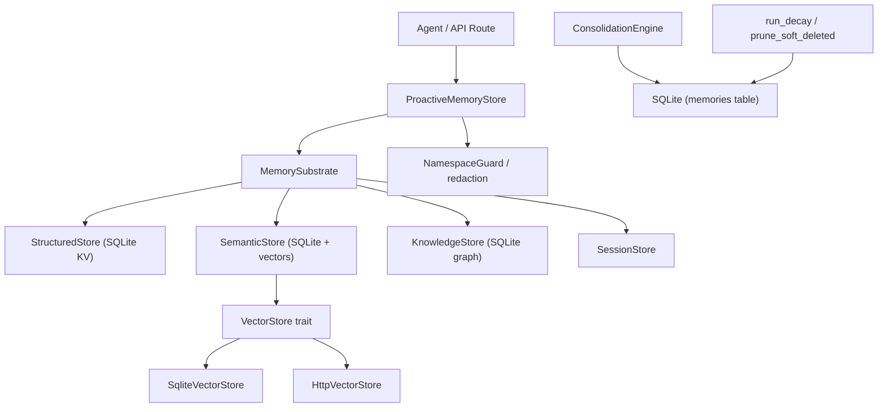

# Memory System

# Memory System (`librefang-memory`)

## Purpose

The memory substrate provides persistent, searchable memory for LibreFang agents. It unifies three storage paradigms—structured key-value, semantic text/vector search, and a knowledge graph—behind a single API that agents interact with through the `Memory` trait defined in `librefang-types`.

The module handles the full memory lifecycle: ingestion (with optional text chunking), recall (via LIKE matching or vector similarity), access tracking, confidence decay, duplicate consolidation, scope-based expiration, and eventual hard deletion.

## Architecture

## Storage Backends

### Structured Store (`structured.rs`)

Per-agent key-value storage in the `kv_store` table. Supports namespaced keys with prefix-based access control via `MemoryNamespaceGuard`. Operations are `get`, `set`, `delete`, and `list_kv` (filtered by prefix).

### Semantic Store (`semantic.rs`)

Stores free-text memories in the `memories` table with optional vector embeddings. Recall supports two modes:

- **Phase 1 (text)**: `LIKE` matching against content when no embedding is available.
- **Phase 2 (vector)**: Delegates to a `VectorStore` implementation for similarity search.

Each recall updates `accessed_at` and increments `access_count`, which feeds into decay and consolidation decisions.

The `VectorStore` trait has two implementations:

| Implementation | Location | Use case |
|---|---|---|
| `SqliteVectorStore` | `semantic.rs` | Single-process, embedding stored as BLOB in SQLite |
| `HttpVectorStore` | `http_vector_store.rs` | External vector DB (Qdrant, Weaviate, etc.) over HTTP/JSON |

`HttpVectorStore` expects a remote service exposing four endpoints: `POST /insert`, `POST /search`, `DELETE /delete`, and `POST /get_embeddings`.

### Knowledge Graph (`knowledge.rs`)

Entities and relations stored in `entities` and `relations` tables. Supports:

- **Entity creation** with upsert semantics (`ON CONFLICT DO UPDATE`).
- **Relation creation** between entities, with confidence scores.
- **Pattern queries** via `query_graph(GraphPattern)` — supports filtering by source entity, relation type, and target entity, matching by either ID or name.
- **Agent-scoped cleanup** via `delete_by_agent`, wrapped in a transaction to prevent orphan entities.

Relations can reference entities by name (as MCP tools do) or by ID; the JOIN logic handles both.

## Memory Lifecycle

### 1. Ingestion — Text Chunking (`chunker.rs`)

Long documents are split into overlapping chunks before embedding. The `chunk_text(text, max_size, overlap)` function applies a three-tier splitting strategy:

1. **Paragraph boundaries** (`\n\n`) — preferred, preserves coherence.
2. **Sentence boundaries** (`. `, `.\n`, `。`, `？`, `！`) — used when a single paragraph exceeds `max_size`.
3. **Hard character split** — fallback for individual sentences that still exceed the limit.

Overlap is applied by prepending the last `overlap` characters of the previous chunk to the next chunk (separated by `\n\n`). If the overlap + new segment exceeds `max_size`, the overlap is dropped to stay within limits.

Character operations use proper UTF-8 boundary iteration, so multi-byte characters (CJK, emoji) are never split mid-codepoint.

### 2. Recall and Search

`ProactiveMemoryStore` exposes two search paths:

- **`search`** — Queries memories for a specific agent, filtered by optional namespace guard. Results pass through PII redaction (`redact_all` in `namespace_acl.rs`).
- **`search_all`** — Cross-agent search, also guarded by ACL.

Both paths flow into `SemanticStore::recall_with_embedding`, which:
1. Tries vector search first (if an embedding is available and a vector store is configured).
2. Falls back to `LIKE`-based text matching.
3. Updates `accessed_at` and `access_count` on matched memories.

### 3. Decay (`decay.rs`)

Time-based expiration governed by `MemoryDecayConfig`:

| Scope | TTL Config Key | Behavior |
|---|---|---|
| `user_memory` | — | Never decays. Permanent knowledge. |
| `session_memory` | `session_ttl_days` | Soft-deleted after N days of no access. |
| `agent_memory` | `agent_ttl_days` | Soft-deleted after N days of no access. |

`run_decay(conn, config)` issues `UPDATE ... SET deleted = 1, deleted_at = <unix_timestamp>` for stale memories. Timestamps are compared using SQLite's `datetime()` function to avoid RFC3339 string-comparison pitfalls (timezone offsets, fractional seconds).

Accessing a memory (via search/recall) resets the decay timer by updating `accessed_at`.

### 4. Consolidation (`consolidation.rs`)

`ConsolidationEngine::consolidate()` runs two phases:

**Phase 1 — Confidence Decay**: Reduces confidence of memories not accessed in the last 7 days by the configured `decay_rate` (floored at 0.1).

**Phase 2 — Duplicate Merge**: For each agent's active memories, computes pairwise text similarity. When similarity exceeds 90%:

- The higher-confidence memory is the **keeper**; the lower is soft-deleted.
- `access_count` is summed across both.
- Metadata JSON objects are unioned (keeper wins on key conflict; non-object values are preserved verbatim rather than coerced to `{}`).
- Embeddings are blended via a **running confidence-weighted average**: the keeper accumulates weight from every loser it absorbs, so a keeper that absorbs N losers produces an average over all N+1 original vectors—not a chain of pairwise blends biased toward the last loser.

The merge loop is capped at `MAX_MERGES_PER_RUN = 100` to avoid O(n²) blowup. All merges execute within a single outer transaction (one fsync), and consolidation is idempotent—subsequent runs pick up where the last left off.

Cross-tenant merges are prevented by processing each `agent_id` in isolation.

### 5. Hard Deletion (`prune_soft_deleted_memories`)

Soft-deleted rows retain their embedding BLOBs indefinitely. `prune_soft_deleted_memories(conn, older_than_days)` hard-deletes rows where `deleted = 1` and `deleted_at` is older than the threshold, reclaiming storage. Rows with `deleted_at = NULL` (pre-migration or manually soft-deleted) are left untouched.

## Proactive Memory (`proactive.rs`)

`ProactiveMemoryStore` implements the `ProactiveMemory` trait from `librefang-types`, providing a unified mem0-style API:

- **`auto_memorize`** — Extracts memory fragments from conversation text using configurable extractors (regex-based by default). Stores unique fragments, detects conflicts, and extracts knowledge-graph relations.
- **`search` / `search_all`** — Recall with optional namespace guards and PII redaction.
- **`add` / `add_with_decision`** — Direct memory insertion with optional conflict resolution.
- **`update`** — Edit an existing memory's content.
- **`history`** — Retrieve memory content by ID.
- **`stats`** — Return `MemoryStats` (total count, per-scope counts).
- **`consolidate`** — Delegate to `ConsolidationEngine`.
- **`cleanup_expired_sessions`** — Prune stale session memories.

## Schema and Migrations (`migration.rs`)

The database schema is at version 31. `run_migrations(conn)` applies each missing step in order, each wrapped in its own transaction. Key tables:

| Table | Purpose |
|---|---|
| `memories` | Semantic memories with embeddings, scope, confidence, metadata, multimodal fields |
| `entities` | Knowledge graph entities (typed, with properties, agent-scoped) |
| `relations` | Knowledge graph relations (typed, with confidence, agent-scoped) |
| `kv_store` | Per-agent key-value pairs |
| `sessions` | Session history with peer isolation |
| `usage_events` | Token/cost metering per agent, model, provider |
| `prompt_versions` | Prompt versioning and A/B testing |
| `audit_entries` | Merkle-chain audit trail |
| `migrations` | Applied migration audit log |

The migration system enforces forward-only upgrades—if the database schema version is newer than the binary supports, it refuses to run. Each migration records an audit row in the `migrations` table, and on boot the system verifies that `user_version` matches the audit row count, auto-healing any drift from prior bugs.

## Access Control (`namespace_acl.rs`)

`MemoryNamespaceGuard` wraps read/write operations with prefix-based filtering. On reads, results pass through `redact_all`, which applies PII redaction (SSN, phone numbers, etc.) via the `redact_pii_in_text` function from `librefang-types`.

The guard enforces that:
- Agents can only read/write keys matching their allowed namespace prefixes.
- Delete operations require an explicit `allow_delete` flag.

## Usage Tracking (`usage.rs`)

Records token usage and costs in `usage_events` with per-agent, per-model, and per-provider granularity. Query functions support hourly, daily, and monthly rollups, as well as user-level and global budget checks. The kernel's metering module calls these to enforce spending caps.

## Memory Provider Plugin System (`provider.rs`)

`MemoryProvider` trait and `MemoryManager` allow plugging in alternative memory backends. `NullMemoryProvider` is a no-op implementation useful for testing or disabled-memory configurations.

## Integration Points

The memory system connects to the rest of LibreFang through:

- **API routes** (`src/routes/memory.rs`) → `ProactiveMemoryStore` for search, list, add operations.
- **Kernel metering** (`librefang-kernel-metering`) → `usage` module for quota enforcement and budget status.
- **Runtime compactor** (`librefang-runtime`) → `Session` for context compression and compaction.
- **Budget routes** (`src/routes/budget.rs`) → `usage` queries for agent and user budget details.