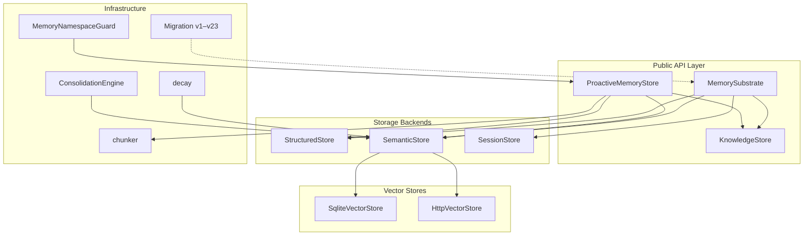
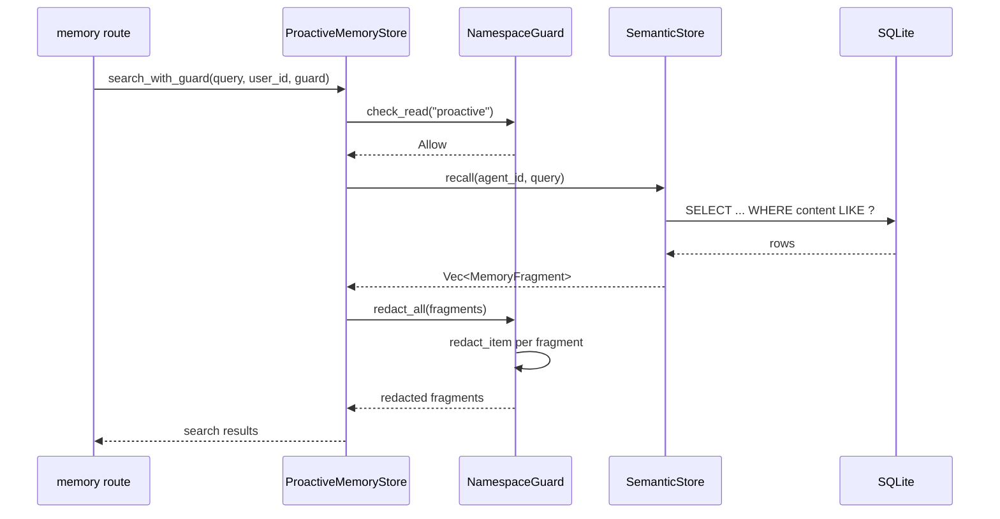

# Memory System

# Memory System (`librefang-memory`)

## Purpose

The memory system is the persistent substrate for the LibreFang Agent Operating System. It provides agents with three complementary storage models — key-value, semantic text search, and a knowledge graph — unified behind a single `MemorySubstrate` type and exposed through both a low-level substrate API and a higher-level mem0-style proactive memory interface.

## Architecture



All data lives in a single SQLite database (via `rusqlite`). Schema creation and evolution are handled by `migration::run_migrations`, which applies 23 incremental migrations idempotently using the `user_version` pragma.

## Key Components

### `MemorySubstrate` (`substrate.rs`)

The top-level facade. Owns an `Arc<Mutex<Connection>>` and composes `StructuredStore`, `SemanticStore`, `KnowledgeStore`, and `SessionStore`. Created with `MemorySubstrate::open_in_memory` for tests or `MemorySubstrate::open` for production.

Exposes methods like `remember`, `recall`, `structured_get`/`structured_set`, session management, and `import`/`export`.

### `ProactiveMemoryStore` (`proactive.rs`)

A mem0-style API layered on top of `MemorySubstrate`. Provides:

- **`search(query, user_id, limit)`** — Semantic search across all memory levels, with optional vector similarity when an embedding driver is configured.
- **`add(messages, user_id)`** — Extracts facts from messages via a `MemoryExtractor`, deduplicates against existing memories, and stores new fragments.
- **`get(user_id)` / `list()`** — Retrieve user-level or all memories.
- **`auto_memorize(agent_id, messages)`** — Hook called after each conversation turn; extracts and stores relevant facts.
- **`auto_retrieve(agent_id, query)`** — Hook called before agent execution; returns recalled memories as context.

Extraction is driven by a pluggable `MemoryExtractor` trait (default: regex-based `DefaultMemoryExtractor`; the runtime layer can swap in an LLM-powered extractor). New memories are deduplicated against existing ones using `text_similarity` (Jaccard on word sets) — memories above 90% similarity are merged rather than duplicated.

The store also runs periodic background maintenance:
- **Confidence decay** — Rate-limited to once per hour. Applies exponential decay based on `days_since_access`, with a log-based boost for frequently accessed memories.
- **Session TTL cleanup** — Soft-deletes session-level memories older than `session_ttl_hours`.

### `SemanticStore` (`semantic.rs`)

Stores and retrieves text-based memories in the `memories` table. Core methods:

- **`remember`** — Stores a memory fragment. Optionally chunks long text via the `chunker` module.
- **`recall`** / **`recall_with_embedding`** — Searches memories. When an embedding driver is present, uses vector similarity search; otherwise falls back to SQL `LIKE` matching.
- **`forget_session_older_than_global`** — Soft-deletes expired session memories.

Memories carry `confidence` (0.0–1.0), `scope` (`user_memory`, `session_memory`, `agent_memory`), `accessed_at`, and `access_count`. Each recall updates `accessed_at` and increments `access_count`, which feeds into the decay/boost calculation.

### `StructuredStore` (`structured.rs`)

A per-agent key-value store in the `kv_store` table. Values are serialized as JSON blobs. Used for agent state, configuration, and memory metadata. Supports namespace-scoped access via `MemoryNamespaceGuard`.

### `KnowledgeStore` (`knowledge.rs`)

An entity-relation graph stored in SQLite. Two tables:

- **`entities`** — Nodes with `entity_type` (Person, Organization, Location, etc.), `name`, and arbitrary `properties` (JSON).
- **`relations`** — Directed edges with `relation_type` (WorksAt, RelatedTo, etc.), `confidence`, and `properties`.

The key method is `query_graph(GraphPattern)`, which performs a triple-pattern query joining entities and relations. The JOIN matches entities by both ID and name, supporting the MCP tool's convention of referencing entities by name rather than UUID.

`has_relation` checks for the existence of a specific edge, and `delete_by_agent` removes all entities and relations owned by an agent.

### `chunker` (`chunker.rs`)

Splits long text into overlapping chunks for embedding-based storage. The splitting strategy is hierarchical:

1. Split on paragraph boundaries (`\n\n`).
2. If a paragraph exceeds `max_size`, split on sentence boundaries (ASCII `. `/`.\n`, Chinese `。`, `？`, `！`).
3. If a sentence still exceeds `max_size`, hard-split at the character boundary.

Overlap is applied by prepending the last `overlap` characters of the previous chunk to the next. All splitting operates on Unicode character boundaries, not byte offsets.

```rust
pub fn chunk_text(text: &str, max_size: usize, overlap: usize) -> Vec<String>
```

### Consolidation and Decay

Two separate mechanisms manage memory lifecycle:

**`ConsolidationEngine`** (`consolidation.rs`) — Runs a consolidation cycle with two phases:
1. **Confidence decay** — Reduces confidence of memories not accessed in 7+ days by `confidence * (1 - decay_rate)`, floored at 0.1.
2. **Duplicate merging** — Compares all active memories pairwise using `text_similarity`. Pairs above 90% similarity are merged: the lower-confidence duplicate is soft-deleted, and the keeper's confidence is lifted to the maximum of the two. Capped at 100 merges per run to avoid O(n²) blowup.

**`run_decay`** (`decay.rs`) — Time-based hard deletion governed by `MemoryDecayConfig`. Deletes (not soft-deletes) SESSION and AGENT scope memories whose `accessed_at` is older than the configured TTL. USER scope memories are never touched. Accessing a memory (via recall) resets the timer by updating `accessed_at`.

### `MemoryNamespaceGuard` (`namespace_acl.rs`)

Per-user access control for memory namespaces. Wraps a `UserMemoryAccess` ACL and gates four operations:

| Method | Required permissions |
|---|---|
| `check_read(namespace)` | Namespace in `readable_namespaces` |
| `check_write(namespace)` | Namespace in `writable_namespaces` |
| `check_delete(namespace)` | `delete_allowed` flag + write access |
| `check_export(namespace)` | `export_allowed` flag + read access |

Namespaces support glob-style prefixes: `"kv:*"` grants access to `"kv:alice"`, `"kv:bob"`, etc.

The guard also handles **PII redaction**. When `pii_access` is `false`, the guard replaces PII-tagged content with `[REDACTED:PII]` before returning fragments to the user. PII detection uses two signals:
1. A `taint_labels` metadata field containing `"Pii"` (case-insensitive).
2. A regex pass (`redact_pii_in_text`) that detects email addresses, phone numbers, SSNs, and credit card numbers.

The kernel calls `check_read` and `redact_all` at every memory call site (see the execution flow: `memory_get_user → redact_all → redact_item → redact_pii_in_text`).

### `HttpVectorStore` (`http_vector_store.rs`)

A `VectorStore` implementation that delegates to a remote HTTP service, allowing integration with external vector databases (Qdrant, Weaviate, custom microservices) without native client dependencies.

The remote service must implement four endpoints:

| Method | Path | Purpose |
|---|---|---|
| POST | `/insert` | Store an embedding with payload and metadata |
| POST | `/search` | Nearest-neighbor search by query embedding |
| DELETE | `/delete` | Remove an embedding by ID |
| POST | `/get_embeddings` | Bulk-fetch embeddings by ID list |

### `Migration` (`migration.rs`)

Schema management across 23 versions. Each migration is a function (`migrate_v1` through `migrate_v23`) that checks whether it has already been applied using `column_exists` or the `migrations` table, then applies `ALTER TABLE` or `CREATE TABLE` statements. Running `run_migrations` is idempotent — safe to call on every boot.

Key tables created:

| Table | Purpose |
|---|---|
| `agents` | Agent registry |
| `sessions` | Session history |
| `memories` | Semantic memory fragments with embeddings |
| `entities` / `relations` | Knowledge graph |
| `kv_store` | Per-agent key-value storage |
| `usage_events` | LLM cost tracking and metering |
| `prompt_versions` | Prompt versioning and A/B testing |
| `audit_entries` | Merkle-audited action log |
| `canonical_sessions` | Cross-channel persistent session state |

### `UsageStore` (`usage.rs`)

Tracks LLM token consumption per agent, model, provider, and user. Methods:
- `check_quota_and_record` — Validates against per-agent and global budget caps before recording.
- `check_all_and_record` — Validates all budget dimensions (global, per-agent, per-provider).
- `query_summary` / `query_by_model` — Aggregates usage for dashboards.
- `query_user_ranking` — Ranks users by daily spend for admin views.

## Memory Scopes

Three scope levels control persistence and decay behavior:

| Scope | Constant | Decay behavior |
|---|---|---|
| **User** | `user_memory` | Never deleted. Permanent knowledge about the user. |
| **Session** | `session_memory` | Deleted after `session_ttl_hours` of inactivity or `session_ttl_days` (config-dependent). |
| **Agent** | `agent_memory` | Deleted after `agent_ttl_days` of no access. |

## Data Flow: Memory Recall with PII Redaction

The most common end-to-end flow, showing how a user request travels from the HTTP API through the ACL and redaction layers:



## Integration Points

- **`librefang-runtime`** creates `MemorySubstrate` instances and wraps them in `ProactiveMemoryStore`. It also provides the LLM-backed `MemoryExtractor` and `EmbeddingFn` implementations.
- **`librefang-api`** HTTP routes call `ProactiveMemoryStore` methods, passing a `MemoryNamespaceGuard` resolved from the authenticated user's ACL.
- **Agent loop** (`librefang-runtime/src/agent_loop.rs`) calls `setup_recalled_memories` which invokes `recall_with_embedding_async` through the substrate, then runs `redact_all` via the namespace guard before injecting context.
- **Compactor** (`librefang-runtime/src/compactor.rs`) uses `Session` for canonical context window management.

## Configuration

`ProactiveMemoryConfig` controls:

| Field | Default | Description |
|---|---|---|
| `confidence_decay_rate` | — | Exponential decay coefficient. 0 disables decay. |
| `session_ttl_hours` | 0 | Session memory TTL. 0 disables cleanup. |
| `auto_memorize_enabled` | — | Whether `auto_memorize` extracts and stores facts. |
| `auto_retrieve_enabled` | — | Whether `auto_retrieve` injects recalled context. |

`MemoryDecayConfig` controls hard deletion:

| Field | Description |
|---|---|
| `enabled` | Master switch for the decay sweep. |
| `session_ttl_days` | Days before session memories are hard-deleted. |
| `agent_ttl_days` | Days before agent memories are hard-deleted. |
| `decay_interval_hours` | How often the decay sweep runs. |

`ChunkConfig` (from the runtime config) controls text chunking:

| Field | Description |
|---|---|
| `max_size` | Maximum characters per chunk. |
| `overlap` | Overlap characters between consecutive chunks. |
| `enabled` | Whether long text is chunked or stored as-is. |