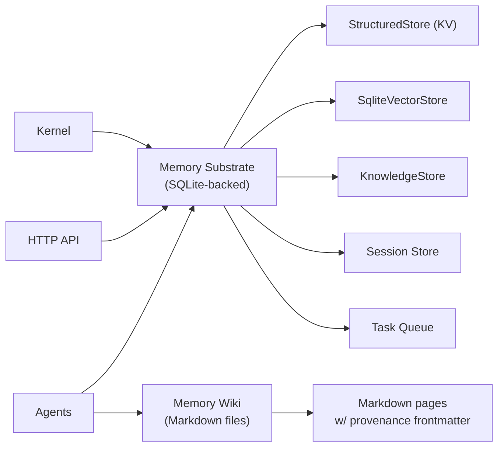

# Memory System

# Memory System

The Memory System provides LibreFang agents with persistent, queryable storage through two complementary sub-modules: a programmatic storage substrate for structured data and semantic search, and a file-backed markdown wiki for navigable, long-form knowledge.

## Sub-Modules

| Sub-Module | Role |
|---|---|
| [Memory Substrate (`librefang-memory`)](librefang-memory-src.md) | Unified API over structured key-value, semantic vector search, knowledge graph, sessions, tasks, and usage quotas — all backed by SQLite via a shared `r2d2` connection pool |
| [Memory Wiki (`librefang-memory-wiki`)](librefang-memory-wiki-src.md) | Opt-in, file-backed markdown vault with provenance frontmatter, editable in Obsidian or any Markdown editor |

## How They Fit Together

The **Memory Substrate** is the primary storage layer — always active, handling every recall, session log, task claim, and usage quota check. Agents, the kernel cron system, and HTTP routes all interact through a single `MemorySubstrate` rather than individual stores.

The **Memory Wiki** sits alongside it as an opt-in knowledge vault. Where the substrate excels at vector similarity search over snippets, the wiki provides durable, human-navigable pages. Both track provenance — the substrate via session and agent metadata in SQLite, the wiki via structured YAML frontmatter recording which agent, session, and turn produced each page.

## Key Cross-Module Workflows

**Recall and document.** An agent queries `MemorySubstrate::recall` for vector-similar context from past sessions, then writes a synthesized finding to the wiki vault — producing a page that both humans and other agents can browse.

**Session-audited edits.** Wiki pages carry provenance frontmatter generated from the same session context the substrate uses to track `CanonicalEntry` records. This means every claim in the wiki traces back to a specific agent turn that is also recorded in the session store.

**Configuration-gated activation.** The wiki is disabled by default and enabled via `config.toml`. The substrate is always available. Operators who need long-form institutional knowledge turn on the wiki; those who only need programmatic recall rely on the substrate alone.