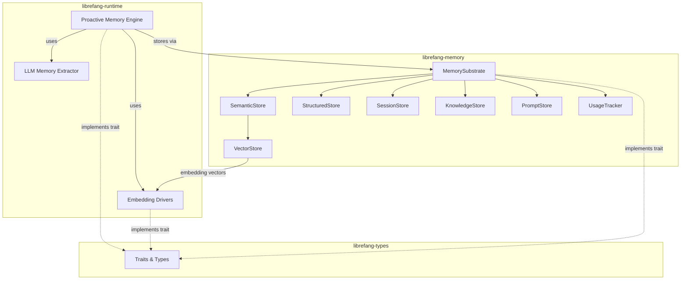

# Memory System

# Memory System

The memory substrate for the LibreFang Agent Operating System. It provides persistent storage, semantic search, and proactive context management across agent conversations.

## Sub-modules

| Module | Role |
|--------|------|
| [**Types**](librefang-types-src.md) | Data structures and trait contracts — `MemoryFragment`, `MemoryItem`, `Entity`, `Relation`, plus the `Memory`, `VectorStore`, and `ProactiveMemory` traits |
| [**Memory**](librefang-memory-src.md) | Storage substrate — SQLite-backed implementations of every store (structured, semantic, session, knowledge, prompt, usage) and background maintenance |
| [**Runtime**](librefang-runtime-src.md) | Runtime services — embedding drivers for vector computation and the LLM-powered proactive memory engine |

## Architecture

## How the pieces fit together

**Types** defines the contracts. Every trait (`Memory`, `VectorStore`, `ProactiveMemory`, `MemoryExtractor`) and data structure (`MemoryFragment`, `MemoryItem`, `Entity`, `Relation`) lives there. The other two modules implement these traits.

**Memory** is the persistence layer. `MemorySubstrate` provides a unified API over six SQLite-backed stores — structured key-value, semantic vector search, session history, knowledge graph, prompt templates, and usage tracking. It also runs background maintenance for decay, consolidation, and eviction.

**Runtime** provides the two services that make memory intelligent:

1. **Embedding drivers** compute vector representations via OpenAI-compatible endpoints, Cohere's native API, or AWS Bedrock (with SigV4 signing). The `create_embedding_driver` factory and `detect_embedding_provider` auto-wiring handle provider selection from environment variables.

2. **Proactive memory** automatically extracts facts from conversations using an LLM, resolves conflicts with existing memories, and injects relevant context into future agent turns. `EmbeddingBridge` connects the embedding drivers to the proactive memory store for similarity-based retrieval.

## Key cross-module workflows

**Proactive memory extraction**: An agent conversation passes through `SessionStore` → text extraction → `ProactiveMemoryStore` invokes `LlmMemoryExtractor` → the LLM returns extracted facts → they are deduplicated, embedded via an `EmbeddingDriver`, and stored in `SemanticStore` with vector indices.

**Semantic retrieval**: A query is embedded by an `EmbeddingDriver` → `VectorStore` performs similarity search against stored vectors in SQLite (or delegates to a remote service like Qdrant) → matching `MemoryFragment` records are returned ranked by cosine similarity.

**Global budget tracking**: Token usage is recorded through `UsageTracker` during LLM calls, feeding back into memory decisions about when to consolidate or evict.

See the individual sub-module pages for implementation details, configuration options, and API reference.