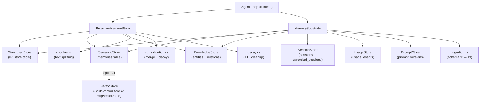

# Memory System

# Memory System (`librefang-memory`)

## Overview

The memory substrate for the LibreFang Agent Operating System. It provides a unified memory API over three SQLite-backed storage backends — structured key-value, semantic text/vector search, and a knowledge graph — so agents can persist and recall information through a single interface.

The crate also ships a **proactive memory** layer (mem0-style) that automatically extracts, deduplicates, and retrieves memories during conversations.

## Architecture

## Storage Backends

### Structured Store (`structured.rs`)

Per-agent key-value storage backed by the `kv_store` table. Stores JSON-serialized values with optimistic concurrency via a `version` column. Used for agent state, configuration, and memory metadata entries (keys prefixed with `memory:`).

Key methods: `get()`, `set()`, `delete()`, `list_kv()`, `remove_agent()`.

### Semantic Store (`semantic.rs`)

Free-text memory storage in the `memories` table. Each memory has a scope (`user_memory`, `session_memory`, `agent_memory`), confidence score, access tracking, and optional embedding blob.

Retrieval paths:
- **Keyword fallback**: `recall()` uses `LIKE` matching against content.
- **Vector search**: `recall_with_embedding()` computes cosine similarity between a query embedding and stored embeddings, falling back to `LIKE` when no embedding is available.

The store supports per-agent memory caps via `lowest_confidence()` for eviction, and `update_content()` for in-place memory edits.

### Knowledge Graph (`knowledge.rs`)

Entity-relation graph in `entities` and `relations` tables. Entities have a type (Person, Organization, Concept, etc.) and arbitrary JSON properties. Relations link two entities with a typed edge and confidence score.

Graph queries (`query_graph()`) accept a `GraphPattern` with optional source, relation type, and target filters. The JOIN logic resolves entities by both ID and name, so relations that reference entities by name (as the MCP tool does) match correctly.

### Session Store (`session.rs`)

Manages conversation sessions in the `sessions` table plus a `canonical_sessions` table for cross-channel persistent memory. Supports:

- Per-session message history with labels and peer isolation (`peer_id`)
- Canonical session context that merges messages across channels
- LLM-generated summaries for compaction (`store_llm_summary`)
- Full-text search via an FTS5 virtual table (`sessions_fts`)
- JSONL mirror writes for audit/logging
- Session TTL cleanup (`cleanup_expired_sessions`, `cleanup_excess_sessions`)

### Usage Store (`usage.rs`)

Cost tracking and metering in `usage_events`. Records per-call token counts, cost, latency, model name, and provider. Supports:

- Per-agent, per-model, and per-provider queries
- Hourly and daily aggregation
- Budget enforcement: `check_quota_and_record()` enforces hourly/daily caps
- Global budget cap: `check_global_budget_and_record()`
- Provider-aware budgets: `check_all_with_provider_and_record()`

## Proactive Memory (`proactive.rs`)

A mem0-style API layer built on top of `MemorySubstrate`. Implements the `ProactiveMemory` and `ProactiveMemoryHooks` traits from `librefang-types`.

### Memory Levels

| Level | Scope String | Persistence | Decay |
|-------|-------------|-------------|-------|
| User | `user_memory` | Permanent | Never |
| Session | `session_memory` | TTL-based | After `session_ttl_hours` |
| Agent | `agent_memory` | TTL-based | After `agent_ttl_days` |

### Core Operations

**`add(messages, user_id)`** — Extracts memories from conversation messages and stores them:

1. The configured `MemoryExtractor` (default or custom LLM-backed) produces `MemoryItem` candidates and optional `RelationTriple`s.
2. For each candidate, `add_with_decision()` runs the mem0 dedup flow:
   - Embed the new content (if embedding driver is available).
   - Search for similar existing memories (vector or keyword).
   - The extractor decides: `Add` (new memory), `Update` (replace existing), or `Noop` (duplicate).
3. On `Update`, the old memory is edited in-place, preserving its ID and access stats. A version history chain is maintained in metadata.
4. Conflict detection flags contradictory updates (e.g., "I love X" → "I hate X").
5. Extracted relation triples are upserted into the knowledge graph with deduplication.
6. Per-agent memory cap is enforced via `evict_if_over_cap()`, which removes the lowest-confidence memories.

**`search(query, user_id, limit)`** — Semantic search across all levels, ranked by relevance and confidence.

**`auto_memorize(messages, user_id)`** — Hook called after each agent turn to extract and store new memories.

**`auto_retrieve(user_id, query)`** — Hook called before agent execution to inject relevant memories into context. Also triggers periodic maintenance (confidence decay, session TTL cleanup).

### Maintenance Tasks

All maintenance is rate-limited to at most once per hour and triggered automatically from `search()`, `auto_retrieve()`, and `consolidate()`:

- **Confidence decay** (`decay_confidence()`): Applies exponential decay based on days since last access, with a log-based boost for frequently accessed memories.
- **Session TTL cleanup** (`cleanup_expired()`): Soft-deletes session-level memories older than the configured TTL across all agents.
- **Consolidation counters**: Trims the in-memory HashMap when it exceeds 1000 entries.

### Import/Export

- `export_all(agent_id)` — Serializes all memories as `Vec<MemoryExportItem>`.
- `import_memories(agent_id, items)` — Bulk import with duplicate detection (>90% text similarity skips the item). Enforces per-agent cap after import.

## Chunker (`chunker.rs`)

Splits long documents into overlapping chunks suitable for embedding. Strategy:

1. Split on paragraph boundaries (`\n\n`).
2. If a paragraph exceeds `max_size`, split on sentence boundaries (`. `, `。`, `？`, `！`).
3. If a sentence still exceeds `max_size`, hard-split at the character limit.
4. Overlap is applied by prepending the last N characters of the previous chunk.

All operations are Unicode-safe using char-based iteration.

## Consolidation (`consolidation.rs`)

`ConsolidationEngine` reduces noise in the memory store:

1. **Decay**: Reduces confidence of memories not accessed in 7 days by a configurable decay factor (floored at 0.1).
2. **Merge**: Pairs of memories with >90% text similarity (Jaccard on lowercased words) are merged — the higher-confidence memory is kept, the lower is soft-deleted. Capped at 100 merges per run to avoid O(n²) blowup.

## Time-Based Decay (`decay.rs`)

Hard-deletes stale memories based on scope-specific TTLs configured in `MemoryDecayConfig`:

- **USER scope**: Never deleted.
- **SESSION scope**: Deleted after `session_ttl_days` of no access.
- **AGENT scope**: Deleted after `agent_ttl_days` of no access.

Accessing a memory resets its `accessed_at` timestamp, extending its lifetime.

## Vector Store Abstraction

The `VectorStore` trait (defined in `librefang-types`) has two implementations:

- **`SqliteVectorStore`** (`semantic.rs`): Stores embeddings as BLOBs in the `memories` table. Cosine similarity computed in Rust.
- **`HttpVectorStore`** (`http_vector_store.rs`): Delegates to a remote HTTP service. Expects a REST contract with `/insert`, `/search`, `/delete`, and `/get_embeddings` endpoints.

## Schema Migrations (`migration.rs`)

Sequential migrations from v1 (initial schema) through v19. Uses SQLite's `user_version` pragma for tracking. Key tables created across versions:

| Version | Addition |
|---------|----------|
| 1 | Core tables: agents, sessions, events, kv_store, task_queue, memories, entities, relations |
| 3 | Embedding column on memories |
| 4 | usage_events for cost tracking |
| 5 | canonical_sessions for cross-channel memory |
| 9 | Performance indexes for proactive memory queries |
| 10 | agent_id on entities/relations for per-agent cleanup |
| 12 | FTS5 virtual table for full-text session search |
| 13 | Prompt versioning and A/B testing tables |
| 15 | Multimodal columns (image_url, image_embedding, modality) |
| 16 | peer_id on memories and sessions for per-user isolation |
| 17 | Approval audit log |
| 19 | Provider column on usage_events |

## Provider Plugin System (`provider.rs`)

`MemoryProvider` trait with `MemoryManager` for dependency injection. `NullMemoryProvider` is a no-op implementation for testing or when memory is disabled. `MemoryError` wraps all storage errors.

## Integration Points

The runtime crate consumes memory through several paths:

- **Agent loop** (`librefang-runtime/src/agent_loop.rs`): Calls `save_session_async()` after each turn, `setup_recalled_memories()` before execution, and `remember_interaction_best_effort()` after completion.
- **Context engine** (`librefang-runtime/src/context_engine.rs`): Constructs `MemorySubstrate` and feeds recalled memories into the agent context.
- **Compactor** (`librefang-runtime/src/compactor.rs`): Reads session history to decide when to compact.
- **API routes** (`src/routes/memory.rs`): CRUD endpoints for memory items use `get_by_id()` and `find_agent_id_for_memory()`.
- **Proactive memory init** (`librefang-runtime/src/proactive_memory.rs`): Wires up `ProactiveMemoryStore` with optional LLM extractor and embedding driver.

## Configuration

`ProactiveMemoryConfig` controls proactive memory behavior:

| Field | Purpose |
|-------|---------|
| `max_memories_per_agent` | Hard cap; 0 disables eviction |
| `confidence_decay_rate` | Exponential decay factor; ≤0 disables |
| `session_ttl_hours` | Hours before session memories expire; 0 disables |
| `auto_memorize_enabled` | Whether `auto_memorize` extracts from conversations |
| `auto_retrieve_enabled` | Whether `auto_retrieve` injects context before agent turns |

`MemoryDecayConfig` controls the separate TTL-based decay sweep:

| Field | Purpose |
|-------|---------|
| `enabled` | Master switch |
| `session_ttl_days` | Days before hard-deleting session memories |
| `agent_ttl_days` | Days before hard-deleting agent memories |
| `decay_interval_hours` | How often the sweep runs |