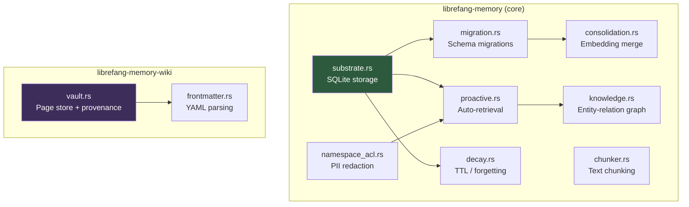

# Memory System

# Memory System

The Memory System provides Librefang's persistent storage, retrieval, and lifecycle management for both structured agent memories and wiki-based documents. It comprises two cooperating sub-modules:

- **[librefang-memory-src](librefang-memory-src.md)** — Core memory subsystem: embeddings, knowledge graph, decay, migration, ACLs, and proactive retrieval.
- **[librefang-memory-wiki-src](librefang-memory-wiki-src.md)** — Wiki-based document vault: Markdown pages with frontmatter, link resolution, and provenance tracking.

## Architecture

## How the sub-modules relate

### Initialization chain

The core memory subsystem boots through a strict dependency chain: `substrate.rs` opens the SQLite pool, `migration.rs` runs schema migrations (checking `get_schema_version`, applying versioned upgrades like `migrate_v22`), and `consolidation.rs` calls `run_migrations` during setup before performing embedding operations. This ensures the schema is current before any memory operations begin.

### Memory lifecycle

Once initialized, memories flow through several interconnected components:

1. **Ingestion** — Text is split into chunks via `chunker.rs`, then stored through `proactive.rs` (`add`, `add_with_level`).
2. **Knowledge graph** — Entities and relations are managed in `knowledge.rs` (`add_entity`, `add_relation`), linked to proactive memory entries.
3. **Decay** — `decay.rs` manages TTL-based forgetting (`run_decay`). Accessing a memory resets its decay timer, creating a "use it or lose it" behavior.
4. **Consolidation** — `consolidation.rs` merges embeddings (`insert_memory_full`), handling dimension mismatches gracefully.
5. **Access control** — `namespace_acl.rs` applies PII redaction based on metadata labels, skipping redaction when access is explicitly granted.

### Wiki vault

The wiki sub-module operates more independently. `vault.rs` manages Markdown pages with YAML frontmatter parsed by `frontmatter.rs`. Key invariants enforced at this layer:

- **Provenance tracking** — Every page records its origin; `concurrent_writes_to_same_topic_are_serialised` and `crlf_authored_pages_are_parsed_not_treated_as_bodyless` both rely on `provenance` and `fresh_vault` to maintain consistency.
- **Link resolution** — `native_render_rewrites_links_to_relative_paths` transforms internal links using provenance metadata.
- **Frontmatter defaults** — `read_page_if_present` delegates to `default_for` in `frontmatter.rs` to supply missing fields.

## Cross-sub-module flows

The `frontmatter.rs` parser's `split` utility is used beyond the wiki vault itself. Plugin version checking flows through `librefang-runtime`'s `semver_parts`, which calls into `frontmatter::split` — making the wiki frontmatter module a shared utility for structured text parsing across the system. This connection is exercised in the `benchmark_plugin_hook`, `test_plugin_hook`, and `plugin_update_check` execution paths.

In the opposite direction, `proactive.rs` depends on `substrate.rs` for its in-memory test databases (`open_in_memory`), and all knowledge graph operations route through the same substrate layer.