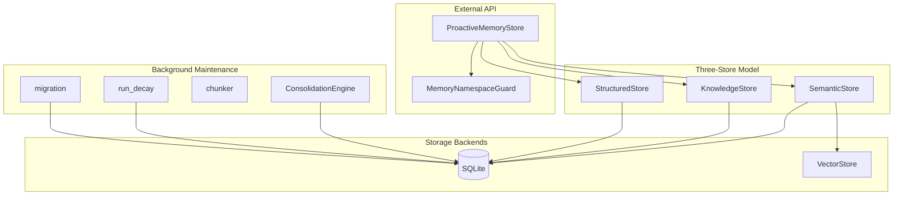

# Memory System

# Memory System (`librefang-memory`)

The memory substrate for the LibreFang Agent Operating System. It provides persistent, searchable, multi-layered memory for autonomous agents through three storage backends unified behind a single API.

## Architecture



## The Three-Store Model

Every agent's memory is divided into three independent stores, each backed by SQLite:

| Store | Purpose | Tables | Primary API |
|-------|---------|--------|-------------|
| **Structured** | Key-value pairs, agent manifests, per-agent state | `kv_store`, `agents` | `StructuredStore` |
| **Semantic** | Free-text memories with optional vector embeddings | `memories` | `SemanticStore` |
| **Knowledge Graph** | Entities and typed relations | `entities`, `relations` | `KnowledgeStore` |

All three are wrapped by `MemorySubstrate`, which owns a shared `Arc<Mutex<Connection>>` and provides transactional access across stores.

## Semantic Memory (`semantic.rs`)

The most heavily used store. Memories are text fragments with metadata, confidence scores, and optional embedding vectors.

### Storage and Retrieval

- **Insert**: Stores a memory row with content, scope, confidence, and optional embedding blob. When an embedding is provided, it's serialized to bytes via `embedding_to_bytes`.
- **Recall (`recall_with_embedding`)**: If the caller provides a query embedding, computes cosine similarity against stored embeddings and ranks results. Falls back to `LIKE` text matching when no embedding is available.
- **Access tracking**: Every recall updates `accessed_at` and increments `access_count`, which feeds into confidence decay and TTL-based cleanup.

### Scope Constants

Scopes determine memory lifecycle:

| Scope | String | Persistence |
|-------|--------|-------------|
| User | `"user_memory"` | Permanent — never decayed |
| Session | `"session_memory"` | TTL-based cleanup via `session_ttl_hours` |
| Agent | `"agent_memory"` | TTL-based cleanup via `agent_ttl_days` |

## Knowledge Graph (`knowledge.rs`)

Stores entities (`Entity`) and relations (`Relation`) in two SQLite tables with JOIN-based graph queries.

### Entity and Relation Lookup

The `query_graph` method joins `relations` → `entities` twice (source + target) using a flexible match:

```sql
JOIN entities s ON (r.source_entity = s.id OR (r.source_entity = s.name AND s.agent_id = r.agent_id))
```

This dual-match (by ID **or** by name) is critical — the MCP tool layer often references entities by name rather than by generated UUID. The regression test `test_query_graph_relation_references_by_name` guards this.

### Key Operations

- `add_entity`: Upserts by ID (ON CONFLICT updates name/properties).
- `add_relation`: Creates a typed edge with confidence.
- `has_relation`: Checks existence by source/target ID **or** name.
- `delete_by_agent`: Cascading delete of all entities and relations for a given agent.

## Structured Store (`structured.rs`)

Per-agent key-value storage. Keys are namespaced — the namespace ACL guard checks prefixes like `kv:*` to determine access. Used for agent manifests, runtime state, and memory metadata that doesn't fit the semantic model.

## Session Management (`session.rs`)

Manages conversation history with:

- **Canonical sessions**: Cross-channel persistent context stored in `canonical_sessions`, with compaction cursor and summary support.
- **Per-channel sessions**: Individual session records in `sessions` table with FTS5 full-text search via `sessions_fts`.
- **Cleanup**: `cleanup_expired_sessions` soft-deletes session memories older than the configured TTL; `cleanup_expired_sessions_global` does the same across all agents.
- **JSONL mirror**: `write_jsonl_mirror` appends messages to an on-disk JSONL file for external analysis.

## Proactive Memory (`proactive.rs`)

The mem0-style high-level API that agents use directly. Implements the `ProactiveMemory` and `ProactiveMemoryHooks` traits.

### `ProactiveMemoryStore`

Wraps all three stores plus an `EmbeddingFn` driver and a `MemoryExtractor`. The key methods:

| Method | Behavior |
|--------|----------|
| `search` | Semantic search across all memory levels, returns ranked `MemoryItem` results |
| `add` | Extracts facts from conversation messages via `MemoryExtractor`, stores as scoped memories |
| `get` | Retrieves user-level memories for a given user ID |
| `list` / `list_all` | Lists memories with optional filtering |
| `auto_memorize` | Hook called after each agent turn to extract and store new facts |
| `auto_retrieve` | Hook called before agent execution to inject relevant memories into context |

### Embedding Integration

When constructed with `.with_embedding(driver)`, memories are stored with vector embeddings and search uses cosine similarity. Without an embedding driver, the system falls back to `LIKE` text matching. This is configured at initialization, not at query time.

### Confidence Decay

`decay_confidence` applies exponential decay to memories not accessed in over a day:

```
new_confidence = original_confidence × e^(-rate × days_since_access) × boost
```

Where `boost = min(1.0 + log₂(access_count), 2.0)` rewards frequently accessed memories. Rate-limited to run at most once per hour via `maybe_decay_confidence`.

### Auto-Consolidation

Every 10 `auto_memorize` calls per agent, the store triggers consolidation: merging highly similar memories (>90% Jaccard text similarity) and decaying low-confidence entries.

## Text Chunking (`chunker.rs`)

Splits long documents into overlapping chunks suitable for embedding. The strategy is hierarchical:

1. **Paragraph boundaries** (`\n\n`) — preferred split points.
2. **Sentence boundaries** (`. ` / `.\n` / `。` / `？` / `！`) — for oversized paragraphs.
3. **Hard character limit** — when even a single sentence exceeds `max_size`.

Overlap is implemented by prepending the last `overlap` characters of the previous chunk to the start of the next. The `pack_with_overlap` function greedily packs segments into chunks and drops overlap if it would cause the new chunk to exceed `max_size`.

## Memory Consolidation (`consolidation.rs`)

Two-phase background maintenance:

1. **Confidence decay**: Reduces confidence of memories not accessed in 7+ days by a configurable decay factor, floored at 0.1.
2. **Duplicate merging**: Compares all active memory pairs using Jaccard text similarity. When similarity exceeds 90%, the lower-confidence duplicate is soft-deleted and the keeper's confidence is lifted to the higher value if needed. Capped at 100 merges per run to avoid O(n²) blowup.

Each merge is wrapped in a SQLite transaction via `unchecked_transaction` to prevent partial state (soft-deleted duplicate with un-updated keeper).

## Time-Based Decay (`decay.rs`)

Hard-deletes stale memories based on scope-specific TTLs configured in `MemoryDecayConfig`:

- **USER scope**: Never deleted.
- **SESSION scope**: Deleted when `accessed_at` is older than `session_ttl_days`.
- **AGENT scope**: Deleted when `accessed_at` is older than `agent_ttl_days`.

This is distinct from consolidation — consolidation reduces confidence and merges duplicates, while decay outright removes expired entries. Accessing a memory (via search/recall) resets the timer by updating `accessed_at`.

## Namespace ACL (`namespace_acl.rs`)

Per-user access control for memory namespaces. Every API call site checks a `MemoryNamespaceGuard` before proceeding.

### Namespace Patterns

- `proactive` — proactive-memory fragments
- `kv:*` — structured key-value entries (glob-matched)
- `shared:<scope>` — peer-scoped shared memory
- `kg` — knowledge graph

### Gate Methods

| Method | Required Permission |
|--------|-------------------|
| `check_read(namespace)` | `readable_namespaces` contains namespace |
| `check_write(namespace)` | `writable_namespaces` contains namespace |
| `check_delete(namespace)` | Write access **and** `delete_allowed` flag |
| `check_export(namespace)` | Read access **and** `export_allowed` flag |

### PII Redaction

When `pii_access` is false (the default), the guard redacts PII from returned `MemoryItem` objects before they reach the user. Redaction uses two signals:

1. **Metadata label**: If `metadata["taint_labels"]` contains `"Pii"` (case-insensitive), the entire content is replaced with `[REDACTED:PII]`.
2. **Regex scan**: `redact_pii_in_text` detects email addresses, phone numbers, SSNs, and credit card numbers, replacing matches with `[REDACTED:PII]`.

Both signals are checked because storage layers don't always propagate metadata flags, and regex can't detect structured PII in custom fields. The redaction pipeline is:

```
memory_get_user → get_with_guard → redact_all → redact_item → redact_pii_in_text
```

## HTTP Vector Store (`http_vector_store.rs`)

A `VectorStore` implementation that delegates to a remote HTTP service. Used when running an external vector database (Qdrant, Weaviate, etc.) instead of the built-in SQLite-backed store.

### API Contract

| Method | Endpoint | Purpose |
|--------|----------|---------|
| `insert` | `POST /insert` | Store an embedding with payload and metadata |
| `search` | `POST /search` | Nearest-neighbor search with optional filter |
| `delete` | `DELETE /delete` | Remove an embedding by ID |
| `get_embeddings` | `POST /get_embeddings` | Bulk-fetch embeddings by IDs |

The base URL is configured at construction and trailing slashes are normalized. All errors are wrapped in `LibreFangError::Internal` with the HTTP status and response body.

## Schema Migrations (`migration.rs`)

Version-controlled SQLite schema currently at version 23. Uses `PRAGMA user_version` to track the current version. Each migration function (`migrate_v1` through `migrate_v23`) is idempotent — column additions are guarded by `column_exists` checks.

Notable migrations:
- **v3**: Embedding column for vector search
- **v9**: Performance indexes for proactive memory queries
- **v10**: `agent_id` on entities/relations for per-agent cleanup
- **v12**: FTS5 virtual table for full-text session search
- **v13**: Prompt versioning and A/B testing tables
- **v15**: Multimodal memory columns (image URL, image embedding, modality)
- **v16**: `peer_id` for per-user memory isolation
- **v22–v23**: RBAC attribution (`user_id`, `channel`) on `audit_entries` and `usage_events`

## Memory Provider Plugin System (`provider.rs`)

Exposes `MemoryProvider` trait and `MemoryManager` for pluggable memory backends. `NullMemoryProvider` is a no-op implementation used when memory is disabled.

## Usage Tracking (`usage.rs`)

Records per-request cost and token usage in `usage_events` with columns for agent, model, token counts, cost, latency, provider, and (as of v23) user/channel attribution for per-user budget rollup.

## Integration Points

The memory system connects to the rest of LibreFang through these paths:

- **Agent loop** (`librefang-runtime/src/agent_loop.rs`): Calls `save_session_async` after each turn, `remember_with_embedding_async` for proactive memory, and `recall_with_embedding_async` for context injection. PII redaction is applied via `redact_all` before recalled memories reach the LLM.
- **Context engine** (`librefang-runtime/src/context_engine.rs`): Constructs `MemorySubstrate` and injects memories into agent context.
- **Session compactor** (`librefang-runtime/src/compactor.rs`): Reads session history to decide when compaction is needed.
- **API routes** (`src/routes/memory.rs`): HTTP endpoints for `memory_get_user`, `memory_search_agent`, `memory_list` — all gated through `MemoryNamespaceGuard`.
- **Config types** (`src/config/types.rs`): `ChunkConfig` and `MemoryDecayConfig` control chunking and TTL behavior.