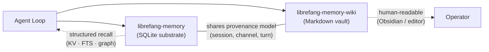

# Memory System

# Memory System

The Memory System provides LibreFang agents with durable, queryable, and auditable knowledge persistence. It combines a structured storage substrate with a human-readable wiki vault, giving agents both machine-efficient recall and operator-transparent documentation.

## Sub-modules

| Sub-module | Role |
|---|---|
| [librefang-memory](librefang-memory-src.md) | Unified memory substrate — structured key-value store, semantic text/vector search, and knowledge graph, all layered on SQLite with optional remote vectors. Handles consolidation, decay, migrations, and namespace ACLs. |
| [librefang-memory-wiki](librefang-memory-wiki-src.md) | Durable Markdown knowledge vault. Complements the substrate by producing navigable, human-readable pages with full YAML provenance (agent, session, channel, turn). Compatible with Obsidian and any Markdown editor. Disabled by default; operators opt in via config. |

## How they fit together

```mermaid
graph LR
    Agent["Agent Loop"] --> Substrate["librefang-memory<br/>(SQLite substrate)"]
    Agent --> Wiki["librefang-memory-wiki<br/>(Markdown vault)"]
    Substrate -.->|"structured recall<br/>(KV · FTS · graph)"| Agent
    Wiki -.->|"human-readable<br/>(Obsidian / editor)"| Operator["Operator"]
    Substrate ---|"shares provenance model<br/>(session, channel, turn)"| Wiki
```

The **substrate** (`librefang-memory`) is the primary runtime memory. Agents read and write through its three backends — `StructuredStore`, `SemanticStore`, and `KnowledgeStore` — during every turn. It owns migrations, decay, consolidation, chunking, and access control.

The **wiki** (`librefang-memory-wiki`) is an optional, complementary output layer. When enabled, agents write synthesized knowledge to Markdown pages that operators can browse directly. Both modules share a common provenance model (agent, session, channel, turn), so any wiki claim can be traced back to the substrate records that produced it.

## Key cross-cutting concerns

- **Provenance** — Both modules tag every record with origin metadata. The substrate stores it in SQLite columns; the wiki serializes it into YAML frontmatter.
- **Consolidation workflow** — The substrate's `ConsolidationEngine` can trigger wiki writes when agents surface durable knowledge worth preserving for operators.
- **Configuration** — The substrate is always active. The wiki requires explicit opt-in (`[memory_wiki] enabled = true`) and supports isolated or shared vault modes with configurable render and ingest settings.

For implementation details, see the individual sub-module pages linked above.