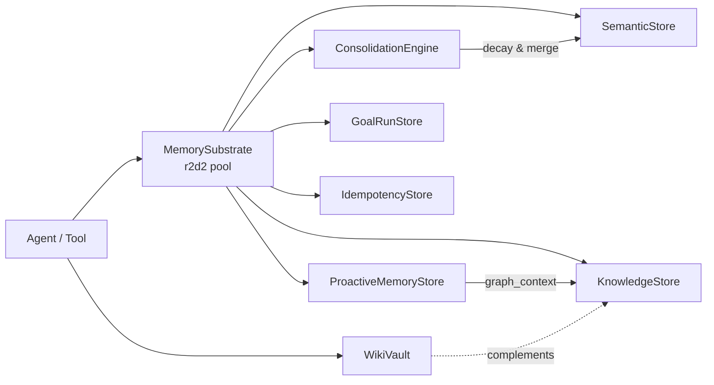

# Memory System

# Memory System

Persistent memory and knowledge infrastructure for LibreFang agents. The module group provides two complementary storage paradigms: a high-performance SQLite substrate for structured queries, vector search, and session state; and an opt-in Markdown knowledge vault for human-auditable, externally editable documentation.

## Sub-modules

| Sub-module | Role |
|---|---|
| [librefang-memory](librefang-memory-src.md) | Core SQLite-backed stores — semantic memory, knowledge graph, session state, goal runs, idempotency cache, usage tracking, consolidation, and decay |
| [librefang-memory-wiki](librefang-memory-wiki-src.md) | File-backed Markdown knowledge vault with provenance frontmatter, Obsidian-compatible |

## How they fit together

```mermaid
graph LR
    Agent[Agent / Tool] --> MS[MemorySubstrate<br/>r2d2 pool]
    Agent --> WV[WikiVault]

    MS --> SS[SemanticStore]
    MS --> KS[KnowledgeStore]
    MS --> PS[ProactiveMemoryStore]
    MS --> GR[GoalRunStore]
    MS --> ID[IdempotencyStore]
    MS --> CE[ConsolidationEngine]

    CE -->|decay & merge| SS
    PS -->|graph_context| KS

    WV -.->|complements| KS
```

**librefang-memory** is the foundation. A single `MemorySubstrate` owns an r2d2 connection pool and runs all migrations, giving every store (semantic, knowledge, proactive, goal run, idempotency, session, usage) shared access to one WAL file. The `ConsolidationEngine` and `run_decay` pipeline periodically merge duplicate embeddings and prune stale entries to keep the store healthy.

**librefang-memory-wiki** layers on top as a durable, navigable knowledge base. It is **disabled by default** — operators opt in via `[memory_wiki]` config. While the core substrate handles vector similarity and graph queries, the wiki captures Markdown pages with structured provenance frontmatter that can be browsed or edited in external tools like Obsidian. The wiki complements the `KnowledgeStore` graph rather than replacing it.

## Key cross-cutting workflows

- **Proactive recall**: `ProactiveMemoryStore` pulls context from `KnowledgeStore.query_graph` to surface relevant memories during agent runs.
- **Consolidation & decay**: `ConsolidationEngine` merges near-duplicate embeddings (below `duplicate_threshold`), while `run_decay` purges expired session and agent memories based on configured retention.
- **Namespace ACL**: Write operations flow through `check_write → can_write → namespace_glob_matches` with path-traversal protection, enforced identically for both substrate writes and wiki writes.
- **Wiki search**: `WikiVault.search` performs file-level lookups against the Markdown vault, falling through to IO-layer error handling distinct from SQLite's error surface.