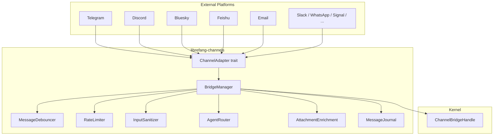

# Messaging Channels

# Messaging Channels (`librefang-channels`)

The channel bridge connects external chat platforms to the LibreFang kernel. Each platform (Telegram, Discord, Slack, Bluesky, Feishu, etc.) is represented by a `ChannelAdapter` that normalizes inbound messages into a common `ChannelMessage` type and delivers outbound responses through the platform's API.

## Architecture



---

## Core Abstractions

### `ChannelAdapter` trait

Defined in `types.rs`. Every platform implements this trait:

| Method | Purpose |
|---|---|
| `name()` | Static adapter identifier (e.g. `"telegram"`) |
| `channel_type()` | Enum variant for routing |
| `start()` | Returns a `Stream<Item = ChannelMessage>` of inbound messages |
| `send()` | Delivers a `ChannelContent` to a `ChannelUser` |
| `send_typing()` | Best-effort typing indicator |
| `stop()` | Graceful shutdown |
| `typing_events()` | Optional typing indicator stream (for debouncing) |
| `create_webhook_routes()` | Optional axum routes for webhook-based adapters |

### `ChannelMessage`

The normalized message that flows from adapter through dispatch:

- `channel` — `ChannelType` enum (Telegram, Discord, Custom, etc.)
- `sender` — `ChannelUser { platform_id, display_name, librefang_user }`
- `content` — `ChannelContent` (see below)
- `metadata` — `HashMap<String, serde_json::Value>` for platform-specific data (URIs, reply refs, account IDs)
- `is_group` — Whether the message came from a group chat
- `thread_id` — Platform-specific thread/topic identifier

### `ChannelContent` enum

Covers all inbound content types the bridge can handle:

- **Text** — Plain text messages
- **Command { name, args }** — Slash commands (e.g. `/agent admin`)
- **Image / File / FileData / Voice / Video / Audio / Animation / Sticker** — Media with URLs or inline data
- **Location** — `{ lat, lon }`
- **Interactive / ButtonCallback / EditInteractive / DeleteMessage** — Rich UI interactions
- **MediaGroup / Poll / PollAnswer** — Composite content types

The `content_to_text()` helper in `bridge.rs` normalizes any variant into a plain-text representation for logging and fallback dispatch.

---

## Bridge and Dispatch Flow

`BridgeManager` is the central coordinator. It owns all running adapters and dispatches inbound messages to agents.

### Startup

```
BridgeManager::start_adapter(adapter)
  ├── Download-dir cleanup (once, sweeps files >24h)
  ├── Check for webhook routes → mount on shared server, OR
  │   fall back to adapter.start() polling/stream
  ├── Read channel_overrides for debounce config
  └── Spawn dispatch loop (debounced or direct)
```

### Direct dispatch (debounce disabled)

When `channel_overrides.message_debounce_ms` is 0 (default), each inbound message spawns a concurrent task:

```
ChannelMessage arrives
  → semaphore.acquire() (max 32 concurrent)
  → dispatch_message()
    → download media attachments (if any)
    → input sanitization check
    → resolve agent via AgentRouter
    → apply group message policy
    → handle slash commands OR send to kernel
    → format and deliver response via adapter.send()
```

### Debounced dispatch

When debouncing is configured, messages from the same sender are buffered and merged:

```
ChannelMessage arrives
  → MessageDebouncer::push(sender_key, message)
  → wait for: debounce timer, max timer, typing stop, or buffer full
  → flush_debounced() → drain() merges buffered messages
  → merged message enters dispatch pipeline
```

Merging rules:
- **Multiple commands with the same name** → merge args into one command
- **Same content type** → join text with newlines
- **Mixed types** → convert all to text, join with newlines

The debounce flush channel is bounded to 1024 entries to prevent OOM when the dispatcher stalls.

---

## Agent Routing

`AgentRouter` (in `router.rs`) resolves inbound messages to an `AgentId`:

1. **Direct route** — `set_direct_route(user, agent)` for DM conversations
2. **Binding** — `load_bindings()` maps `(channel, chat_id) → agent`
3. **Context-aware** — `resolve_with_context()` considers channel metadata
4. **Default** — `set_default(agent)` as catch-all

Slash commands like `/agent <name>` explicitly switch the routing.

---

## Group Message Processing

Group messages go through several gates before dispatch:

### Group policy (`ChannelOverrides.group_policy`)

| Policy | Behavior |
|---|---|
| `Ignore` | Drop all group messages |
| `CommandsOnly` | Process only slash commands |
| `MentionOnly` | Process only mentions + commands |
| `All` (default) | Process everything |

### Trigger matching (`MentionOnly` mode)

A message is processed when any of:
- `was_mentioned` metadata is `true` (platform-level @mention)
- Text matches a `group_trigger_patterns` regex (cached via `RegexSet`)
- Agent name appears as a positional vocative trigger (Phase 2 §C)
- Text starts with `/` (command)

### Addressee guard (opt-in via `LIBREFANG_GROUP_ADDRESSEE_GUARD=on`)

Prevents false-positive triggers when the agent's name appears in a sentence addressed to someone else:

- `is_addressed_to_other_participant()` detects leading vocatives like `"Caterina, chiedi al Signore..."`
- `is_vocative_trigger()` checks that the pattern appears at turn-start or after punctuation boundaries, not mid-sentence addressed to another participant

---

## Attachment Enrichment

`attachment_enrich.rs` extracts content from downloaded files so the LLM sees inline text instead of just a file path. This runs after the bridge streams a download to disk.

### Entry point

```rust
pub fn enrich_saved_file(saved_path: &Path, media_type: &str, filename: &str) -> Vec<ContentBlock>
```

### Content-type handling

| Input | Output |
|---|---|
| `application/pdf` | `[Attached PDF: name (N bytes)]\n\n<extracted text>` |
| PDF with ambiguous MIME (`octet-stream`, empty) | Detected via `.pdf` extension or `%PDF-` magic bytes |
| `text/*`, code extensions (`.rs`, `.py`, `.json`, etc.) | `[Attached file: name (N bytes[, truncated])]\n\n<text>` |
| Images, audio, video, unknown binary | Empty vec — caller emits path block only |

### Key constraints

- **Hard cap**: `MAX_ENRICHED_TEXT_CHARS = 200,000` — mirrors the kernel's PDF text and API attachment limits
- **Additive**: enrichment blocks are inserted *before* the existing `[File: ...] saved to /path` block so file-reader tools still work
- **Panic-safe**: PDF extraction is wrapped in `catch_unwind` to isolate malformed-document panics
- **Audio/voice excluded**: these go through `media_transcribe` out of band

### PDF detection fallback

Many platforms (especially Telegram) upload PDFs as `application/octet-stream`. Detection order:
1. Explicit `application/pdf` MIME → enrich immediately
2. Ambiguous MIME + `.pdf` extension → enrich
3. Ambiguous MIME + `%PDF-` magic bytes → enrich
4. Authoritative MIME (e.g. `image/png`) is never overridden by filename

---

## Channel Adapters

### Bluesky (`bluesky.rs`)

Uses the AT Protocol XRPC API:
- **Auth**: `com.atproto.server.createSession` with identifier + app password, auto-refresh via `refreshSession`
- **Inbound**: Polls `app.bsky.notification.listNotifications` every 5 seconds, processes `mention` and `reply` reasons
- **Outbound**: `com.atproto.repo.createRecord` with `app.bsky.feed.post` record type
- **Session management**: Tokens cached in `RwLock`, refreshed 5 minutes before expiry
- **App password**: Zeroized on drop via `Zeroizing<String>`
- **Multi-bot**: Optional `account_id` for routing to different agent instances

### Other adapters (referenced in call graph)

| Adapter | Transport | Notes |
|---|---|---|
| Telegram | Webhook + long-poll | Forum topics, inline keyboards |
| Discord | WebSocket gateway | Slash commands, reactions |
| Feishu | Webhook (encrypted) | Card actions for approvals |
| Email | IMAP + SMTP | UID-based seen tracking |
| DingTalk | Stream + callback | Session webhook pattern |
| Flock | Webhook | Chat message API |
| Discourse | REST API | Topic reply posting |
| Revolt | WebSocket | Configurable URLs |
| Slack / WhatsApp / Signal / Matrix / Teams / Mattermost / WeChat / WebChat / CLI | Various | See individual adapter files |

---

## Security

### Input sanitization

`InputSanitizer` (in `sanitizer.rs`) checks inbound messages for prompt injection patterns:

- **Clean** — pass through
- **Warned** — log but allow (suspicious but not definitive)
- **Blocked** — reject with generic error message to the user

Configured via `SanitizeConfig`. Applied to text, command args, and media captions before dispatch.

### Rate limiting

`ChannelRateLimiter` applies per-user and per-channel rate limits to prevent abuse.

### Command access control

`ChannelOverrides` fields:
- `disable_commands` — block all slash commands
- `allowed_commands` — whitelist (if non-empty, only listed commands work)
- `blocked_commands` — blacklist
- Command names are normalized (both `"agent"` and `"/agent"` match)

---

## Message Journaling

Optional crash recovery via `MessageJournal`:

1. Messages are journalled before dispatch
2. On restart, `recover_pending()` returns in-flight messages for re-processing
3. `compact()` flushes completed entries on shutdown

---

## Output Formatting

`formatter.rs` (`format_for_channel`) adapts LLM responses for each platform's markup:

- Telegram → HTML
- Discord → Markdown with mention syntax
- Slack → mrkdwn
- Others → plain text passthrough

The output format is selected by `ChannelOverrides.output_format` with per-channel defaults from `default_output_format_for_channel()`.

---

## Reply Envelope

`ReplyEnvelope` structures outbound responses:

```rust
pub struct ReplyEnvelope {
    pub public: Option<String>,       // Message for the source chat
    pub owner_notice: Option<String>, // Private message for operator DM
}
```

Adapters that don't support owner-side delivery ignore `owner_notice` and forward only `public`. The `silent()` variant carries neither (used for suppressed turns).

---

## Configuration (`ChannelOverrides`)

Per-channel overrides that can be set at the channel level or per-agent (agent-level takes priority):

| Field | Purpose |
|---|---|
| `group_policy` | How group messages are filtered |
| `output_format` | Response markup format |
| `threading` | Enable thread/topic replies |
| `message_debounce_ms` | Debounce window for merging rapid messages |
| `message_debounce_max_ms` | Hard cap on debounce window |
| `message_debounce_max_buffer` | Max messages per sender before forced flush |
| `group_trigger_patterns` | Regex patterns for mention-less group triggers |
| `disable_commands` / `allowed_commands` / `blocked_commands` | Command access control |
| `prefix_style` | Agent name prefix on responses |
| `dm_policy` | DM handling policy |

---

## Adding a New Channel Adapter

1. Create `src/<platform>.rs` implementing `ChannelAdapter`
2. Parse platform-specific events into `ChannelMessage` with appropriate `ChannelContent`
3. For webhook platforms, implement `create_webhook_routes()` returning axum routes
4. For polling platforms, implement `start()` returning a `Stream`
5. Register the adapter in `BridgeManager::start_adapter()`
6. Add the `ChannelType` variant to the enum in `types.rs`
7. Update `channel_type_str()` in `bridge.rs`
8. Add format handling in `formatter.rs` if the platform uses non-standard markup