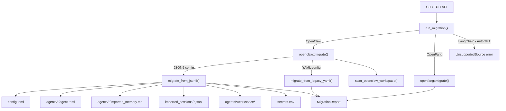

# Migration Tools

# Migration Tools (`librefang-migrate`)

Imports agents, configuration, memory, sessions, and channel setup from other agent frameworks into LibreFang's native format.

## Architecture



## Public API

### `MigrateSource`

Source framework selector:

| Variant | Status |
|---|---|
| `OpenClaw` | Fully supported |
| `OpenFang` | Supported (same-format fork) |
| `LangChain` | Planned — returns `UnsupportedSource` |
| `AutoGpt` | Planned — returns `UnsupportedSource` |

### `MigrateOptions`

```rust
pub struct MigrateOptions {
    pub source: MigrateSource,
    pub source_dir: PathBuf,   // Source workspace root
    pub target_dir: PathBuf,   // LibreFang home directory
    pub dry_run: bool,         // Report only, no filesystem changes
}
```

### `run_migration`

```rust
pub fn run_migration(options: &MigrateOptions) -> Result<MigrationReport, MigrateError>
```

Entry point. Dispatches to the appropriate source migrator. On success, returns a `MigrationReport` listing every imported item, skipped feature, and warning. If `dry_run` is `false`, a `migration_report.md` is also written into the target directory.

### `MigrateError`

All errors that can occur during migration:

| Variant | Meaning |
|---|---|
| `SourceNotFound(PathBuf)` | Source directory does not exist |
| `ConfigParse(String)` | Malformed config file |
| `AgentParse(String)` | Malformed agent definition |
| `Io(std::io::Error)` | Filesystem I/O failure |
| `Yaml(serde_yaml::Error)` | Legacy YAML parse failure |
| `Json5Parse(String)` | Modern JSON5 parse failure |
| `TomlSerialize(toml::ser::Error)` | Output TOML serialization failure |
| `UnsupportedSource(String)` | Framework not yet supported |

## OpenClaw Migration

The OpenClaw migrator handles both the modern single-file JSON5 format and the legacy multi-file YAML layout. It auto-detects which format is present.

### Supported Config Formats

**Modern (JSON5)** — a single `openclaw.json` at the workspace root containing everything. The file discovery checks these names in order: `openclaw.json`, `clawdbot.json`, `moldbot.json`, `moltbot.json`.

**Legacy (YAML)** — separate files: `config.yaml` for global config, `agents/<id>/agent.yaml` per agent, `messaging/<channel>.yaml` per channel.

### Workspace Auto-Detection

`detect_openclaw_home()` searches standard locations:

- `$OPENCLAW_STATE_DIR` environment override
- `~/.openclaw`, `~/.clawdbot`, `~/.moldbot`, `~/.moltbot`
- `~/openclaw`, `~/.config/openclaw`
- `%APPDATA%/openclaw`, `%LOCALAPPDATA%/openclaw` (Windows)

A candidate directory is validated by checking for a config file, a `sessions/` subdirectory, or a `memory/` subdirectory.

### Workspace Scanning

`scan_openclaw_workspace(path)` inspects an OpenClaw workspace without migrating and returns a `ScanResult` listing discovered agents (with provider, model, tool count, memory/workspace presence), active channels, installed skills, and whether memory data exists.

### What Gets Migrated

| Component | Source | Destination |
|---|---|---|
| Global config | `openclaw.json` or `config.yaml` | `config.toml` |
| Agent definitions | `agents.list[]` or `agents/*/agent.yaml` | `agents/<id>/agent.toml` |
| Memory files | `memory/<id>/MEMORY.md` or `agents/<id>/MEMORY.md` | `agents/<id>/imported_memory.md` |
| Workspace dirs | `workspaces/<id>/` or `agents/<id>/workspace/` | `agents/<id>/workspace/` |
| Session logs | `sessions/*.jsonl` | `imported_sessions/*.jsonl` |
| Channel configs | `channels.*` or `messaging/*.yaml` | `[channels.*]` in `config.toml` |
| Secrets (tokens) | Inline in JSON5 config | `secrets.env` (with `0o600` permissions on Unix) |

### What Gets Skipped (Reported)

These OpenClaw features have no LibreFang equivalent and are reported as skipped items:

- **Cron jobs** — LibreFang uses `ScheduleMode::Periodic` instead
- **Webhook hooks** — LibreFang uses its event system
- **Auth profiles** (`auth-profiles.json`, inline `auth.profiles`) — must be set as environment variables manually
- **Skills entries** — must be reinstalled via `librefang skill install`
- **Vector search index** (`memory-search/index.db`) — LibreFang rebuilds embeddings from scratch
- **Session/memory backend config** — LibreFang uses its own SQLite + vector store
- **iMessage channel** — macOS-only, requires manual setup
- **BlueBubbles channel** — no LibreFang adapter exists

### Channel Support

13 channel types are recognized from JSON5 config. The migrator maps each to its LibreFang `[channels.<name>]` TOML section:

| Channel | Secrets Extracted | Notes |
|---|---|---|
| `telegram` | `TELEGRAM_BOT_TOKEN` | `allow_from` → `allowed_users` |
| `discord` | `DISCORD_BOT_TOKEN` | `allow_from` → `allowed_users` |
| `slack` | `SLACK_BOT_TOKEN`, `SLACK_APP_TOKEN` | `allow_from` cannot map (no per-user field) |
| `whatsapp` | Credentials dir copied | May require re-authentication |
| `signal` | None (URL-based) | `httpHost` + `httpPort` → `api_url` |
| `matrix` | `MATRIX_ACCESS_TOKEN` | `rooms` → `allowed_rooms`; `allow_from` cannot map |
| `google_chat` | Service account file copied | |
| `teams` | `TEAMS_APP_PASSWORD` | `tenantId` → `allowed_tenants`; `allow_from` cannot map |
| `irc` | `IRC_PASSWORD` | `channels` as TOML array |
| `mattermost` | `MATTERMOST_TOKEN` | `allow_from` cannot map |
| `feishu` | `FEISHU_APP_SECRET` | `domain` maps to `region` ("cn" or "intl") |
| `imessage` | — | Skipped (macOS-only) |
| `bluebubbles` | — | Skipped (no adapter) |

When `allow_from` cannot be auto-mapped to a LibreFang field, a warning is added to the report.

### Policy Mapping

OpenClaw DM and group policies are mapped to LibreFang equivalents:

**DM Policy:**

| OpenClaw | LibreFang |
|---|---|
| `open` | `respond` |
| `allowlist` / `allow_list` | `allowed_only` |
| `pairing` / `disabled` | `ignore` |

**Group Policy:**

| OpenClaw | LibreFang |
|---|---|
| `open` / `all` | `all` |
| `mention` / `mention_only` | `mention_only` |
| `commands` / `commands_only` / `slash_only` | `commands_only` |
| `disabled` / `ignore` | `ignore` |

### Provider Mapping

`map_provider()` normalizes OpenClaw provider names to LibreFang conventions:

| OpenClaw | LibreFang |
|---|---|
| `anthropic`, `claude` | `anthropic` |
| `openai`, `gpt` | `openai` |
| `groq` | `groq` |
| `ollama` | `ollama` |
| `openrouter` | `openrouter` |
| `deepseek` | `deepseek` |
| `together` | `together` |
| `mistral` | `mistral` |
| `fireworks` | `fireworks` |
| `google`, `gemini` | `google` |
| `xai`, `grok` | `xai` |
| `cerebras` | `cerebras` |
| `sambanova` | `sambanova` |
| Any other value | Passed through unchanged |

`default_api_key_env()` returns the standard environment variable name for each provider (e.g., `ANTHROPIC_API_KEY`, `OPENAI_API_KEY`). Ollama returns an empty string since it needs no key.

### Tool and Capability Mapping

Tool names are resolved through `librefang_types::tool_compat::{is_known_librefang_tool, map_tool_name}`. Unrecognized tools are reported as warnings per agent.

Tool profiles are mapped via `tools_for_profile()`, which delegates to `librefang_types::agent::ToolProfile`:

| Profile | Tools Included |
|---|---|
| `minimal` | Minimal set |
| `coding` / `coder` / `developer` | Development tools |
| `research` / `researcher` | Research tools |
| `messaging` / `chat` | Messaging tools |
| `automation` / `automator` | Automation tools |
| `full` (default) | All tools |

Capabilities are derived from the resolved tool list by `derive_capabilities()`:

| Tool | Capability Granted |
|---|---|
| `*` (wildcard) | `shell: ["*"]`, `network: ["*"]`, `agent_message: ["*"]`, `agent_spawn: true` |
| `shell_exec` | `shell: ["*"]` |
| `web_fetch` / `web_search` / `browser_navigate` | `network: ["*"]` |
| `agent_send` / `agent_list` | `agent_message: ["*"]`, `agent_spawn: true` |

### Agent Identity (System Prompt) Extraction

OpenClaw stores agent identity/system prompts in varied formats. `extract_identity_prompt()` handles:

- **Raw string** — used directly
- **Structured object** — searches a priority-ordered list of keys: `systemPrompt`, `system_prompt`, `prompt`, `instructions`, `instruction`, `content`, `text`, `value`, `persona`, `identity`, `description`. Falls back to recursing into nested objects and arrays.

### Agent TOML Output

Each agent produces an `agent.toml` with this structure:

```toml
name = "Coder"
version = "0.1.0"
description = "Migrated from OpenClaw agent 'coder'"
author = "librefang"
module = "builtin:chat"
profile = "coding"
skills = ["web-scraper"]
tool_blocklist = ["dangerous_tool"]
workspace = "/path/to/workspace"

[model]
provider = "deepseek"
model = "deepseek-chat"
system_prompt = """
You are an expert software engineer.
"""
api_key_env = "DEEPSEEK_API_KEY"

[[fallback_models]]
provider = "groq"
model = "llama-3.3-70b-versatile"

[capabilities]
tools = ["file_read", "file_write", "shell_exec"]
memory_read = ["*"]
memory_write = ["self.*"]
shell = ["*"]
agent_spawn = true
```

Fields like `skills`, `tool_blocklist`, and `workspace` are preserved from the OpenClaw source even though they were historically dropped during migration.

### Secrets Handling

Inline secrets (bot tokens, API keys) are extracted from the JSON5 config and written to `secrets.env` as `KEY=value` lines. The file is:

- Created with `0o600` permissions on Unix
- Updated in-place (existing keys are overwritten, new keys appended)
- Never populated during a dry run

## OpenFang Migration

OpenFang is a same-format community fork, so migration is primarily a file copy with schema drift validation. `openfang::migrate()` copies files from the source directory to the target and calls `warn_on_schema_drift()` to detect unknown or changed fields that may not load correctly in LibreFang.

## Migration Report

The `report` module defines:

- **`MigrationReport`** — contains `imported` items, `skipped` items, and `warnings`
- **`MigrateItem`** — a successfully migrated artifact with its `kind`, `name`, and `destination` path
- **`SkippedItem`** — a feature that could not be migrated, with a human-readable `reason`
- **`ItemKind`** — enum: `Config`, `Agent`, `Channel`, `Memory`, `Session`, `Skill`, `Secret`
- **`to_markdown()`** — renders the full report as a markdown document

## Integration Points

The migration module is called from three entry points:

1. **CLI** — `librefang-cli::cmd_migrate` parses arguments, constructs `MigrateOptions`, calls `run_migration`, and prints the report summary
2. **TUI init wizard** — `tui::screens::init_wizard` auto-detects OpenClaw via `detect_openclaw_home()`, scans via `scan_openclaw_workspace()`, and runs migration
3. **HTTP API** — `routes::config::{migrate_detect, migrate_scan, run_migrate}` expose migration as REST endpoints

Both the TUI and API paths use `detect_openclaw_home()` and `scan_openclaw_workspace()` to present available migration options before committing.