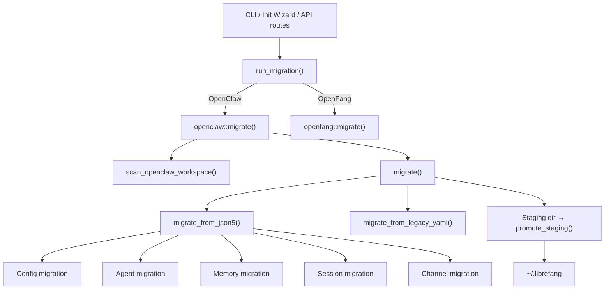

# Migration Tools

# Migration Tools (`librefang-migrate`)

## Purpose

The migration engine imports agents, configuration, memory, sessions, and channel setups from other agent frameworks into LibreFang's native format. It currently supports **OpenClaw** (both modern JSON5 and legacy YAML layouts) and **OpenFang** (same-format fork), with stubs for LangChain and AutoGPT.

All migrations are **atomic**, **idempotent**, and **non-destructive**: existing files are backed up, writes go through a staging directory, and a marker file prevents accidental re-runs from overwriting user edits.

## Architecture



## Entry Point

### `run_migration(options: &MigrateOptions) -> Result<MigrationReport, MigrateError>`

Dispatches to the appropriate backend based on `options.source`. Returns a `MigrationReport` listing every imported item, skipped feature, and warning.

### `MigrateOptions`

| Field | Type | Description |
|-------|------|-------------|
| `source` | `MigrateSource` | Framework to import from |
| `source_dir` | `PathBuf` | Path to the source workspace |
| `target_dir` | `PathBuf` | Path to the LibreFang home directory |
| `dry_run` | `bool` | Report only — no disk writes |

### `MigrateSource` Variants

- **`OpenClaw`** — fully supported
- **`OpenFang`** — fully supported (delegates to `openfang::migrate`)
- **`LangChain`** / **`AutoGpt`** — returns `MigrateError::UnsupportedSource`

## Error Handling (`MigrateError`)

| Variant | Meaning |
|---------|---------|
| `SourceNotFound(PathBuf)` | Source directory does not exist |
| `ConfigParse(String)` | Config file could not be parsed |
| `AgentParse(String)` | Agent definition could not be parsed |
| `Io(std::io::Error)` | Filesystem I/O failure |
| `Yaml(serde_yaml::Error)` | YAML parse error |
| `Json5Parse(String)` | JSON5 parse error |
| `TomlSerialize(toml::ser::Error)` | TOML output serialization failure |
| `UnsupportedSource(String)` | Framework not yet implemented |
| `InvalidId(String)` | Agent ID contains path traversal (security: #3794) |
| `UnsupportedVersion(u32)` | Schema version not in `[1, 2]` (compat: #3797) |
| `StagingExists(PathBuf)` | Stale staging from a previous failed run (#3798) |

## OpenClaw Migration (`openclaw` module)

### Source Layout

The migrator handles two OpenClaw generations:

**Modern (JSON5):**
```
~/.openclaw/
├── openclaw.json          # Single JSON5 config (everything)
├── auth-profiles.json     # Credentials
├── sessions/*.jsonl       # Conversation logs
├── memory/<agent>/MEMORY.md
├── skills/
└── workspaces/<agent>/
```

**Legacy (YAML):**
```
~/.openclaw/
├── config.yaml            # Global config
├── agents/<name>/agent.yaml
├── agents/<name>/MEMORY.md
├── messaging/<channel>.yaml
└── skills/
```

Config auto-detection via `find_config_file()` checks for `openclaw.json`, `clawdbot.json`, `moldbot.json`, `moltbot.json`, then falls back to `config.yaml`.

### Auto-Detection

**`detect_openclaw_home() -> Option<PathBuf>`** searches standard locations in order:
1. `OPENCLAW_STATE_DIR` environment variable
2. `~/.openclaw`, `~/.clawdbot`, `~/.moldbot`, `~/.moltbot`, `~/openclaw`, `~/.config/openclaw`
3. `%APPDATA%/openclaw` and `%LOCALAPPDATA%/openclaw` on Windows

Returns `Some(path)` only when the directory contains a recognized config file or `sessions/`/`memory/` subdirectories.

### Workspace Scanning

**`scan_openclaw_workspace(path: &Path) -> ScanResult`** inspects an OpenClaw workspace without modifying anything. Returns lists of discovered agents, channels, skills, and whether memory exists. Used by the TUI init wizard and the API routes for pre-migration previews.

### Migration Pipeline

`openclaw::migrate()` executes these steps:

#### 1. Pre-flight checks

- Verifies `source_dir` exists
- Checks for the `.openclaw_migrated` marker file — if present, returns immediately with a warning (idempotency)
- For non-dry-run, checks for a stale staging directory and refuses to proceed if one exists (#3798)

#### 2. Staging and atomicity

All writes go to a sibling staging directory (e.g., `~/.librefang.migrate-staging`). On success, `promote_staging()` atomically renames each file into the real target. Existing files in the target are **never overwritten** — staged duplicates are dropped with a warning. On failure, the staging directory is left intact for manual inspection.

Individual file writes use `atomic_write()`: content is written to a `.tmp` sibling first, then `fs::rename`d into place to prevent torn writes.

#### 3. Config migration

Extracts the default model from `agents.defaults.model`, builds a `LibreFangConfig` struct, serializes to TOML, and writes as `config.toml`. Includes the current `CONFIG_VERSION` so the kernel recognizes the file as up-to-date.

#### 4. Agent migration

For each agent entry in `openclaw.json` (or `agents/<name>/agent.yaml` for legacy):

- **ID validation** (`validate_migration_id`): rejects empty strings, NUL bytes, and path-traversal components (#3794)
- **Model resolution**: splits `"provider/model"` references, extracts fallback models from `Detailed` variant
- **Tool mapping**: maps OpenClaw tool names via `librefang_types::tool_compat::{is_known_librefang_tool, map_tool_name}`; resolves profiles (`ToolProfile::Minimal`, `Coding`, `Research`, `Messaging`, `Automation`, `Full`) to concrete tool lists
- **Tool blocklist**: carries over `tools.deny` entries (previously dropped, which widened access)
- **Capability derivation**: infers `shell`, `network`, `agent_message`, `agent_spawn` from the mapped tool list
- **Identity extraction**: `extract_identity_prompt()` handles both raw strings and nested structured objects, searching a priority list of keys (`systemPrompt`, `instructions`, `persona`, etc.)
- **Skill allowlists**: preserved per-agent if present
- **Workspace paths**: preserved if set

Output: `agents/<id>/agent.toml` in LibreFang manifest format.

#### 5. Channel migration

Supports 13 channel types: Telegram, Discord, Slack, WhatsApp, Signal, Matrix, Google Chat, Teams, IRC, Mattermost, Feishu, iMessage, and BlueBubbles.

Each channel is:
- Mapped to a TOML table with policy overrides (`dm_policy`, `group_policy`)
- Secrets (tokens, passwords) extracted into `secrets.env` with restricted permissions (`0o600` on Unix)
- Allow-lists converted to TOML arrays where LibreFang supports them
- Skipped with a reported reason where no adapter exists (iMessage, BlueBubbles)

Policy mapping:
| OpenClaw DM Policy | LibreFang |
|---|---|
| `open` | `respond` |
| `allowlist` | `allowed_only` |
| `pairing`/`disabled` | `ignore` |

| OpenClaw Group Policy | LibreFang |
|---|---|
| `open`/`all` | `all` |
| `mention` | `mention_only` |
| `commands`/`slash_only` | `commands_only` |
| `disabled` | `ignore` |

#### 6. Memory migration

Copies `MEMORY.md` files from both `memory/<agent>/MEMORY.md` and `agents/<agent>/MEMORY.md` (legacy layout) to `agents/<agent>/imported_memory.md`. Deduplicates — if an agent's memory was found in the primary location, the legacy fallback is skipped.

#### 7. Workspace and session migration

- **Workspaces**: copies `workspaces/<agent>/` (or `agents/<agent>/workspace/`) directories recursively to `agents/<agent>/workspace/`
- **Sessions**: copies `sessions/*.jsonl` files to `imported_sessions/`

#### 8. Skipped features report

The following OpenClaw features have no LibreFang equivalent and are reported as skipped:

| Feature | Reason |
|---------|--------|
| `cron` | Use LibreFang's `ScheduleMode::Periodic` |
| `hooks` | Use LibreFang's event system |
| `auth-profiles` / `auth-profiles.json` | Security — set env vars manually |
| `skills.entries` | Reinstall via `librefang skill install` |
| `memory-search/index.db` | SQLite vector index not portable |
| `session` config | LibreFang uses per-agent sessions |
| `memory` backend config | LibreFang uses SQLite with vector embeddings |

### Provider Mapping

`map_provider()` normalizes provider names:

| OpenClaw | LibreFang |
|----------|-----------|
| `anthropic`, `claude` | `anthropic` |
| `openai`, `gpt` | `openai` |
| `google`, `gemini` | `google` |
| `xai`, `grok` | `xai` |
| `groq`, `ollama`, `deepseek`, etc. | passed through as-is |

`default_api_key_env()` maps each provider to its standard environment variable name (e.g., `anthropic` → `ANTHROPIC_API_KEY`). Ollama returns an empty string (no key needed).

## Integration Points

The migration module is called from three places:

| Caller | Function | Context |
|--------|----------|---------|
| `tui/screens/init_wizard.rs` | `detect_openclaw_home()`, `scan_openclaw_workspace()` | Pre-migration preview in the TUI setup wizard |
| `tui/screens/init_wizard.rs` | `run_migration()` | User confirms migration |
| `src/routes/config.rs` | `detect_openclaw_home()` → `scan_openclaw_workspace()` → `run_migration()` | HTTP API endpoints |

The `MigrationReport` returned by `run_migration()` is serialized to `migration_report.md` inside the target directory and includes all imported items, skipped features, and warnings.

## Adding a New Source Framework

1. Add a variant to `MigrateSource` in `lib.rs` and update its `Display` impl
2. Add a dispatch arm in `run_migration()` — return `UnsupportedSource` for stubs
3. Create a new module file (e.g., `langchain.rs`) implementing a `migrate(options: &MigrateOptions) -> Result<MigrationReport, MigrateError>` function
4. Follow the OpenClaw module's pattern: scan → stage → write → promote