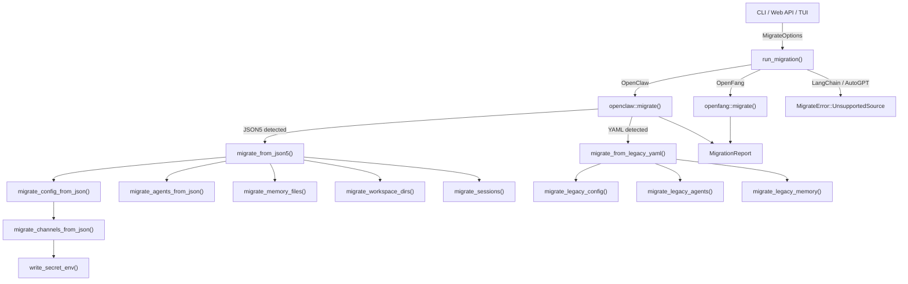

# Migration Tools

# Migration Tools (`librefang-migrate`)

## Purpose

The migration engine imports agents, configuration, memory, sessions, and channel configs from other agent frameworks into LibreFang's native format. It currently supports two sources—**OpenClaw** and **OpenFang**—with stubs for LangChain and AutoGPT.

The crate is used by four callers across the codebase: the CLI (`cmd_migrate`), the web API (`/config/migrate`), the TUI init wizard, and an xtask helper.

---

## Architecture



---

## Public API

### `MigrateSource`

```rust
pub enum MigrateSource {
    OpenClaw,
    LangChain,  // future
    AutoGpt,    // future
    OpenFang,
}
```

Enum of supported source frameworks. `LangChain` and `AutoGpt` return `MigrateError::UnsupportedSource` at runtime.

### `MigrateOptions`

```rust
pub struct MigrateOptions {
    pub source: MigrateSource,
    pub source_dir: PathBuf,   // path to source workspace
    pub target_dir: PathBuf,   // path to LibreFang home directory
    pub dry_run: bool,         // if true, report only — no filesystem writes
}
```

All callers construct this and pass it to `run_migration()`.

### `run_migration(options: &MigrateOptions) -> Result<MigrationReport, MigrateError>`

Top-level dispatch. Matches on `options.source` and delegates to the appropriate submodule's `migrate()` function. Returns a `MigrationReport` detailing everything that was (or would be) imported, skipped, or warned about.

### `MigrateError`

```rust
pub enum MigrateError {
    SourceNotFound(PathBuf),
    ConfigParse(String),
    AgentParse(String),
    Io(std::io::Error),
    Yaml(serde_yaml::Error),
    Json5Parse(String),
    TomlSerialize(toml::ser::Error),
    UnsupportedSource(String),
}
```

All errors are annotated with context. `SourceNotFound` fires when `source_dir` doesn't exist on disk.

---

## OpenClaw Migration (`openclaw` module)

This is the most complex migrator, handling two distinct OpenClaw config formats.

### Config format detection

`find_config_file()` probes the source directory for config files in priority order:

1. **JSON5** (modern): `openclaw.json`, `clawdbot.json`, `moldbot.json`, `moltbot.json`
2. **YAML** (legacy): `config.yaml`

The detection result determines whether `migrate_from_json5()` or `migrate_from_legacy_yaml()` runs.

### JSON5 migration flow

For modern OpenClaw installations with a single `openclaw.json` containing everything:

| Step | Function | What it does |
|------|----------|-------------|
| 1 | `migrate_config_from_json()` | Extracts default model, memory settings; converts to `config.toml` |
| 2 | `migrate_agents_from_json()` | Iterates `agents.list[]`, converts each to `agents/<id>/agent.toml` |
| 3 | `migrate_memory_files()` | Copies `memory/<agent>/MEMORY.md` → `agents/<agent>/imported_memory.md` |
| 4 | `migrate_workspace_dirs()` | Copies `workspaces/<agent>/` → `agents/<agent>/workspace/` |
| 5 | `migrate_sessions()` | Copies `sessions/*.jsonl` → `imported_sessions/` |
| 6 | `report_skipped_features()` | Records cron, hooks, auth profiles, skills, vector index as skipped |

### Legacy YAML migration flow

For very old OpenClaw installations with per-file YAML configs:

| Step | Function | Source layout |
|------|----------|--------------|
| Config | `migrate_legacy_config()` | `config.yaml` → `config.toml` |
| Agents | `migrate_legacy_agents()` | `agents/<name>/agent.yaml` → `agents/<name>/agent.toml` |
| Memory | `migrate_legacy_memory()` | `agents/<name>/MEMORY.md` → `agents/<name>/imported_memory.md` |
| Workspaces | `migrate_legacy_workspaces()` | `agents/<name>/workspace/` → `agents/<name>/workspace/` |
| Skills | `scan_legacy_skills()` | Reports skills as skipped (need reinstall) |
| Channels | `parse_legacy_channels()` | `messaging/<channel>.yaml` → `[channels.*]` in config.toml |

### Channel migration

OpenClaw supports 13+ channel types. The migrator handles them as follows:

**Fully migrated** (config + secrets extracted to `secrets.env`):
- Telegram, Discord, Slack, WhatsApp, Signal, Matrix, IRC, Mattermost, Feishu, Google Chat, Teams

**Skipped with explanation**:
- **iMessage** — macOS-only, requires manual setup
- **BlueBubbles** — no LibreFang adapter
- **Unknown channels** (from the `#[serde(flatten)]` catch-all) — reported as skipped

Secret handling uses `write_secret_env()`, which upserts keys into a `secrets.env` file and restricts permissions to `0o600` on Unix.

### Agent conversion

`convert_agent_from_json()` and `convert_legacy_agent()` transform OpenClaw agent definitions into LibreFang `agent.toml` manifests. Key transformations:

| OpenClaw concept | LibreFang mapping |
|-----------------|-------------------|
| `model: "provider/model"` | `[model] provider = "..." model = "..."` |
| `model.primary` / `model.fallbacks` | `[[fallback_models]]` array |
| `identity` (string or structured) | `system_prompt` via `extract_identity_prompt()` |
| `tools.allow` | `[capabilities] tools = [...]` with name mapping |
| `tools.profile` | `profile = "..."` field + `tools_for_profile()` expansion |
| `tools.deny` | `tool_blocklist = [...]` |
| `skills` | `skills = [...]` array |
| `workspace` path | `workspace = "..."` |

Tool names are mapped via `librefang_types::tool_compat::{is_known_librefang_tool, map_tool_name}`. Unrecognized tools are reported as warnings, not errors.

### Provider and model mapping

`split_model_ref()` parses `"provider/model"` strings (falling back to `("anthropic", input)` if no slash). `map_provider()` normalizes names:

- `anthropic` / `claude` → `"anthropic"`
- `openai` / `gpt` → `"openai"`
- `google` / `gemini` → `"google"`
- `xai` / `grok` → `"xai"`
- And 10+ more providers

`default_api_key_env()` returns the standard env var name for each provider (e.g. `"ANTHROPIC_API_KEY"`, `"OPENAI_API_KEY"`). Ollama returns empty (no key needed).

### Policy mapping

OpenClaw's DM and group policies map to LibreFang equivalents:

| OpenClaw DM policy | LibreFang |
|--------------------|-----------|
| `open` | `respond` |
| `allowlist` / `allow_list` | `allowed_only` |
| `pairing` / `disabled` | `ignore` |

| OpenClaw group policy | LibreFang |
|-----------------------|-----------|
| `open` / `all` | `all` |
| `mention` / `mention_only` | `mention_only` |
| `commands` / `slash_only` | `commands_only` |
| `disabled` / `ignore` | `ignore` |

### Workspace scanning (pre-migration)

Before committing to a migration, callers can inspect the source workspace:

- **`detect_openclaw_home()`** — probes standard locations (`~/.openclaw`, `~/.clawdbot`, `~/.moldbot`, `~/.moltbot`, `%APPDATA%\openclaw`, etc.) and the `OPENCLAW_STATE_DIR` env var
- **`scan_openclaw_workspace(path)`** — returns a `ScanResult` listing found agents, channels, skills, and whether memory exists

These are used by the TUI init wizard and the web API's `/migrate/detect` endpoint.

### Identity/system prompt extraction

OpenClaw's `identity` field is polymorphic—it can be a plain string, a structured object, or nested arrays. `extract_identity_prompt()` recursively searches for the prompt text by probing common keys in priority order:

`systemPrompt` → `system_prompt` → `prompt` → `instructions` → `instruction` → `content` → `text` → `value` → `persona` → `identity` → `description`

Then falls back to recursing into any nested objects/arrays. This defensive approach avoids failing the entire agent migration when the config shape differs.

---

## OpenFang Migration (`openfang` module)

OpenFang is a community fork using the same config format as LibreFang. The migrator:

1. Copies TOML files from the source directory, rewriting internal references (e.g., `openfang` → `librefang` in strings)
2. Validates config files against the current schema using `detect_unknown_fields()` from the config validation module
3. Skips files that already exist in the target (no overwrite)

---

## Migration Report (`report` module)

`MigrationReport` captures the full result of a migration run:

```rust
pub struct MigrationReport {
    pub source: String,
    pub dry_run: bool,
    pub imported: Vec<MigrateItem>,    // successfully migrated items
    pub skipped: Vec<SkippedItem>,     // items that couldn't be migrated
    pub warnings: Vec<String>,         // non-fatal issues
}
```

Each `MigrateItem` has a `kind` (Config, Agent, Channel, Memory, Session, Secret, Skill), a `name`, and a `destination` path. `SkippedItem` adds a `reason` string.

The report can be rendered as:
- **Markdown** via `to_markdown()` — written to `migration_report.md` in the target directory
- **Terminal summary** via `print_summary()` — used by the CLI and xtask

---

## Skipped Features

Not everything from OpenClaw can be auto-migrated. The following are reported as skipped with guidance:

| Feature | Reason |
|---------|--------|
| Cron jobs | Use LibreFang's `ScheduleMode::Periodic` |
| Webhook hooks | Use LibreFang's event system |
| Auth profiles | Security — set env vars manually |
| Skills | Must be reinstalled via `librefang skill install` |
| SQLite vector index (`memory-search/index.db`) | Not portable — LibreFang rebuilds embeddings |
| `auth-profiles.json` | Security — set API keys as env vars |
| Session scope config | LibreFang uses per-agent sessions by default |
| Memory backend config | LibreFang uses SQLite with vector embeddings |

---

## Error Handling Philosophy

The migration engine is designed to be **maximally forgiving**: a failure in one agent does not abort the rest of the migration. Individual agent parse errors are captured as `SkippedItem` entries. Unparseable channels are skipped. The only hard failures are:

- Source directory doesn't exist (`MigrateError::SourceNotFound`)
- The main config file can't be parsed (`MigrateError::ConfigParse` / `MigrateError::Json5Parse`)
- I/O errors writing to the target directory

---

## Integration Points

| Caller | Module | What it uses |
|--------|--------|-------------|
| `cmd_migrate` | `librefang-cli` | `run_migration()`, `print_summary()` |
| `migrate_detect` | Web API (`src/routes/config.rs`) | `detect_openclaw_home()`, `scan_openclaw_workspace()` |
| `run_migrate` | Web API | `run_migration()` |
| Init wizard | TUI (`tui/screens/init_wizard.rs`) | `detect_openclaw_home()`, `scan_openclaw_workspace()` |
| xtask | `xtask/src/migrate.rs` | `run_migration()`, `print_summary()` |

---

## Adding a New Source Framework

1. Add a variant to `MigrateSource` in `lib.rs`
2. Add a match arm in `run_migration()` — return `UnsupportedSource` if not yet implemented
3. Create a new submodule (e.g., `pub mod langchain;`)
4. Implement `pub fn migrate(options: &MigrateOptions) -> Result<MigrationReport, MigrateError>`
5. Populate the `MigrationReport` with imported/skipped/warnings
6. Add workspace scanning functions if pre-migration inspection is needed