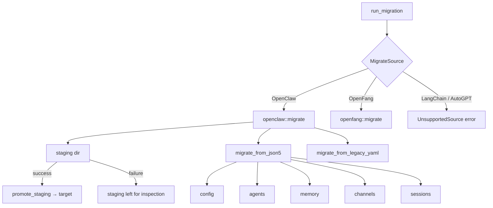

# Migration Tools

# Migration Tools (`librefang-migrate`)

## Overview

The migration engine imports agents, memory, sessions, skills, and channel configurations from other agent frameworks into LibreFang's native format. It currently supports **OpenClaw** (both modern JSON5 and legacy YAML layouts) and **OpenFang** (same-format community fork), with stubs for LangChain and AutoGPT.

The module is designed around three priorities:

1. **Crash safety** — all writes go through an atomic staging directory; a partial failure never corrupts the target.
2. **Idempotency** — a marker file prevents accidental re-imports that would overwrite manual edits.
3. **Security** — agent IDs are validated for path traversal, secrets are written with restricted permissions, and schema versions are checked before processing.

## Architecture



## Public API

### `run_migration`

```rust
pub fn run_migration(options: &MigrateOptions) -> Result<MigrationReport, MigrateError>
```

Top-level entry point. Dispatches to `openclaw::migrate` or `openfang::migrate` based on `options.source`. Returns a `MigrationReport` listing every imported item, skipped item, and warning.

### `MigrateOptions`

| Field | Type | Purpose |
|---|---|---|
| `source` | `MigrateSource` | Framework to import from |
| `source_dir` | `PathBuf` | Path to the source workspace |
| `target_dir` | `PathBuf` | Path to the LibreFang home directory |
| `dry_run` | `bool` | Report what would happen without writing to disk |

### `MigrateSource`

```rust
pub enum MigrateSource {
    OpenClaw,   // fully supported
    OpenFang,   // fully supported
    LangChain,  // returns UnsupportedSource error
    AutoGpt,    // returns UnsupportedSource error
}
```

### `MigrateError`

All errors use `thiserror` for ergonomic formatting. Key variants:

| Variant | When |
|---|---|
| `SourceNotFound(PathBuf)` | Source directory doesn't exist |
| `ConfigParse(String)` | Config file can't be parsed |
| `AgentParse(String)` | Agent definition is malformed |
| `UnsupportedVersion(u32)` | `openclaw.json` declares schema version other than 1 or 2 (#3797) |
| `InvalidId(String)` | Agent ID contains `..`, absolute path, or NUL bytes (#3794) |
| `StagingExists(PathBuf)` | Stale staging directory from a previous failed run (#3798) |
| `Io`, `Yaml`, `TomlSerialize`, `Json5Parse` | Wrapped I/O and serialization errors |

---

## OpenClaw Migration (`openclaw` module)

### Supported Workspace Layouts

**Modern (JSON5):**

```
~/.openclaw/
├── openclaw.json          # JSON5 — single config (agents, channels, models, tools, etc.)
├── auth-profiles.json
├── sessions/*.jsonl
├── memory/<agent>/MEMORY.md
├── skills/
└── workspaces/<agent>/
```

Also recognizes legacy directory names: `~/.clawdbot`, `~/.moldbot`, `~/.moltbot`.

**Legacy (YAML):**

```
~/.openclaw/
├── config.yaml
├── agents/<agent>/agent.yaml
├── messaging/<channel>.yaml
├── skills/community/*, skills/custom/*
```

### Workspace Detection

`detect_openclaw_home()` searches these locations in order:

1. `OPENCLAW_STATE_DIR` environment variable
2. `~/.openclaw`, `~/.clawdbot`, `~/.moldbot`, `~/.moltbot`
3. `~/openclaw`, `~/.config/openclaw`
4. `%APPDATA%\openclaw`, `%LOCALAPPDATA%\openclaw` (Windows)

Returns `None` if no directory contains a recognizable config file or `sessions/`/`memory/` subdirectory.

### Workspace Scanning

`scan_openclaw_workspace(path)` returns a `ScanResult` describing what's available:

```rust
pub struct ScanResult {
    pub path: String,
    pub has_config: bool,
    pub agents: Vec<ScannedAgent>,
    pub channels: Vec<String>,
    pub skills: Vec<String>,
    pub has_memory: bool,
}
```

Used by the CLI init wizard and `config.rs` routes to preview migrations before committing.

### Migration Flow

1. **Schema validation** — `openclaw.json` must declare version 1 or 2. Unknown versions produce `UnsupportedVersion`. Missing version is allowed with a warning.
2. **Config migration** — Global settings are converted to LibreFang's `config.toml`. The default model is extracted from `agents.defaults.model` and split into `(provider, model)` via `split_model_ref`.
3. **Agent migration** — Each agent entry is validated (#3794), converted to a TOML manifest under `agents/<id>/agent.toml`. Tool names are mapped via `librefang_types::tool_compat::map_tool_name`. Unrecognized tools produce warnings but don't fail the migration.
4. **Channel migration** — 13 channel types are handled (Telegram, Discord, Slack, WhatsApp, Signal, Matrix, Google Chat, Teams, IRC, Mattermost, Feishu, iMessage, BlueBubbles). Secrets are extracted into `secrets.env` with `0o600` permissions on Unix. DM and group policies are mapped to LibreFang equivalents.
5. **Memory migration** — `memory/<agent>/MEMORY.md` files are copied to `agents/<agent>/imported_memory.md`.
6. **Workspace migration** — `workspaces/<agent>/` directories are recursively copied.
7. **Session migration** — `.jsonl` session files are copied to `imported_sessions/`.
8. **Skipped features** — Cron jobs, hooks, auth profiles, skill entries, vector indexes, and memory backend config are reported as skipped items with explanatory reasons.

### Atomic Staging (#3798)

All file writes go to a sibling staging directory (e.g., `~/.librefang.migrate-staging/`). Only after every migration step succeeds does `promote_staging()` move files into the real target. Key properties:

- **No overwrites** — existing files in the target are never clobbered (#3795). Staged copies that would overwrite are dropped and reported as warnings.
- **Per-entry atomicity** — each file is renamed into place (same-filesystem) or copied through a `.migrate-tmp` file then renamed.
- **Failure recovery** — if promotion fails partway, the staging directory remains for manual inspection.

### Idempotency

After a successful migration, a marker file `.openclaw_migrated` is written to the target. Subsequent `migrate()` calls detect this marker and return early with a warning rather than re-importing. Delete the marker to force a re-run.

### File Safety Helpers

| Function | Purpose |
|---|---|
| `atomic_write(path, content)` | Writes to a `.tmp` sibling then renames — prevents torn writes |
| `backup_existing(path)` | Renames to `.bak.<timestamp>` before overwriting |
| `write_with_backup(dest, content, report)` | Combines backup + atomic write; logs the backup path as a warning |
| `validate_migration_id(id)` | Rejects empty strings, NUL bytes, `..`, absolute paths |

### Channel Policy Mapping

OpenClaw policies are translated to LibreFang equivalents:

| OpenClaw DM Policy | LibreFang |
|---|---|
| `open` | `respond` |
| `allowlist` / `allow_list` | `allowed_only` |
| `pairing` / `disabled` | `ignore` |

| OpenClaw Group Policy | LibreFang |
|---|---|
| `open` / `all` | `all` |
| `mention` / `mention_only` | `mention_only` |
| `commands` / `slash_only` | `commands_only` |
| `disabled` / `ignore` | `ignore` |

### Provider Mapping

`map_provider()` normalizes provider names:

| OpenClaw | LibreFang |
|---|---|
| `anthropic`, `claude` | `anthropic` |
| `openai`, `gpt` | `openai` |
| `google`, `gemini` | `google` |
| `xai`, `grok` | `xai` |

Unrecognized provider names pass through unchanged.

### Secrets Handling

`write_secret_env()` manages a `secrets.env` file with `KEY=value` lines:

- Existing keys are updated in place; new keys are appended.
- Keys and values containing newlines are rejected.
- On Unix, file permissions are set to `0o600`.

### Agent Tool Resolution

Tools are resolved in this order per agent:

1. `tools.allow` list → each name checked via `is_known_librefang_tool` or mapped via `map_tool_name`
2. `tools.also_allow` list → appended to the above
3. `tools.profile` → expanded via `ToolProfile::tools()` (e.g., `"coding"` → `ToolProfile::Coding.tools()`)
4. Agent defaults from `agents.defaults.tools`
5. Fallback: `["file_read", "file_list", "web_fetch"]`

`tools.deny` lists are preserved as `tool_blocklist` in the agent manifest. Agent `skills` lists are preserved as the `skills` field. Custom `workspace` paths are preserved.

Capabilities (`shell`, `network`, `agent_message`, `agent_spawn`) are derived from the resolved tool list via `derive_capabilities()`.

### Identity / System Prompt Extraction

OpenClaw's `identity` field can be a raw string or an arbitrarily-nested JSON object. `extract_identity_prompt()` recursively searches for prompt content in these keys (in order): `systemPrompt`, `system_prompt`, `prompt`, `instructions`, `instruction`, `content`, `text`, `value`, `persona`, `identity`, `description`. Falls back to nested objects and arrays. If nothing is found, a default prompt is generated using the agent's display name.

---

## OpenFang Migration (`openfang` module)

Handles migration from OpenFang, which uses the same TOML + `.env` format as LibreFang. The module:

- Copies config and agent files to the target
- Rewrites environment variable references via `rewrite_env_content()`
- Detects schema drift between source and current LibreFang schema via `warn_on_schema_drift()`, which delegates to `librefang_types::config::validation::detect_unknown_fields`

---

## Reporting (`report` module)

`MigrationReport` captures the full outcome of a migration:

```rust
pub struct MigrationReport {
    pub source: String,
    pub dry_run: bool,
    pub imported: Vec<MigrateItem>,
    pub skipped: Vec<SkippedItem>,
    pub warnings: Vec<String>,
}
```

- `MigrateItem` — each successfully migrated resource with its `ItemKind` (Config, Agent, Channel, Memory, Secret, Session, Skill), name, and destination path.
- `SkippedItem` — resources that couldn't be migrated, with a human-readable reason.
- `warnings` — non-fatal issues (unmapped tools, backed-up files, channels with unmappable allowlists).

`MigrationReport::to_markdown()` generates a readable summary written to `migration_report.md` in the target.

---

## Integration Points

| Consumer | Usage |
|---|---|
| `src/routes/config.rs` | `run_migration()` via `run_migrate()`, `scan_openclaw_workspace()` via `migrate_scan()`, `detect_openclaw_home()` via `migrate_detect()` |
| `tui/screens/init_wizard.rs` | `detect_openclaw_home()` to check for existing installs, `scan_openclaw_workspace()` for preview, `run_migration()` via `handle_migration_key()` |
| `librefang-types` | `tool_compat` for tool name mapping, `config::validation` for schema drift detection, `config::CONFIG_VERSION` and `agent::ToolProfile` |
