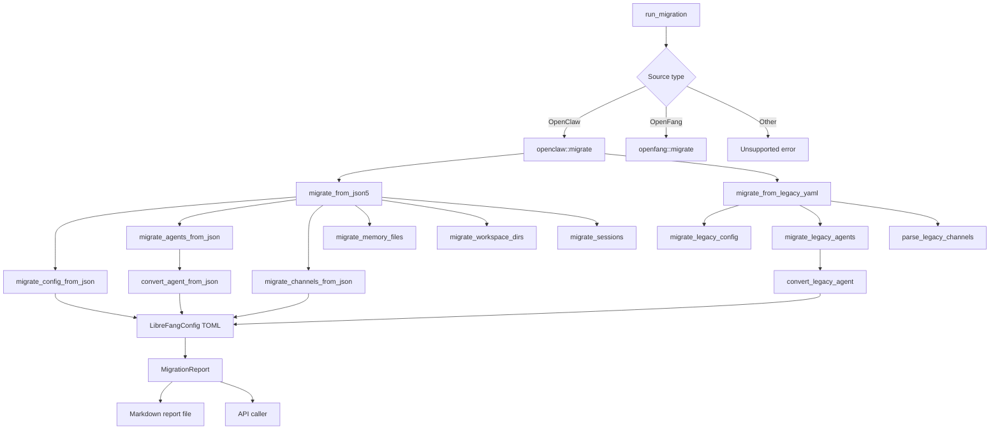

# Migration Tools

# Migration Tools Module

The `librefang-migrate` crate handles importing agents, configuration, memory, sessions, and channel settings from external agent frameworks into LibreFang. It is the primary onboarding path for users switching from OpenClaw, OpenFang, or other compatible frameworks.

## Overview

Migration is a one-time, directional process: source frameworks export configuration and state, which this module transforms into LibreFang's TOML-based format. The migration is designed to be **safe and informative** — it produces a detailed report of what was imported, what was skipped, and any warnings encountered along the way.

### Supported Sources

| Source | Status | Config Format |
|--------|--------|---------------|
| OpenClaw | ✅ Full support | JSON5 (`openclaw.json`) or legacy YAML |
| OpenFang | ✅ Full support | Same as OpenClaw JSON5 |
| LangChain | ❌ Planned | — |
| AutoGPT | ❌ Planned | — |

### What Gets Migrated

| Item | JSON5 Migration | Legacy YAML Migration |
|------|-----------------|----------------------|
| Global config | ✅ | ✅ |
| Agents | ✅ | ✅ |
| Memory (MEMORY.md) | ✅ | ✅ |
| Session logs (JSONL) | ✅ | ❌ |
| Workspace directories | ✅ | ✅ |
| Messaging channels (13+ adapters) | ✅ | ✅ |
| Tool profiles | ✅ | ✅ |
| Fallback models | ✅ | ❌ |

### What Is Skipped

The following are intentionally not migrated. Each generates a warning in the migration report:

- **Cron jobs** — LibreFang uses `ScheduleMode::Periodic` instead
- **Webhook hooks** — Use LibreFang's event system
- **Auth profiles / credentials** — Exported for security; set as environment variables
- **Vector index database** — LibreFang rebuilds embeddings on first run
- **Skills** — Must be reinstalled via `librefang skill install`
- **iMessage channel** — macOS-only; requires manual setup
- **BlueBubbles channel** — No LibreFang adapter available

## Architecture

The module is split into four source files:

```
librefang-migrate/
├── lib.rs        # Public API: MigrateOptions, MigrateSource, run_migration
├── openclaw.rs   # OpenClaw migration logic (JSON5 + legacy YAML)
├── openfang.rs   # OpenFang migration logic
└── report.rs     # MigrationReport and Markdown output
```



## Public API

### `MigrateOptions`

```rust
pub struct MigrateOptions {
    pub source: MigrateSource,        // Which framework to migrate from
    pub source_dir: PathBuf,          // Path to source workspace
    pub target_dir: PathBuf,         // LibreFang home directory
    pub dry_run: bool,               // Preview mode — no files written
}
```

### `run_migration`

```rust
pub fn run_migration(options: &MigrateOptions) -> Result<MigrationReport, MigrateError>
```

Entry point for all migrations. Dispatches to the appropriate source handler and returns a structured report.

### Auto-Detection

```rust
pub fn detect_openclaw_home() -> Option<PathBuf>
pub fn scan_openclaw_workspace(path: &Path) -> ScanResult
```

These functions support the init wizard and config UI. `detect_openclaw_home()` searches standard locations:

```text
~/.openclaw/            (modern)
~/.clawdbot/            (legacy)
~/.moldbot/             (legacy)
~/.moltbot/             (legacy)
~/.config/openclaw/     (XDG)
%APPDATA%/openclaw/     (Windows)
%LOCALAPPDATA%/openclaw/
```

The `OPENCLAW_STATE_DIR` environment variable overrides auto-detection.

## OpenClaw Workspace Structure

Modern OpenClaw uses a **single JSON5 config file** at `~/.openclaw/openclaw.json` that contains everything:

```text
~/.openclaw/
├── openclaw.json           # JSON5 — all config lives here
├── auth-profiles.json      # Auth credentials (NOT migrated)
├── sessions/               # JSONL conversation logs
│   ├── main.jsonl
│   └── agent:coder:main.jsonl
├── memory/                 # Per-agent MEMORY.md files
│   ├── default/MEMORY.md
│   └── coder/MEMORY.md
├── memory-search/          # SQLite vector index (NOT migrated)
├── skills/                 # Installed skills (NOT migrated)
├── cron/                   # Cron state (NOT migrated)
├── hooks/                  # Webhook hooks (NOT migrated)
└── workspaces/             # Per-agent working directories
    └── coder/
```

Legacy OpenClaw (very old installs) used a **YAML-based structure**:

```text
~/.moldbot/
├── config.yaml             # Global config
├── agents/
│   └── coder/
│       ├── agent.yaml      # Per-agent config
│       ├── MEMORY.md
│       ├── sessions/
│       └── workspace/
├── messaging/
│   ├── telegram.yaml
│   └── discord.yaml
└── skills/
```

## Agent Migration

### Tool Profile Mapping

OpenClaw tool profiles map to LibreFang `ToolProfile` values:

| OpenClaw Profile | LibreFang Profile | Tools Included |
|------------------|-------------------|----------------|
| `minimal` | `minimal` | Minimal set |
| `coding`, `coder`, `developer`, `dev` | `coding` | Read, Write, Bash, etc. |
| `research`, `researcher` | `research` | Web search, fetch, etc. |
| `messaging`, `chat` | `messaging` | Messaging tools |
| `automation`, `automator` | `automation` | Automation tools |
| `custom` | `custom` | Custom profile |
| (unknown) | `full` | All tools |

The `tools_for_profile()` function delegates to `librefang_types::agent::ToolProfile` to ensure migration and kernel use identical definitions.

### Tool Name Compatibility

The migration uses `librefang_types::tool_compat` to handle tool name differences:

- `Read` → `file_read` (if recognized by LibreFang)
- `Write` → `file_write`
- `Bash` → `shell_exec`
- `WebSearch` → `web_search`
- Unknown tools → logged as warnings

### Capability Derivation

The `derive_capabilities()` function infers LibreFang capability grants from the tool list:

| Tool | Capability Granted |
|------|-------------------|
| `*` (wildcard) | Full shell, network, agent_message, agent_spawn |
| `shell_exec` | `shell = ["*"]` |
| `web_fetch`, `web_search`, `browser_navigate` | `network = ["*"]` |
| `agent_send`, `agent_list` | `agent_message = ["*"]`, `agent_spawn = true` |

### Identity / System Prompt Extraction

OpenClaw's `identity` field is flexible — it can be a raw string or a structured object. The migration searches for common prompt-bearing keys:

```
systemPrompt, system_prompt, prompt, instructions, instruction,
content, text, value, persona, identity, description
```

If identity is empty or missing, a default prompt is generated.

### Per-Agent Configuration Preserved

Several per-agent settings that were previously dropped are now correctly migrated:

- **`tool_blocklist`** — Previously silently dropped, causing widened tool access
- **`workspace`** — Custom working directory path
- **`skills`** — Per-agent skill allowlist

## Channel Migration

LibreFang supports 13+ messaging channel adapters. The migration maps each to LibreFang's TOML format:

| Channel | OpenClaw Field | LibreFang Mapping |
|---------|---------------|-------------------|
| Telegram | `botToken` | `channels.telegram.bot_token_env` |
| Discord | `token` | `channels.discord.bot_token_env` |
| Slack | `botToken`, `appToken` | `channels.slack.bot_token_env`, `app_token_env` |
| WhatsApp | `authDir` (Baileys) | Credentials copied to `credentials/` |
| Signal | `httpUrl`, `httpHost` | `channels.signal.api_url` |
| Matrix | `accessToken` | `channels.matrix.access_token_env` |
| Google Chat | `serviceAccountFile` | Copied to `credentials/google_chat_sa.json` |
| MS Teams | `appPassword` | `channels.teams.app_password_env` |
| IRC | `host`, `port`, `nick`, `password` | `channels.irc` fields |
| Mattermost | `botToken` | `channels.mattermost.token_env` |
| Feishu | `appId`, `appSecret` | `channels.feishu.app_id`, `app_secret_env` |
| iMessage | `cliPath` | Skipped (macOS-only) |
| BlueBubbles | — | Skipped (no adapter) |

### Policy Mapping

OpenClaw's DM and group policies map to LibreFang equivalents:

**DM Policy:**

| OpenClaw | LibreFang |
|----------|-----------|
| `open` | `respond` |
| `allowlist` / `allow_list` | `allowed_only` |
| `pairing` / `disabled` | `ignore` |

**Group Policy:**

| OpenClaw | LibreFang |
|----------|-----------|
| `open` / `all` | `all` |
| `mention` / `mention_only` | `mention_only` |
| `commands` / `commands_only` / `slash_only` | `commands_only` |
| `disabled` / `ignore` | `ignore` |

### Secrets Handling

API tokens and credentials are **never written to TOML files**. Instead, they are:

1. Extracted from the source config
2. Written to `secrets.env` with restricted permissions (`0o600` on Unix)
3. Referenced in `config.toml` via `*_env` fields (e.g., `bot_token_env = "TELEGRAM_BOT_TOKEN"`)

On Unix systems, file permissions are restricted after writing to prevent other users from reading secrets.

### Limitations

Some OpenClaw `allow_from` fields cannot be auto-migrated:

- **Slack** — Uses per-user allowlists; LibreFang has only `allowed_channels`
- **Matrix** — Uses `allow_from` for users; LibreFang has only `allowed_rooms`
- **Teams** — Uses `allow_from` for users; LibreFang has only `allowed_tenants`
- **IRC** — No per-user allowlist field in LibreFang

These generate warnings in the migration report.

## Provider Mapping

OpenClaw provider names map to LibreFang providers:

| OpenClaw | LibreFang |
|----------|-----------|
| `anthropic`, `claude` | `anthropic` |
| `openai`, `gpt` | `openai` |
| `groq` | `groq` |
| `ollama` | `ollama` |
| `openrouter` | `openrouter` |
| `deepseek` | `deepseek` |
| `together` | `together` |
| `mistral` | `mistral` |
| `fireworks` | `fireworks` |
| `google`, `gemini` | `google` |
| `xai`, `grok` | `xai` |
| `cerebras` | `cerebras` |
| `sambanova` | `sambanova` |

Unknown providers pass through unchanged.

Default API key environment variables are derived per provider (e.g., `ANTHROPIC_API_KEY`, `OPENAI_API_KEY`, etc.). Ollama requires no API key.

## Migration Report

After migration, a `migration_report.md` is written to the target directory:

```markdown
# Migration Report

**Source:** OpenClaw  
**Date:** 2024-01-15 10:30:00 UTC  
**Dry run:** false

## Imported (24 items)

| Kind | Name | Destination |
|------|------|-------------|
| Config | openclaw.json | config.toml |
| Agent | coder | agents/coder/agent.toml |
| Agent | researcher | agents/researcher/agent.toml |
| Channel | telegram | config.toml [channels.telegram] |
| Channel | discord | config.toml [channels.discord] |
| Memory | coder/MEMORY.md | agents/coder/imported_memory.md |
| ... | ... | ... |

## Skipped (8 items)

| Kind | Name | Reason |
|------|------|--------|
| Skill | web-scraper | Skills must be reinstalled via `librefang skill install` |
| Config | auth-profiles | Auth profiles not migrated for security |
| Channel | imessage | macOS-only channel |
| Channel | bluebubbles | No LibreFang adapter available |
| ... | ... | ... |

## Warnings (3 items)

- Agent 'coder': tool 'unknown-tool' has no LibreFang equivalent
- WhatsApp Baileys credentials copied — you may need to re-authenticate
- Matrix: OpenClaw 'allow_from' could not be auto-mapped
```

## Error Handling

`MigrateError` variants:

```rust
pub enum MigrateError {
    SourceNotFound(PathBuf),           // Source directory doesn't exist
    ConfigParse(String),               // Failed to parse config.yaml
    AgentParse(String),               // Failed to parse agent.yaml
    Io(std::io::Error),               // File system errors
    Yaml(serde_yaml::Error),          // YAML parse errors
    Json5Parse(String),               // JSON5 parse errors
    TomlSerialize(toml::ser::Error),  // TOML output errors
    UnsupportedSource(String),         // Unknown/unsupported source framework
}
```

## Usage

### From the CLI

```bash
librefang migrate --source openclaw --source-dir ~/.openclaw --target-dir ~/.librefang
librefang migrate --source openfang --source-dir ~/.openfang --target-dir ~/.librefang --dry-run
```

### From the Init Wizard

The TUI init wizard (`tui/screens/init_wizard.rs`) uses `detect_openclaw_home()` and `scan_openclaw_workspace()` to offer one-click migration during setup.

### Programmatically

```rust
use librefang_migrate::{run_migration, MigrateOptions, MigrateSource};

let options = MigrateOptions {
    source: MigrateSource::OpenClaw,
    source_dir: PathBuf::from("~/.openclaw"),
    target_dir: PathBuf::from("~/.librefang"),
    dry_run: true,
};

let report = run_migration(&options)?;
println!("{}", report.to_markdown());
```

## Integration Points

The migration module is called from:

| Caller | Purpose |
|--------|---------|
| `librefang-cli/src/main.rs` | `cmd_migrate` command |
| `tui/screens/init_wizard.rs` | Auto-detect and offer migration during setup |
| `src/routes/config.rs` | Web UI migration endpoints |
| `xtask/src/migrate.rs` | Internal development tooling |

## Security Considerations

1. **Credentials never go to TOML** — All tokens are written to `secrets.env` and referenced by environment variable name.

2. **Restricted file permissions** — `secrets.env` is created with `0o600` permissions on Unix systems, preventing other users from reading it.

3. **Auth profiles not migrated** — OpenClaw's `auth-profiles.json` contains raw API keys and OAuth tokens. This file is explicitly skipped and a warning is generated. Users must set credentials as environment variables.

4. **Vector index not migrated** — The SQLite database containing vector embeddings is not portable. LibreFang rebuilds the index on first run with the migrated memory files.

5. **WhatsApp credentials** — Baileys session data is copied but users may need to re-authenticate after migration due to device linkage differences.