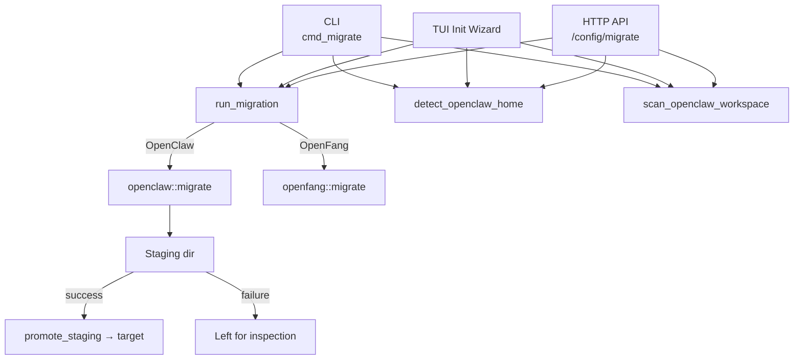

# Migration

# Migration Module (`librefang-migrate`)

## Overview

The migration engine imports agents, memory, sessions, skills, and channel configurations from other agent frameworks into LibreFang's native format. It currently supports two source frameworks—**OpenClaw** (including legacy YAML installs) and **OpenFang** (a community fork sharing the same format)—with stubs for LangChain and AutoGPT.

## Architecture



## Entry Points

### `run_migration(options: &MigrateOptions) -> Result<MigrationReport, MigrateError>`

Top-level dispatch in `lib.rs`. Routes to the appropriate sub-module based on `MigrateOptions.source`. Returns a `MigrationReport` listing every imported item, skipped feature, and warning.

### `openclaw::detect_openclaw_home() -> Option<PathBuf>`

Auto-detects an existing OpenClaw installation by checking:

1. `OPENCLAW_STATE_DIR` environment variable
2. Standard directories: `~/.openclaw`, `~/.clawdbot`, `~/.moldbot`, `~/.moltbot`, `~/openclaw`, `~/.config/openclaw`
3. Windows-specific paths: `%APPDATA%\openclaw`, `%LOCALAPPDATA%\openclaw`

Returns `Some(path)` only if the directory exists and contains a recognizable config file or `sessions`/`memory` subdirectories.

### `openclaw::scan_openclaw_workspace(path: &Path) -> ScanResult`

Read-only scan that returns a `ScanResult` listing discovered agents, channels, skills, and whether memory data exists. Used by the CLI and TUI to preview what will be migrated before committing.

## Configuration: `MigrateOptions`

| Field | Type | Purpose |
|-------|------|---------|
| `source` | `MigrateSource` | Which framework to migrate from |
| `source_dir` | `PathBuf` | Path to the source workspace root |
| `target_dir` | `PathBuf` | Path to the LibreFang home directory |
| `dry_run` | `bool` | If `true`, report what would happen without writing anything |

`MigrateSource` variants: `OpenClaw`, `OpenFang`, `LangChain` (unsupported), `AutoGpt` (unsupported).

## OpenClaw Migration

OpenClaw has two configuration formats, both handled by `openclaw::migrate`:

### Modern JSON5 format

A single `openclaw.json` (or `clawdbot.json`, `moldbot.json`, `moltbot.json`) in the workspace root containing everything: global config, agents, channels, models, tools, cron, hooks, and skills.

```
~/.openclaw/
├── openclaw.json          # JSON5 — single unified config
├── auth-profiles.json     # Credentials (not migrated)
├── sessions/              # JSONL conversation logs
├── memory/                # Per-agent MEMORY.md files
├── skills/                # Installed skills
└── workspaces/            # Per-agent working directories
```

Schema versions 1 and 2 are supported. A config declaring an unsupported version produces `MigrateError::UnsupportedVersion`.

### Legacy YAML format

Very old installs use separate YAML files:

```
~/.openclaw/
├── config.yaml            # Global provider/model config
├── agents/
│   └── <name>/
│       ├── agent.yaml     # Agent definition
│       └── MEMORY.md      # Agent memory
├── messaging/
│   ├── telegram.yaml      # Per-channel config
│   └── discord.yaml
└── skills/
    ├── community/
    └── custom/
```

### Migration Pipeline

`openclaw::migrate` executes these steps in order:

1. **Validate source** — confirm `source_dir` exists
2. **Check marker** — if `.openclaw_migrated` exists in the target, skip to prevent overwriting user edits
3. **Detect format** — call `find_config_file` to locate JSON5 or YAML config
4. **Dry-run path** — if `dry_run` is `true`, run the full pipeline without touching disk
5. **Create staging directory** — sibling `<leaf>.migrate-staging` for atomic writes
6. **Execute migration steps** (all writes go to staging):
   - Migrate global config → `config.toml`
   - Migrate agents → `agents/<id>/agent.toml`
   - Migrate memory files → `agents/<id>/imported_memory.md`
   - Migrate workspace directories → `agents/<id>/workspace/`
   - Migrate sessions → `imported_sessions/*.jsonl`
   - Report skipped features
7. **Write marker and report** into staging
8. **Promote staging → target** — move entries into the real target, never overwriting existing files
9. **Clean up** staging directory

### What Gets Migrated

| Source | Destination | Notes |
|--------|-------------|-------|
| `openclaw.json` / `config.yaml` | `config.toml` | Provider, model, memory decay, channels |
| Agent entries | `agents/<id>/agent.toml` | Model, tools, capabilities, system prompt |
| `memory/<id>/MEMORY.md` | `agents/<id>/imported_memory.md` | Checked in both `memory/` and `agents/` layouts |
| `workspaces/<id>/` | `agents/<id>/workspace/` | Recursive copy |
| `sessions/*.jsonl` | `imported_sessions/` | Raw copy |
| Channel tokens/keys | `secrets.env` | Restricted to mode 0o600 on Unix |
| WhatsApp credentials dir | `credentials/whatsapp/` | Baileys auth files |
| Google Chat SA file | `credentials/google_chat_sa.json` | Service account JSON |

### What Gets Skipped (Reported)

These features have no automatic migration path and are logged as `SkippedItem` entries:

- **Cron jobs** — use LibreFang's `ScheduleMode::Periodic` instead
- **Hooks** — use LibreFang's event system
- **Auth profiles** (`auth-profiles.json`) — set API keys as environment variables manually
- **Skills** — reinstall via `librefang skill install`
- **Vector search index** (`memory-search/index.db`) — LibreFang rebuilds embeddings
- **iMessage** — macOS-only, requires manual setup
- **BlueBubbles** — no LibreFang adapter
- **Session/memory config sections** — structural differences

## Channel Migration

The migrator handles 13 channel types. For each channel, it:

1. Extracts tokens/credentials into `secrets.env` (key-value format, existing keys are updated)
2. Builds a TOML table with env-var references (never raw secrets in config.toml)
3. Maps DM and group policies to LibreFang equivalents

### Policy Mapping

**DM policy** (`map_dm_policy`):

| OpenClaw | LibreFang |
|----------|-----------|
| `open` | `respond` |
| `allowlist` / `allow_list` | `allowed_only` |
| `pairing` / `disabled` | `ignore` |

**Group policy** (`map_group_policy`):

| OpenClaw | LibreFang |
|----------|-----------|
| `open` / `all` | `all` |
| `mention` / `mention_only` | `mention_only` |
| `commands` / `commands_only` / `slash_only` | `commands_only` |
| `disabled` / `ignore` | `ignore` |

### Allow-List Caveats

Some channel configs in OpenClaw support `allow_from` (per-user allowlists) that have no direct equivalent in LibreFang. For Slack, Matrix, Teams, IRC, and Mattermost, a warning is emitted. Where LibreFang does support user allowlists (Telegram, Discord, WhatsApp, Signal), the list is mapped to the appropriate TOML field.

## Agent Migration

Each agent produces a complete `agent.toml` manifest with:

- **Model resolution** — agent-level model overrides defaults; `"provider/model"` strings are split via `split_model_ref`. Fallback models produce `[[fallback_models]]` entries.
- **Tool mapping** — delegates to `librefang_types::tool_compat::{is_known_librefang_tool, map_tool_name}` for compatibility. Unrecognized tools are reported as warnings.
- **Tool profiles** — mapped via `tools_for_profile` which uses `librefang_types::agent::ToolProfile`. Profile names: `minimal`, `coding`, `research`, `messaging`, `automation`, `full`.
- **Capabilities derivation** — `derive_capabilities` infers `shell`, `network`, `agent_message`, and `agent_spawn` grants from the resolved tool list.
- **System prompt extraction** — `extract_identity_prompt` handles both raw strings and structured objects, searching common keys (`systemPrompt`, `instructions`, `persona`, etc.) recursively.
- **Tool blocklist** — OpenClaw's `tools.deny` list is preserved as `tool_blocklist` in the output.
- **Skill allowlist** — agent-level `skills` entries are preserved.
- **Custom workspace path** — preserved if non-empty.

## Provider Mapping

`map_provider` normalizes OpenClaw provider names:

| OpenClaw aliases | LibreFang provider |
|------------------|--------------------|
| `anthropic`, `claude` | `anthropic` |
| `openai`, `gpt` | `openai` |
| `google`, `gemini` | `google` |
| `xai`, `grok` | `xai` |
| Others | Passed through as-is |

`default_api_key_env` maps each provider to its conventional environment variable name (e.g., `ANTHROPIC_API_KEY`, `OPENAI_API_KEY`). Ollama returns an empty string (no key needed).

## Atomicity and Safety

### Path Traversal Protection (#3794)

`validate_migration_id` rejects agent IDs containing `..`, absolute paths, NUL bytes, or any non-`Normal` path component. All agent names from both JSON5 entries and filesystem-derived directory names are validated.

### Atomic File Writes

`atomic_write` writes content to a `.tmp` sibling first, then renames into place. This prevents torn writes if the process is interrupted mid-write.

### Staging Directory (#3798)

All migration writes go to a sibling staging directory (`<target>.migrate-staging`). Only after the entire pipeline succeeds does `promote_staging` move entries into the real target. This ensures:

- A failed migration never leaves the real `~/.librefang` in a partially-written state
- Existing files in the target are never clobbered (they are silently skipped during promotion, with a warning logged)
- The staging directory remains after a failure for manual inspection
- A stale staging directory from a previous failed run causes `MigrateError::StagingExists` rather than silent data loss

### Migration Marker

After a successful migration, `.openclaw_migrated` is written to the target. Subsequent migration attempts detect this marker and skip, preventing overwrites of user edits made since the import.

### Backup Before Overwrite

`write_with_backup` renames any existing destination file to `<name>.bak.<timestamp>` before writing new content. Timestamp collision is handled by falling back to nanosecond precision.

### Secret File Permissions

`write_secret_env` restricts `secrets.env` to mode `0o600` on Unix systems.

## Error Handling

`MigrateError` covers all failure modes:

| Variant | Meaning |
|---------|---------|
| `SourceNotFound` | Source directory does not exist |
| `ConfigParse` | Config file could not be parsed |
| `AgentParse` | Agent definition could not be parsed |
| `Io` | Filesystem I/O error |
| `Yaml` | YAML deserialization error |
| `Json5Parse` | JSON5 parsing error |
| `TomlSerialize` | TOML serialization error |
| `UnsupportedSource` | Framework not yet supported |
| `InvalidId` | Agent ID contains path traversal (#3794) |
| `UnsupportedVersion` | Schema version not in `[1, 2]` (#3797) |
| `StagingExists` | Stale staging directory from prior failure (#3798) |

## Migration Report

`report::MigrationReport` is returned on success (and partially populated even during dry runs). It contains:

- **`imported`** — list of `MigrateItem` (kind, name, destination path)
- **`skipped`** — list of `SkippedItem` (kind, name, reason)
- **`warnings`** — arbitrary warning strings (unmapped tools, allow-list caveats, backup notifications)
- **`dry_run`** — whether this was a dry run
- **`source`** — human-readable source framework name

Callers use `report.to_markdown()` (CLI) and `report.print_summary()` (TUI) to present results.

## Integration Points

- **`librefang_types::config`** — `CONFIG_VERSION`, `DEFAULT_API_LISTEN` used in generated config
- **`librefang_types::tool_compat`** — `is_known_librefang_tool`, `map_tool_name` for tool migration
- **`librefang_types::agent::ToolProfile`** — tool profile enumeration
- **`librefang_types::VERSION`** — written into agent manifests
- **CLI** (`librefang-cli/src/main.rs`) — `cmd_migrate` calls `run_migration`, prints report
- **TUI** (`tui/screens/init_wizard.rs`) — `handle_migration_key` and `run` call detect/scan/migrate
- **HTTP API** (`src/routes/config.rs`) — `migrate_detect`, `migrate_scan`, `run_migrate` endpoints