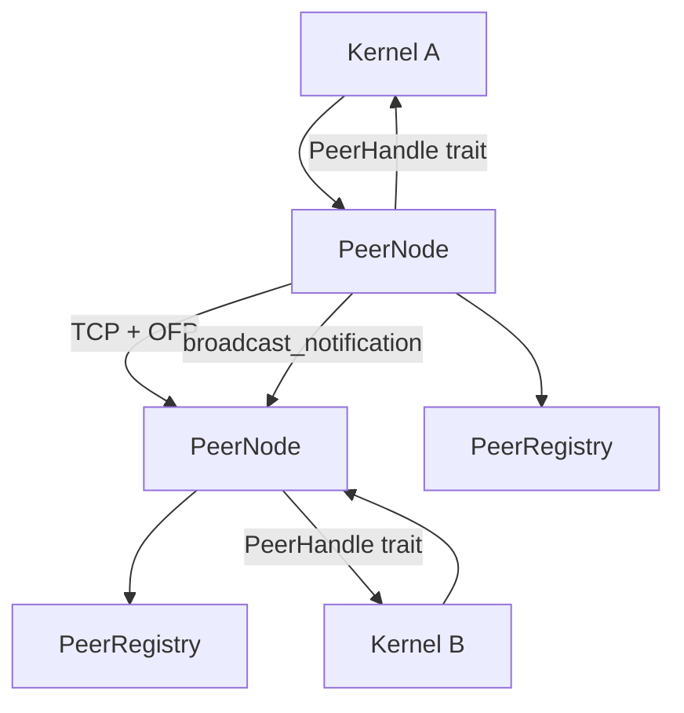
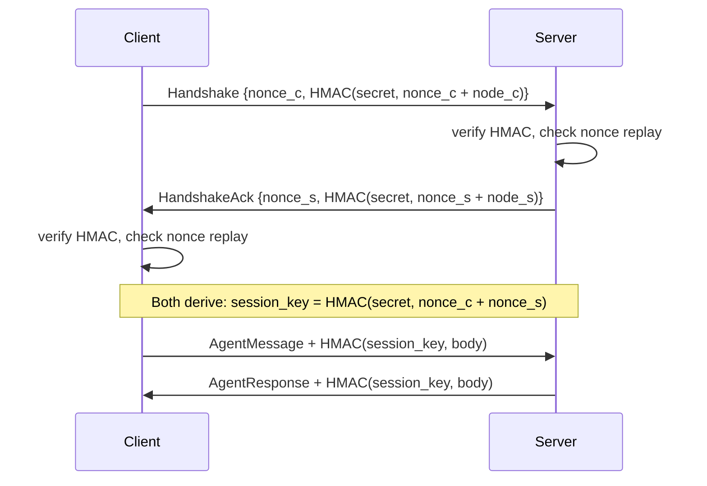

# Networking & P2P

# Networking & P2P — LibreFang Wire Protocol (OFP)

The `librefang-wire` crate implements the LibreFang Wire Protocol, a TCP-based peer-to-peer networking layer that enables LibreFang kernels running on different machines to discover each other's agents, exchange messages, and coordinate work. All communication is authenticated via HMAC-SHA256 with a shared secret.

## Architecture Overview



Each kernel owns one `PeerNode` that both listens for inbound connections and initiates outbound ones. The `PeerHandle` trait is the integration point — the kernel implements it to route incoming remote requests to its local agents. `PeerRegistry` tracks all known peers and their advertised agents in a thread-safe map.

## Wire Protocol

All messages use a length-prefixed JSON framing over TCP:

```
[4 bytes: big-endian length of JSON body]
[N bytes: JSON-encoded WireMessage]
```

Post-handshake, every frame also carries a trailing 64-character hex HMAC:

```
[4 bytes: length of (JSON + HMAC)]
[JSON body]
[64 bytes: hex-encoded HMAC-SHA256 of JSON body, keyed with session key]
```

The maximum frame size is 16 MB (`MAX_MESSAGE_SIZE`).

### Message Envelope

Every message is a `WireMessage` containing a unique `id` and a `kind` (one of `Request`, `Response`, or `Notification`):

```rust
pub struct WireMessage {
    pub id: String,
    pub kind: WireMessageKind,
}
```

`WireMessageKind` is a tagged enum with variants `Request(WireRequest)`, `Response(WireResponse)`, and `Notification(WireNotification)`.

Encoding and decoding are handled by `encode_message()`, `decode_length()`, and `decode_message()` in `message.rs`.

### Request Types

| Method | Purpose |
|--------|---------|
| `handshake` | Exchange identity, agent lists, and HMAC authentication |
| `discover` | Query remote agents by name, tag, or description |
| `agent_message` | Send a message to a specific remote agent and get a response |
| `ping` | Liveness check — responds with `pong` and uptime |

### Response Types

| Method | Purpose |
|--------|---------|
| `handshake_ack` | Acknowledge handshake with own identity and HMAC |
| `discover_result` | Return matching `RemoteAgentInfo` list |
| `agent_response` | Return agent's text reply |
| `pong` | Uptime in seconds |
| `error` | Error code + message |

### Notification Types (one-way, no response)

| Event | Purpose |
|-------|---------|
| `agent_spawned` | A new agent is available on the peer |
| `agent_terminated` | An agent was shut down |
| `shutting_down` | Peer is going offline |

## Authentication & Security

### Handshake Flow

1. **Client** generates a random nonce, computes `HMAC-SHA256(shared_secret, nonce + node_id)`, and sends a `Handshake` request.
2. **Server** verifies the HMAC using constant-time comparison. If valid, generates its own nonce + HMAC and replies with `HandshakeAck`.
3. Both sides derive a **per-session key**: `HMAC-SHA256(shared_secret, our_nonce + their_nonce)`.
4. All subsequent messages on this connection use `write_message_authenticated` / `read_message_authenticated`, which append and verify a per-message HMAC keyed with the session key.



### Nonce Replay Protection

`NonceTracker` prevents replay attacks using a concurrent `DashMap`:

- **5-minute window** — nonces older than this are garbage-collected on each insertion.
- **100k entry cap** — if the map is full after GC, new nonces are rejected to prevent unbounded memory growth under flood.
- **Atomic check-and-record** — uses `DashMap::entry()` API in a single call, eliminating TOCTOU races where two concurrent handshakes with the same replayed nonce could both pass.

### Security Guarantees

- `PeerNode::start` **refuses to boot** if `shared_secret` is empty.
- Any message sent before completing the handshake is rejected with error code 401.
- HMAC comparison uses `subtle::ConstantTimeEq` to prevent timing attacks.
- Session keys are unique per connection even when the shared secret is reused, because they incorporate both sides' random nonces.
- Nonce ordering matters: `derive_session_key(secret, our_nonce, their_nonce)` produces different keys depending on argument order, so each side calls it with its own nonce first.

## PeerNode

`PeerNode` is the main networking object. It binds a TCP listener, accepts inbound connections, and can initiate outbound connections.

### Starting a Node

```rust
let (node, task_handle) = PeerNode::start(config, registry, handle).await?;
```

- `config: PeerConfig` — listen address, node ID, node name, shared secret.
- `registry: PeerRegistry` — where discovered peers are tracked.
- `handle: Arc<dyn PeerHandle>` — the kernel's implementation of request routing.

Returns the node (wrapped in `Arc`) and a `JoinHandle` for the accept loop task.

### Connecting to a Peer

```rust
node.connect_to_peer(remote_addr, handle.clone()).await?;
```

Performs the full HMAC handshake, registers the peer in the local `PeerRegistry`, and spawns a background task for the message dispatch loop.

### Sending a One-Shot Message

```rust
let response = node.send_to_peer("node-2", "coder", "Write hello world", None, handle).await?;
```

Opens a fresh TCP connection, performs the handshake, sends an `AgentMessage`, reads the `AgentResponse`, and closes. This is stateless — each call is a complete authenticated session.

### Broadcasting Notifications

```rust
let errors = broadcast_notification(&registry, WireNotification::AgentSpawned { agent }, &secret).await;
```

Iterates all connected peers, opens a connection to each, derives a per-message key from a fresh nonce, and sends the notification with HMAC. Returns a list of `(node_id, WireError)` for any peers that failed to receive it.

## PeerHandle Trait

The kernel implements `PeerHandle` to bridge the wire protocol with the local agent runtime:

```rust
#[async_trait]
pub trait PeerHandle: Send + Sync + 'static {
    fn local_agents(&self) -> Vec<RemoteAgentInfo>;
    async fn handle_agent_message(&self, agent: &str, message: &str, sender: Option<&str>) -> Result<String, String>;
    fn discover_agents(&self, query: &str) -> Vec<RemoteAgentInfo>;
    fn uptime_secs(&self) -> u64;
}
```

- `local_agents()` — called during handshake and discovery to advertise what this node offers.
- `handle_agent_message()` — routes an incoming remote message to the named local agent and returns its response.
- `discover_agents()` — performs a local search matching name, tags, or description.
- `uptime_secs()` — reported in `Pong` responses.

## PeerRegistry

A thread-safe (`Arc<RwLock<HashMap>>`) store for all known peers. Key operations:

| Method | Description |
|--------|-------------|
| `add_peer(entry)` | Register/update a peer after handshake |
| `remove_peer(node_id)` | Remove entirely |
| `mark_disconnected(node_id)` | Set state to `Disconnected` (kept for reconnect) |
| `mark_connected(node_id)` | Restore to `Connected` |
| `get_peer(node_id)` | Snapshot of a single peer |
| `connected_peers()` | All peers in `Connected` state |
| `find_agents(query)` | Search across all connected peers' agents (matches name, tags, description, case-insensitive) |
| `all_remote_agents()` | Every agent on every connected peer |
| `add_agent(node_id, agent)` / `remove_agent(node_id, agent_id)` | Update a peer's agent list after notifications |
| `connected_count()` / `total_count()` | Peer counts |

`find_agents` returns `Vec<RemoteAgent>`, which pairs each `RemoteAgentInfo` with the `peer_node_id` that hosts it — callers need both to route messages.

## Connection Lifecycle

The `connection_loop` function drives post-handshake communication:

1. Reads a message (authenticated or plain depending on whether a session key exists).
2. For `Notification` variants — dispatches to `handle_notification` which updates the registry (adds/removes agents, marks peers disconnected).
3. For `Request` variants — calls `handle_request_in_loop` which dispatches to the `PeerHandle` implementation and writes the response.
4. For `Response` variants — logs a warning (unexpected in the connection loop; responses flow back through `send_to_peer`).
5. On connection close or error, the peer is marked disconnected in the registry.

## Integration with the Rest of LibreFang

- The **REST API** (`src/routes/network.rs`) reads from `PeerRegistry` to serve `network_status`, `list_peers`, and `comms_topology` endpoints.
- The **WebSocket handler** (`librefang-api/src/ws.rs`) queries `all_peers` for the dashboard.
- The **channel bridge** (`librefang-api/src/channel_bridge.rs`) formats peer lists for chat platforms.
- The **event bus** (`librefang-types/src/event.rs`) defines `NetworkEvent` variants (`PeerConnected`, `PeerDisconnected`, `MessageReceived`, `DiscoveryResult`) that the kernel fires in response to wire protocol activity.
- **Topology types** (`librefang-types/src/comms.rs`) — `Topology`, `TopoNode`, `TopoEdge` — represent the agent graph for the UI, built from both local and remote agent data.

## Configuration

`PeerConfig` fields:

| Field | Default | Description |
|-------|---------|-------------|
| `listen_addr` | `127.0.0.1:0` | TCP bind address (port 0 = OS-assigned) |
| `node_id` | Random UUID | Unique node identifier |
| `node_name` | `"librefang-node"` | Human-readable name |
| `shared_secret` | **empty (required)** | HMAC pre-shared key. Set `[network] shared_secret` in `config.toml` |

## Error Handling

`WireError` covers all failure modes:

- `Io` — TCP read/write failures
- `Json` — malformed messages
- `HandshakeFailed` — HMAC mismatch, nonce replay, version mismatch, or missing secret
- `ConnectionClosed` — clean shutdown
- `MessageTooLarge` — frame exceeds 16 MB
- `VersionMismatch` — protocol version disagreement

## Protocol Version

The current protocol version is `1` (`PROTOCOL_VERSION` constant in `message.rs`). Both sides check version equality during handshake and refuse mismatches.