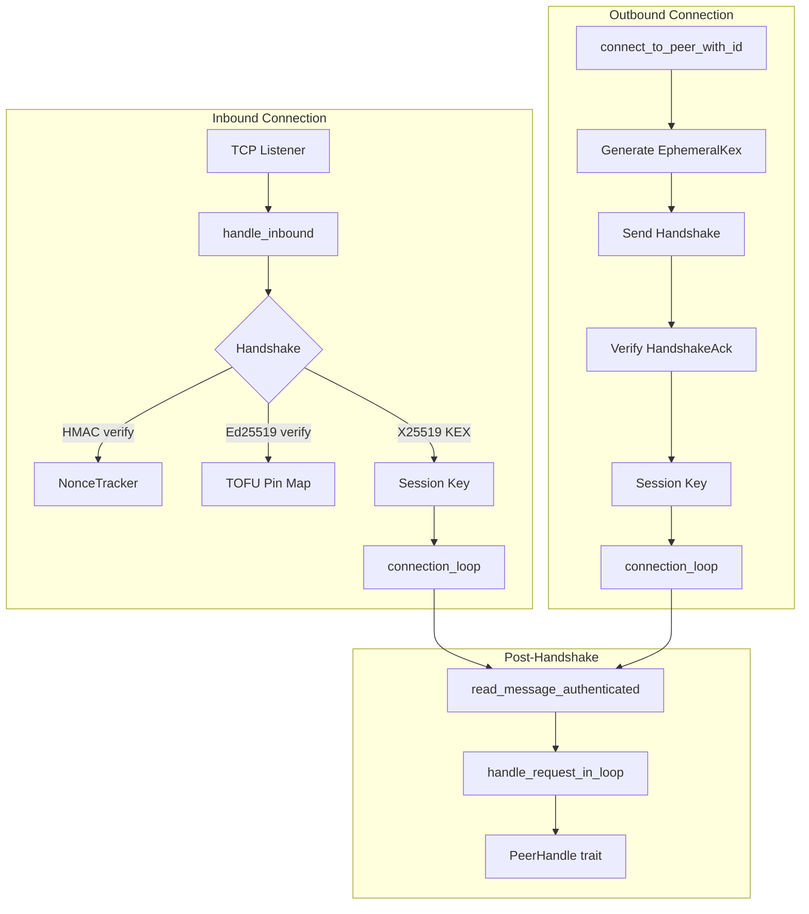

# Networking & P2P

# Networking & P2P (`librefang-wire`)

Agent-to-agent TCP networking for LibreFang. Provides peer discovery, mutual authentication, and message dispatch over a JSON-RPC framed protocol called OFP (LibreFang Wire Protocol).

## Architecture



## Security Model

OFP uses layered authentication. All three layers are independent — compromising one does not compromise the others.

### Layer 1: Network Admission (HMAC-SHA256)

Every handshake carries `auth_hmac = HMAC-SHA256(shared_secret, nonce | sender_node_id | recipient_node_id)`. This is a coarse "cluster password" gate. The HMAC binds to a specific sender/recipient pair so a captured handshake cannot be replayed against a different federation node (#3875).

`shared_secret` is required — OFP refuses to start without it. Set via `[network] shared_secret` in `config.toml`.

### Layer 2: Per-Peer Identity (Ed25519 + TOFU)

Each node persists an Ed25519 keypair in `<data_dir>/peer_keypair.json` via `PeerKeyManager`. The handshake carries the sender's public key plus an Ed25519 signature over the auth-data string. Recipients verify the signature and TOFU-pin the public key to the sender's `node_id`.

**Invariants enforced by `verify_and_pin_identity`:**

| Remote presents | Pin exists for node_id? | Result |
|---|---|---|
| pubkey + valid signature | Same pubkey | ✅ OK |
| pubkey + valid signature | Different pubkey | ❌ Rejected (mismatch) |
| pubkey + valid signature | No pin | ✅ Pin created |
| neither | No pin | ✅ OK (legacy) |
| neither | Pin exists | ❌ Rejected (downgrade attack) |
| partial (only one) | — | ❌ Rejected |

Pins are bounded at 100,000 entries (`MAX_PIN_ENTRIES`) to prevent memory exhaustion from a `shared_secret` holder flooding fresh node IDs.

**Identity signing scope (#4269):** When an ephemeral X25519 pubkey is included in the handshake, the Ed25519 signature covers `auth_data | "|" | ephemeral_pubkey`. This binds the ephemeral to the static identity, preventing an active MITM from substituting its own ephemeral.

### Layer 3: Forward Secrecy (X25519 ECDH)

`EphemeralKex` generates a fresh X25519 keypair per handshake. Both peers exchange public halves inside the handshake messages (covered by the Ed25519 signature), then ECDH the local secret with the remote pubkey. HKDF-SHA256 over the shared point yields the session key.

```rust
let alice = EphemeralKex::generate()?;
let bob = EphemeralKex::generate()?;
// After exchanging pubkeys over the wire:
let transcript = handshake_transcript(client_nonce, server_nonce);
let session_key = alice.derive_session_key(&bob_pub, &transcript)?;
```

The transcript (both nonces concatenated `client|server` in fixed order) is mixed into the HKDF salt so two sessions that happen to use the same ephemeral pair produce different keys.

**Result:** ephemeral private keys are dropped after the handshake (`StaticSecret` zeroizes on drop). A future leak of `shared_secret` or either node's static Ed25519 key cannot decrypt recorded past traffic or forge in-flight HMACs.

### Backward Compatibility

All identity and KEX fields on the wire are `Option<String>`. When either side omits them, the kernel falls back to the legacy `derive_session_key(shared_secret, nonces)` path. This allows rolling federation upgrades without coordination.

## Wire Format

Messages are framed as `[4-byte big-endian length][JSON body]`. Post-handshake messages append a 64-character hex HMAC:

```
Unauthenticated:  [len: u32][JSON]
Authenticated:    [len: u32][JSON][HMAC hex: 64 bytes]
```

The per-message HMAC is keyed with the session key (ECDH-derived when both peers brought an ephemeral, or `HMAC-SHA256(shared_secret, our_nonce || their_nonce)` otherwise). HMAC verification uses constant-time comparison.

Maximum transport message size is 16 MB (`MAX_MESSAGE_SIZE`). Agent message payloads are further capped at 64 KiB (`MAX_PEER_MESSAGE_BYTES`) to prevent LLM budget draining by federated peers.

### Message Types

The `WireMessage` envelope wraps one of:

| Type | Variant | Description |
|---|---|---|
| `request` | `WireRequest` | Expects a response: `Handshake`, `Discover`, `AgentMessage`, `Ping` |
| `response` | `WireResponse` | Response to a request: `HandshakeAck`, `DiscoverResult`, `AgentResponse`, `Pong`, `Error` |
| `notification` | `WireNotification` | One-way: `AgentSpawned`, `AgentTerminated`, `ShuttingDown` |

All enums use `#[serde(other)]` for forward compatibility — unknown `type`/`method`/`event` values decode as `Unknown` variants, keeping the TCP link alive across protocol version mismatches (#3544).

## Key Components

### `PeerNode`

The main networking entry point. Binds a TCP listener, accepts inbound connections, and connects outward to known peers.

**Lifecycle:**

1. **Start:** `PeerNode::start_with_identity(config, registry, handle, keypair, trust_store_dir)` binds the listener and spawns the accept loop. Returns `(Arc<PeerNode>, JoinHandle<()>)`.
2. **Connect:** `connect_to_peer_with_id(addr, handle, recipient_node_id)` opens a TCP connection, performs the handshake, and spawns a `connection_loop` task.
3. **Send:** `send_to_peer(node_id, agent, message, sender, handle)` opens a fresh connection, handshakes, sends one `AgentMessage`, reads the response, and closes.

The `PeerHandle` trait abstracts the kernel's ability to respond to remote requests. The kernel implements it to route messages to local agents.

### `PeerConfig`

```rust
pub struct PeerConfig {
    pub listen_addr: SocketAddr,
    pub node_id: String,
    pub node_name: String,
    pub shared_secret: String,                          // required
    pub max_messages_per_peer_per_minute: u32,          // default: 60
    pub max_llm_tokens_per_peer_per_hour: Option<u64>,  // default: None
}
```

### `NonceTracker`

Prevents handshake replay attacks. Stores seen nonces with timestamps in a `DashMap`. Nonces older than 5 minutes are garbage-collected. Capped at 100,000 entries.

Critical ordering: `check_and_record` is called **after** HMAC verification (#3880). This prevents an unauthenticated attacker from filling nonce capacity without proving knowledge of `shared_secret`. GC runs are amortized — only triggered when the map reaches 80% capacity, avoiding O(n) sweeps on every insert.

### `PeerRateLimiter`

Per-peer rate limiting for `AgentMessage` requests (#3876). Two independent limits:

- **Message rate:** `max_msgs_per_minute` per peer per 60-second window. Excess → 429 error.
- **Token budget:** `max_tokens_per_hour` cumulative LLM token cap per peer per hour. Checked after the LLM call completes (token cost is unknown beforehand).

### `PeerRegistry`

Tracks known peers and their agents. `DashMap`-backed for concurrent access. Key operations: `add_peer`, `get_peer`, `mark_disconnected`, `find_agents`, `connected_peers`.

### `Ed25519KeyPair` and `PeerKeyManager`

`Ed25519KeyPair` wraps an Ed25519 signing key. The private key is held as raw bytes (not serialized through the public `Serialize` impl) and redacted in `Debug` output.

`PeerKeyManager` handles persistence at `<data_dir>/peer_keypair.json`:

- **Load or generate:** `load_or_generate()` reads the file if present, otherwise generates a fresh keypair + node_id and writes it.
- **Migration:** Files from PR-1 (missing `node_id` field) are auto-migrated. A fresh UUID is minted and the file rewritten.
- **Integrity:** The public key is re-derived from the private seed on load and cross-checked against the file. Tampering is rejected.
- **Permissions:** On Unix, the file is set to mode 0600 on write.

### `EphemeralKex`

Per-handshake X25519 key exchange. See [Layer 3: Forward Secrecy](#layer-3-forward-secrecy-x25519-ecdh).

`derive_session_key` consumes `self` — the caller is expected to drop the `EphemeralKex` immediately after, which zeroizes the private key. The all-zero shared secret (indicating a low-order public key contribution) is explicitly rejected.

### `TrustedPeers`

Persistent backing for the in-memory TOFU pin map. Stores pinned `(node_id, public_key)` pairs in `<data_dir>/trusted_peers.json`. Hydrated at startup; new pins are written through `trust_peer()` on every TOFU first-contact. Persistence failures are logged but do not roll back the in-memory pin — the mismatch-detection guarantee remains intact within the daemon's lifetime.

## Handshake Flow

The full handshake between peer A (initiator) and peer B (responder):

```
A → B:  Handshake {
            nonce, node_id_A, node_id_B,
            auth_hmac = HMAC(shared_secret, nonce|A|B),
            public_key, identity_signature,
            ephemeral_pubkey
        }

B verifies HMAC(shared_secret, nonce|A|B)
B verifies Ed25519 signature over (auth_data|ephemeral_pubkey)
B TOFU-pins A's public_key to node_id_A
B records nonce (after HMAC check)
B generates its own ephemeral

B → A:  HandshakeAck {
            ack_nonce, node_id_B, node_id_A,
            auth_hmac = HMAC(shared_secret, ack_nonce|B|A),
            public_key, identity_signature,
            ephemeral_pubkey
        }

A verifies HMAC, signature, pins B's key, records nonce
Both derive session_key via X25519 ECDH + HKDF-SHA256
```

Post-handshake, all messages use `write_message_authenticated` / `read_message_authenticated` with the derived session key.

## Integration with the Kernel

The kernel connects to this crate at two points:

1. **Implementing `PeerHandle`:** The kernel provides `local_agents()`, `handle_agent_message()`, `discover_agents()`, and `uptime_secs()` so the wire layer can dispatch remote requests to local agents.

2. **Starting the node:** During initialization, the kernel calls `PeerKeyManager::load_or_generate()` to establish identity, then `PeerNode::start_with_identity()` with the keypair and trust store directory.

The kernel exposes peer status and trusted-peer lists through the API:
- `GET /api/network/status` → `identity_fingerprint`, `pinned_peer_count`
- `GET /api/network/trusted-peers` → sorted `(node_id, public_key, fingerprint)` triples

Operators compare fingerprints out-of-band with remote peers before trusting a TOFU pin.

## Wire Confidentiality

OFP frames are **plaintext** on the wire. Authentication, integrity, and replay protection are provided by this crate; confidentiality must come from the deployment layer (WireGuard, Tailscale, SSH tunnel, service-mesh mTLS). Do not add TLS termination inside this crate without re-evaluating the decision documented at `docs.librefang.ai/architecture/ofp-wire` (#3874, #4001).

## Error Handling

`WireError` covers IO, JSON parse failures, handshake failures, message size limits, and version mismatches. Handshake failures include specific reasons (HMAC failure, Ed25519 verification failure, TOFU pin mismatch, replay detected) that are logged but sent to the remote as generic 403 errors to avoid information leakage.