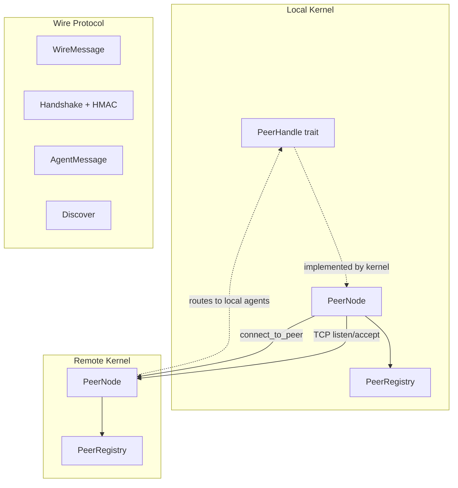
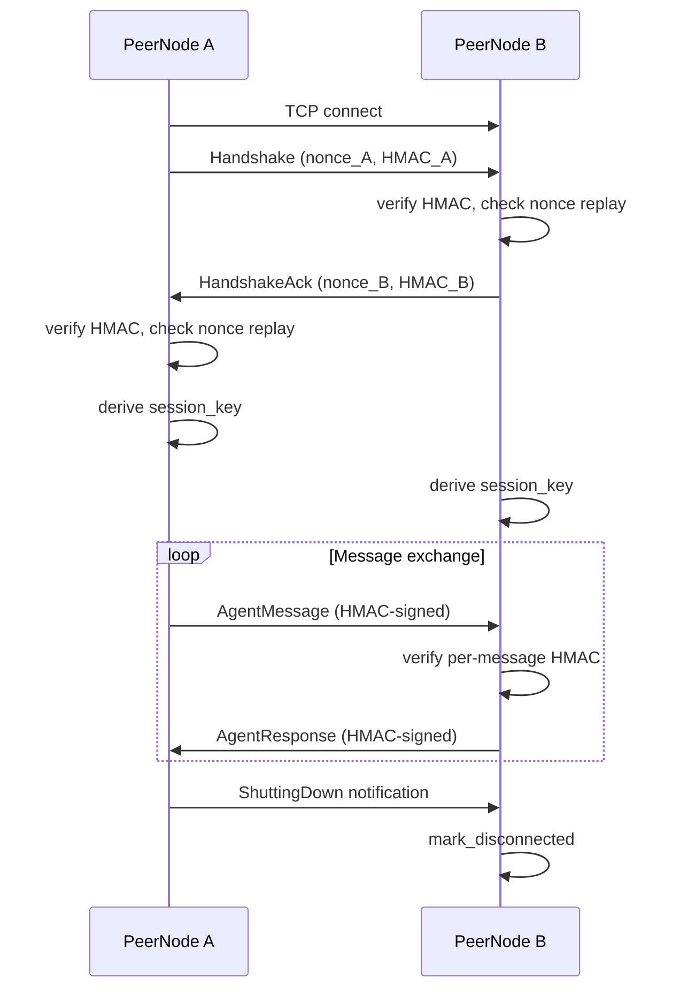

# Networking & P2P

# LibreFang Wire Protocol (OFP) — Networking & P2P

The `librefang-wire` crate implements peer-to-peer networking between LibreFang kernels. It provides cross-machine agent discovery, authentication, and communication over TCP using a JSON-framed wire protocol with HMAC-SHA256 authentication at both the handshake and per-message levels.

## Architecture Overview



Every LibreFang kernel that participates in the network runs a `PeerNode`. That node binds a TCP listener, performs mutual HMAC-authenticated handshakes with connecting peers, and maintains a `PeerRegistry` of known remote peers and their agents. The kernel implements the `PeerHandle` trait so the networking layer can route incoming messages to local agents without knowing anything about the agent system itself.

## Wire Protocol

All communication uses length-prefixed JSON frames over TCP. The current protocol version is `1`.

### Framing

```
[4 bytes: big-endian length of payload][JSON payload]
```

For authenticated post-handshake messages, the frame includes a trailing HMAC:

```
[4 bytes: big-endian length][JSON body][64 bytes: hex-encoded HMAC-SHA256]
```

The maximum message size is 16 MB (`MAX_MESSAGE_SIZE`). The `encode_message` / `decode_message` / `decode_length` functions in `message.rs` handle serialization; the `write_message` / `read_message` / `write_message_authenticated` / `read_message_authenticated` async functions in `peer.rs` handle I/O.

### Message Types

All messages share the `WireMessage` envelope with a unique `id` (UUID string) and a `kind` discriminated by the `"type"` JSON tag:

| Variant | Tag | Direction | Description |
|---|---|---|---|
| `WireRequest::Handshake` | `"request"` / `"handshake"` | Both | Identity exchange with HMAC |
| `WireRequest::Discover` | `"request"` / `"discover"` | Client → Server | Query remote agents |
| `WireRequest::AgentMessage` | `"request"` / `"agent_message"` | Client → Server | Send text to a remote agent |
| `WireRequest::Ping` | `"request"` / `"ping"` | Client → Server | Liveness check |
| `WireResponse::HandshakeAck` | `"response"` / `"handshake_ack"` | Both | Handshake acceptance |
| `WireResponse::DiscoverResult` | `"response"` / `"discover_result"` | Server → Client | Agent list result |
| `WireResponse::AgentResponse` | `"response"` / `"agent_response"` | Server → Client | Agent reply text |
| `WireResponse::Pong` | `"response"` / `"pong"` | Server → Client | Uptime in seconds |
| `WireResponse::Error` | `"response"` / `"error"` | Server → Client | Error with code and message |
| `WireNotification::AgentSpawned` | `"notification"` / `"agent_spawned"` | One-way | New agent advertised |
| `WireNotification::AgentTerminated` | `"notification"` / `"agent_terminated"` | One-way | Agent removed |
| `WireNotification::ShuttingDown` | `"notification"` / `"shutting_down"` | One-way | Peer graceful shutdown |

Each `RemoteAgentInfo` struct carries: `id`, `name`, `description`, `tags`, `tools`, and `state`.

## Authentication & Security

The protocol is designed around a pre-shared key model. Every peer must be configured with the same `shared_secret` — the node refuses to start without one.

### Handshake Flow

1. The initiator generates a UUID nonce and computes `HMAC-SHA256(shared_secret, nonce || node_id)`.
2. It sends a `WireRequest::Handshake` containing its identity, agent list, nonce, and HMAC.
3. The responder verifies the HMAC, checks the nonce against the `NonceTracker` (replay protection), and responds with a `WireResponse::HandshakeAck` containing its own nonce and HMAC.
4. The initiator verifies the ack HMAC and checks the responder's nonce for replay.
5. Both sides derive a session key: `session_key = HMAC-SHA256(shared_secret, our_nonce || their_nonce)`.

After handshake, all messages on that connection use per-message HMAC (the session key signs the JSON body). Any message sent before a successful handshake is rejected with error code `401`.

### Nonce Replay Protection

`NonceTracker` prevents replay attacks within a 5-minute window. It uses a `DashMap` for lock-free concurrent access, and the `check_and_record` method performs an atomic `entry` check to avoid TOCTOU races — even under concurrent load with the same nonce, exactly one caller wins. The tracker has a hard cap of 100,000 entries; when at capacity, new nonces are rejected (failing closed) to prevent memory exhaustion from flooding attacks.

### HMAC Verification

All HMAC comparisons use constant-time equality (`subtle::ConstantTimeEq`) to prevent timing side-channels.

## Key Types

### `PeerNode`

The central networking actor. Created via `PeerNode::start(config, registry, handle)`, which binds the TCP listener and spawns the accept loop. Key methods:

- **`start`** — Binds to `config.listen_addr`, validates that `shared_secret` is non-empty, spawns the accept loop. Returns `(Arc<PeerNode>, JoinHandle<()>)`.
- **`connect_to_peer(addr, handle)`** — Opens a TCP connection, performs the full HMAC handshake, registers the remote peer, and spawns a connection loop task.
- **`send_to_peer(node_id, agent, message, sender, handle)`** — Opens a fresh authenticated connection to the peer identified by `node_id`, sends an `AgentMessage`, and returns the response text. Performs a full handshake on each call.
- **`local_addr()`** — Returns the actual bound address (useful when binding to port `0`).
- **`registry()`** — Returns a reference to the `PeerRegistry`.

### `PeerHandle` trait

The integration point between the networking layer and the kernel. The kernel implements these methods:

| Method | Purpose |
|---|---|
| `local_agents()` | Return agent metadata for handshake and discovery responses |
| `handle_agent_message(agent, message, sender)` | Route a message to a local agent and return its response |
| `discover_agents(query)` | Search local agents by name, tags, or description |
| `uptime_secs()` | Return local uptime for pong responses |

### `PeerRegistry`

Thread-safe (`Arc<RwLock<HashMap<String, PeerEntry>>>`) store of known peers. Each `PeerEntry` records the peer's `node_id`, `node_name`, `address`, advertised `agents`, `state` (`Connected` / `Disconnected`), `connected_at` timestamp, and `protocol_version`.

Key operations:

- **`add_peer`** / **`remove_peer`** — Register or remove a peer entry.
- **`mark_disconnected`** / **`mark_connected`** — Toggle state without removing the entry (supports reconnection scenarios).
- **`find_agents(query)`** — Searches agent names, descriptions, and tags across all connected peers. Returns `Vec<RemoteAgent>` which pairs each agent with its `peer_node_id`.
- **`add_agent`** / **`remove_agent`** — Update a specific peer's agent list (driven by `AgentSpawned` / `AgentTerminated` notifications).
- **`connected_count()`** / **`total_count()`** — Peer counts for status reporting.

### `PeerConfig`

Configuration with sensible defaults:

```rust
PeerConfig {
    listen_addr: "127.0.0.1:0",  // bind to random port
    node_id: uuid::Uuid::new_v4(),
    node_name: "librefang-node",
    shared_secret: "",           // MUST be set — start() will fail
}
```

### `NonceTracker`

Internal security component. Tracks seen nonces in a `DashMap<String, Instant>` with a 5-minute garbage-collection window. The `max_entries` cap (default 100,000) prevents unbounded growth under flood conditions. The `check_and_record` method is atomic and race-free.

### `WireError`

Error type for the wire layer:

| Variant | Meaning |
|---|---|
| `Io` | TCP I/O failure |
| `Json` | Serialization/deserialization failure |
| `HandshakeFailed` | HMAC mismatch, replay detected, or unexpected response |
| `ConnectionClosed` | Remote end closed the connection (clean EOF) |
| `MessageTooLarge` | Frame exceeds 16 MB limit |
| `VersionMismatch` | Incompatible protocol versions |

## Connection Lifecycle



### Inbound connections (`accept_loop` → `handle_inbound`)

1. The accept loop spawns a task per incoming TCP connection.
2. `handle_inbound` reads the first message — it **must** be a `Handshake`. Any other message type results in a `401` error and connection drop.
3. After successful handshake, the connection enters `connection_loop` which reads frames, dispatches requests through `PeerHandle`, and writes responses.

### Outbound connections (`connect_to_peer`)

1. Opens a TCP stream, sends a `Handshake` with HMAC, and reads the `HandshakeAck`.
2. Verifies the ack's HMAC and nonce, derives the session key.
3. Registers the peer and spawns a `connection_loop` task for ongoing communication.

### One-shot messaging (`send_to_peer`)

For simple request-response patterns, `send_to_peer` opens a fresh connection, performs the full handshake, sends a single `AgentMessage`, reads the `AgentResponse`, and closes. This is stateless from the caller's perspective but carries the full authentication overhead.

### Broadcasting (`broadcast_notification`)

Sends a one-way notification to all connected peers by opening a fresh TCP connection to each, deriving a per-message key from a fresh nonce, and writing an authenticated frame. Returns a list of `(node_id, WireError)` for any peers that failed to receive the notification.

## Integration with the Rest of LibreFang

The wire crate is consumed by several other crates:

- **`librefang-api`** — Calls `PeerNode::local_addr()` to determine the bound port, and reads `PeerRegistry` methods (`all_peers`, `connected_count`, `total_count`, `node_id`) for the `/network/status` and `/network/peers` API routes.
- **`librefang-cli`** — Accesses the registry for peer status display.
- **`librefang-desktop`** — Uses `local_addr()` for the embedded server.
- **Extension crates** (`librefang-runtime-oauth`, `librefang-runtime-mcp`) — Use `local_addr()` for localhost redirect/callback URLs.

The kernel implements `PeerHandle` to bridge the wire layer with the agent runtime, routing incoming remote messages to the appropriate local agent and returning responses across the network.

## Configuration

Set the shared secret in `config.toml`:

```toml
[network]
shared_secret = "your-secret-key-here"
```

The `listen_addr` defaults to `127.0.0.1:0` (random port). To bind to a specific address:

```toml
[network]
listen_addr = "0.0.0.0:7000"
```

All peers in a cluster must share the same `shared_secret`. Mismatched secrets cause handshake HMAC verification failures.