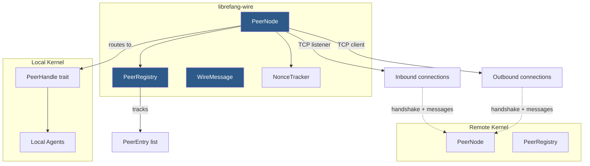

# Networking & P2P

# LibreFang Wire Protocol (OFP) — Networking & P2P

The `librefang-wire` crate implements the **OFP** (LibreFang Wire Protocol), the networking layer that enables multiple LibreFang kernels to discover, authenticate, and communicate with each other over TCP. It provides cross-machine agent discovery, message routing, and a security model built on HMAC-SHA256 authentication with replay protection.

## Architecture Overview



**Core flow:** A `PeerNode` binds a TCP listener, accepts incoming connections, performs mutual HMAC-authenticated handshakes, then enters a message dispatch loop that routes remote requests through the `PeerHandle` trait to local agents.

---

## Wire Protocol

All communication uses a JSON-framed binary protocol over TCP. Every message is prefixed with a **4-byte big-endian length header** followed by a UTF-8 JSON body.

```
┌──────────────┬──────────────────────────┐
│ Length (u32) │      JSON payload        │
│  big-endian  │                          │
└──────────────┴──────────────────────────┘
```

After handshake completion, messages switch to an **authenticated frame format** that appends a 64-character hex HMAC-SHA256 signature:

```
┌──────────────┬──────────────────┬──────────────┐
│ Length (u32) │  JSON payload    │  HMAC-SHA256  │
│  big-endian  │                  │  (64 hex ch)  │
└──────────────┴──────────────────┴──────────────┘
```

The length field covers both the JSON body and the HMAC trailer. The maximum message size is **16 MB** (`MAX_MESSAGE_SIZE`).

### Message Envelope

Every message is a `WireMessage` containing a unique `id` and a `WireMessageKind`:

```rust
pub struct WireMessage {
    pub id: String,           // UUID, used to correlate request/response
    pub kind: WireMessageKind, // tagged union: Request | Response | Notification
}
```

The `WireMessageKind` enum is internally tagged with `"type"` for JSON serialization:

- **`WireRequest`** — tagged by `"method"`: `handshake`, `discover`, `agent_message`, `ping`
- **`WireResponse`** — tagged by `"method"`: `handshake_ack`, `discover_result`, `agent_response`, `pong`, `error`
- **`WireNotification`** — tagged by `"event"`: `agent_spawned`, `agent_terminated`, `shutting_down`

### Encoding/Decoding Functions

| Function | Purpose |
|----------|---------|
| `encode_message(msg)` | Serializes a `WireMessage` to `Vec<u8>` (length prefix + JSON) |
| `decode_length(header)` | Extracts the body length from a 4-byte header |
| `decode_message(body)` | Parses a JSON byte slice into a `WireMessage` |

---

## Authentication & Security

OFP mandates HMAC-SHA256 authentication. The `PeerConfig.shared_secret` field **must** be set — the node refuses to start without it.

### Handshake Authentication

Both sides of a connection perform a mutual HMAC handshake:

1. **Initiator** sends a `Handshake` request containing a random `nonce` and `auth_hmac = HMAC-SHA256(shared_secret, nonce + node_id)`.
2. **Responder** checks the nonce for replay (via `NonceTracker`), verifies the HMAC, then replies with a `HandshakeAck` containing its own nonce and HMAC.
3. Both sides derive a **per-session key**: `derive_session_key(shared_secret, our_nonce, their_nonce)` = `HMAC-SHA256(shared_secret, our_nonce || their_nonce)`.

Nonce order matters: the initiator passes `(our_nonce, ack_nonce)` and the responder passes `(their_nonce, our_nonce)`, producing the same derived key.

### Per-Message HMAC

After handshake, all subsequent messages use `write_message_authenticated` / `read_message_authenticated`, which append and verify a per-message HMAC computed over the JSON body using the session key. Any tampering or forgery results in a `WireError::HandshakeFailed`.

### Replay Protection

`NonceTracker` is a time-windowed (5-minute) deduplication map backed by a `DashMap`. It uses a single atomic `entry()` call to prevent TOCTOU races where two concurrent handshakes with the same replayed nonce could both pass. The tracker has a hard cap of 100,000 entries to prevent memory exhaustion under nonce-flooding attacks — once at capacity, new nonces are rejected (fail-closed).

### Unauthenticated Message Rejection

Any message that is not a `Handshake` request sent before completing the handshake is rejected with an `Error(401)` response. This includes `Ping`, `Discover`, and `AgentMessage`.

---

## Key Components

### `PeerNode`

The central networking struct. Owns the TCP listener, `PeerRegistry`, and `NonceTracker`.

**Lifecycle:**

1. **`PeerNode::start(config, registry, handle)`** — Binds the TCP listener, spawns the accept loop, returns `(Arc<PeerNode>, JoinHandle)`.
2. **`connect_to_peer(addr, handle)`** — Opens an outbound connection, performs the handshake, registers the peer, and spawns a connection loop.
3. **`send_to_peer(node_id, agent, message, sender, handle)`** — One-shot message: opens a new connection, handshakes, sends an `AgentMessage`, reads the `AgentResponse`, then the connection closes.
4. **Accept loop** — For each inbound connection, calls `handle_inbound` which performs the handshake and enters the `connection_loop`.

**Connection loop** (`connection_loop`) reads messages in a loop, dispatching:
- **Requests** → routed to `PeerHandle` methods, responses written back
- **Notifications** → handled by `handle_notification` (updates the registry)
- **Responses** → logged as unexpected (connection loops are for inbound traffic)

### `PeerHandle` Trait

The integration point between the wire layer and the kernel. The kernel implements this trait to route remote requests to local agents:

```rust
#[async_trait]
pub trait PeerHandle: Send + Sync + 'static {
    fn local_agents(&self) -> Vec<RemoteAgentInfo>;
    async fn handle_agent_message(&self, agent: &str, message: &str, sender: Option<&str>) -> Result<String, String>;
    fn discover_agents(&self, query: &str) -> Vec<RemoteAgentInfo>;
    fn uptime_secs(&self) -> u64;
}
```

- `local_agents()` — Called during handshake and discovery to advertise this node's agents.
- `handle_agent_message()` — Routes an `AgentMessage` to the named local agent, returns the response text.
- `discover_agents()` — Searches local agents by name, tags, or description.
- `uptime_secs()` — Returns node uptime for `Pong` responses.

### `PeerRegistry`

Thread-safe (`Arc<RwLock<HashMap<String, PeerEntry>>>`) store of all known peers. Each `PeerEntry` records the peer's `node_id`, `node_name`, socket `address`, advertised `agents`, `state` (`Connected`/`Disconnected`), `connected_at` timestamp, and `protocol_version`.

**Key operations:**

| Method | Description |
|--------|-------------|
| `add_peer(entry)` | Register/update a peer after handshake |
| `remove_peer(node_id)` | Remove a peer entirely |
| `mark_disconnected(node_id)` | Set state to `Disconnected` (kept for reconnect) |
| `mark_connected(node_id)` | Set state back to `Connected` |
| `get_peer(node_id)` | Get a snapshot of a specific peer |
| `connected_peers()` | All peers in `Connected` state |
| `find_agents(query)` | Search agents across all connected peers by name/tag/description |
| `all_remote_agents()` | Every agent on every connected peer |
| `add_agent(node_id, agent)` / `remove_agent(node_id, agent_id)` | Update a peer's agent list (used by notifications) |

`find_agents` returns `Vec<RemoteAgent>`, which pairs each `RemoteAgentInfo` with the owning `peer_node_id`. Disconnected peers are excluded from search results.

### `PeerConfig`

```rust
pub struct PeerConfig {
    pub listen_addr: SocketAddr,   // e.g., "0.0.0.0:7000" or "127.0.0.1:0" for OS-assigned
    pub node_id: String,            // UUID — defaults to a new v4 UUID
    pub node_name: String,          // Human-readable name
    pub shared_secret: String,      // Required. Set via [network] shared_secret in config.toml
}
```

When `listen_addr` uses port `0`, the OS assigns an ephemeral port available via `peer_node.local_addr()`.

### `NonceTracker`

Internal to `PeerNode`. Not exposed publicly, but critical for security:

- 5-minute replay window with automatic garbage collection on each insertion.
- 100,000 entry hard cap (fail-closed under flooding).
- Uses `DashMap::entry()` for atomic check-and-insert, preventing TOCTOU races.

---

## Message Types Reference

### Requests (`WireRequest`)

| Method | Fields | Purpose |
|--------|--------|---------|
| `handshake` | `node_id`, `node_name`, `protocol_version`, `agents`, `nonce`, `auth_hmac` | Identity exchange + HMAC auth |
| `discover` | `query` | Search agents on remote peer |
| `agent_message` | `agent`, `message`, `sender` | Send a message to a remote agent |
| `ping` | — | Liveness check |

### Responses (`WireResponse`)

| Method | Fields | Purpose |
|--------|--------|---------|
| `handshake_ack` | `node_id`, `node_name`, `protocol_version`, `agents`, `nonce`, `auth_hmac` | Accept handshake + mutual auth |
| `discover_result` | `agents` | Matched agents list |
| `agent_response` | `text` | Agent's reply text |
| `pong` | `uptime_secs` | Liveness confirmation |
| `error` | `code`, `message` | Error (401=auth required, 403=auth failed, 404=not found, 500=agent error) |

### Notifications (`WireNotification`)

One-way messages that don't expect a response. Handled via `handle_notification` which updates the registry in place.

| Event | Fields | Effect |
|-------|--------|--------|
| `agent_spawned` | `agent: RemoteAgentInfo` | Added to peer's agent list |
| `agent_terminated` | `agent_id` | Removed from peer's agent list |
| `shutting_down` | — | Peer marked disconnected |

Use `broadcast_notification(registry, notification, shared_secret)` to send a notification to all connected peers. It opens a fresh TCP connection per peer, derives a per-message key from a fresh nonce, and sends an authenticated frame.

---

## Integration Points

### From the Kernel

The kernel creates a `PeerRegistry`, implements `PeerHandle`, and calls `PeerNode::start` during initialization. Other modules interact with the wire layer through:

- `peer_node.local_addr()` — Used by OAuth flows, test servers, and the desktop app server to coordinate ports.
- `peer_node.node_id()` — Used by the network status route (`src/routes/network.rs`).
- `peer_node.registry()` — Accessed via `all_peers()`, `connected_count()`, `find_agents()` from the network routes and WebSocket command handler.

### From API/Routes

- `network_status` — Reads `registry().connected_count()`, `registry().all_peers()`, `node_id()`, `local_addr()`.
- `list_peers` — Calls `registry().all_peers()`.
- `handle_command` (WebSocket) — Calls `registry().all_peers()`.

### From Tests

Integration tests across the project use `local_addr()` to discover the dynamically assigned port for HTTP compatibility tests, daemon lifecycle tests, load tests, and API integration tests.

---

## Protocol Version

The current protocol version is `PROTOCOL_VERSION = 1`. Both sides verify version agreement during handshake — a mismatch returns `WireError::VersionMismatch` and an `Error` response with code 1.

---

## Error Handling

`WireError` covers all failure modes:

| Variant | When |
|---------|------|
| `Io` | TCP read/write failures |
| `Json` | Malformed JSON in messages |
| `HandshakeFailed` | Auth failures, replay detection, unexpected message order |
| `ConnectionClosed` | Remote end closed the connection (clean shutdown) |
| `MessageTooLarge` | Frame exceeds 16 MB limit |
| `VersionMismatch` | Protocol version disagreement |

The connection loop treats `ConnectionClosed` as a clean exit; all other errors are logged and the peer is marked disconnected in the registry.