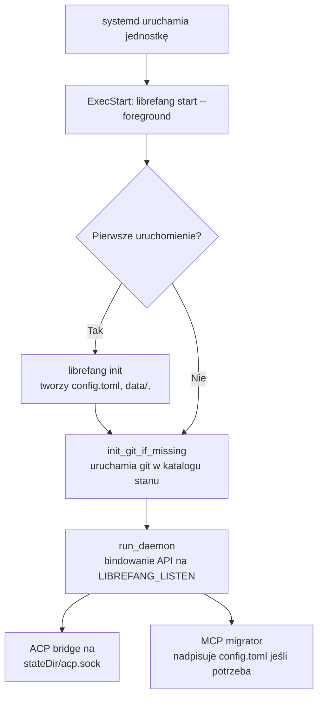

# nix

# `services.librefang` — Moduł NixOS

Plik `nixos-module.nix` definiuje moduł NixOS `services.librefang` do uruchamiania demona systemu operacyjnego agenta LibreFang jako usługi systemd. Obejmuje tworzenie użytkownika/grupy, zarządzanie katalogiem stanu, generowanie jednostki systemd z zabezpieczeniami oraz zestaw asercji w czasie ewaluacji, które wyłapują błędne konfiguracje, zanim mogą spowodować błędy w czasie działania.

---

## Importowanie

Obsługiwane są dwie ścieżki importu:

**Przez flake (zalecane):** Zaimportuj `nixosModules.default` lub `nixosModules.librefang`. Wrapper flake ustawia `services.librefang.package` na własną kompilację `librefang-cli` flake za pomocą `lib.mkDefault`, więc nie jest potrzebne dodatkowe podłączanie pakietu.

**Import bezpośredni (vendored / bez flake):** Zaimportuj ten plik bezpośrednio, ale upewnij się, że `overlays.default` jest zastosowane do zestawu pakietów, aby `pkgs.librefang-cli` było w zasięgu. Opcja `package` modułu domyślnie przyjmuje wartość `pkgs.librefang-cli`, a bez overlaya ten atrybut nie istnieje — ewaluacja rzuci błąd z instrukcją, jak to naprawić.

Pakiet **nie jest** przekazywany jako argument `_module.args`. Jest to celowe: system modułów rozwiązuje argumenty modułów przez `config._module.args` i ignoruje domyślą wartość na poziomie Nix dla parametru, więc domyślna wartość `librefangPackages ? { }` niepotrzebnie zawiesiłaby się na ścieżce importu bezpośredniego zamiast milcząco fallbackować.

---

## Opcje

| Opcja | Typ | Domyślna wartość | Opis |
|---|---|---|---|
| `enable` | bool | `false` | Włącza usługę. |
| `package` | package | `pkgs.librefang-cli` | Pakiet dostarczający binarkę `librefang`. Rzuca błąd, jeśli atrybut nie istnieje. |
| `port` | port | `4545` | Port TCP dla serwera API i dashboardu. Eksportowany jako `LIBREFANG_LISTEN=127.0.0.1:<port>`. |
| `openFirewall` | bool | `false` | Otwiera `port` w zaporze hosta. Przydatne tylko przy bindowaniu na adresie innym niż loopback (patrz niżej). |
| `user` | string | `"librefang"` | Użytkownik usługi. Deklarowany automatycznie tylko przy wartości domyślnej. |
| `group` | string | `"librefang"` | Grupa usługi. Deklarowana automatycznie tylko przy wartości domyślnej. |
| `stateDir` | path | `/var/lib/librefang` | Katalog przechowujący cały stan demona. Eksportowany jako `LIBREFANG_HOME`. |
| `environmentFile` | null lub path | `null` | Ścieżka do pliku `EnvironmentFile` systemd dla sekretów. Nie może być ścieżką w sklepie Nix. |
| `extraEnvironment` | attrs of string | `{}` | Dodatkowe zmienne środowiskowe dla jednostki. Nieprzeznaczone dla sekretów. |
| `authConfiguredExternally` | bool | `false` | Furtka awaryjna dla asercji, że autoryzacja jest skonfigurowana w `config.toml`. |

### Adres nasłuchiwania

Moduł bindowuje demona na loopback (`127.0.0.1:<port>`) domyślnie. Adres bindowania jest kontrolowany przez `LIBREFANG_LISTEN`, a nie przez generowany `config.toml` — demon sam zapisuje ten plik (podczas migracji MCP i przez edycje konfiguracji w API/dashboardzie), więc moduł nim nigdy nie zarządza. Operator może nadpisać bindowanie na adres routowalny przez `extraEnvironment.LIBREFANG_LISTEN`, ale bindowanie na adres inny niż loopback wymaga skonfigurowania autoryzacji, w przeciwnym razie demon odmówi uruchomienia.

### Katalog stanu

`stateDir` staje się `LIBREFANG_HOME`, które demon odczytuje przed katalogiem domowym użytkownika. Katalog musi być dedykowany dla LibreFang i nie może mieć końcowego ukośnika.

- **Pod `/var/lib`** (domyślnie): Zarządzany przez dyrektywę systemd `StateDirectory=`, która obsługuje tworzenie i własność.
- **Gdzie indziej**: Tworzony przez wpis `systemd.tmpfiles.rules` z chown na użytkownika usługi i zadeklarowany w `ReadWritePaths=`, ponieważ `ProtectSystem=strict` montuje system plików jako tylko-do-odczytu poza zadeklarowanym zbiorem ścieżek do zapisu.

### Sekrety

Klucze API dostawców i inne sekrety umieszcza się w `environmentFile`, wskazującym plik utworzony poza pasmem (np. `sops-nix`, `agenix` lub ręcznie zainstalowany plik pod `/run` lub `/etc`). Moduł odrzuca ścieżki ze sklepu Nix dla tej opcji, ponieważ sklep jest world-readable. systemd odczytuje plik jako root przed zrzuceniem uprawnień, więc plik może mieć prawa `0400`.

**Nie umieszczaj** sekretów w `extraEnvironment` — bloki środowiskowe jednostek trafiają do world-readable sklepu Nix.

---

## Usługa systemd

Moduł generuje `systemd.services.librefang` o następujących cechach:

### Kluczowe właściwości jednostki

- **`Type = "exec"`** — systemd zgłasza błąd, gdy binarki nie można wykonać. Nie `notify` (demon nigdy nie wywołuje `sd_notify`) i nie `forking` (brak pliku PID).

- **Flaga `--foreground`** — Moduł wywołuje `librefang start --foreground`, ponieważ goły `librefang start` forkuje: re-execuje sam siebie z `--spawned`, wywołuje `libc::setsid()`, a proces rodzic kończy się po sondzie zdrowia. systemd zobaczyłby zakończenie głównego procesu i rozebrał dziecko zestid. `--foreground` utrzymuje proces na pierwszym planie przez czas życia jednostki.

- **`path = [ pkgs.git ]`** — Przy każdym uruchomieniu, `init_git_if_missing` demona uruchamia `git` po samej nazwie, aby objąć katalog stanu kontrolą wersji. Jednostki systemd nie dziedziczą `PATH` profilu systemowego, więc `git` musi być zadeklarowany jawnie.

- **`EnvironmentFile`** — Tylko plik dostarczony przez operatora. Ścieżka foreground demona ładuje również `<home>/secrets.env` do własnego środowiska procesu przed budową runtime'u tokio, więc klucze zapisane przez dashboard przetrwają restarty bez drugiej dyrektywy `EnvironmentFile`.

### Zmienne środowiskowe ustawiane przez moduł

| Zmienna | Wartość | Uzasadnienie |
|---|---|---|
| `LIBREFANG_HOME` | `stateDir` | `librefang_home()` demona odczytuje to przed katalogiem domowym użytkownika. Bez tego demon rozwiązuje `<home>/.librefang`. |
| `HOME` | `stateDir` | `dirs::home_dir()` odczytuje `$HOME` przed konsultacją wpisu passwd. Ścieżka pierwszego uruchomienia `librefang init` kończy się kodem 1, gdy home to `None`. |
| `LIBREFANG_LISTEN` | `127.0.0.1:<port>` | Faktyczny adres bindowania używany przez demona. |

Są one scalane **przed** `extraEnvironment`, więc nadpisania operatora mają priorytet (z wyjątkiem `LIBREFANG_HOME`, które ma dedykowaną asercję zapobiegającą nadpisaniu).

---

## Zabezpieczenia

Jednostka stosuje następujące dyrektywy bezpieczeństwa systemd:

| Dyrektywa | Wartość | Uwagi |
|---|---|---|
| `NoNewPrivileges` | `true` | |
| `ProtectSystem` | `strict` | System plików jest tylko-do-odczytu z wyjątkiem zadeklarowanych ścieżek zapisu. |
| `ProtectHome` | `true` | Uczyń `/home`, `/root`, `/run/user` niedostępnymi. To uniemożliwia odkrywanie danych logowania BYO-CLI (`~/.claude`, `~/.codex`, `~/.gemini`, `~/.qwen`) — te klucze dostawców muszą pochodzić z `environmentFile`. |
| `PrivateTmp` | `true` | |
| `ProtectKernelTunables` | `true` | |
| `ProtectKernelModules` | `true` | |
| `ProtectControlGroups` | `true` | |
| `RestrictSUIDSGID` | `true` | |
| `RestrictRealtime` | `true` | |
| `MemoryDenyWriteExecute` | `false` | Celowo wyłączone — sandbox wtyczek WASM potrzebuje stron zapisywalnych i wykonywalnych. |
| `RestrictAddressFamilies` | `AF_INET AF_INET6 AF_UNIX` | Serwer API bindowanie TCP; ACP bridge bindowanie gniazda unixa na `<home>/acp.sock`. Wszystkie trzy rodziny są niezbędne. |
| `LimitNOFILE` | `65536` | |
| `LimitNPROC` | `4096` | |

Większość z nich odzwierciedla ręcznie napisaną jednostkę referencyjną w `deploy/librefang.service`, utrzymując porównywalność obu.

---

## Asercje

Moduł wykonuje pięć sprawdzeń w czasie ewaluacji:

### 1. Plik środowiskowy nie w sklepie Nix
Odrzuca ścieżki `environmentFile` pod `builtins.storeDir`. Sklep jest world-readable; sekrety muszą pochodzić spoza niego.

### 2. Bindowanie non-loopback wymaga autoryzacji
Non-loopback `LIBREFANG_LISTEN` musi być sparowane z jednym z:
- Plik `environmentFile` (dane logowania dashboardu: `LIBREFANG_DASHBOARD_USER` / `LIBREFANG_DASHBOARD_PASS`)
- `authConfiguredExternally = true` (autoryzacja pre-istniejąca w `config.toml`)
- `LIBREFANG_ALLOW_NO_AUTH` ustawione na jedną z wartości `"1"`, `"true"`, `"TRUE"`, `"yes"`, `"on"`

To odzwierciedla własne sprawdzenie demona `check_bind_auth_safety` / `any_auth_configured` przy starcie. Zauważ, że żadna zmienna środowiskowa nie dostarcza `api_key` — jest on odczytywany tylko z `config.toml` — więc pliki środowiskowe z samymi kluczami dostawców nie spełniają wymogu autoryzacji.

### 3. Katalog stanu musi być dedykowany i mieć prawdziwą nazwę
Odrzuca końcowe ukośniki (które uczyniłyby `StateDirectory=` pustym i spowodowałyby odmowę załadowania jednostki przez systemd) oraz współdzielonych rodziców FHS (`/var`, `/var/lib`, `/srv`, `/opt`, `/etc`, `/usr`, `/home`), którzy zostaliby chownowani na użytkownika usługi przez regułę tmpfiles.

### 4. Katalog stanu nie pod drzewami `ProtectHome`
Odrzuca ścieżki pod `/home`, `/root` i `/run/user` — `ProtectHome = true` czyni je niedostępnymi i pustymi dla procesów jednostki.

### 5. Brak `LIBREFANG_HOME` w `extraEnvironment`
Zapobiega desynchronizacji między `LIBREFANG_HOME`, `StateDirectory` i `ReadWritePaths`.

---

## Ostrzeżenia

Moduł emituje ostrzeżenia dla:

- **`openFirewall` przy bindowaniu loopback**: Otwór w zaporze niczego nie osiąga, ponieważ demon jest zbindowany na loopback. Sugeruje nadpisanie `LIBREFANG_LISTEN` lub wyłączenie `openFirewall`.

- **Niedomyślny `user`**: Moduł nie deklaruje konta. Operator musi zdefiniować `users.users.<name>` z `home` ustawionym na `stateDir`, ponieważ ścieżka pierwszego uruchomienia `librefang init` kończy się kodem 1, gdy `dirs::home_dir()` rozwiązuje się do `None`.

- **Niedomyślny `group`**: Moduł nie deklaruje grupy. Operator musi zdefiniować `users.groups.<name>`.

- **`LIBREFANG_ALLOW_NO_AUTH` przy bindowaniu loopback**: Wyłączenie nie ma efektu przy loopback. Usunięcie go sprawia, że późniejsza zmiana bindowania zawiedzie głośno zamiast milcząco działać otwarcie.

---

## Tworzenie użytkownika i grupy

Moduł deklaruje `users.users.librefang` i `users.groups.librefang` **tylko** gdy `user` i `group` pozostają przy wartościach domyślnych. Użytkownik systemowy ma:

- `isSystemUser = true`
- `home = stateDir` (krytyczne dla `librefang init`, które rozwiązuje `dirs::home_dir()`)
- `createHome = false` (katalog stanu jest zarządzany przez `StateDirectory=` lub tmpfiles)

Zmiana `user` lub `group` na inną wartość przenosi pełną odpowiedzialność za deklarację konta/grupy na operatora.

---

## Relacja z wewnętrznymi mechanizmami demona

Moduł jest zaprojektowany wokół rzeczywistego zachowania demona w czasie działania, a nie wokół generowania plików konfiguracji:

- **Brak zarządzania `config.toml`**: Demon sam zapisuje `config.toml` podczas migracji MCP (`mcp_migrate.rs`, osiągalnej z `kernel/boot.rs`) oraz poprzez atomowe zapisy w kilku handlerach API (zarządzanie konfiguracją, budżet, dostawcy). Ścieżka only-do-odczytu w sklepie Nix zepsułaby obie ścieżki.

- **`LIBREFANG_LISTEN` jako interfejs bindowania**: `KernelConfig::default()` zaczyna od `DEFAULT_API_LISTEN = "127.0.0.1:4545"`, a `Kernel::boot_with_config` nadpisuje `config.api_listen` z `LIBREFANG_LISTEN` gdy jest ustawione. `cmd_start` przekazuje `api_listen` uruchomionego kernela do `run_daemon`. Zmienna środowiskowa — a nie plik konfiguracji — jest obsługiwanym sposobem przypięcia portu przez jednostkę.

- **Graceful shutdown**: `run_daemon` instaluje future zamykania nasłuchujące `SIGTERM`/`SIGINT`, więc domyślne `KillSignal=SIGTERM` systemd jest poprawne bez jawnej konfiguracji.

- **Git w katalogu stanu**: `init_git_if_missing` uruchamia `git` przy każdym starcie, aby objąć katalog stanu kontrolą wersji, stąd `path = [ pkgs.git ]` na jednostce.
