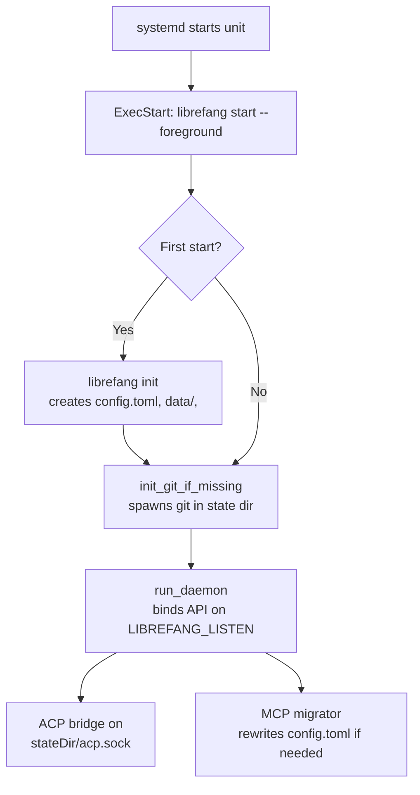

# nix

# `services.librefang` — NixOS Module

The `nixos-module.nix` file defines the `services.librefang` NixOS module for running the LibreFang agent operating system daemon as a systemd service. It covers user/group provisioning, state directory management, systemd unit generation with security hardening, and a set of evaluation-time assertions that catch misconfigurations before they can cause runtime failures.

---

## Importing

There are two supported import paths:

**Via the flake (recommended):** Import `nixosModules.default` or `nixosModules.librefang`. The flake wrapper sets `services.librefang.package` to the flake's own `librefang-cli` build with `lib.mkDefault`, so no further package wiring is needed.

**Direct import (vendored / non-flake):** Import this file directly, but ensure `overlays.default` is applied to the package set so that `pkgs.librefang-cli` is in scope. The module's `package` option defaults to `pkgs.librefang-cli`, and without the overlay that attribute does not exist — evaluation will throw an error with guidance on how to fix it.

The package is **not** passed as a `_module.args` argument. This is deliberate: the module system resolves module arguments through `config._module.args` and ignores a Nix-level default on the parameter, so a `librefangPackages ? { }` default would fail outright on the direct-import path rather than falling back silently.

---

## Options

| Option | Type | Default | Description |
|---|---|---|---|
| `enable` | bool | `false` | Enables the service. |
| `package` | package | `pkgs.librefang-cli` | Package providing the `librefang` binary. Throws if the attribute is missing. |
| `port` | port | `4545` | TCP port for the API server and dashboard. Exported as `LIBREFANG_LISTEN=127.0.0.1:<port>`. |
| `openFirewall` | bool | `false` | Opens `port` in the host firewall. Only useful with a non-loopback bind (see below). |
| `user` | string | `"librefang"` | Service user. Declared automatically only at the default value. |
| `group` | string | `"librefang"` | Service group. Declared automatically only at the default value. |
| `stateDir` | path | `/var/lib/librefang` | Directory holding all daemon state. Exported as `LIBREFANG_HOME`. |
| `environmentFile` | null or path | `null` | Path to a systemd `EnvironmentFile` for secrets. Must not be a Nix store path. |
| `extraEnvironment` | attrs of string | `{}` | Extra environment variables for the unit. Not for secrets. |
| `authConfiguredExternally` | bool | `false` | Escape hatch for asserting auth is configured in `config.toml`. |

### Listen address

The module binds the daemon to loopback (`127.0.0.1:<port>`) by default. The bind address is controlled by `LIBREFANG_LISTEN`, not by a generated `config.toml` — the daemon writes that file itself (during MCP migration and through API/dashboard config edits), so the module never manages it. An operator can override the bind to a routable address through `extraEnvironment.LIBREFANG_LISTEN`, but a non-loopback bind requires authentication to be configured or the daemon will refuse to start.

### State directory

`stateDir` becomes `LIBREFANG_HOME`, which the daemon reads ahead of the user's home directory. The directory must be dedicated to LibreFang and have no trailing slash.

- **Under `/var/lib`** (the default): Managed by systemd's `StateDirectory=` directive, which handles creation and ownership.
- **Anywhere else**: Created by a `systemd.tmpfiles.rules` entry chowned to the service user, and declared in `ReadWritePaths=` since `ProtectSystem=strict` mounts the filesystem read-only outside the declared write set.

### Secrets

Provider API keys and other secrets go in `environmentFile`, pointing at a file produced out-of-band (e.g., `sops-nix`, `agenix`, or a manually installed file under `/run` or `/etc`). The module rejects Nix store paths for this option, because the store is world-readable. systemd reads the file as root before dropping privileges, so it can be mode `0400`.

Do **not** put secrets in `extraEnvironment` — unit environment blocks end up in the world-readable Nix store.

---

## Systemd Service

The module generates `systemd.services.librefang` with the following characteristics:

### Key unit properties

- **`Type = "exec"`** — systemd reports failure when the binary cannot be executed. Not `notify` (the daemon never calls `sd_notify`), and not `forking` (no PID file).

- **`--foreground` flag** — The module invokes `librefang start --foreground` because the bare `librefang start` forks: it re-execs itself with `--spawned`, calls `libc::setsid()`, and the parent exits after a health poll. systemd would see the main process exit and tear down the setsid'd child. `--foreground` keeps the process in the foreground for the unit's lifetime.

- **`path = [ pkgs.git ]`** — On every boot, the daemon's `init_git_if_missing` spawns `git` by bare name to version-control the state directory. systemd units do not inherit the system profile's `PATH`, so `git` must be declared explicitly.

- **`EnvironmentFile`** — Only the operator-supplied file. The daemon's foreground path also loads `<home>/secrets.env` into its own process environment before building the tokio runtime, so dashboard-saved keys survive restarts without a second `EnvironmentFile` directive.

### Environment variables set by the module

| Variable | Value | Rationale |
|---|---|---|
| `LIBREFANG_HOME` | `stateDir` | The daemon's `librefang_home()` reads this before the user's home directory. Without it, the daemon resolves `<home>/.librefang`. |
| `HOME` | `stateDir` | `dirs::home_dir()` reads `$HOME` before consulting the passwd entry. The first-start `librefang init` path exits 1 when home is `None`. |
| `LIBREFANG_LISTEN` | `127.0.0.1:<port>` | The actual bind address the daemon uses. |

These are merged **before** `extraEnvironment`, so operator overrides take precedence (except `LIBREFANG_HOME`, which has a dedicated assertion preventing override).

---

## Security Hardening

The unit applies the following systemd security directives:

| Directive | Value | Notes |
|---|---|---|
| `NoNewPrivileges` | `true` | |
| `ProtectSystem` | `strict` | Filesystem is read-only except declared write paths. |
| `ProtectHome` | `true` | Makes `/home`, `/root`, `/run/user` inaccessible. This forecloses BYO-CLI credential discovery (`~/.claude`, `~/.codex`, `~/.gemini`, `~/.qwen`) — those provider keys must come through `environmentFile` instead. |
| `PrivateTmp` | `true` | |
| `ProtectKernelTunables` | `true` | |
| `ProtectKernelModules` | `true` | |
| `ProtectControlGroups` | `true` | |
| `RestrictSUIDSGID` | `true` | |
| `RestrictRealtime` | `true` | |
| `MemoryDenyWriteExecute` | `false` | Deliberately off — the WASM plugin sandbox needs writable-executable pages. |
| `RestrictAddressFamilies` | `AF_INET AF_INET6 AF_UNIX` | The API server binds TCP; the ACP bridge binds a unix socket at `<home>/acp.sock`. All three families are load-bearing. |
| `LimitNOFILE` | `65536` | |
| `LimitNPROC` | `4096` | |

Most of these mirror the hand-written reference unit at `deploy/librefang.service`, keeping the two comparable.

---

## Assertions

The module performs five evaluation-time checks:

### 1. Environment file not in the Nix store
Rejects `environmentFile` paths under `builtins.storeDir`. The store is world-readable; secrets must come from outside it.

### 2. Non-loopback bind requires authentication
A non-loopback `LIBREFANG_LISTEN` must be paired with one of:
- An `environmentFile` (dashboard credentials: `LIBREFANG_DASHBOARD_USER` / `LIBREFANG_DASHBOARD_PASS`)
- `authConfiguredExternally = true` (auth pre-existing in `config.toml`)
- `LIBREFANG_ALLOW_NO_AUTH` set to one of `"1"`, `"true"`, `"TRUE"`, `"yes"`, `"on"`

This mirrors the daemon's own `check_bind_auth_safety` / `any_auth_configured` check at boot. Note that no environment variable feeds `api_key` — it is read from `config.toml` only — so provider-only environment files do not satisfy the auth requirement.

### 3. State directory must be dedicated and have a real name
Rejects trailing slashes (which would make `StateDirectory=` empty and cause systemd to refuse unit load) and shared FHS parents (`/var`, `/var/lib`, `/srv`, `/opt`, `/etc`, `/usr`, `/home`) that would be chowned to the service user by the tmpfiles rule.

### 4. State directory not under `ProtectHome` trees
Rejects paths under `/home`, `/root`, and `/run/user` — `ProtectHome = true` makes these inaccessible and empty for the unit's processes.

### 5. No `LIBREFANG_HOME` in `extraEnvironment`
Prevents desynchronization between `LIBREFANG_HOME`, `StateDirectory`, and `ReadWritePaths`.

---

## Warnings

The module emits warnings for:

- **`openFirewall` with loopback bind**: The firewall hole reaches nothing because the daemon is bound to loopback. Suggests overriding `LIBREFANG_LISTEN` or disabling `openFirewall`.

- **Non-default `user`**: The module does not declare the account. The operator must define `users.users.<name>` with `home` set to `stateDir`, because the first-start `librefang init` path exits 1 when `dirs::home_dir()` resolves to `None`.

- **Non-default `group`**: The module does not declare the group. The operator must define `users.groups.<name>`.

- **`LIBREFANG_ALLOW_NO_AUTH` with loopback bind**: The opt-out has no effect on loopback. Removing it keeps a later bind change failing loudly rather than silently running open.

---

## User and Group Provisioning

The module declares `users.users.librefang` and `users.groups.librefang` **only** when `user` and `group` are left at their defaults. The system user has:

- `isSystemUser = true`
- `home = stateDir` (critical for `librefang init`, which resolves `dirs::home_dir()`)
- `createHome = false` (the state directory is managed by `StateDirectory=` or tmpfiles)

Changing `user` or `group` to any other value shifts full responsibility for account/group declaration to the operator.

---

## Relationship to Daemon Internals

The module is designed around the daemon's actual runtime behavior, not around generating config files:

- **No `config.toml` management**: The daemon writes `config.toml` itself during MCP migration (`mcp_migrate.rs`, reached from `kernel/boot.rs`) and through atomic writes in several API handlers (config management, budget, providers). A read-only store path would break both paths.

- **`LIBREFANG_LISTEN` as the bind interface**: `KernelConfig::default()` starts from `DEFAULT_API_LISTEN = "127.0.0.1:4545"`, and `Kernel::boot_with_config` overrides `config.api_listen` from `LIBREFANG_LISTEN` when set. `cmd_start` passes the booted kernel's `api_listen` to `run_daemon`. The environment variable — not a config file — is the supported way for a unit to pin the port.

- **Graceful shutdown**: `run_daemon` installs a shutdown future listening for `SIGTERM`/`SIGINT`, so systemd's default `KillSignal=SIGTERM` is correct without explicit configuration.

- **Git in the state dir**: `init_git_if_missing` spawns `git` on every boot to version-control the state directory, hence `path = [ pkgs.git ]` on the unit.