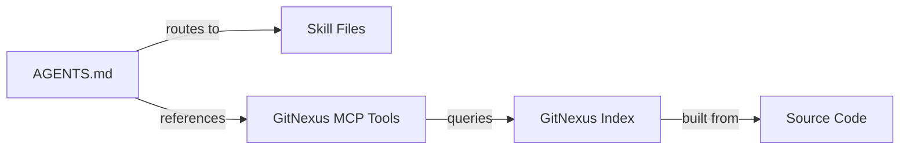

# Other — AGENTS.md

# AGENTS.md — GitNexus Agent Instructions

## Purpose

`AGENTS.md` is the top-level instruction file consumed by AI coding agents (e.g., Claude Code) operating in this repository. It defines mandatory safety protocols that the agent **must** follow before modifying any code, and provides a routing table to task-specific skill files for deeper guidance.

The file sits at the root of the project and is the first thing an compliant agent reads when a session begins. It is bounded by `<!-- gitnexus:start -->` / `<!-- gitnexus:end -->` markers so that GitNexus itself can regenerate the content without disturbing surrounding documentation.

## How It Works

The file is divided into four sections, each serving a distinct role in the agent's workflow:

```
┌─────────────────────────────────────────────┐
│  Header — index metadata & staleness hint    │
├─────────────────────────────────────────────┤
│  Always Do — mandatory pre-edit checks       │
├─────────────────────────────────────────────┤
│  Never Do — hard prohibitions                │
├─────────────────────────────────────────────┤
│  Resources — URI-addressable knowledge base  │
├─────────────────────────────────────────────┤
│  CLI — task-to-skill-file routing table      │
└─────────────────────────────────────────────┘
```

### Header

States the codebase identity (`crates`), index statistics (symbol count, relationship count, execution flow count), and instructs the agent to run `npx gitnexus analyze` if any tool reports a stale index.

### Always Do

Four mandatory behaviors that form the safety rail around every code change:

| Behavior | GitNexus Tool Invoked | When |
|----------|----------------------|------|
| Impact analysis before edits | `gitnexus_impact({target, direction: "upstream"})` | Before modifying any function, class, or method |
| Change detection before commit | `gitnexus_detect_changes()` | Before every commit |
| Risk disclosure to user | — (reporting step) | When impact analysis returns HIGH or CRITICAL |
| Flow-based code exploration | `gitnexus_query({query})` | When exploring unfamiliar code |
| Deep symbol context lookup | `gitnexus_context({name})` | When full caller/callee/flow context is needed |

### Never Do

Hard prohibitions designed to prevent the most common classes of AI-introduced bugs:

- **No blind edits** — every symbol modification must be preceded by `gitnexus_impact`.
- **No ignored warnings** — HIGH/CRITICAL risk results block the edit until the user explicitly approves.
- **No find-and-replace renames** — `gitnexus_rename` understands the call graph and avoids partial or incorrect renames.
- **No unverified commits** — `gitnexus_detect_changes()` must confirm the blast radius matches intent.

### Resources

Five `gitnexus://` URI templates that the agent can resolve to retrieve structured knowledge about the codebase:

| URI | Content |
|-----|---------|
| `gitnexus://repo/crates/context` | Codebase overview and index freshness check |
| `gitnexus://repo/crates/clusters` | All functional areas / modules |
| `gitnexus://repo/crates/processes` | All indexed execution flows |
| `gitnexus://repo/crates/process/{name}` | Step-by-step trace of a specific execution flow |

### CLI Routing Table

Maps common development tasks to the corresponding skill file under `.claude/skills/gitnexus/`:

- **Exploring** → `gitnexus-exploring/SKILL.md`
- **Impact analysis** → `gitnexus-impact-analysis/SKILL.md`
- **Debugging** → `gitnexus-debugging/SKILL.md`
- **Refactoring** → `gitnexus-refactoring/SKILL.md`
- **Tool reference** → `gitnexus-guide/SKILL.md`
- **CLI commands** → `gitnexus-cli/SKILL.md`

## Relationship to the Rest of the Codebase

`AGENTS.md` has no direct code dependencies — it is not imported or executed at runtime. Its connections are:



The skill files (under `.claude/skills/gitnexus/`) contain the detailed procedures the agent follows for each task category. The MCP tools (`gitnexus_impact`, `gitnexus_query`, `gitnexus_context`, `gitnexus_detect_changes`, `gitnexus_rename`) are the runtime interface into the pre-built index, which itself is produced by running `npx gitnexus analyze` against the source tree.

## Editing This File

The content between `<!-- gitnexus:start -->` and `<!-- gitnexus:end -->` is managed by GitNexus. Manual edits inside that region will be overwritten the next time the index is regenerated. To customize agent behavior, either:

- Modify content **outside** the marker boundaries.
- Adjust the GitNexus configuration that governs what gets written into the marked region.