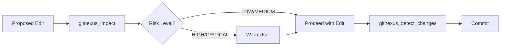

# Other — AGENTS.md

# AGENTS.md — GitNexus Code Intelligence Agent Instructions

## Purpose

This file is a **policy and reference document** consumed by AI coding agents (Claude, Cursor, etc.) operating within the `crates` repository. It enforces a mandatory safety protocol: no symbol-level edit may proceed without first assessing its blast radius through GitNexus's static analysis index.

The repository is pre-indexed by GitNexus with **24,313 symbols**, **56,272 relationships**, and **300 execution flows**. The instructions in this file ensure agents leverage that index rather than falling back to fragile text search or blind edits.

## How It Works

When an AI agent loads this project, it reads `AGENTS.md` and adopts the rules as operational constraints. The file defines two categories of rules and provides a lookup table for task-specific skill files.

### Mandatory Safety Gate

Every code modification must pass through a two-step gate:



1. **Pre-edit**: Run `gitnexus_impact({target, direction: "upstream"})` to surface the blast radius — direct callers, affected processes, and risk classification.
2. **Pre-commit**: Run `gitnexus_detect_changes()` to confirm changes are scoped to expected symbols and flows.

If either step surfaces `HIGH` or `CRITICAL` risk, the agent **must** warn the user before proceeding.

### Exploration Workflow

For read-only tasks (understanding architecture, tracing bugs), the agent uses:

- **`gitnexus_query({query: "concept"})`** — Returns execution flows matching a conceptual query, grouped by process and ranked by relevance. Replaces manual `grep`/`ripgrep`.
- **`gitnexus_context({name: "symbolName"})`** — Returns full neighborhood context for a symbol: callers, callees, and participating execution flows.
- **Resource URIs** — Structured data sources for browsing clusters, processes, and step-by-step traces.

## Key Components

### Agent Rules

| Category | Rules | Intent |
|----------|-------|--------|
| **Always Do** | Run impact analysis before edits; run change detection before commits; warn on HIGH/CRITICAL risk; use query instead of grep; use context for full symbol detail | Prevent unscoped breakage |
| **Never Do** | Edit without impact analysis; ignore risk warnings; find-and-replace renames; commit without change detection | Prevent common agent mistakes |

### Tool Reference

| Tool | Invocation | Purpose |
|------|------------|---------|
| `gitnexus_impact` | `gitnexus_impact({target: "symbolName", direction: "upstream"})` | Blast radius analysis for a symbol |
| `gitnexus_detect_changes` | `gitnexus_detect_changes()` | Verify change scope before committing |
| `gitnexus_query` | `gitnexus_query({query: "concept"})` | Search execution flows by concept |
| `gitnexus_context` | `gitnexus_context({name: "symbolName"})` | Full caller/callee/flow context |
| `gitnexus_rename` | Implicit (referenced in Never Do) | Graph-aware renaming across the codebase |

### Resource URIs

Agents can read structured data directly:

- `gitnexus://repo/crates/context` — Codebase overview and index freshness check
- `gitnexus://repo/crates/clusters` — All functional areas
- `gitnexus://repo/crates/processes` — All execution flows
- `gitnexus://repo/crates/process/{name}` — Step-by-step execution trace for a named process

### Skill File Routing

Task-specific workflows are delegated to dedicated skill files under `.claude/skills/gitnexus/`:

| Task Type | Skill File |
|-----------|------------|
| Architecture exploration | `gitnexus-exploring/SKILL.md` |
| Blast radius / impact analysis | `gitnexus-impact-analysis/SKILL.md` |
| Bug tracing | `gitnexus-debugging/SKILL.md` |
| Refactoring (rename, extract, split) | `gitnexus-refactoring/SKILL.md` |
| Tool and schema reference | `gitnexus-guide/SKILL.md` |
| CLI commands (index, status, clean, wiki) | `gitnexus-cli/SKILL.md` |

## Stale Index Handling

If any GitNexus tool reports a stale index, the agent should instruct the user to regenerate it by running:

```bash
npx gitnexus analyze
```

This must happen before relying on any query, impact, or context results, since stale data could produce incorrect blast radius assessments.

## Relationship to the Rest of the Codebase

This file has **no runtime code, no imports, and no call graph**. It is a static Markdown configuration consumed at agent session start. Its effectiveness depends entirely on:

1. The **GitNexus MCP server** being connected and serving the indexed data.
2. The **skill files** under `.claude/skills/gitnexus/` being present and containing current tool schemas.
3. The **index** being up to date with the current source tree.

If any of these dependencies are missing, the agent will lack the context needed to follow the rules in this file, and edits will proceed without safety checks — the exact scenario this document is designed to prevent.