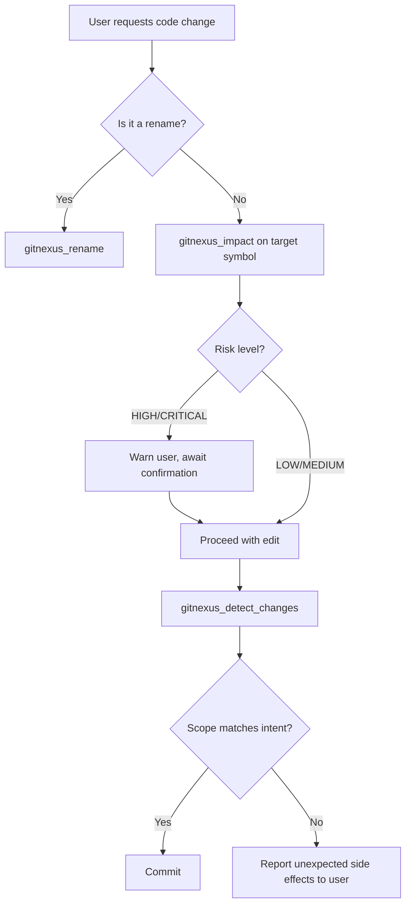

# Other — CLAUDE.md

# CLAUDE.md — GitNexus Integration for AI-Assisted Development

## Purpose

`CLAUDE.md` is an instruction manifest that governs how an AI coding agent (Claude Code) interacts with the **GitNexus** code intelligence platform. It defines mandatory safety protocols, available tools, and navigation strategies so that every code change is preceded by impact analysis and every commit is validated against the call graph.

This file lives at the repository root and is consumed automatically by Claude Code at the start of every session. It is not imported by any application code — it is purely an operational contract.

## How It Works

GitNexus maintains a pre-built index of the codebase (25,317 symbols, 58,626 relationships, 300 execution flows). The `CLAUDE.md` file instructs the AI agent to query this index through MCP (Model Context Protocol) tools **before** making edits, rather than relying on grep or text search. This ensures changes are evaluated against actual dependency relationships.

The file is wrapped in `<!-- gitnexus:start -->` / `<!-- gitnexus:end -->` markers, allowing GitNexus to update its contents automatically when the index is regenerated.

## Mandatory Protocols

### Pre-Edit Impact Analysis

Before modifying any symbol, the agent **must** run:

```
gitnexus_impact({target: "symbolName", direction: "upstream"})
```

This returns the blast radius — direct callers, affected execution flows, and a risk classification. If the result is **HIGH** or **CRITICAL**, the agent must warn the user and await explicit confirmation before proceeding.

### Pre-Commit Change Detection

Before committing, the agent **must** run:

```
gitnexus_detect_changes()
```

This verifies that the diff only touches symbols and flows that were intentionally modified, catching unintended side effects.

### Safe Renaming

Symbol renames must go through `gitnexus_rename`, which rewrites all call-graph-referenced usages. Find-and-replace is explicitly forbidden because it misses cross-file references that the index tracks.

## Available Tools

| Tool | Purpose |
|------|---------|
| `gitnexus_query({query: "concept"})` | Semantic search returning process-grouped results ranked by relevance. Use instead of grep when exploring unfamiliar code. |
| `gitnexus_context({name: "symbolName"})` | Full symbol profile: callers, callees, and every execution flow the symbol participates in. |
| `gitnexus_impact({target, direction})` | Blast radius analysis with risk classification (LOW / MEDIUM / HIGH / CRITICAL). |
| `gitnexus_detect_changes()` | Validates staged changes against expected scope. |
| `gitnexus_rename` | Call-graph-aware rename across the entire codebase. |

## Resource URIs

GitNexus exposes data through MCP resources prefixed with `gitnexus://repo/crates/`:

| URI | What It Returns |
|-----|-----------------|
| `gitnexus://repo/crates/context` | Codebase overview and index freshness status |
| `gitnexus://repo/crates/clusters` | All functional areas (module groupings) |
| `gitnexus://repo/crates/processes` | Catalog of all indexed execution flows |
| `gitnexus://repo/crates/process/{name}` | Step-by-step trace for a single execution flow |

Check `context` first if any tool warns the index is stale, then regenerate with `npx gitnexus analyze`.

## Skill Files

The `CLAUDE.md` file delegates detailed workflows to skill files under `.claude/skills/gitnexus/`:

| Scenario | Skill File |
|----------|------------|
| Understanding architecture | `.claude/skills/gitnexus/gitnexus-exploring/SKILL.md` |
| Assessing blast radius | `.claude/skills/gitnexus/gitnexus-impact-analysis/SKILL.md` |
| Tracing bugs | `.claude/skills/gitnexus/gitnexus-debugging/SKILL.md` |
| Refactoring / renaming / extracting | `.claude/skills/gitnexus/gitnexus-refactoring/SKILL.md` |
| Tool and schema reference | `.claude/skills/gitnexus/gitnexus-guide/SKILL.md` |
| CLI commands (index, status, clean) | `.claude/skills/gitnexus/gitnexus-cli/SKILL.md` |

## Agent Workflow

The following diagram shows the decision flow an AI agent follows when this file is active:



## Relationship to the Rest of the Codebase

This file has **no runtime or compile-time dependency** on any application module. It is not imported, required, or referenced by source code. Its sole consumer is the Claude Code agent runtime, which reads it at session initialization.

The file references the GitNexus index (stored externally) and skill files (stored in `.claude/skills/`), but nothing in the application's `src/` or `crates/` directories references this file in return.