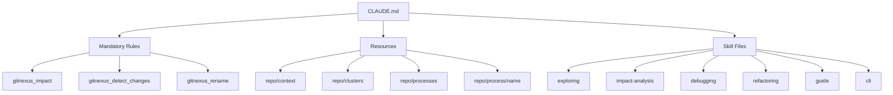

# Other — CLAUDE.md

# CLAUDE.md — GitNexus Operational Directives

## Purpose

`CLAUDE.md` is not executable code. It is a **directive file** consumed by the Claude AI assistant to enforce safe coding practices when working on the `crates` codebase. It defines mandatory workflows, prohibited actions, and navigation aids that leverage the GitNexus code intelligence index (24,313 symbols, 56,272 relationships, 300 execution flows).

Every instruction in this file exists to prevent Claude from making blind edits that cascade through the call graph undetected.

## Mandatory Workflows

### Pre-Edit Impact Analysis

Before modifying any function, class, or method, Claude **must** run:

```
gitnexus_impact({target: "symbolName", direction: "upstream"})
```

This returns:
- **Direct callers** of the target symbol
- **Affected processes** (execution flows that traverse the symbol)
- **Risk level** classification

If the risk level is `HIGH` or `CRITICAL`, Claude must warn the user and obtain explicit confirmation before proceeding.

### Pre-Commit Change Detection

Before committing any changes, Claude **must** run:

```
gitnexus_detect_changes()
```

This verifies that the diff only touches expected symbols and execution flows. If unexpected symbols appear in the results, the commit should be held and the discrepancy reported to the user.

## Prohibited Actions

| Prohibition | Rationale |
|---|---|
| Editing without `gitnexus_impact` | Changes with unknown blast radius can silently break downstream consumers |
| Ignoring HIGH/CRITICAL warnings | These indicate significant surface area affected by the proposed edit |
| Find-and-replace renaming | Textual substitution misses dynamic references; `gitnexus_rename` traces the call graph |
| Committing without `gitnexus_detect_changes` | Prevents accidental scope creep in commits |

## Navigation Patterns

### Exploring Unfamiliar Code

Instead of grepping, use semantic queries:

```
gitnexus_query({query: "concept"})
```

Returns process-grouped results ranked by relevance — faster and more accurate than text search.

### Deep Symbol Context

For full caller/callee/flow information on a specific symbol:

```
gitnexus_context({name: "symbolName"})
```

## Exposed Resources

These URI-based resources provide structured views into the codebase:

| Resource URI | Content |
|---|---|
| `gitnexus://repo/crates/context` | Codebase overview; index freshness check |
| `gitnexus://repo/crates/clusters` | All functional areas of the codebase |
| `gitnexus://repo/crates/processes` | Complete list of indexed execution flows |
| `gitnexus://repo/crates/process/{name}` | Step-by-step trace of a specific execution flow |

## Skill File Reference

Task-specific operational procedures are delegated to skill files under `.claude/skills/gitnexus/`:

| Task | Skill File |
|---|---|
| Architecture exploration | `gitnexus-exploring/SKILL.md` |
| Impact / blast radius analysis | `gitnexus-impact-analysis/SKILL.md` |
| Bug tracing | `gitnexus-debugging/SKILL.md` |
| Refactoring (rename, extract, split) | `gitnexus-refactoring/SKILL.md` |
| Tool & schema reference | `gitnexus-guide/SKILL.md` |
| CLI commands (index, status, clean) | `gitnexus-cli/SKILL.md` |

## Index Staleness

GitNexus tools may warn that the index is stale. When this happens, regenerate it before relying on any query results:

```bash
npx gitnexus analyze
```

## Architecture Context



This file has no imports, no exports, and no runtime behavior. It is consumed at session startup by Claude and governs all subsequent interactions with the codebase through GitNexus MCP tools.