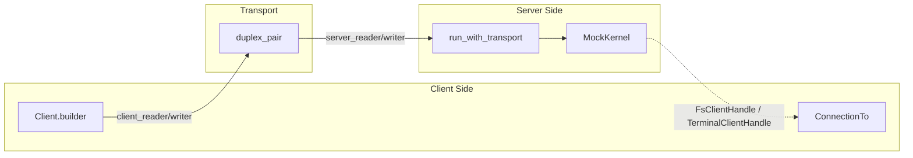

# Other — librefang-acp-tests

# librefang-acp Integration Tests

## Overview

`acp_integration.rs` contains end-to-end integration tests for the ACP (Agent Client Protocol) adapter. Each test wires `librefang_acp::run_with_transport` to one end of a `tokio::io::duplex` pipe and drives the matching `agent_client_protocol::Client` on the other end against a stub `AcpKernel` implementation. This validates on-the-wire JSON-RPC behavior — request/response correctness, notification ordering, permission round-trips, and reverse-RPC paths — without booting a real LibreFang kernel or LLM provider.

All tests run on `tokio::test(flavor = "current_thread")` inside a `LocalSet` to support `spawn_local` for the server task.

## Test Architecture



The `duplex_pair()` function creates two cross-wired `tokio::io::duplex` streams wrapped with `tokio_util::compat` to produce four futures-compatible I/O halves. The server reads from `a` and writes to `d`; the client reads from `c` and writes to `b`. This simulates a full bidirectional JSON-RPC connection in-process.

## MockKernel

`MockKernel` implements the `AcpKernel` trait with canned, controllable behavior:

| Field | Purpose |
|---|---|
| `canned_events` | Pre-loaded `StreamEvent` sequence returned by `send_prompt` (consumed on first call via `std::mem::take`) |
| `approval_tx` | Broadcast channel for injecting synthetic `ApprovalEvent::Created` messages via `fire_approval()` |
| `resolves` | Records `(Uuid, ApprovalDecision)` pairs from `resolve_approval` calls for test assertions |
| `last_session_id` | Captures the `LfSessionId` passed to `send_prompt` so tests can correlate ACP sessions with kernel sessions |
| `fs_client` | Stores the `FsClientHandle` injected by `set_fs_client` (called at `initialize` time) for reverse-RPC testing |
| `terminal_client` | Same pattern for `TerminalClientHandle` |
| `canned_history` | Pre-loaded `(Role, String)` pairs returned by `fetch_session_history` for session-load replay tests |

Key trait method behaviors:

- **`resolve_agent`** — returns `AgentId(Uuid::nil())` unconditionally.
- **`send_prompt`** — drains `canned_events` into an `mpsc::channel`, spawning a task that forwards each event. Records `last_session_id`.
- **`subscribe_approvals`** — returns a new broadcast receiver from `approval_tx`.
- **`resolve_approval`** — pushes `(request_id, decision)` into `resolves`.
- **`fetch_session_history`** — returns a clone of `canned_history`.

### fire_approval()

Injects a synthetic `ApprovalEvent::Created` into the broadcast channel with a deterministic shape:

```rust
fn fire_approval(&self, lf_session_id: LfSessionId) -> Uuid
```

The generated `ApprovalRequest` has `tool_name: "bash"`, `risk_level: Medium`, and `tool_use_id: Some("toolu_acp_integration_test")` to exercise the primary path where the bridge uses the LLM-assigned ID as the `ToolCallId` rather than the `approval-{req_id}` fallback. Returns the `Uuid` of the created request for later assertion in `wait_for_resolve`.

## Test Utilities

### recv\<T\>()

```rust
async fn recv<T: JsonRpcResponse + Send + 'static>(sent: SentRequest<T>) -> Result<T, Error>
```

Bridges the ACP `SentRequest::on_receiving_result` callback-based API into a simple `await`-able future using a oneshot channel. Every request-response interaction in the tests goes through this.

### poll_for()

```rust
async fn poll_for<T, F: FnMut() -> Option<T>>(f: F) -> T
```

Polls a closure up to 40 times (25ms sleep between attempts ≈ 1s total) until it returns `Some`. Used to wait for handles that the server sets asynchronously during `initialize`.

### wait_for_session_id()

Polls `kernel.last_session_id` until the server has processed a `send_prompt` call and recorded the kernel-side session ID. Returns the `LfSessionId`.

### wait_for_resolve()

Polls `kernel.resolves` for a specific `Uuid`, returning the associated `ApprovalDecision`. Used in the permission round-trip test to confirm the bridge forwarded the client's decision back to the kernel.

### duplex_pair()

Creates four I/O halves suitable for `agent_client_protocol::ByteStreams`:

```rust
fn duplex_pair() -> (
    impl AsyncRead,        // server_reader
    impl AsyncWrite,       // server_writer
    impl AsyncRead,        // client_reader
    impl AsyncWrite,       // client_writer
)
```

Internally creates two `tokio::io::duplex(8192)` pipes cross-wired so server↔client communication flows through in-memory buffers.

## Integration Tests

### initialize_and_prompt_emits_text_chunks_and_end_turn

**What it verifies:** The basic prompt flow — initialize → new session → prompt — produces correctly ordered `AgentMessageChunk` notifications and a final `StopReason::EndTurn`.

The `MockKernel` is pre-loaded with two `TextDelta` events followed by a `ContentComplete`. The test:

1. Connects the client with an `on_receive_notification` handler that captures `SessionNotification`s.
2. Sends `InitializeRequest`, asserts `agent_info.name == "librefang"`.
3. Sends `NewSessionRequest` with `/tmp/proj`.
4. Sends `PromptRequest` with text "hi".
5. Asserts `stop_reason == EndTurn` on the `PromptResponse`.
6. After a 50ms flush delay, inspects captured notifications for the two text chunks `"Hello"` and `" world"`.

### permission_round_trip_resolves_kernel_approval

**What it verifies:** When the kernel broadcasts an `ApprovalEvent::Created`, the bridge dispatches a `session/request_permission` reverse-RPC to the client, and the client's response (e.g., `allow_once`) propagates back as a `resolve_approval` call on the kernel.

Test flow:

1. Connects the client with an `on_receive_request` handler for `RequestPermissionRequest` that always responds with `allow_once` and asserts 4 permission options.
2. Sends initialize + new session + prompt (the prompt keeps the bridge pump alive).
3. Waits for `last_session_id` to appear on the kernel.
4. Calls `kernel.fire_approval(lf_id)` to inject a synthetic approval.
5. Polls `wait_for_resolve` to confirm the kernel received `ApprovalDecision::Approved` with the matching `Uuid`.

### unknown_session_id_returns_invalid_params

**What it verifies:** Sending a `PromptRequest` with a nonexistent `SessionId` produces an error response from the server.

Minimal test: initialize, then send a prompt with session ID `"does-not-exist"` and assert the result is `Err`.

### fs_read_text_file_round_trip

**What it verifies:** The reverse-RPC path for filesystem operations. The server-side `FsClientHandle` (captured at `initialize` time) issues a `fs/read_text_file` request to the connected client, which responds with canned content.

Test flow:

1. Client builder registers an `on_receive_request` handler for `ReadTextFileRequest` that asserts the path is `/tmp/hello.txt` and responds with `"canned editor content"`.
2. Sends `InitializeRequest` with `client_capabilities.fs.read_text_file = true`.
3. Polls `kernel.fs_client_handle()` to get the handle injected by the server at init time.
4. Calls `handle.read_text_file(session_id, path, None, None)` — this issues a real JSON-RPC request through the transport.
5. Asserts the returned content matches the canned response.

### terminal_run_command_round_trip

**What it verifies:** The full terminal lifecycle — create → wait_for_exit → output → release — works as a sequence of reverse-RPCs, and the `AcpTerminalClient::run_command` helper produces the correct `AcpTerminalRunResult`.

Client builder registers four `on_receive_request` handlers:

| Request | Response |
|---|---|
| `CreateTerminalRequest` | `TerminalId("term-1")` |
| `WaitForTerminalExitRequest` | `exit_code: Some(0)` |
| `TerminalOutputRequest` | `"hello world\n"`, not truncated |
| `ReleaseTerminalRequest` | default |

Test flow:

1. Sends `InitializeRequest` with `client_capabilities.terminal = true`.
2. Polls `kernel.terminal_client_handle()`.
3. Calls `handle.run_command("echo", ["hello"], [], None, None)` via the `AcpTerminalClient` trait.
4. Asserts `output == "hello world\n"`, `exit_code == Some(0)`, not truncated, no signal.

### session_load_replays_history_to_client

**What it verifies:** When a client reconnects via `LoadSessionRequest`, the kernel's stored message history is emitted as `SessionNotification` updates (issue #3313).

Test flow:

1. Pre-loads `canned_history` with two turns: `(User, "previous question")` and `(Assistant, "previous answer")`.
2. Connects the client with a notification capture handler.
3. Sends `LoadSessionRequest` with session ID `"reconnecting-session"`.
4. Polls until at least 2 notifications arrive.
5. Asserts the first is a `UserMessageChunk` with `"previous question"` and the second is an `AgentMessageChunk` with `"previous answer"`.

## Relationship to the Codebase

This module depends on:

- **`librefang_acp`** — the ACP adapter under test, specifically `run_with_transport`, `AcpKernel`, `FsClientHandle`, and `TerminalClientHandle`.
- **`agent_client_protocol`** — the ACP protocol crate providing `Client`, `ByteStreams`, all request/response schema types, `ConnectionTo`, `SentRequest`, and `Responder`.
- **`librefang_llm_driver`** — `StreamEvent` variants used as canned kernel output.
- **`librefang_types`** — domain types (`AgentId`, `SessionId`, `ApprovalEvent`, `ApprovalRequest`, `RiskLevel`, `TokenUsage`, `StopReason`).
- **`librefang_kernel_handle`** — the `AcpTerminalClient` trait, exercised by `terminal_run_command_round_trip` to test the same code path the runtime's `shell_exec` arm uses.

## Adding New Tests

Follow the established pattern:

1. Create a `MockKernel::new(...)` with appropriate canned events.
2. Call `duplex_pair()` and build `ByteStreams` for both sides.
3. `spawn_local` the server: `librefang_acp::run_with_transport(kernel, agent_id, server_transport)`.
4. Build a `Client.builder()` registering handlers for any notifications or reverse-RPC requests your test needs.
5. Call `client.connect_with(client_transport, async |cx| { ... })` and use `recv(cx.send_request(...))` for each request.
6. Assert on responses, captured notifications, or kernel-side state (`resolves`, `last_session_id`, etc.).