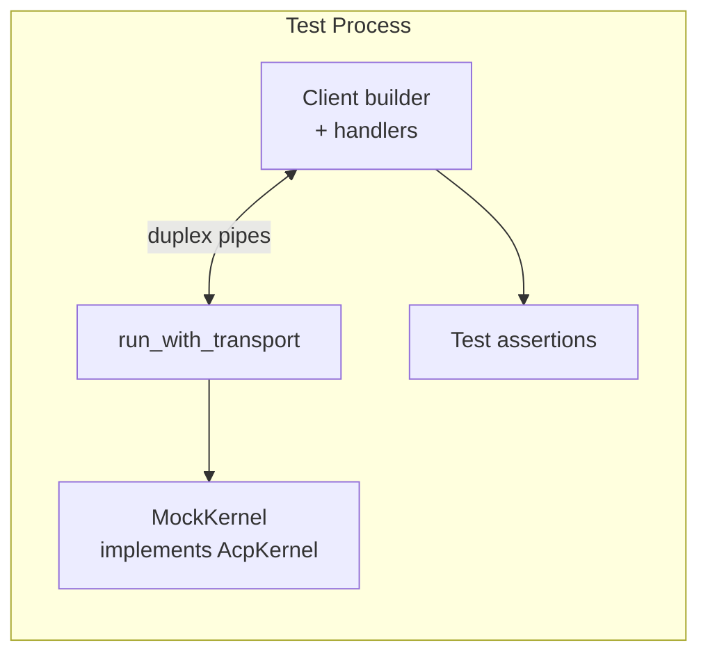

# Other — librefang-acp-tests

# librefang-acp Integration Tests

## Overview

The `acp_integration.rs` test module provides end-to-end integration tests for the LibreFang Agent Client Protocol (ACP) adapter. These tests validate on-the-wire JSON-RPC behavior — request/response correctness, notification ordering, permission round-trips, reverse-RPC paths, and error handling — without requiring a running LibreFang kernel or a real LLM provider.

Each test constructs an in-memory duplex pipe, wires `librefang_acp::run_with_transport` to one end and an `agent_client_protocol::Client` to the other, then drives both sides through a `MockKernel` implementation.

## Architecture



The `run_with_transport` server reads/writes JSON-RPC frames on one side of the duplex pair while the `Client` builder does the same on the opposite side. The `MockKernel` supplies canned `StreamEvent`s and captures approval decisions, allowing tests to assert both directions of the protocol.

## Test Harness

### `MockKernel`

A stub implementation of the `AcpKernel` trait (`librefang_acp::AcpKernel`) that replaces the real kernel for testing.

**Key fields:**

| Field | Type | Purpose |
|---|---|---|
| `canned_events` | `AsyncMutex<Vec<StreamEvent>>` | Events emitted by `send_prompt`, consumed once |
| `approval_tx` | `broadcast::Sender<ApprovalEvent>` | Injects approval requests into the broadcast stream |
| `resolves` | `AsyncMutex<Vec<(Uuid, ApprovalDecision)>>` | Captures calls to `resolve_approval` for assertion |
| `last_session_id` | `AsyncMutex<Option<LfSessionId>>` | Records the session ID from the last `send_prompt` call |
| `fs_client` | `std::sync::Mutex<Option<FsClientHandle>>` | Stores the `FsClientHandle` set during `initialize` |
| `terminal_client` | `std::sync::Mutex<Option<TerminalClientHandle>>` | Stores the `TerminalClientHandle` set during `initialize` |
| `canned_history` | `AsyncMutex<Vec<(Role, String)>>` | History returned by `fetch_session_history` |

**Helper methods:**

- **`new(canned: Vec<StreamEvent>)`** — Constructs an `Arc<MockKernel>` with pre-loaded stream events.
- **`set_history(history)`** — Sets canned conversation history for session load tests.
- **`fs_client_handle()`** / **`terminal_client_handle()`** — Retrieves the client handles stashed during initialization.
- **`fire_approval(lf_session_id)`** — Injects an `ApprovalEvent::Created` into the broadcast channel, simulating the kernel queuing an approval request. Returns the `Uuid` of the created request for later assertion.

**`AcpKernel` trait methods:**

- `resolve_agent` — Returns a nil `AgentId`.
- `send_prompt` — Records the session ID, drains `canned_events` into a channel, and returns the receiver.
- `subscribe_approvals` — Returns a new broadcast receiver.
- `resolve_approval` — Appends `(request_id, decision)` to `resolves`.
- `set_fs_client` / `set_terminal_client` — Stash the handles passed by the adapter at initialization time.
- `fetch_session_history` — Returns the canned history.

### `duplex_pair()`

Creates two `tokio::io::duplex` pipes and adapts them with `tokio_util::compat` for use with the `futures`-based `agent_client_protocol::ByteStreams` transport. Returns four values: `(server_reader, server_writer, client_reader, client_writer)`.

### `recv<T>(sent: SentRequest<T>)`

Awaits the result of a `SentRequest` by bridging it through a `oneshot` channel. Used throughout the tests to convert the callback-based `SentRequest::on_receiving_result` API into a direct `.await`.

### `poll_for<T>(f)`

Polls a closure every 25ms for up to 1 second until it returns `Some(T)`. Used to wait for handles that the server side sets asynchronously during initialization.

### `wait_for_session_id(kernel)` / `wait_for_resolve(kernel, req_id)`

Polling helpers that wait for the kernel to record a session ID from `send_prompt` or an approval resolution, respectively. Both panic after ~1 second if the condition is never met.

## Test Cases

All tests use `#[tokio::test(flavor = "current_thread")]` and wrap their bodies in a `LocalSet` to support `spawn_local` for the server task.

### `initialize_and_prompt_emits_text_chunks_and_end_turn`

Validates the core prompt flow:

1. Client sends `InitializeRequest`, asserts `agent_info.name == "librefang"`.
2. Client creates a new session via `NewSessionRequest`.
3. Client sends `PromptRequest` with text content.
4. MockKernel emits two `TextDelta` events followed by `ContentComplete` with `EndTurn`.
5. Asserts the `PromptResponse.stop_reason` is `EndTurn`.
6. Asserts the client received two `AgentMessageChunk` notifications with the concatenated text "Hello world".

### `permission_round_trip_resolves_kernel_approval`

Validates the approval reverse-RPC path:

1. Initialize and create a session, then kick off a prompt (keeps the bridge alive).
2. Wait for `send_prompt` to record the `LfSessionId`.
3. Call `kernel.fire_approval(lf_id)` to inject an `ApprovalEvent::Created`.
4. The bridge dispatches `session/request_permission` to the client.
5. Client handler always responds with `allow_once`.
6. Asserts the kernel's `resolve_approval` was called with `ApprovalDecision::Approved` for the correct request UUID.

The client handler also asserts that exactly 4 permission options are presented (matching the standard permission set).

### `unknown_session_id_returns_invalid_params`

Validates error handling for invalid sessions:

1. Initialize but do **not** create a session.
2. Send a `PromptRequest` with a fabricated session ID `"does-not-exist"`.
3. Asserts the result is an error.

### `fs_read_text_file_round_trip`

Validates the reverse-RPC path for filesystem operations:

1. Client declares `fs.read_text_file` capability in the `InitializeRequest`.
2. After initialization, the test retrieves the `FsClientHandle` from the mock kernel.
3. Calls `handle.read_text_file(session_id, "/tmp/hello.txt", None, None)`.
4. The adapter issues an `fs/read_text_file` request to the client.
5. Client handler asserts the path matches and responds with `"canned editor content"`.
6. Asserts the handle returns the canned content.

### `terminal_run_command_round_trip`

Validates the full terminal lifecycle through four reverse-RPCs:

1. Client declares `terminal` capability in initialization.
2. Test retrieves the `TerminalClientHandle` from the mock kernel.
3. Calls `handle.run_command("echo", ["hello"], [], None, None)` via the `AcpTerminalClient` trait.
4. The adapter issues these requests in sequence:
   - `terminal/create` → client responds with `TerminalId("term-1")`
   - `terminal/wait_for_exit` → client responds with exit code `0`
   - `terminal/output` → client responds with `"hello world\n"`, not truncated
   - `terminal/release` → client responds with default
5. Asserts the `AcpTerminalRunResult` contains the expected output, exit code, and truncation flag.

### `session_load_replays_history_to_client`

Validates session reconnection and history replay:

1. Mock kernel is pre-loaded with two history turns: a user message and an assistant response.
2. Client sends a `LoadSessionRequest` with a stable session ID `"reconnecting-session"`.
3. The adapter calls `fetch_session_history`, then emits two `session/update` notifications.
4. Asserts the first notification is a `UserMessageChunk` with `"previous question"` and the second is an `AgentMessageChunk` with `"previous answer"`.

## Relationship to the Codebase

- **`librefang_acp::run_with_transport`** — The server entry point under test. It accepts an `AcpKernel` impl, an `AgentId`, and a `ByteStreams` transport, then serves the ACP JSON-RPC protocol.
- **`agent_client_protocol`** — Provides the `Client` builder, `ByteStreams` transport, all schema types (`InitializeRequest`, `PromptRequest`, etc.), and the `ConnectionTo` context for sending requests.
- **`librefang_llm_driver::StreamEvent`** — Defines the streaming event variants (`TextDelta`, `ContentComplete`) that the mock kernel emits.
- **`librefang_types`** — Core domain types: `AgentId`, `SessionId`, `ApprovalDecision`, `ApprovalEvent`, `ApprovalRequest`, `RiskLevel`, `TokenUsage`, and `StopReason`.
- **`librefang_kernel_handle::AcpTerminalClient`** — The trait that exposes `run_command` on `TerminalClientHandle`. The terminal test exercises the same path the runtime's `shell_exec` arm uses.

## Running the Tests

```bash
cargo test -p librefang-acp --test acp_integration
```

All tests run on a single tokio thread (`flavor = "current_thread"`) with `LocalSet` to support intra-task spawning. No external services, ports, or files are required.