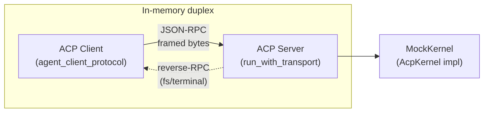

# Other — librefang-acp-tests

# librefang-acp Integration Tests

End-to-end test suite that validates the ACP adapter's on-the-wire JSON-RPC behaviour without requiring a real LibreFang kernel or LLM provider.

## Purpose

These tests wire `librefang_acp::run_with_transport` to one end of an in-memory duplex pipe and drive a matching `agent_client_protocol::Client` on the other end. A stub `AcpKernel` implementation (`MockKernel`) provides canned responses, allowing the tests to assert:

- Request/response shape and ordering
- Notification delivery (streaming text chunks, history replay)
- Permission round-trip (kernel approval → client → resolution)
- Reverse-RPC paths (server issuing requests *to* the client for FS and terminal operations)
- Error handling for invalid session IDs

## Architecture



Each test follows the same topology: `duplex_pair()` creates two cross-wired `tokio::io::duplex` streams. The server reads from one pair and writes to the other; the client does the inverse. Both sides use `tokio_util::compat` to adapt tokio I/O to the `futures` traits that `agent_client_protocol::ByteStreams` expects.

## Key Components

### `MockKernel`

A thread-safe, `Arc`-shared stub implementing the `AcpKernel` trait. Internal state is guarded by `AsyncMutex` (tokio) for async fields and `std::sync::Mutex` for sync fields that the test driver reads after initialization.

| Field | Purpose |
|---|---|
| `canned_events` | `Vec<StreamEvent>` drained by `send_prompt`. Each prompt invocation takes ownership of the current contents. |
| `approval_tx` | Broadcast channel for injecting `ApprovalEvent::Created` messages via `fire_approval`. |
| `resolves` | Records `(Uuid, ApprovalDecision)` pairs from `resolve_approval` calls, so tests can assert the kernel received the correct decision. |
| `last_session_id` | Captured from `send_prompt` arguments; used to correlate approval events with the right LibreFang session. |
| `fs_client` / `terminal_client` | Stashed by `set_fs_client` / `set_terminal_client` (called during `initialize`), exposing `FsClientHandle` and `TerminalClientHandle` for reverse-RPC tests. |
| `canned_history` | Returned by `fetch_session_history`; populated via `set_history` for the session-load replay test. |

#### `fire_approval`

Injects a synthetic `ApprovalEvent::Created` into the broadcast channel. The approval request always includes a non-`None` `tool_use_id` to exercise the primary tool-call-id mapping path rather than the fallback. Returns the `Uuid` of the created request so tests can wait for its resolution.

### `duplex_pair()`

Creates four I/O halves suitable for `agent_client_protocol::ByteStreams`:

```
Server reads from `a`  →  writes to `d`
Client reads from `c`  →  writes to `b`
```

Each half is wrapped in `.compat()` / `.compat_write()` to bridge `tokio::io` ↔ `futures::io`.

### `recv<T>(SentRequest<T>)`

Awaits a typed JSON-RPC response from a `SentRequest`. Internally bridges the `on_receiving_result` callback to a `oneshot` channel. Used in every test to turn the ACP client's async callback pattern into a linear `.await?`.

### `poll_for<T>(FnMut() -> Option<T>)`

Retries a closure up to 40 times with 25ms sleeps (≈1s total) until it returns `Some`. Used to wait for handles that the server-side populates asynchronously during `initialize`.

### `wait_for_session_id` / `wait_for_resolve`

Specialized polling helpers that spin on `last_session_id` and `resolves` respectively, with the same 40×25ms budget.

## Test Scenarios

### `initialize_and_prompt_emits_text_chunks_and_end_turn`

Validates the core prompt flow:

1. Client sends `initialize` → server responds with `agent_info.name == "librefang"`
2. Client sends `new_session` → receives a `session_id`
3. Client sends `prompt` with a text message
4. `MockKernel.send_prompt` streams `TextDelta("Hello")`, `TextDelta(" world")`, `ContentComplete(EndTurn)`
5. Asserts `PromptResponse.stop_reason == EndTurn`
6. Asserts the client received two `AgentMessageChunk` notifications containing the concatenated text

### `permission_round_trip_resolves_kernel_approval`

Tests the full approval lifecycle:

1. Initialize + new session + kick off a prompt (keeps the bridge alive)
2. Wait for the kernel to record the LibreFang session ID
3. Call `fire_approval` to inject an `ApprovalEvent::Created` into the broadcast
4. Client's `on_receive_request` handler receives `RequestPermissionRequest`, responds with `allow_once`
5. Asserts the bridge called `resolve_approval` with `ApprovalDecision::Approved`
6. Prompt completes with `EndTurn`

### `unknown_session_id_returns_invalid_params`

Negative test: sending a `PromptRequest` with a fabricated session ID that was never created via `new_session` results in an error response from the server.

### `fs_read_text_file_round_trip`

Validates the reverse-RPC path for filesystem operations:

1. Client declares `fs.read_text_file` capability during `initialize`
2. Test driver retrieves the `FsClientHandle` stashed on the mock kernel
3. Calls `handle.read_text_file("/tmp/hello.txt")` — this issues a server-to-client JSON-RPC request
4. Client's `on_receive_request` handler asserts the path and returns `"canned editor content"`
5. Asserts the round-trip result matches

### `terminal_run_command_round_trip`

Exercises the full terminal lifecycle via reverse-RPC:

1. Client declares `terminal` capability during `initialize`
2. Test driver retrieves `TerminalClientHandle` and calls `run_command("echo", ["hello"], ...)`
3. The server issues four sequential requests to the client:
   - `create_terminal` → returns `TerminalId("term-1")`
   - `wait_for_terminal_exit` → returns exit code `0`
   - `terminal_output` → returns `"hello world\n"`, not truncated
   - `release_terminal` → acknowledged
4. Asserts `AcpTerminalRunResult` carries expected `output`, `exit_code`, and `truncated` flag

### `session_load_replays_history_to_client`

Tests session reconnection and history replay:

1. `MockKernel` is pre-loaded with two history entries (user + assistant turn)
2. Client sends `load_session` with a stable session ID
3. Server calls `fetch_session_history` and emits each entry as a `session/update` notification
4. Asserts the client received exactly two notifications in order: `UserMessageChunk("previous question")` then `AgentMessageChunk("previous answer")`

## Runtime Constraints

All tests use `#[tokio::test(flavor = "current_thread")]` with a `LocalSet`. This is required because `run_with_transport` and the ACP client's callback system rely on `!Send` futures spawned via `spawn_local`. Tests must not use `#[tokio::test]` with the multi-thread flavor.

## Adding New Tests

To add a new integration test:

1. Create a `MockKernel` with appropriate canned events (or empty if the test doesn't invoke `send_prompt`)
2. Call `duplex_pair()` to get the four I/O halves
3. Spawn `run_with_transport(kernel, agent_id, server_transport)` in a `spawn_local` task
4. Build a `Client` with the necessary `on_receive_request` / `on_receive_notification` handlers
5. Call `client.connect_with(transport, async |cx| { ... })` to drive the protocol
6. Use `recv()` to await responses and `poll_for()` to wait for server-side side effects

For reverse-RPC tests (server calls client), remember to:
- Set the relevant capability flag on `InitializeRequest.client_capabilities`
- Retrieve the stashed handle (`fs_client_handle()` / `terminal_client_handle()`) via `poll_for` after `initialize` completes
- Handle the corresponding request type in the client builder