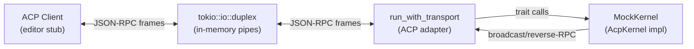

# Other — librefang-acp-tests

# librefang-acp Integration Tests

End-to-end tests that verify the ACP (Agent Client Protocol) adapter's on-the-wire JSON-RPC behaviour without requiring a real LibreFang kernel or LLM provider.

## Architecture

Each test creates an in-memory duplex connection, runs `librefang_acp::run_with_transport` on the server side, and drives an `agent_client_protocol::Client` on the other. A `MockKernel` stub satisfying the `AcpKernel` trait provides deterministic canned responses.


```mermaid
graph LR
    Client["ACP Client<br/>(editor stub)"]
    Duplex["tokio::io::duplex<br/>(in-memory pipes)"]
    Server["run_with_transport<br/>(ACP adapter)"]
    Kernel["MockKernel<br/>(AcpKernel impl)"]

    Client <-->|JSON-RPC frames| Duplex
    Duplex <-->|JSON-RPC frames| Server
    Server -->|trait calls| Kernel
    Kernel -->|broadcast/reverse-RPC| Server
```

## Test Harness

### `MockKernel`

A thread-safe stub implementing `AcpKernel`. Key fields:

| Field | Purpose |
|---|---|
| `canned_events` | `Vec<StreamEvent>` drained by `send_prompt` — simulates LLM output |
| `approval_tx` | `broadcast::Sender<ApprovalEvent>` — inject approval requests for round-trip tests |
| `resolves` | Captures `(Uuid, ApprovalDecision)` pairs from `resolve_approval` calls |
| `last_session_id` | Records the LibreFang session ID from the most recent `send_prompt` |
| `fs_client` | Holds the `FsClientHandle` set at `initialize` time for reverse-RPC testing |
| `terminal_client` | Holds the `TerminalClientHandle` set at `initialize` time for reverse-RPC testing |
| `canned_history` | Message history returned by `fetch_session_history` — drives session/load replay |

Construction: `MockKernel::new(canned_events)` returns `Arc<MockKernel>` so it can be shared between the server task and test driver.

Helper methods:

- **`set_history(history)`** — populate canned session history
- **`fs_client_handle()`** / **`terminal_client_handle()`** — retrieve the reverse-RPC handles after `initialize`
- **`fire_approval(lf_session_id)`** — injects an `ApprovalEvent::Created` into the broadcast channel, returning the `Uuid` of the synthetic request

### `duplex_pair()`

Creates two `tokio::io::duplex` pipes and wraps them with `tokio_util::compat` to get `futures::AsyncRead` + `futures::AsyncWrite` pairs:

```
server reads from a, writes to d
client reads from c, writes to b
```

### `recv<T>(sent: SentRequest<T>) -> Result<T, Error>`

Converts a `SentRequest` into a `oneshot` channel and awaits the result. Required because the ACP client's request API is callback-based rather than directly `await`-able.

### `poll_for<T>(f: FnMut() -> Option<T>) -> T`

Polls a closure up to 40 times (25ms sleep between attempts, ~1s total) until it returns `Some`. Used to wait for handles that become available asynchronously (e.g., after `initialize` completes on the server).

## Test Coverage

### `initialize_and_prompt_emits_text_chunks_and_end_turn`

Verifies the core prompt flow:

1. Client sends `InitializeRequest` → asserts `agent_info.name == "librefang"`
2. Client sends `NewSessionRequest` → receives a `session_id`
3. Client sends `PromptRequest` with text content
4. MockKernel feeds two `TextDelta` events followed by `ContentComplete` with `EndTurn`
5. Asserts the client receives two `AgentMessageChunk` notifications with the concatenated text, and the prompt response has `stop_reason == EndTurn`

Uses `LocalSet` + `on_receive_notification` to capture session notifications.

### `permission_round_trip_resolves_kernel_approval`

Verifies the approval/permission reverse-RPC path:

1. Initialize and create a session, then start a prompt (keeps the bridge active)
2. Wait for `last_session_id` to appear on the kernel (via `wait_for_session_id`)
3. Call `fire_approval` to inject an `ApprovalEvent::Created`
4. The bridge converts this into a `session/request_permission` to the client
5. Client handler responds with `allow_once`
6. Assert the kernel's `resolve_approval` was called with `ApprovalDecision::Approved`

The client handler also asserts that the request carries exactly 4 permission options.

Helper functions:
- **`wait_for_session_id`** — polls `last_session_id` up to 1s
- **`wait_for_resolve`** — polls `resolves` for a specific `Uuid`, panics if not found within 1s

### `unknown_session_id_returns_invalid_params`

Error path test: sends a `PromptRequest` with a fabricated session ID (`"does-not-exist"`) without first calling `NewSession`. Asserts the result is an error.

### `fs_read_text_file_round_trip`

Tests the filesystem reverse-RPC:

1. Client initializes with `client_capabilities.fs.read_text_file = true`
2. After `initialize`, pulls the `FsClientHandle` from the kernel
3. Calls `handle.read_text_file(session_id, "/tmp/hello.txt", None, None)`
4. The server-side bridge issues a `fs/read_text_file` request to the client
5. Client handler asserts the path matches and responds with `"canned editor content"`
6. Asserts the `FsClientHandle` returns the canned content

### `terminal_run_command_round_trip`

Tests the full terminal lifecycle via `AcpTerminalClient::run_command`:

1. Client initializes with `client_capabilities.terminal = true`
2. After `initialize`, pulls the `TerminalClientHandle` from the kernel
3. Calls `handle.run_command("echo", vec!["hello"], Vec::new(), None, None)`
4. The bridge issues four sequential requests to the client:
   - `CreateTerminalRequest` → responds with `TerminalId("term-1")`
   - `WaitForTerminalExitRequest` → responds with exit code `0`
   - `TerminalOutputRequest` → responds with `"hello world\n"`, not truncated
   - `ReleaseTerminalRequest` → responds with default
5. Asserts the returned `AcpTerminalRunResult` has `output == "hello world\n"`, `exit_code == Some(0)`, `truncated == false`, `signal == None`

### `session_load_replays_history_to_client`

Tests session reconnection history replay (issue #3313):

1. Populates kernel with two canned history entries (user + assistant messages)
2. Client sends `LoadSessionRequest` with a stable session ID (`"reconnecting-session"`)
3. The server looks up the session, fetches history via `fetch_session_history`, and emits `SessionUpdate` notifications
4. Asserts two notifications arrive — first a `UserMessageChunk` with `"previous question"`, then an `AgentMessageChunk` with `"previous answer"`

## Conventions

- All tests use `#[tokio::test(flavor = "current_thread")]` with `LocalSet` to support `spawn_local` for the server task.
- The server task is fire-and-forget (`let _ = run_with_transport(...).await`) — tests don't depend on clean shutdown.
- Timing-sensitive assertions use polling loops (up to 40 iterations × 25ms = ~1s) rather than fixed sleeps where possible, improving reliability without excessive wait times.