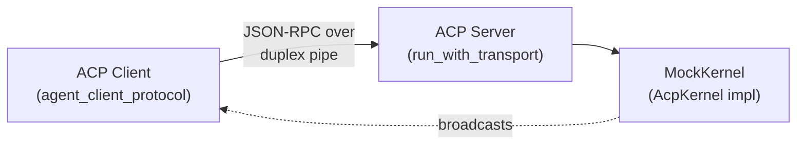

# Other — librefang-acp-tests

# librefang-acp Integration Tests

End-to-end tests that exercise the ACP adapter's on-the-wire JSON-RPC behavior without a real LibreFang kernel or LLM provider. Each test wires `librefang_acp::run_with_transport` to one end of a `tokio::io::duplex` pipe and an `agent_client_protocol::Client` to the other, asserting correct request/response sequences, notification ordering, and reverse-RPC flows.

## Architecture


```mermaid
graph LR
    Client["ACP Client<br/>(agent_client_protocol)"] -- "JSON-RPC over<br/>duplex pipe" --> Server["ACP Server<br/>(run_with_transport)"]
    Server --> Kernel["MockKernel<br/>(AcpKernel impl)"]
    Kernel -.->|broadcasts| Client
```

The key insight: the tests exercise **both directions** of the JSON-RPC connection. The client sends forward requests (`initialize`, `new_session`, `prompt`), while the server issues reverse-RPCs (`request_permission`, `read_text_file`, `terminal/*` methods) that the client's `on_receive_request` handlers answer with stub data.

## Test Harness Components

### `MockKernel`

A stub implementation of the `AcpKernel` trait that the ACP server binds to. It provides:

| Field | Purpose |
|---|---|
| `canned_events` | Queue of `StreamEvent` values drained by `send_prompt` to simulate LLM streaming |
| `approval_tx` | Broadcast channel for injecting `ApprovalEvent::Created` entries |
| `resolves` | Records `(Uuid, ApprovalDecision)` pairs from `resolve_approval` calls |
| `last_session_id` | Captures the LibreFang session ID assigned during `send_prompt` |
| `fs_client` / `terminal_client` | Stores `FsClientHandle` / `TerminalClientHandle` set by the server at `initialize` time |
| `canned_history` | History entries returned by `fetch_session_history` for session-replay tests |

Key methods:

- **`new(canned)`** — constructs an `Arc<MockKernel>` with the given stream events and a fresh broadcast channel.
- **`fire_approval(lf_session_id)`** — injects an `ApprovalEvent::Created` into the broadcast, simulating a kernel-queued approval request. Returns the request's UUID for later assertion.
- **`fs_client_handle()`** / **`terminal_client_handle()`** — retrieve the handles the server stashed during initialization, so the test driver can exercise reverse-RPCs directly.

### `duplex_pair()`

Creates two `tokio::io::duplex(8192)` streams, wraps them with `tokio_util::compat` to satisfy the `futures` `AsyncRead`/`AsyncWrite` traits, and returns a 4-tuple: `(server_read, server_write, client_read, client_write)`.

### `recv<T>(sent: SentRequest<T>)`

Awaiting helper that bridges the ACP client's callback-based response model into a `tokio::oneshot` future, making test assertions read linearly.

### `poll_for<T>(f)`

Spins for up to ~1 second (40 iterations × 25ms) until a closure returns `Some(T)`. Used to wait for the server to populate handles or session IDs asynchronously.

### `wait_for_session_id` / `wait_for_resolve`

Specialized polling helpers that check `MockKernel` state at 25ms intervals. Used in the permission round-trip test where the bridge processes events asynchronously.

## Test Descriptions

### `initialize_and_prompt_emits_text_chunks_and_end_turn`

**What it validates:** The basic prompt lifecycle — initialize → create session → send prompt → receive streamed text → end turn.

The `MockKernel` is seeded with two `StreamEvent::TextDelta` events and one `ContentComplete`. The test captures `SessionNotification`s via `on_receive_notification` and asserts the text chunks arrive in order and `stop_reason` is `EndTurn`.

Also asserts that `InitializeResponse.agent_info.name` equals `"librefang"`.

### `permission_round_trip_resolves_kernel_approval`

**What it validates:** The full approval round-trip: kernel broadcasts `ApprovalEvent::Created` → bridge dispatches `session/request_permission` to the client → client responds with `allow_once` → bridge calls `resolve_approval` on the kernel.

Flow:
1. Initialize and create a session.
2. Spawn a prompt (to keep the bridge pump active).
3. Wait for `last_session_id` to be populated.
4. Call `kernel.fire_approval(lf_id)` to inject an approval.
5. The client's `on_receive_request` handler always responds with `SelectedPermissionOutcome("allow_once")`.
6. `wait_for_resolve` polls until `resolve_approval` records the decision, then asserts it equals `Approved`.

The test also asserts `req.options.len() == 4`, verifying the bridge emits the standard permission option set.

### `unknown_session_id_returns_invalid_params`

**What it validates:** Sending a `PromptRequest` with a fabricated session ID produces an error. Negative test ensuring the server validates session existence before processing.

### `fs_read_text_file_round_trip`

**What it validates:** The reverse-RPC path for filesystem operations — the server-side `FsClientHandle` (stashed during `initialize`) issues `fs/read_text_file`, the client answers, and the result propagates back.

The client declares `read_text_file` capability in `InitializeRequest.client_capabilities`. The test then:
1. Polls for `kernel.fs_client_handle()`.
2. Calls `handle.read_text_file(session_id, "/tmp/hello.txt", None, None)`.
3. Asserts the client-side handler received the correct path and returned `"canned editor content"`.

### `terminal_run_command_round_trip`

**What it validates:** The full terminal lifecycle — `create` → `wait_for_exit` → `output` → `release` — via `AcpTerminalClient::run_command`.

The client registers four `on_receive_request` handlers stubbing each `terminal/*` method. The test polls for `kernel.terminal_client_handle()`, calls `run_command("echo", ["hello"], ...)`, and asserts the resulting `AcpTerminalRunResult` contains the stubbed output, exit code 0, no signal, and `truncated == false`.

### `session_load_replays_history_to_client`

**What it validates:** When a client reconnects with `session/load`, the server replays kernel-supplied history as `SessionUpdate::UserMessageChunk` and `SessionUpdate::AgentMessageChunk` notifications.

The kernel's `canned_history` is seeded with two turns. After `LoadSessionRequest`, the test polls for two notifications and asserts they appear in order with correct roles and text content. This covers the session-rehydration feature where editors reconnect to a previously-used ACP session ID.

## Running the Tests

```bash
# All integration tests in this crate
cargo test -p librefang-acp-tests

# Single test (names are verbose; substring match works)
cargo test -p librefang-acp-tests -- terminal_run_command
```

All tests use `#[tokio::test(flavor = "current_thread")]` with a `LocalSet`, which is required because `agent_client_protocol::Client` and `run_with_transport` use `spawn_local` internally.