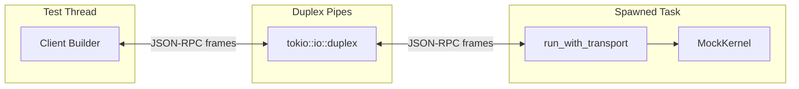

# Other — librefang-acp-tests

# librefang-acp Integration Tests

## Purpose

End-to-end integration tests that verify the ACP (Agent Client Protocol) adapter's on-the-wire JSON-RPC behavior—request/response flows, notification ordering, permission round-trips, and reverse-RPC paths—without booting a real LibreFang kernel or spawning a real LLM provider.

Each test wires `librefang_acp::run_with_transport` to one end of a `tokio::io::duplex` pipe and drives an `agent_client_protocol::Client` on the other end, with a stub `AcpKernel` implementation mediating between them.

## Architecture


```mermaid
graph LR
    subgraph Test Thread
        CK[Client Builder]
    end
    subgraph Spawned Task
        RW[run_with_transport]
        MK[MockKernel]
    end
    subgraph Duplex Pipes
        A[tokio::io::duplex]
    end
    CK <-->|JSON-RPC frames| A
    A <-->|JSON-RPC frames| RW
    RW --> MK
```

The client and server never share memory directly. All communication flows through the duplex pipes as framed JSON-RPC messages, exactly mirroring a real editor-to-agent connection.

## Key Components

### `MockKernel`

A stub implementation of the `AcpKernel` trait (`librefang_acp::AcpKernel`) that replaces the real LibreFang kernel. It provides:

| Field | Purpose |
|---|---|
| `canned_events` | Pre-loaded `StreamEvent` sequence returned by `send_prompt` |
| `approval_tx` | Broadcast channel for injecting `ApprovalEvent`s |
| `resolves` | Captured `(Uuid, ApprovalDecision)` pairs from `resolve_approval` calls |
| `last_session_id` | The `LfSessionId` most recently passed to `send_prompt` |
| `fs_client` | `FsClientHandle` stashed at `initialize` time for reverse-RPC tests |
| `terminal_client` | `TerminalClientHandle` stashed at `initialize` time for reverse-RPC tests |
| `canned_history` | Role/text pairs returned by `fetch_session_history` |

Key methods:

- **`new(canned: Vec<StreamEvent>)`** — Creates an `Arc<MockKernel>` with pre-loaded streaming events and a fresh broadcast channel.
- **`set_history(history)`** — Populates canned history for the `session/load` replay test.
- **`fs_client_handle()` / `terminal_client_handle()`** — Retrieve the handles the server deposited during `initialize`, so test drivers can issue reverse-RPCs.
- **`fire_approval(lf_session_id)`** — Injects an `ApprovalEvent::Created` into the broadcast channel, simulating the kernel queuing an approval. Returns the request `Uuid` so tests can match it against `resolve_approval` calls.

The `AcpKernel` trait methods behave as follows:

- **`resolve_agent`** — Returns `AgentId(Uuid::nil())`.
- **`send_prompt`** — Records the session ID, drains `canned_events` into an `mpsc::channel`, and returns the receiver.
- **`subscribe_approvals`** — Returns a new receiver on the broadcast channel.
- **`resolve_approval`** — Appends `(request_id, decision)` to `resolves`.
- **`set_fs_client` / `set_terminal_client`** — Store the handles passed by the server at initialization.
- **`fetch_session_history`** — Returns a clone of `canned_history`.

### Test Harness Utilities

#### `duplex_pair()`

Creates two pairs of `tokio::io::duplex(8192)` streams, wrapped via `tokio_util::compat` into `futures::AsyncRead + AsyncWrite` types. The wiring is:

```
Server reads from `a`, writes to `d`
Client reads from `c`, writes to `b`
```

This gives each side a full-duplex pipe that mirrors a TCP connection.

#### `recv<T>(sent: SentRequest<T>) -> Result<T, Error>`

Awaiting a `SentRequest` directly blocks the current task because the ACP protocol dispatches responses asynchronously on a background pump. `recv` bridges this by creating a `oneshot` channel, registering a callback via `sent.on_receiving_result`, and `.await`ing the oneshot receiver. This lets tests write synchronous-looking request/response sequences.

#### `poll_for<T>(f: FnMut() -> Option<T>) -> T`

Polls a closure up to 40 times (1 second total at 25ms intervals) until it returns `Some`. Used to wait for handles that the server deposits asynchronously during initialization.

#### `wait_for_session_id(kernel) -> LfSessionId`

Polls `kernel.last_session_id` until the kernel adapter has recorded the session mapping from a `send_prompt` call.

#### `wait_for_resolve(kernel, req_id) -> ApprovalDecision`

Polls `kernel.resolves` until a matching `(req_id, decision)` entry appears.

## Test Descriptions

### `initialize_and_prompt_emits_text_chunks_and_end_turn`

Verifies the core streaming path: initialize → new session → prompt → text deltas → end turn.

- **Kernel is loaded** with two `TextDelta` events and a `ContentComplete(EndTurn)`.
- **Client** registers an `on_receive_notification` handler that captures all `SessionNotification`s.
- **Asserts**: `InitializeResponse.agent_info.name == "librefang"`, `PromptResponse.stop_reason == EndTurn`, and that the captured notifications contain the text chunks `"Hello"` and `" world"` in order.

### `permission_round_trip_resolves_kernel_approval`

Verifies the full approval lifecycle: kernel fires approval → bridge dispatches `session/request_permission` to client → client responds → bridge calls `resolve_approval`.

- **Kernel** is loaded with only a `ContentComplete(EndTurn)` (the prompt itself doesn't matter).
- **Client** registers an `on_receive_request` handler for `RequestPermissionRequest` that always selects `allow_once`. It asserts the request carries exactly 4 permission options.
- **Flow**: After sending a prompt (to keep the bridge alive), the test waits for the kernel to record the session ID, fires an approval via `fire_approval`, then waits for `resolve_approval` to record `Approved` with the matching UUID.

### `unknown_session_id_returns_invalid_params`

Verifies that sending a `PromptRequest` with a fabricated session ID (that was never created via `NewSessionRequest`) produces an error response.

- **Kernel** has no canned events (the prompt should never reach it).
- **Asserts** that the `recv()` call on the bogus prompt returns an error.

### `fs_read_text_file_round_trip`

Verifies the reverse-RPC path for file system operations. The server-side code uses `FsClientHandle` to ask the client to read a file, and the client answers.

- **Client** declares `client_capabilities.fs.read_text_file = true` during `initialize` and registers an `on_receive_request` handler for `ReadTextFileRequest` that asserts the path is `/tmp/hello.txt` and responds with `"canned editor content"`.
- **Server side**: After initialization, the test pulls the `FsClientHandle` from `MockKernel` and calls `handle.read_text_file(...)` directly.
- **Asserts**: the handle reports `capabilities().read_text_file == true`, and the content returned matches the client's canned response.

This confirms that reverse-RPCs (server→client requests) interleave correctly with the main JSON-RPC pump without deadlocking.

### `terminal_run_command_round_trip`

Verifies the complete terminal lifecycle via the `AcpTerminalClient` trait: create → wait_for_exit → output → release.

- **Client** registers four `on_receive_request` handlers:
  - `CreateTerminalRequest` → returns `TerminalId("term-1")`
  - `WaitForTerminalExitRequest` → returns exit code 0
  - `TerminalOutputRequest` → returns `"hello world\n"`, not truncated
  - `ReleaseTerminalRequest` → returns default response
- **Client** declares `client_capabilities.terminal = true`.
- **Server side**: Pulls `TerminalClientHandle` and calls `handle.run_command("echo", ["hello"], ...)` through the `AcpTerminalClient` trait—the same path `librefang_kernel_handle` uses for `shell_exec`.
- **Asserts**: `result.output == "hello world\n"`, `!result.truncated`, `result.exit_code == Some(0)`, `result.signal == None`.

### `session_load_replays_history_to_client`

Verifies that reconnecting to a previously-used session ID replays persisted history as `session/update` notifications (feature #3313).

- **Kernel** is loaded with two history turns: `("User", "previous question")` and `("Assistant", "previous answer")`.
- **Client** sends a `LoadSessionRequest` with session ID `"reconnecting-session"`.
- **Asserts**: Two notifications are received. The first is a `UserMessageChunk` with text `"previous question"`, and the second is an `AgentMessageChunk` with text `"previous answer"`.

## Common Patterns

All tests follow the same structure:

1. **Create a `MockKernel`** with appropriate canned data.
2. **Call `duplex_pair()`** to get four stream halves.
3. **Spawn** `librefang_acp::run_with_transport(kernel, AgentId(Uuid::nil()), server_transport)` on `LocalSet` via `spawn_local`.
4. **Build a client** with the necessary notification/request handlers.
5. **Call `client.connect_with(transport, async |cx| { ... })`** and drive the protocol sequence inside the closure.
6. **Assert** results.

All tests use `#[tokio::test(flavor = "current_thread")]` and `LocalSet` because `spawn_local` requires a single-threaded runtime and the ACP server's internal state is `!Send`.

## Dependencies on Other Crates

| Crate | Usage |
|---|---|
| `agent_client_protocol` | Provides `Client`, `ByteStreams`, `ConnectionTo`, all request/response types, `SentRequest`, `Responder` |
| `librefang_acp` | `run_with_transport`, `AcpKernel` trait, `FsClientHandle`, `TerminalClientHandle` |
| `librefang_llm_driver` | `StreamEvent` (canned LLM output) |
| `librefang_types` | `AgentId`, `SessionId`, `ApprovalDecision`, `ApprovalEvent`, `ApprovalRequest`, `RiskLevel`, `TokenUsage`, `StopReason`, `Role` |
| `librefang_kernel_handle` | `AcpTerminalClient` trait (used in the terminal round-trip test to call `run_command`) |

## Adding New Tests

To add a new integration test:

1. **Define canned events** for `MockKernel::new()` that exercise the path under test.
2. **Set up `duplex_pair()`** and spawn `run_with_transport` in a `LocalSet`.
3. **Register handlers** on `Client.builder()` for any notifications or requests your test expects the server to send.
4. **Drive the protocol** inside the `connect_with` closure, using `recv()` to await responses.
5. **Use `poll_for()`** if you need to wait for server-side state (e.g., handles deposited during initialization).
6. **Use `wait_for_*` helpers** if your test depends on asynchronous kernel state like session IDs or approval resolutions.