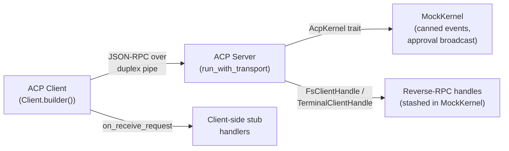

# Other — librefang-acp-tests

# librefang-acp Integration Tests

## Purpose

This module provides end-to-end integration tests for the ACP (Agent Client Protocol) adapter in `librefang-acp`. Each test connects `librefang_acp::run_with_transport` to one end of an in-memory `tokio::io::duplex` pipe and drives the matching `agent_client_protocol::Client` on the other end, backed by a stub `AcpKernel` implementation. This validates on-the-wire JSON-RPC behavior — request/response routing, notification ordering, permission round-trips, reverse-RPC calls, and session history replay — without booting a real LibreFang kernel or LLM provider.

## Architecture


```mermaid
graph LR
    Client["ACP Client<br/>(Client.builder())"] -- "JSON-RPC over<br/>duplex pipe" --> Server["ACP Server<br/>(run_with_transport)"]
    Server -- "AcpKernel trait" --> Mock["MockKernel<br/>(canned events,<br/>approval broadcast)"]
    Server -- "FsClientHandle /<br/>TerminalClientHandle" --> Handles["Reverse-RPC handles<br/>(stashed in MockKernel)"]
    Client -- "on_receive_request" --> Handlers["Client-side stub<br/>handlers"]
```

Every test follows the same structural pattern:

1. Create a `MockKernel` with canned `StreamEvent`s (and optional history).
2. Call `duplex_pair()` to create four framed I/O halves (server read, server write, client read, client write).
3. Spawn `librefang_acp::run_with_transport` in a `LocalSet` task with the server-side transport.
4. Build an `agent_client_protocol::Client` with appropriate `on_receive_request` / `on_receive_notification` handlers.
5. Call `client.connect_with(transport, async |cx| { ... })` to drive the client-side protocol and assert results.

All tests run on `tokio::test(flavor = "current_thread")` with `LocalSet` to avoid multi-threaded timing issues and keep `spawn_local` available.

## Key Components

### `MockKernel`

A stub implementation of the `AcpKernel` trait that provides configurable, deterministic behavior:

| Field | Purpose |
|---|---|
| `canned_events` | `Vec<StreamEvent>` drained by `send_prompt` and forwarded over an `mpsc::channel` |
| `approval_tx` | `broadcast::Sender<ApprovalEvent>` — tests inject approvals via `fire_approval()` |
| `resolves` | Records `(Uuid, ApprovalDecision)` pairs from `resolve_approval` calls for later assertion |
| `last_session_id` | Captures the `LfSessionId` passed to `send_prompt` so tests can correlate sessions |
| `fs_client` | Stores the `FsClientHandle` injected by `set_fs_client` (called during `initialize`) |
| `terminal_client` | Stores the `TerminalClientHandle` injected by `set_terminal_client` |
| `canned_history` | History returned by `fetch_session_history` for the session-load replay test |

Key methods:

- **`new(canned: Vec<StreamEvent>)`** — Constructs a shared `Arc<MockKernel>`. The approval broadcast channel is created internally.
- **`fire_approval(lf_session_id)`** — Injects an `ApprovalEvent::Created` into the broadcast channel with a synthetic `ApprovalRequest`. Returns the request `Uuid` so tests can verify the correct approval was resolved.
- **`fs_client_handle()` / `terminal_client_handle()`** — Non-async accessors for the handles stashed during initialization. Tests poll these until they become `Some`.

### `duplex_pair()`

Creates four I/O halves suitable for framed JSON-RPC:

```
server reads from `a`  →  client writes to `b`
client reads from `c`  →  server writes to `d`
```

Two `tokio::io::duplex(8192)` calls produce the raw byte streams; `tokio_util::compat` adapts them to the `futures` traits that `agent_client_protocol::ByteStreams` expects.

### `recv<T>(sent: SentRequest<T>)`

Wraps the `SentRequest::on_receiving_result` callback into a `oneshot` future so tests can `await` a response directly with `?` propagation:

```rust
let init: InitializeResponse =
    recv(cx.send_request(InitializeRequest::new(ProtocolVersion::LATEST))).await?;
```

### `poll_for<T>(f)`

Spins up to 40 iterations (≈1 second at 25 ms intervals) waiting for a closure to return `Some(T)`. Used to wait for handles that the server stashes asynchronously during initialization:

```rust
let handle = poll_for(|| kernel_for_driver.fs_client_handle()).await;
```

### `wait_for_session_id` / `wait_for_resolve`

Polling helpers used by the permission round-trip test to synchronize on kernel state:
- `wait_for_session_id` polls `last_session_id` until the server has processed a `send_prompt`.
- `wait_for_resolve` polls `resolves` until the bridge has called `resolve_approval` with the expected `Uuid`.

## Test Scenarios

### `initialize_and_prompt_emits_text_chunks_and_end_turn`

Validates the core prompt flow: the client sends `initialize` → `new_session` → `prompt`, and the server streams `TextDelta` events followed by `ContentComplete` with `EndTurn`. Assertions check:

- `agent_info.name` is `"librefang"`.
- `PromptResponse.stop_reason` equals `EndTurn`.
- Captured `AgentMessageChunk` notifications carry `"Hello"` and `" world"` in order.

### `permission_round_trip_resolves_kernel_approval`

Tests the approval pipeline. After initiating a prompt, the test:

1. Waits for the server to record the `LfSessionId`.
2. Calls `kernel.fire_approval(lf_id)` to inject an `ApprovalEvent::Created`.
3. The bridge translates this into a `session/request_permission` JSON-RPC request to the client.
4. The client handler always selects `allow_once`.
5. The test asserts `resolve_approval` was called with `ApprovalDecision::Approved`.

Also asserts the request shape contains exactly 4 permission options.

### `unknown_session_id_returns_invalid_params`

Error-path test: sends a `PromptRequest` with a fabricated session ID (`"does-not-exist"`). Asserts the response is an error (the bridge returns an `invalid_params` JSON-RPC error for unmapped sessions).

### `fs_read_text_file_round_trip`

Validates the reverse-RPC path for filesystem operations:

1. Client initializes with `client_capabilities.fs.read_text_file = true`.
2. After initialization, the test retrieves the `FsClientHandle` from the mock kernel.
3. Calls `handle.read_text_file(session_id, path, ...)` — this issues a `fs/read_text_file` JSON-RPC request back to the client.
4. The client handler asserts the path matches `/tmp/hello.txt` and responds with canned content.
5. The test asserts the returned content equals `"canned editor content"`.

This confirms the server-to-client reverse-RPC channel works end-to-end without a real filesystem.

### `terminal_run_command_round_trip`

Exercises the full terminal lifecycle via `AcpTerminalClient::run_command`:

```
create → wait_for_exit → output → release
```

The client registers four `on_receive_request` handlers, one for each terminal method:

- `CreateTerminalRequest` → returns `TerminalId("term-1")`
- `WaitForTerminalExitRequest` → returns exit code `0`
- `TerminalOutputRequest` → returns `"hello world\n"`, not truncated
- `ReleaseTerminalRequest` → returns default response

The test asserts the resulting `AcpTerminalRunResult` carries the expected `output`, `exit_code`, `truncated`, and `signal` values.

### `session_load_replays_history_to_client`

Tests session reconnection (issue #3313). The mock kernel is preloaded with two history entries (`"previous question"` as user, `"previous answer"` as assistant). The client sends a `LoadSessionRequest` with a stable session ID. The bridge:

1. Looks up (or derives) the `LfSessionId` for the ACP session.
2. Calls `fetch_session_history` on the kernel.
3. Emits each history entry as a `session/update` notification.

The test asserts exactly 2 notifications arrive — a `UserMessageChunk` first, then an `AgentMessageChunk` — with the correct text content.

## Conventions

- **All tests use `current_thread` runtime** — necessary because `agent_client_protocol` internals rely on `spawn_local` and the `!Send` bounds of certain futures.
- **Handles are polled, not blocked on** — since the server-side bridge sets `FsClientHandle` and `TerminalClientHandle` asynchronously during `initialize`, tests use `poll_for` rather than channels to wait for availability.
- **Canned events are consumed once** — `send_prompt` takes ownership via `std::mem::take`, so each `MockKernel` instance is single-use per prompt test.
- **Timing is bounded** — all poll loops cap at 40 iterations × 25 ms = ~1 second, failing with a panic if the condition isn't met.