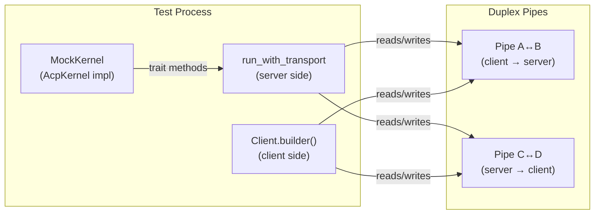

# Other — librefang-acp-tests

# librefang-acp Integration Tests

## Overview

The `acp_integration.rs` test suite exercises the **Agent Client Protocol (ACP) adapter** end-to-end. Each test wires `librefang_acp::run_with_transport` to one end of a `tokio::io::duplex` pipe and drives a matching `agent_client_protocol::Client` on the other end, using a stub [`MockKernel`] in place of a real LibreFang kernel. This validates on-the-wire JSON-RPC behavior—request/response flows, notification ordering, permission round-trips, and reverse-RPC calls—without booting a real kernel or LLM provider.

## Architecture


```mermaid
graph LR
    subgraph "Test Process"
        MK["MockKernel<br/>(AcpKernel impl)"]
        SR["run_with_transport<br/>(server side)"]
        CL["Client.builder()<br/>(client side)"]
    end
    subgraph "Duplex Pipes"
        AB["Pipe A↔B<br/>(client → server)"]
        CD["Pipe C↔D<br/>(server → client)"]
    end
    MK -- "trait methods" --> SR
    SR -- "reads/writes" --> AB
    SR -- "reads/writes" --> CD
    CL -- "reads/writes" --> AB
    CL -- "reads/writes" --> CD
```

The `duplex_pair()` helper creates two `tokio::io::duplex(8192)` channels, yielding four halves wrapped via `tokio_util::compat` for `futures::AsyncRead/AsyncWrite` compatibility. The server reads from pipe A and writes to pipe D; the client reads from C and writes to B.

## Key Components

### `MockKernel`

A thread-safe stub implementing the `AcpKernel` trait. Internal state is guarded by `AsyncMutex` (for async-accessed fields) or `std::sync::Mutex` (for infallible sync accessors like handle storage).

| Field | Purpose |
|---|---|
| `canned_events` | Pre-loaded `StreamEvent` sequence returned by `send_prompt`, consumed once via `std::mem::take` |
| `approval_tx` | Broadcast channel for injecting `ApprovalEvent::Created` entries via `fire_approval()` |
| `resolves` | Captures `(request_id, decision)` pairs recorded by `resolve_approval()` |
| `last_session_id` | Records the `LfSessionId` from the most recent `send_prompt` call |
| `fs_client` | Stores the `FsClientHandle` set by the bridge at `initialize` time; tests retrieve it to exercise reverse-RPCs |
| `terminal_client` | Same pattern as `fs_client`, but for terminal operations |
| `canned_history` | History entries returned by `fetch_session_history`, populated via `set_history()` |

Key methods:

- **`new(canned: Vec<StreamEvent>)`** — Constructs the kernel wrapped in `Arc` with a fresh broadcast channel.
- **`fire_approval(lf_session_id)`** — Injects a synthetic `ApprovalEvent::Created` into the broadcast, simulating a kernel-queued approval. Returns the `Uuid` of the created request for later assertion.
- **`fs_client_handle()` / `terminal_client_handle()`** — Non-async accessors for retrieving handles that the server-side bridge stashes during initialization.

### Test Helpers

- **`recv<T>(sent: SentRequest<T>)`** — Bridges the ACP callback-based response pattern to a `oneshot` channel, allowing `await`-style consumption: `recv(cx.send_request(...)).await?`.
- **`poll_for<T, F>(f)`** — Retries a closure up to 40 times with 25ms sleeps (~1s total) for conditions that depend on async server-side state propagation.
- **`wait_for_session_id(kernel)`** / **`wait_for_resolve(kernel, req_id)`** — Specialized polling helpers that check `MockKernel` state at intervals.

### `duplex_pair()`

Returns a 4-tuple of `(server_read, server_write, client_read, client_write)`, each compatible with the `futures` crate's `AsyncRead`/`AsyncWrite` traits. Used to construct `agent_client_protocol::ByteStreams` for both sides of the connection.

## Test Cases

### `initialize_and_prompt_emits_text_chunks_and_end_turn`

**What it verifies:** The basic init → create session → prompt lifecycle streams `TextDelta` events as `AgentMessageChunk` notifications and terminates with `StopReason::EndTurn`.

**Flow:**
1. `MockKernel` is loaded with two `StreamEvent::TextDelta` events and one `ContentComplete`.
2. Server runs `run_with_transport`; client connects and sends `InitializeRequest`, `NewSessionRequest`, then `PromptRequest`.
3. Asserts the `InitializeResponse` advertises `"librefang"` as the agent name.
4. Asserts `PromptResponse.stop_reason == EndTurn`.
5. Captures `SessionNotification`s and verifies the streamed text chunks are `"Hello"` and `" world"`.

### `permission_round_trip_resolves_kernel_approval`

**What it verifies:** The full approval round-trip: kernel fires an approval → bridge dispatches `session/request_permission` to the client → client responds with `allow_once` → bridge calls `resolve_approval` on the kernel with `Approved`.

**Flow:**
1. Client registers an `on_receive_request` handler for `RequestPermissionRequest` that always selects `PermissionOptionId("allow_once")`.
2. After initialization and session creation, a prompt is kicked off in a spawned local task to keep the bridge active.
3. Test polls for the kernel to record `last_session_id`, then calls `fire_approval()` with that session ID.
4. Polls `wait_for_resolve()` to confirm the bridge delivered `ApprovalDecision::Approved` with the correct `Uuid`.

The `fire_approval()` helper pins a non-None `tool_use_id` (`"toolu_acp_integration_test"`) to exercise the primary tool-call-id mapping path rather than the fallback `approval-{req_id}` pattern.

### `unknown_session_id_returns_invalid_params`

**What it verifies:** Sending a `PromptRequest` with a non-existent `SessionId` returns an error rather than panicking or hanging.

**Flow:**
1. Initialize the connection, then immediately send a `PromptRequest` targeting `SessionId("does-not-exist")`.
2. Assert the result is an error.

### `fs_read_text_file_round_trip`

**What it verifies:** The reverse-RPC path for filesystem operations. The server-side `FsClientHandle` issues a `fs/read_text_file` request across the connection; the client's `on_receive_request` handler responds with canned content.

**Flow:**
1. Client declares `client_capabilities.fs.read_text_file = true` in the `InitializeRequest`.
2. Client registers a handler for `ReadTextFileRequest` that asserts the path is `/tmp/hello.txt` and responds with `"canned editor content"`.
3. After initialization, the test retrieves the `FsClientHandle` stashed on the `MockKernel` (set by the bridge during `initialize`).
4. Calls `handle.read_text_file(...)` and asserts the returned content matches.

### `terminal_run_command_round_trip`

**What it verifies:** The complete terminal lifecycle (create → wait for exit → output → release) exercises all five reverse-RPCs in sequence and produces the expected `AcpTerminalRunResult`.

**Flow:**
1. Client declares `client_capabilities.terminal = true` and registers handlers for all four terminal request types:
   - `CreateTerminalRequest` → returns `TerminalId("term-1")`
   - `WaitForTerminalExitRequest` → returns exit code `0`
   - `TerminalOutputRequest` → returns `"hello world\n"`, not truncated
   - `ReleaseTerminalRequest` → returns default response
2. After initialization, retrieves the `TerminalClientHandle` from the mock kernel.
3. Calls `handle.run_command("echo", vec!["hello"], ...)` via the `AcpTerminalClient` trait—the same path the runtime's `shell_exec` arm uses.
4. Asserts the result: `output == "hello world\n"`, `exit_code == Some(0)`, `truncated == false`, `signal == None`.

### `session_load_replays_history_to_client`

**What it verifies:** When a client reconnects with `LoadSessionRequest` using a previously-used session ID, the kernel-supplied message history is replayed as `session/update` notifications in order (issue #3313).

**Flow:**
1. `MockKernel` is pre-loaded with two history entries: `(User, "previous question")` and `(Assistant, "previous answer")`.
2. Client connects, initializes, then sends a `LoadSessionRequest` with `SessionId("reconnecting-session")`.
3. Polls for at least two `SessionNotification`s.
4. Asserts the first notification is a `UserMessageChunk` with text `"previous question"` and the second is an `AgentMessageChunk` with text `"previous answer"`.

## Running the Tests

All tests use `#[tokio::test(flavor = "current_thread")]` and a `LocalSet`, meaning they run on a single thread with `spawn_local` for cooperative tasks. This avoids `Send` bounds on futures that capture `Rc`-based ACP internals.

```bash
cargo test -p librefang-acp --test acp_integration
```

## Adding New Integration Tests

1. **Create a `MockKernel`** with appropriate canned events via `MockKernel::new(...)`.
2. **Call `duplex_pair()`** to get the four stream halves.
3. **Build `ByteStreams`** for server and client from those halves.
4. **Spawn the server** with `tokio::task::spawn_local(run_with_transport(kernel, agent_id, transport))`.
5. **Build the client** with `Client.builder()`, registering handlers for any notifications or requests the test exercises.
6. **Drive the client** inside `client.connect_with(transport, |cx| { ... })`, using `recv(cx.send_request(...)).await` for each request.
7. **Assert** on responses, captured notifications, or `MockKernel` state (using `poll_for` for async conditions).

## Dependencies

- **`agent_client_protocol`** — Provides the ACP schema types, `Client`, `ByteStreams`, `ConnectionTo`, `SentRequest`, and `Responder`.
- **`librefang_acp`** — The adapter under test; exports `run_with_transport`, `AcpKernel`, `FsClientHandle`, `TerminalClientHandle`.
- **`librefang_llm_driver`** — `StreamEvent` variants used as canned LLM output.
- **`librefang_types`** — Domain types: `AgentId`, `SessionId`, `ApprovalDecision`, `ApprovalEvent`, `RiskLevel`, `TokenUsage`, `StopReason`.
- **`librefang_kernel_handle`** — `AcpTerminalClient` trait used in the terminal round-trip test to call `run_command`.
- **`tokio_util::compat`** — Bridges `tokio::io` types to `futures` traits for ACP transport compatibility.