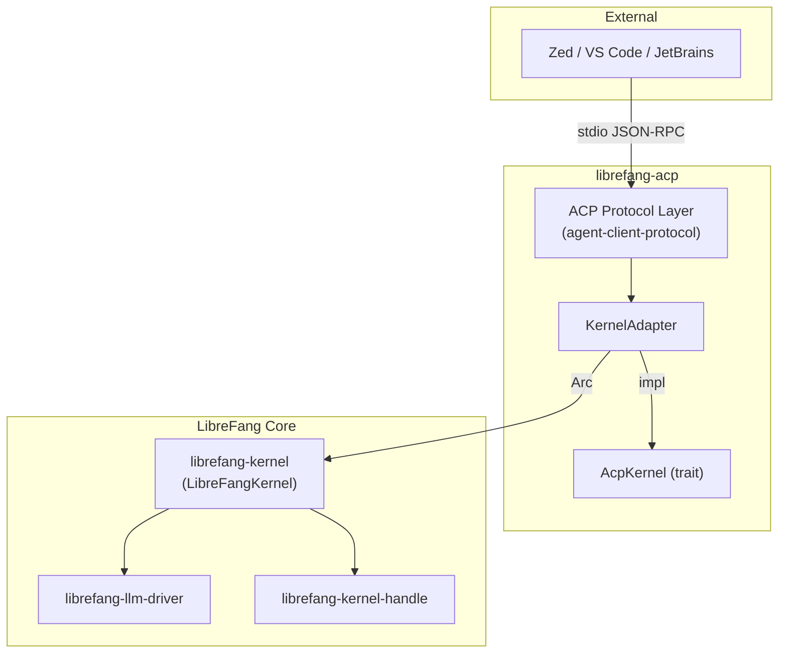

# Other — librefang-acp

# librefang-acp

Agent Client Protocol (ACP) adapter for LibreFang. This crate bridges LibreFang's internal agent/LLM stack and the **Agent Client Protocol**, enabling LibreFang agents to be embedded in editors like Zed, VS Code, and JetBrains over a stdio JSON-RPC transport.

## Architecture

## Purpose

Editor integrations don't talk LibreFang's internal APIs — they speak the Agent Client Protocol, a JSON-RPC protocol transported over stdio. This crate owns the translation layer between those two worlds:

- **Inbound**: ACP requests (session creation, message turns, approval responses) arrive over stdio and are dispatched to the appropriate kernel operations.
- **Outbound**: Kernel events (streaming LLM tokens, approval requests, tool calls) are translated back into ACP notifications and written to stdout.

By keeping this translation isolated in its own crate, `librefang-cli` and `librefang-api` can both host an ACP server — one in-process, one daemon-attached — without duplicating the binding logic.

## Key Abstractions

### `AcpKernel` trait

The core integration point. `AcpKernel` defines the operations the ACP protocol layer needs from a kernel backend — things like initiating a session, sending a user message, responding to an approval prompt, and tearing down a session. Any type implementing this trait can serve as the backend for the ACP server.

The trait is defined in this crate (it is *not* re-exported from `agent-client-protocol`), which means alternative kernel implementations can implement `AcpKernel` directly without pulling in the full `librefang-kernel` dependency tree.

### `KernelAdapter`

A struct gated behind the `kernel-adapter` feature. It wraps an `Arc<LibreFangKernel>` and implements `AcpKernel` by delegating to the real kernel. This is the production adapter used by `librefang-cli` and `librefang-api`.

## Feature Flags

| Flag | Default | Description |
|------|---------|-------------|
| `kernel-adapter` | off | Pulls in `librefang-kernel` and provides `KernelAdapter`. Enables production use by CLI and API crates. |

When the feature is off, the crate still compiles — it exports the protocol types, the `AcpKernel` trait, and the stdio transport machinery. This is useful for integration tests and any consumer that wants to provide a mock or alternative kernel.

## Dependencies

**Internal (always linked):**

- `librefang-types` — shared type definitions (session IDs, message types, etc.)
- `librefang-llm-driver` — LLM provider abstractions, needed for translating between ACP message formats and internal LLM request/response types
- `librefang-kernel-handle` — kernel handle abstraction for managing active sessions

**Internal (optional):**

- `librefang-kernel` — the full kernel implementation, only pulled in via the `kernel-adapter` feature

**External:**

- `agent-client-protocol` / `agent-client-protocol-tokio` — workspace crates providing ACP type definitions and tokio-based transport primitives
- `tokio` / `tokio-util` — async runtime and I/O utilities (the transport layer is built on tokio's `AsyncRead`/`AsyncWrite`)
- `dashmap` — concurrent hashmap used for tracking active ACP sessions across async tasks
- `serde` / `serde_json` — JSON serialization for the JSON-RPC message wire format
- `tracing` — structured logging throughout the protocol and transport layers
- `thiserror` / `uuid` — error derivation and unique ID generation

## How Other Crates Use This

**`librefang-cli`** — Enables the `kernel-adapter` feature, constructs a `LibreFangKernel`, wraps it in `KernelAdapter`, and runs the ACP server in-process over stdio. This is the path used when an editor launches LibreFang as a subprocess.

**`librefang-api`** — Similarly enables `kernel-adapter`. Hosts the ACP server in daemon mode, allowing multiple editor instances to connect through a persistent process.

**Integration tests** (in this crate's `tests/` directory) — Leave `kernel-adapter` off, implement `AcpKernel` directly with lightweight stubs, and exercise the protocol/transport layer in isolation. Test fixtures use `futures` for duplex transport simulation and `chrono` for timestamping `ApprovalRequest` fixtures.

## Transport

The crate uses stdio as the transport boundary. `agent-client-protocol-tokio` provides the framing layer (length-delimited JSON-RPC messages over `AsyncRead`/`AsyncWrite`), and this crate wires stdin/stdout into that layer. This is the standard transport for editor-hosted agents — the editor spawns LibreFang as a child process and communicates over the child's stdin/stdout.