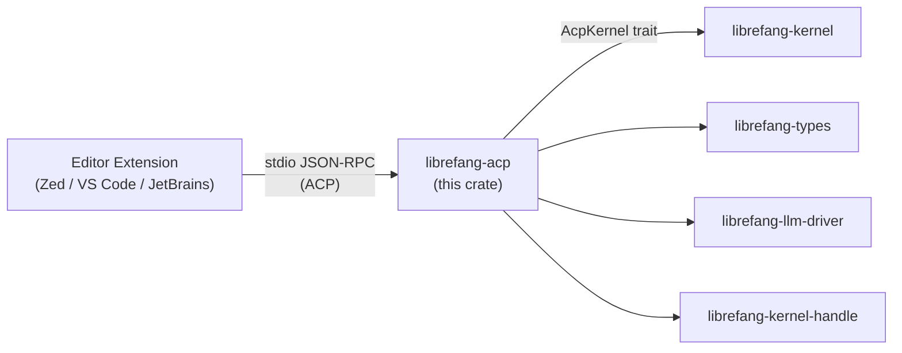

# Other — librefang-acp

# librefang-acp

Agent Client Protocol (ACP) adapter for LibreFang. Bridges LibreFang agents into editor environments (Zed, VS Code, JetBrains) over stdio JSON-RPC.

## Overview

This crate translates between the [Agent Client Protocol](https://github.com/Agenct-Client-Protocol/spec) — the standard wire format spoken by editor extensions — and LibreFang's internal kernel APIs. Editors launch a LibreFang process that communicates over stdin/stdout using JSON-RPC; this crate owns the server-side of that interaction.

The design separates **protocol handling** (always compiled in) from **kernel binding** (optional via feature flag), so alternative kernel backends or integration tests can implement the core trait directly without pulling in the full kernel dependency tree.

## Architecture

The crate has two layers:

- **Protocol layer** — depends on `agent-client-protocol` and `agent-client-protocol-tokio` for JSON-RPC message framing and transport. Depends on `librefang-types`, `librefang-llm-driver`, and `librefang-kernel-handle` for LibreFang domain types. Always compiled.
- **Kernel adapter** — gated behind the `kernel-adapter` feature. Provides `KernelAdapter`, which wraps `Arc<LibreFangKernel>` and implements the `AcpKernel` trait. This is the concrete binding used by `librefang-cli` (in-process hosting) and `librefang-api` (daemon-attached hosting).

## Feature Flags

| Flag | Default | Description |
|------|---------|-------------|
| `kernel-adapter` | off | Pulls in `librefang-kernel` and provides `KernelAdapter` — a concrete `AcpKernel` implementation backed by `Arc<LibreFangKernel>`. Enable this when the binary hosting the ACP server links against the full kernel. |

### When to enable `kernel-adapter`

- **Enable it** in `librefang-cli` and `librefang-api` — these binaries host the ACP server and need the real kernel.
- **Leave it off** for integration tests, protocol fuzzer consumers, or alternative kernel backends. Implement `AcpKernel` directly instead.

## Key Abstractions

### `AcpKernel` trait

The central trait that protocol handlers call into. It abstracts the kernel operations the ACP wire protocol needs — session management, tool invocation, approval workflows, and conversation state. Anything implementing this trait can serve ACP requests.

### `KernelAdapter`

Concrete `AcpKernel` implementation (requires `kernel-adapter` feature). Wraps `Arc<LibreFangKernel>` and delegates trait methods to the underlying kernel. Downstream crates get a working ACP server by constructing this adapter and handing it to the server entry point.

## Dependencies

**Always required:**

| Crate | Role |
|-------|------|
| `agent-client-protocol` | ACP type definitions and specification types |
| `agent-client-protocol-tokio` | Tokio-based transport for ACP JSON-RPC |
| `librefang-types` | LibreFang shared domain types |
| `librefang-llm-driver` | LLM provider abstraction |
| `librefang-kernel-handle` | Kernel handle types |
| `dashmap` | Concurrent maps for session/request tracking |
| `tokio` / `tokio-util` | Async runtime and codec utilities |
| `serde` / `serde_json` | JSON serialization |
| `tracing` | Structured logging |
| `thiserror` | Error type derivation |
| `uuid` | Session and request identifiers |

**Optional:**

| Crate | Flag | Role |
|-------|------|------|
| `librefang-kernel` | `kernel-adapter` | Full kernel for `KernelAdapter` |

**Dev-only** (`futures`, `chrono`): Used by integration tests for duplex transport (`AsyncRead`/`AsyncWrite` bounds) and `ApprovalRequest` fixtures. Kept out of the release dependency tree.

## Integration with Downstream Crates

`librefang-cli` and `librefang-api` both depend on this crate with `kernel-adapter` enabled. They differ in how they host the server:

- **`librefang-cli`** — runs the ACP server in-process. The editor launches the CLI binary directly; it creates a `KernelAdapter`, starts the stdio transport, and serves requests until the pipe closes.
- **`librefang-api`** — attaches to an already-running daemon. The ACP server runs inside the long-lived API process, routing editor requests through to the shared kernel instance.

## Testing

Integration tests live in `tests/acp_integration.rs`. They validate the protocol layer without requiring `kernel-adapter`, using a test `AcpKernel` implementation that stubs kernel behavior. This keeps test compilation fast and isolates protocol correctness from kernel internals.

The test suite uses `tokio::test` with the `rt-multi-thread` and `test-util` features, and exercises the duplex transport directly through `futures`' `AsyncRead`/`AsyncWrite` combinators.