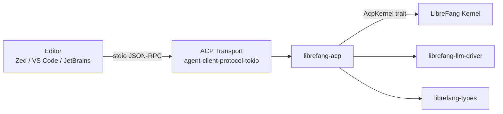

# Other — librefang-acp

# librefang-acp

Agent Client Protocol (ACP) adapter for LibreFang. Bridges LibreFang's kernel and LLM infrastructure to the [Agent Client Protocol](https://github.com/AcpProtocol/acp), allowing LibreFang agents to run inside editors like Zed, VS Code, and JetBrains over stdio JSON-RPC.

## Overview

ACP defines a standard for editor–agent communication. This crate implements the **server side**: it exposes LibreFang as an ACP-compatible agent that any ACP-speaking editor can consume. The transport is stdio-based JSON-RPC, orchestrated by the `agent-client-protocol` and `agent-client-protocol-tokio` workspace crates.

The crate is intentionally thin on protocol logic — it delegates message parsing, framing, and routing to the upstream ACP libraries. Its real job is **adaptation**: translating between ACP's abstract kernel interface (`AcpKernel`) and LibreFang's concrete kernel.

## Architecture

## Key Trait: `AcpKernel`

The central abstraction in this crate is the `AcpKernel` trait (defined in the `agent-client-protocol` workspace crate). It represents the operations an ACP server needs from its backing agent — session management, message handling, approval requests, and so on.

There are two ways `AcpKernel` gets implemented:

1. **`KernelAdapter`** (behind the `kernel-adapter` feature) — wraps `Arc<LibreFangKernel>` from `librefang-kernel` and maps each `AcpKernel` method to the corresponding kernel operation. This is the production path, used by `librefang-cli` (in-process) and `librefang-api` (daemon-attached).

2. **Custom implementations** — integration tests and alternative kernel backends implement `AcpKernel` directly, keeping the test/alternative surface free of the heavy `librefang-kernel` dependency tree.

## Feature Flags

| Flag | Default | Effect |
|------|---------|--------|
| `kernel-adapter` | off | Pulls in `librefang-kernel`. Provides `KernelAdapter` implementing `AcpKernel` over `Arc<LibreFangKernel>`. |

### Why `kernel-adapter` is optional

The full kernel dependency tree is heavy. Pure-protocol consumers — integration tests validating JSON-RPC framing, or hypothetical alternative kernel backends — don't need it. They implement `AcpKernel` directly and avoid the compile cost.

The flag is enabled by `librefang-cli` and `librefang-api`, which are the two crates that actually host a running ACP server connected to a real kernel.

## Dependencies

### Required

| Crate | Role |
|-------|------|
| `librefang-types` | Shared type definitions (messages, session IDs, etc.) |
| `librefang-llm-driver` | LLM backend abstraction for generating responses |
| `librefang-kernel-handle` | Lightweight handle to a running kernel instance |
| `agent-client-protocol` | ACP trait definitions and types |
| `agent-client-protocol-tokio` | Tokio-based ACP transport (stdio framing, JSON-RPC dispatch) |
| `tokio`, `tokio-util` | Async runtime and codec utilities |
| `async-trait` | Trait async methods |
| `serde`, `serde_json` | Serialization |
| `tracing` | Structured logging |
| `dashmap` | Concurrent session/conversation state maps |
| `uuid` | Session and conversation ID generation |
| `thiserror` | Error type derivation |

### Optional

| Crate | Flag | Role |
|-------|------|------|
| `librefang-kernel` | `kernel-adapter` | Full kernel, used by `KernelAdapter` |

### Dev-only

`futures` (for duplex transport `AsyncRead`/`AsyncWrite` bounds in tests) and `chrono` (for `ApprovalRequest` test fixtures). Kept out of the production dependency tree.

## Integration Points

### librefang-cli

The CLI enables `kernel-adapter` and starts an in-process ACP server over stdio. When an editor launches the CLI as a language server–style subprocess, it gets a full LibreFang agent.

### librefang-api

The API server enables `kernel-adapter` to host an ACP endpoint attached to a long-running kernel daemon, serving multiple editor connections.

### Integration tests

`tests/acp_integration.rs` exercises the full JSON-RPC message flow — handshake, session creation, conversation turns, approval requests — without pulling in `librefang-kernel`. Tests implement `AcpKernel` with stubs or mocks, using the `futures` crate's duplex transport to simulate the stdio pipe.

## Error Handling

Errors are consolidated through `thiserror`. The main error variants cover:

- **Protocol errors** — malformed JSON-RPC, unexpected message types, missing fields.
- **Kernel errors** — forwarded from `librefang-kernel` or `librefang-kernel-handle` when the backing kernel rejects an operation.
- **Transport errors** — stdio pipe closed, framing failures, I/O errors.

All errors are logged through `tracing` with structured fields (session ID, conversation ID, method name) for observability in editor logs.

## Session Management

`dashmap` provides the concurrent map backing active sessions. Each editor connection gets a session keyed by UUID. Within a session, conversations are tracked so that approval requests (e.g., "allow this file write?") can be correlated back to the originating editor prompt and surfaced correctly in the ACP protocol.