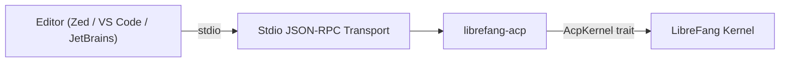

# Other — librefang-acp

# librefang-acp

Agent Client Protocol (ACP) adapter for LibreFang — exposes LibreFang agents to editor integrations (Zed, VS Code, JetBrains) over stdio JSON-RPC.

## Overview

`librefang-acp` translates between the **Agent Client Protocol** wire format and LibreFang's internal kernel APIs. Editors that implement ACP launch the LibreFang process as a language-server-style child, communicating over stdin/stdout using JSON-RPC. This crate owns that translation boundary.

## Architecture

```mermaid
graph LR
    Editor["Editor (Zed / VS Code / JetBrains)"]
    Transport["Stdio JSON-RPC Transport"]
    ACP["librefang-acp"]
    Kernel["LibreFang Kernel"]

    Editor -->|stdio| Transport
    Transport --> ACP
    ACP -->|AcpKernel trait| Kernel
```

The crate is deliberately split into a **protocol layer** (always compiled) and an optional **kernel binding layer** (behind `kernel-adapter`). This separation lets integration tests and alternative kernel implementations provide their own `AcpKernel` without pulling in the full kernel dependency tree.

## Feature Flags

| Flag | Default | Description |
|------|---------|-------------|
| `kernel-adapter` | off | Pulls in `librefang-kernel` and provides a `KernelAdapter` wrapping `Arc<LibreFangKernel>` that implements `AcpKernel`. Enabled by `librefang-cli` (in-process hosting) and `librefang-api` (daemon-attached hosting). Leave this off if you only need the protocol types and transport. |

## Key Dependencies

| Crate | Role |
|-------|------|
| `agent-client-protocol` | Workspace crate providing ACP type definitions (requests, responses, notifications). |
| `agent-client-protocol-tokio` | Tokio-based ACP transport — handles JSON-RPC framing over async I/O. |
| `librefang-types` | Shared domain types used across all LibreFang crates. |
| `librefang-llm-driver` | LLM abstraction layer; used when the ACP adapter needs to forward prompt/completion calls. |
| `librefang-kernel-handle` | Lightweight handle to a kernel instance, decoupled from the heavy kernel crate. |
| `librefang-kernel` | Full kernel implementation. Optional — only pulled in when `kernel-adapter` is enabled. |

## Trait-Based Kernel Abstraction

The core of this crate is the `AcpKernel` trait (async, via `async-trait`). It defines the operations that the ACP protocol needs from the underlying agent kernel — things like initiating sessions, submitting prompts, handling approval requests, and streaming responses.

Consumers implement this trait to bridge ACP into whatever backend they have:

- **With `kernel-adapter`**: Use the provided `KernelAdapter` which wraps `Arc<LibreFangKernel>` and implements `AcpKernel` by delegating to the real kernel. This is what `librefang-cli` and `librefang-api` use.
- **Without `kernel-adapter`**: Implement `AcpKernel` yourself. Useful for integration tests or experimental backends.

## Integration Points

### From `librefang-cli`

When running as a CLI tool in ACP mode, the process hosts the ACP server in-process with `kernel-adapter` enabled. The kernel is instantiated directly, wrapped in `KernelAdapter`, and the stdio transport is attached.

### From `librefang-api`

In daemon mode, `librefang-api` attaches to an already-running kernel instance and hosts the ACP server as a frontend. It also uses `kernel-adapter` but may connect through a different kernel acquisition path.

### Integration Tests

The `tests/acp_integration.rs` test file exercises the full ACP transport layer using duplex async I/O (`AsyncRead`/`AsyncWrite` from `futures`) and stamps `ApprovalRequest` fixtures (using `chrono` for timestamps). These tests implement `AcpKernel` directly with mock/stub logic, so they don't need the kernel feature.

## Concurrency

The crate uses `dashmap` for concurrent session state management — ACP allows multiple concurrent agent sessions, and the server needs lock-free concurrent access to session metadata keyed by session ID (`uuid`).

Error handling follows the workspace pattern: domain errors are enumerated through `thiserror` derive, and `tracing` spans are attached to JSON-RPC request boundaries for observability.

## Adding a New ACP Method

1. Define or reuse the request/response types in `agent-client-protocol`.
2. Add the method handler in this crate's server dispatch.
3. Extend `AcpKernel` with the corresponding async method if the kernel needs to support it.
4. Update `KernelAdapter` (behind `kernel-adapter`) to delegate the new method to `LibreFangKernel`.