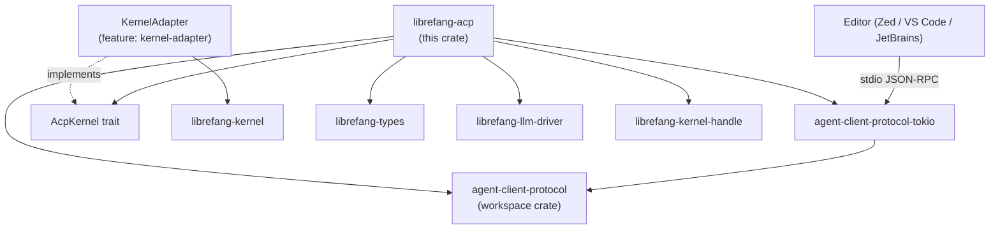

# Other — librefang-acp

# librefang-acp

Agent Client Protocol (ACP) adapter for LibreFang — provides the bridge layer that lets LibreFang agents run inside editors (Zed, VS Code, JetBrains) over a stdio JSON-RPC transport.

## Overview

This crate implements the editor-facing side of the [Agent Client Protocol](https://github.com/Aider-AI/agent-client-protocol) for LibreFang. Editors that support ACP communicate with agents over JSON-RPC, typically piped through stdin/stdout. `librefang-acp` translates those protocol messages into LibreFang kernel operations and back.

The crate is intentionally split into a **protocol core** (always compiled) and an optional **kernel binding** (behind the `kernel-adapter` feature). This separation lets integration tests and alternative kernel implementations use the protocol layer without pulling in the full `librefang-kernel` dependency tree.

## Architecture

```mermaid
graph TD
    Editor["Editor (Zed / VS Code / JetBrains)"]
    ACP["agent-client-protocol<br/>(workspace crate)"]
    ACPTokio["agent-client-protocol-tokio"]
    LFA["librefang-acp<br/>(this crate)"]
    AK["AcpKernel trait"]
    KA["KernelAdapter<br/>(feature: kernel-adapter)"]
    LFK["librefang-kernel"]
    LFT["librefang-types"]
    LLD["librefang-llm-driver"]
    LKH["librefang-kernel-handle"]

    Editor -->|"stdio JSON-RPC"| ACPTokio
    ACPTokio --> ACP
    LFA --> ACP
    LFA --> ACPTokio
    LFA --> AK
    KA -.->|"implements"| AK
    KA --> LFK
    LFA --> LFT
    LFA --> LLD
    LFA --> LKH
```

## Key Abstractions

### `AcpKernel` trait

The central trait that decouples ACP protocol handling from any specific kernel backend. Anything implementing `AcpKernel` can serve as the agent engine behind the ACP server. The trait captures the operations an editor client needs: initiating sessions, sending prompts, handling approval requests, and streaming responses.

Pure-protocol consumers (integration tests, alternative backends) implement this trait directly against their own infrastructure, avoiding the `librefang-kernel` dependency entirely.

### `KernelAdapter` (feature-gated)

Behind the `kernel-adapter` feature, this struct wraps `Arc<LibreFangKernel>` and implements `AcpKernel`. This is the production path: `librefang-cli` and `librefang-api` both enable this feature so they can host an in-process ACP server without duplicating the kernel binding logic.

## Feature Flags

| Flag | Default | Description |
|------|---------|-------------|
| `kernel-adapter` | off | Pulls in `librefang-kernel`. Provides `KernelAdapter` that implements `AcpKernel` over a real kernel instance. |

## Dependencies — why each one

| Dependency | Role in this crate |
|---|---|
| `agent-client-protocol` | Core ACP types, JSON-RPC method definitions, request/response schemas |
| `agent-client-protocol-tokio` | Tokio-based transport layer for the stdio JSON-RPC duplex |
| `librefang-types` | Shared domain types used across all LibreFang crates |
| `librefang-llm-driver` | LLM abstraction — the kernel delegates model calls through this |
| `librefang-kernel-handle` | Lightweight handle type for referencing a kernel without owning it |
| `dashmap` | Concurrent `HashMap` for tracking in-flight sessions and approval callbacks |
| `uuid` | Session and request identifiers |
| `tokio` / `tokio-util` | Async runtime, I/O adapters for the stdio transport |
| `tracing` | Structured logging throughout the protocol layer |
| `thiserror` | Error types for protocol and kernel adapter failures |
| `serde_json` | JSON serialization for protocol messages and dynamic payload handling |

## Integration Points

### From `librefang-cli`

The CLI enables `kernel-adapter` and runs the ACP server in-process. When launched with the appropriate subcommand, it wires stdin/stdout to an `agent-client-protocol-tokio` transport, constructs a `KernelAdapter` around a freshly initialized `LibreFangKernel`, and serves requests until the pipe closes.

### From `librefang-api`

The API server (daemon mode) enables `kernel-adapter` to attach to a long-running kernel instance and expose ACP over a managed transport — useful for scenarios where the editor connects to a persistent agent process rather than spawning a new one.

### From integration tests

The `tests/acp_integration.rs` test file leaves `kernel-adapter` off and implements `AcpKernel` with a stub or mock backend. It uses `futures` (for `AsyncRead`/`AsyncWrite` duplex construction) and `chrono` (for timestamping `ApprovalRequest` fixtures) — both kept as dev-dependencies to minimize the release dependency tree.

## Error Handling

Errors are modeled with `thiserror` enums covering:

- **Protocol errors** — malformed JSON-RPC messages, unexpected method names, serialization failures.
- **Kernel adapter errors** — forwarded from `librefang-kernel` when the `kernel-adapter` feature is active (session creation failures, model errors, tool execution failures).
- **Transport errors** — I/O failures on the stdio pipe, unexpected disconnects.

All errors are traced through the `tracing` subscriber before being serialized back to the client as JSON-RPC error responses.

## Adding a New Kernel Backend

1. Implement `AcpKernel` for your backend type.
2. Construct your backend and pass it to the ACP server entry point in this crate.
3. No need to enable `kernel-adapter` — that feature exists solely for the `LibreFangKernel` binding.

## Conventions

- **No direct kernel dependency by default.** The base crate compiles without `librefang-kernel`. Only enable `kernel-adapter` if you need the real kernel.
- **All state is thread-safe.** Session tracking uses `DashMap` so the server handles concurrent editor requests without a global mutex.
- **Stdio is the expected transport.** The crate is designed around the duplex byte-stream model that ACP editors provide. Other transports are theoretically possible but not a primary target.