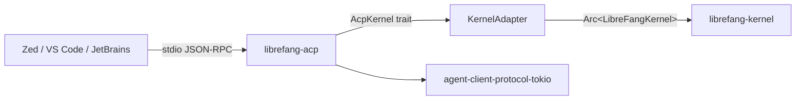

# Other — librefang-acp

# librefang-acp

Agent Client Protocol (ACP) adapter for LibreFang. Bridges LibreFang agents into editors — Zed, VS Code, JetBrains — over stdio JSON-RPC.

## Purpose

Editors that implement the [Agent Client Protocol](https://github.com/anthropics/agent-client-protocol) communicate with agent backends through a standardized JSON-RPC channel, typically over stdin/stdout. This crate provides the glue between that protocol and LibreFang's kernel, allowing any ACP-compliant editor to host a LibreFang agent session in-process or via a daemon.

## Architecture


```mermaid
graph LR
    Editor[Zed / VS Code / JetBrains] -->|stdio JSON-RPC| ACP
    ACP[librefang-acp] -->|AcpKernel trait| KA[KernelAdapter]
    KA -->|Arc&lt;LibreFangKernel&gt;| Kernel[librefang-kernel]
    ACP --> AT[agent-client-protocol-tokio]
```

The crate is structured around one core abstraction — the **`AcpKernel` trait** — which decouples protocol handling from the underlying kernel. Consumers implement this trait to provide editor-visible capabilities (session management, approval requests, tool execution). When the `kernel-adapter` feature is enabled, a concrete `KernelAdapter` struct wraps `Arc<LibreFangKernel>` and implements `AcpKernel` for production use.

## Key Components

### `AcpKernel` Trait

The primary integration point. Any type implementing `AcpKernel` can serve as the backend for an ACP server session. The trait defines the operations the protocol layer needs — session lifecycle, prompt handling, approval flows — without depending on `librefang-kernel` directly.

Pure-protocol consumers (integration tests, alternative kernel implementations) implement this trait against their own types, avoiding the heavy `librefang-kernel` dependency tree.

### `KernelAdapter`

Available only under the `kernel-adapter` feature. Wraps `Arc<LibreFangKernel>` and implements `AcpKernel`, providing the production binding used by `librefang-cli` (in-process mode) and `librefang-api` (daemon-attached mode).

### Transport Layer

Built on `agent-client-protocol-tokio`, which provides the async JSON-RPC framing over Tokio's I/O types. The server reads ACP requests from stdin, dispatches them through the `AcpKernel` implementation, and writes responses to stdout.

## Feature Flags

| Flag | Default | Description |
|---|---|---|
| `kernel-adapter` | off | Enables `KernelAdapter` and pulls in `librefang-kernel`. Use this when hosting a real agent session. Leave it off for protocol-only consumers. |

## Integration with the Workspace

**Downstream consumers:**

- **`librefang-cli`** — Enables `kernel-adapter` to host an in-process ACP server. The CLI spawns a stdio transport and hands it to this crate's server entry point.
- **`librefang-api`** — Enables `kernel-adapter` for daemon-attached ACP sessions exposed through the API layer.

**Upstream dependencies:**

- `librefang-types` — Shared domain types referenced in ACP message translation.
- `librefang-llm-driver` — LLM abstraction layer, used when the kernel needs to invoke model inference during a session.
- `librefang-kernel-handle` — Kernel handle abstraction for session-scoped interactions.

## Writing a Custom `AcpKernel` Implementation

For testing or alternative backends, implement `AcpKernel` directly without enabling `kernel-adapter`:

```rust
use librefang_acp::AcpKernel;

struct MyTestKernel;

#[async_trait]
impl AcpKernel for MyTestKernel {
    // Implement required methods...
}
```

This keeps your dependency graph minimal — no `librefang-kernel`, no transitive heavy crates.

## Testing

Integration tests live in `tests/acp_integration.rs` and use the duplex transport's `AsyncRead`/`AsyncWrite` bounds to simulate editor ↔ agent communication without a real kernel. Dev-dependencies (`futures`, `chrono`) are intentionally kept out of the production dependency tree.