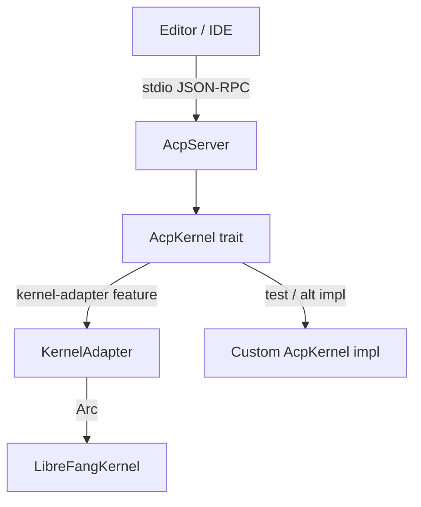

# Other — librefang-acp

# librefang-acp

Agent Client Protocol (ACP) adapter for LibreFang. This crate bridges LibreFang's agent kernel with the Agent Client Protocol, enabling LibreFang agents to be embedded in editors like Zed, VS Code, and JetBrains via stdio-based JSON-RPC.

## Purpose

Editors that implement the Agent Client Protocol expect a specific JSON-RPC interface over stdio — session lifecycle, tool approval, conversation management, and streaming responses. This crate provides the adapter layer that translates between ACP protocol messages and LibreFang's internal kernel APIs, so editors can host LibreFang agents without knowing anything about the kernel itself.

## Architecture

```mermaid
graph TD
    Editor[Editor / IDE] -->|stdio JSON-RPC| ACP[AcpServer]
    ACP --> AK[AcpKernel trait]
    AK -->|kernel-adapter feature| KA[KernelAdapter]
    KA -->|Arc| LFK[LibreFangKernel]
    AK -->|test / alt impl| Custom[Custom AcpKernel impl]
```

The central abstraction is the `AcpKernel` trait. Everything else in the crate — transport handling, session routing, message serialization — is infrastructure around that trait. Consumers either enable the `kernel-adapter` feature to get a production-ready `KernelAdapter` (wrapping `Arc<LibreFangKernel>`), or they implement `AcpKernel` directly for testing or alternative backends.

## Feature Flags

### `kernel-adapter` (optional)

Pulls in the `librefang-kernel` dependency tree and provides `KernelAdapter`, which wraps `Arc<LibreFangKernel>` and implements `AcpKernel`. This is the production path — enabled by `librefang-cli` and `librefang-api` so they can host the ACP server (in-process and daemon-attached respectively) without duplicating the binding layer.

When this feature is off, the crate contains only the protocol layer: the `AcpKernel` trait, transport setup, and JSON-RPC message handling. Pure-protocol consumers (integration tests, alternative kernel implementations) leave this disabled and implement `AcpKernel` directly.

## Key Dependencies

| Dependency | Role |
|---|---|
| `agent-client-protocol` | Workspace crate providing ACP type definitions and protocol constants |
| `agent-client-protocol-tokio` | Tokio-based transport for the ACP JSON-RPC layer |
| `librefang-types` | Shared type definitions used across LibreFang crates |
| `librefang-llm-driver` | LLM driver abstraction for model interaction |
| `librefang-kernel-handle` | Kernel handle abstraction for managing kernel references |
| `librefang-kernel` | Full kernel (optional, gated by `kernel-adapter`) |

## Integration Points

This crate is consumed by:

- **`librefang-cli`** — hosts the ACP server in-process, enabling `librefang` to be launched as an editor plugin subprocess
- **`librefang-api`** — hosts the ACP server in daemon-attached mode for persistent agent sessions

Both enable the `kernel-adapter` feature to get the full production binding layer.

## Testing

The crate includes integration tests in `tests/acp_integration.rs` that exercise the protocol layer without requiring the full kernel. These tests use `tokio` with `macros`, `rt-multi-thread`, and `test-util` features, along with `futures` (for duplex transport's `AsyncRead`/`AsyncWrite` bounds) and `chrono` (for `ApprovalRequest` fixtures). These are dev-dependencies only, keeping the release dependency tree minimal.