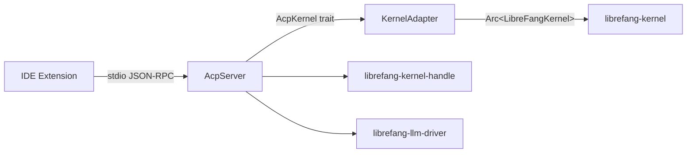

# Other — librefang-acp

# librefang-acp

Agent Client Protocol (ACP) adapter for LibreFang — embeds LibreFang agents in Zed, VS Code, and JetBrains via stdio JSON-RPC.

## Purpose

This crate bridges LibreFang's kernel and the **Agent Client Protocol**, allowing LibreFang agents to run inside IDE extensions. It translates ACP JSON-RPC messages arriving over stdio into kernel operations and streams results back to the editor.

## Architecture

```mermaid
graph LR
    IDE[IDE Extension] -->|stdio JSON-RPC| ACP[AcpServer]
    ACP -->|AcpKernel trait| KA[KernelAdapter]
    KA -->|Arc&lt;LibreFangKernel&gt;| Kernel[librefang-kernel]
    ACP --> HD[librefang-kernel-handle]
    ACP --> LLMD[librefang-llm-driver]
```

The server sits on the process's stdin/stdout. The IDE extension launches the LibreFang ACP binary (or connects to a running daemon), and all communication flows as JSON-RPC messages conforming to the `agent-client-protocol` specification.

## Feature Flags

| Flag | Default | Description |
|------|---------|-------------|
| `kernel-adapter` | off | Pulls in `librefang-kernel` and provides `KernelAdapter`, a concrete implementation of `AcpKernel` wrapping `Arc<LibreFangKernel>`. Enabled by `librefang-cli` (in-process hosting) and `librefang-api` (daemon-attached hosting). |

When `kernel-adapter` is off, this crate is a pure protocol layer. Consumers implement `AcpKernel` themselves — useful for integration tests or alternative kernel backends that want to avoid the full kernel dependency tree.

## Key Abstractions

### `AcpKernel` trait

The core integration point. It defines the operations the ACP server needs from a kernel — session management, tool invocation, approval handling, and streaming response production. Production consumers get this via `KernelAdapter` (feature-gated); test consumers implement it directly.

### Transport

Built on `agent-client-protocol` and `agent-client-protocol-tokio`, providing a Tokio-based duplex transport over stdio. The transport handles framing, serialization, and dispatch of JSON-RPC requests and notifications.

### Session and Approval Tracking

Uses `dashmap` for concurrent session state. `ApprovalRequest` artifacts from the kernel are surfaced to the IDE as ACP approval notifications, and the IDE's response routes back through to the kernel handle.

## Dependencies

- **`librefang-types`** — shared domain types used across all LibreFang crates.
- **`librefang-llm-driver`** — LLM abstraction layer; the ACP server uses it to configure model selection and stream tokens back to the IDE.
- **`librefang-kernel-handle`** — lightweight handle to a running kernel session, used for issuing commands and receiving streamed output.
- **`librefang-kernel`** (optional) — the full kernel, only pulled in when `kernel-adapter` is enabled.

## Usage Patterns

### In-process hosting (`librefang-cli` with `kernel-adapter`)

The CLI binary creates a `LibreFangKernel`, wraps it in `KernelAdapter`, and runs the ACP server directly. The IDE extension launches the CLI as a child process and communicates over its stdio.

### Daemon-attached hosting (`librefang-api` with `kernel-adapter`)

The API daemon holds a long-lived kernel. When an IDE connects, the daemon creates a `KernelAdapter` pointing at the existing kernel and runs an ACP server on that connection's stdio transport.

### Testing without the kernel

Integration tests in `tests/acp_integration.rs` implement `AcpKernel` with mock/fixture data (using `futures` for async stream construction and `chrono` for timestamping `ApprovalRequest` fixtures), keeping the test dependency tree small.

## Adding a New ACP Method

1. Ensure the method is represented in the `agent-client-protocol` crate types.
2. Add a handler in the ACP server dispatch that maps the incoming request to the appropriate `AcpKernel` method.
3. If the method needs kernel support beyond the current `AcpKernel` surface, extend the trait.
4. Update `KernelAdapter` to implement the new trait method by delegating to `LibreFangKernel`.
5. Add an integration test using a mock `AcpKernel` implementation to verify request/response shape.