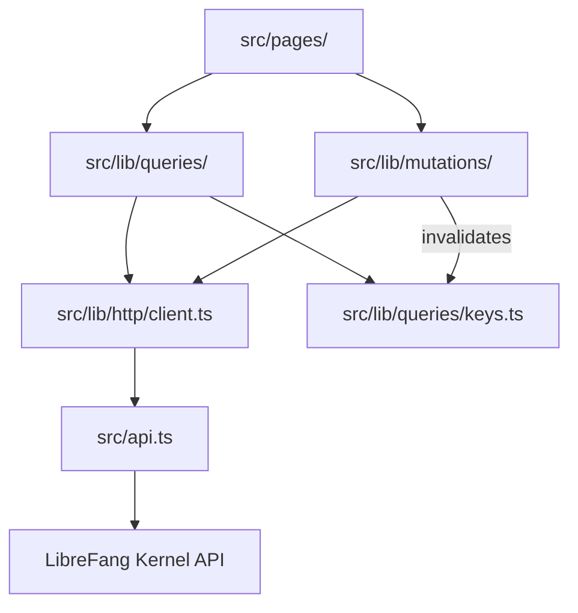

# Other — librefang-api-dashboard

# LibreFang API Dashboard

A React 19 single-page application for managing and monitoring LibreFang autonomous agents. Built with TanStack Router v1 for routing, TanStack Query v5 for server state, and Tailwind CSS v4 for styling.

## Architecture Overview



Pages and components never call `fetch()` or `src/api.ts` directly. All data access flows through the hooks layer (`src/lib/queries/` for reads, `src/lib/mutations/` for writes), which wraps the HTTP client and manages TanStack Query cache invalidation.

The sole exceptions are streaming/SSE connections and fire-and-forget control channels (e.g., terminal WebSocket lifecycle in `TerminalTabs.tsx`), which call `fetch` directly with an inline comment explaining why.

## Navigation Surface

The dashboard provides 16 top-level sections, each backed by its own page component:

| Route | Page | Domain |
|-------|------|--------|
| Overview | `OverviewPage` | `overview` |
| Agents | `AgentsPage` | `agents` |
| Sessions | `SessionsPage` | `sessions` |
| Approvals | `ApprovalsPage` | `approvals` |
| Comms | `ChannelsPage` | `channels` |
| Providers | `ProvidersPage` | `providers` |
| Channels | `ChannelsPage` | `channels` |
| Skills | `SkillsPage` | `skills` |
| Hands | `HandsPage` | `hands` |
| Workflows | `WorkflowsPage` / `CanvasPage` | `workflows` |
| Scheduler | `SchedulesPage` | `schedules` |
| Goals | `GoalsPage` | `goals` |
| Analytics | `AnalyticsPage` | `analytics` |
| Memory | `MemoryPage` | `memory` |
| Runtime | `RuntimePage` | `runtime` |
| Logs | Terminal page | `terminal` |

## Data Layer

### Directory Layout

```
src/lib/
  http/
    client.ts          # Thin wrapper over src/api.ts + typed re-exports
    errors.ts          # ApiError class
  queries/
    keys.ts            # Hierarchical query-key factories for every domain
    keys.test.ts       # Anchoring and existence tests for all factories
    <domain>.ts        # queryOptions + useXxx hooks per domain
  mutations/
    <domain>.ts        # useXxx mutation hooks with built-in invalidation
```

Current domain files: `agents`, `analytics`, `approvals`, `channels`, `config`, `goals`, `hands`, `mcp`, `media`, `memory`, `models`, `network`, `overview`, `plugins`, `providers`, `runtime`, `schedules`, `sessions`, `skills`, `workflows`.

### Query Key Factories

Every domain defines a hierarchical key factory in `src/lib/queries/keys.ts`. Each sub-key is anchored to the domain's `all` key so that broad invalidation cascades correctly:

```ts
export const fooKeys = {
  all: ["foo"] as const,
  lists: () => [...fooKeys.all, "list"] as const,
  list: (filters: FooFilters = {}) => [...fooKeys.lists(), filters] as const,
  details: () => [...fooKeys.all, "detail"] as const,
  detail: (id: string) => [...fooKeys.details(), id] as const,
};
```

Never build a `queryKey` inline — always call the factory. Never subscribe to the same endpoint with a different key to get a subset; use `select` on the shared `queryOptions` instead.

### Query Hooks

Each domain file exports a `queryOptions` factory and a corresponding `useXxx` hook:

```ts
export const fooQueryOptions = (filters?: FooFilters) =>
  queryOptions({
    queryKey: fooKeys.list(filters ?? {}),
    queryFn: () => listFoo(filters),
    staleTime: 30_000,
  });

export function useFoo(filters?: FooFilters) {
  return useQuery(fooQueryOptions(filters));
}
```

Hooks accept an optional `options` argument for per-call overrides (`enabled`, `staleTime`, `refetchInterval`). Every call-site override must include a short inline comment explaining why the default is being overridden.

### Mutation Hooks and Cache Invalidation

Every write operation invalidates the appropriate query keys **inside the mutation hook** — callers never need to know which keys are touched. Call sites may attach their own `onSuccess`/`onError` for UI feedback (toasts, modal dismissal); that is orthogonal to invalidation.

Invalidation must use the **narrowest keys** that cover what actually changed:

| Scenario | Keys to invalidate | Examples |
|----------|--------------------|----------|
| Per-id update where list projection also changes | `detail(id)` + `lists()` | `usePatchAgent`, `usePatchAgentConfig`, experiment mutations |
| List-shape change, no existing detail | `lists()` | `useCreateFoo`, `useDeleteFoo`, `useCloneAgent` |
| Change scoped to one detail or nested collection | `detail(id)` or nested sub-key | `useSwitchAgentSession` |
| Bulk import / cache reset / cross-cutting change | `all` | `useSpawnAgent`, `useSuspendAgent`, `useDeleteAgent`, `useResumeAgent` |

The `all` key is **not the default**. Invalidating `fooKeys.all` when N items are cached refetches the list plus every cached `detail(id)` and any nested sub-keys for each of the N items. Use it only when that is the desired effect.

### Adding a New Endpoint

1. Add the raw API call in `src/api.ts` (or re-export via `src/lib/http/client.ts`).
2. Add a key factory to `src/lib/queries/keys.ts` following the hierarchical pattern.
3. Add `queryOptions` + `useXxx` in `src/lib/queries/<domain>.ts`.
4. Add mutation hooks in `src/lib/mutations/<domain>.ts` with invalidation.
5. Add anchoring/existence tests to `src/lib/queries/keys.test.ts`.

## Authentication

The dashboard supports credential-based authentication. The auth flow is:

1. On load, `verifyStoredAuth()` probes a protected endpoint with the stored bearer token.
2. If the server returns 401, the stored token is cleared and a sign-in dialog is shown.
3. `setApiKey()` persists the token to `localStorage` under the key `librefang-api-key`.
4. All subsequent API calls include `Authorization: Bearer <token>` via `buildHeaders()`.
5. WebSocket URLs are authenticated by appending `?token=<key>` via `buildAuthenticatedWebSocketUrl()`.

## Agent Manifest System

The dashboard includes a full TOML manifest editor for agent configuration, located in `src/lib/agentManifest.ts`. This handles:

- **Parsing**: `parseManifestToml()` converts TOML text into a structured form state + extras object. It normalizes aliases (e.g., `exec_policy: "none"` → `exec_policy_shorthand: "deny"`) and handles unknown fields by preserving them as extras.
- **Serialization**: `serializeManifestForm()` converts form state back to TOML, with mutual exclusion logic to prevent key/table redefinition conflicts (e.g., if the user picks an `exec_policy` shorthand, any preserved `[exec_policy]` table is dropped).
- **Validation**: `validateManifestForm()` flags missing required fields (`name`, `model.provider`, `model.model`).
- **Markdown preview**: `generateManifestMarkdown()` renders a human-readable summary of the manifest.

Key design decisions:
- Numeric fields are stored as strings in form state and validated/converted during serialization (negative values and values above `MAX_SAFE_INTEGER` are silently dropped).
- `FallbackModel` entries carry an `extras` bag for provider-specific fields (e.g., Qwen's `enable_memory`), which round-trip through parse/serialize.
- `response_format` has three modes: `text`, `json`, `json_schema`. The `json_schema` mode carries a stringified schema body to avoid React uncontrolled→controlled warnings.

## Supporting Libraries

### Chat Utilities (`src/lib/chat.ts`)

Provides message normalization for the chat interface:
- `normalizeRole()` — maps API role strings to lowercase (`"User"` → `"user"`).
- `asText()` — converts unknown content values to displayable text.
- `formatMeta()` — formats token usage metadata (`"12 in / 34 out | 2 iter | $0.0012"`).
- `normalizeToolOutput()` — extracts structured tool output events for persistent display, filtering malformed entries.

### Chat Picker (`src/lib/chatPicker.ts`)

`groupedPicker()` organizes agents into standalone agents and hand-instance groups for the chat target picker:
- When `showHandAgents` is false, all agents (including hand-spawned) appear as flat standalone.
- When true, hand-spawned agents are grouped under their hand instance, with the coordinator role listed first and remaining roles sorted alphabetically.
- Inactive or empty hands are hidden entirely — their agents do not fall back to standalone.

### Trigger Pattern Formatting (`src/lib/triggerPattern.ts`)

`formatTriggerPattern()` converts trigger configurations into human-readable pattern strings.

### Multi-Select Component (`src/components/ui/MultiSelectCmdk.tsx`)

A combobox-based multi-select built on `cmdk`. Supports:
- Chip display with individual remove buttons.
- Backspace to remove the last selected item.
- Search filtering of the dropdown list.
- Already-selected items are excluded from the dropdown.
- Controlled via `value`/`onChange` props.

## Theming and Styling

The dashboard uses a semantic color system defined in `src/index.css` with CSS custom properties, supporting light and dark modes:

- **Light mode**: Subtle, high-contrast palette with Slate backgrounds and Sky brand accent.
- **Dark mode**: Glowing, softer contrast with a radial gradient background and lighter accent variants.

Custom Tailwind breakpoints (`3xl: 1920px`, `4xl: 2560px`) extend the default scale for QHD and UHD displays, allowing card grids to go 5- or 6-wide on large monitors.

The animation system uses spring-physics curves (`--apple-spring`, `--apple-ease`, `--apple-bounce`) for page entrances, modal transitions, and staggered card reveals. All animations respect `prefers-reduced-motion: reduce`.

## Build and Verification

```bash
pnpm typecheck          # tsc --noEmit — must be green
pnpm test --run         # vitest — all unit/integration tests pass
pnpm build              # vite build — production bundle must succeed
pnpm e2e                # Playwright end-to-end tests
```

Run all three (`typecheck`, `test`, `build`) after any change to `src/lib/queries/`, `src/lib/mutations/`, or `src/api.ts`. A passing typecheck alone is insufficient — the key-factory tests catch anchoring regressions that the compiler does not detect.

### Key Generation for OpenAPI Types

```bash
pnpm openapi:types      # Generates openapi/generated.ts from the running kernel
```

## Testing Patterns

### Query and Mutation Tests

All query and mutation hook tests use `createQueryClientWrapper` from `src/lib/test/query-client.tsx`, which provides a real `QueryClient` configured for testing (no retries, no garbage collection). Tests spy on `queryClient.invalidateQueries` to verify the correct key factories are invalidated:

```ts
const { queryClient, wrapper } = createQueryClientWrapper();
const invalidateSpy = vi.spyOn(queryClient, "invalidateQueries");
const { result } = renderHook(() => usePatchAgent(), { wrapper });

await result.current.mutateAsync({ agentId: "a1", body: { name: "new" } });

expect(invalidateSpy).toHaveBeenCalledWith({ queryKey: agentKeys.lists() });
expect(invalidateSpy).toHaveBeenCalledWith({ queryKey: agentKeys.detail("a1") });
```

HTTP client functions are mocked at the `src/lib/http/client` module level to prevent real network requests.

### End-to-End Tests

Playwright tests in `e2e/dashboard.spec.ts` verify:
- The shell loads with all expected navigation links visible.
- Route navigation works (clicking "Comms" shows the Comms heading).
- The sign-in dialog appears when credentials are required (using route mocking to simulate the auth check).

## Execution Flow Examples

A typical page-to-API mutation flow traverses five layers. For example, when a user approves an approval on the Approvals page:

1. `ApprovalsPage` calls `useResolveApproval().mutateAsync()`.
2. The mutation hook calls `resolveApproval()` from `src/api.ts`.
3. `resolveApproval()` calls `post()` which builds headers via `authHeader()` → `getItem()` from localStorage.
4. On 401, `parseError()` triggers `clearApiKey()` to strip the expired token.
5. On success, the mutation hook invalidates `approvalKeys.all`, causing all approval queries to refetch.

When a user updates a workflow on the Canvas page:

1. `CanvasPageInner` calls `useUpdateWorkflow().mutateAsync()`.
2. The mutation hook calls `updateWorkflow()` → `put()` → `buildHeaders()`.
3. On success, invalidates `workflowKeys.lists()`, `workflowKeys.detail(id)`, and `workflowKeys.runs(id)`.

## Conventions

- **TypeScript strict mode** with no `any` in new hooks. Types come from `src/api.ts` or `openapi/generated.ts`.
- **Hooks set sensible defaults** in `queryOptions` (`staleTime`, `refetchInterval`). Accept an optional `{ enabled?; staleTime?; refetchInterval? }` argument for per-page overrides with an inline comment explaining why.
- **Mutation invalidation is self-contained** in the hook. Call sites may add `onSuccess`/`onError` for UI feedback but never for cache management.
- **Commit messages** follow `feat(dashboard/<area>):`, `refactor(dashboard/<area>):`, `fix(dashboard/<area>):` — never include a `Co-Authored-By` footer.