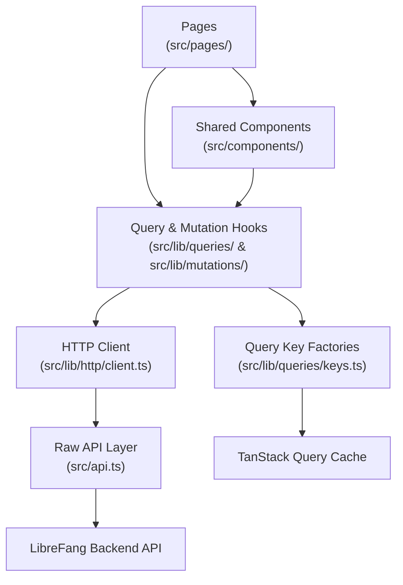

# Other — librefang-api-dashboard

# LibreFang API Dashboard

## Overview

The dashboard is a single-page application that provides a web interface for the LibreFang autonomous agent operating system. It exposes management and monitoring capabilities for agents, sessions, approvals, communication channels, skills, hands (multi-agent orchestrations), workflows, scheduling, memory, analytics, and runtime configuration.

Built on React 19 with TanStack Router v1 for file-based routing and TanStack Query v5 for server-state management, the dashboard enforces a strict layered architecture where UI components never call the API directly—all data access flows through a shared hooks layer.

## Architecture



## Tech Stack

| Layer | Technology |
|---|---|
| UI Framework | React 19 |
| Routing | TanStack Router v1 |
| Server State | TanStack Query v5 |
| State Management | Zustand v5 |
| Styling | Tailwind CSS v4 (with custom semantic palette) |
| Build | Vite 7 |
| Type Generation | openapi-typescript |
| Terminal Emulation | xterm.js |
| Charts | Recharts |
| Animations | Motion (Framer Motion) |
| i18n | i18next + react-i18next |
| TOML Parsing | smol-toml |
| Testing | Vitest + Testing Library + Playwright |
| Package Manager | pnpm 10 |

## Project Structure

```
dashboard/
├── e2e/                          # Playwright end-to-end tests
│   └── dashboard.spec.ts
├── public/
│   ├── manifest.json             # PWA manifest
│   ├── sw.js                     # Service worker (stale-while-revalidate)
│   ├── icon-192.png
│   └── icon-512.png
├── src/
│   ├── main.tsx                  # Application entry point
│   ├── api.ts                    # Raw API calls + auth helpers
│   ├── api.test.ts
│   ├── index.css                 # Tailwind config, theme variables, animations
│   ├── components/
│   │   └── ui/
│   │       ├── DeliveryTargetsEditor.tsx   # Schedule delivery target builder
│   │       ├── MultiSelectCmdk.tsx         # Command-palette multi-select
│   │       └── *.test.tsx
│   ├── pages/                    # Route page components
│   └── lib/
│       ├── http/
│       │   ├── client.ts         # Thin typed wrapper over src/api.ts
│       │   └── errors.ts         # ApiError class
│       ├── queries/
│       │   ├── keys.ts           # All query-key factories
│       │   ├── keys.test.ts      # Factory existence & anchoring tests
│       │   └── <domain>.ts       # queryOptions + useXxx hooks per domain
│       ├── mutations/
│       │   └── <domain>.ts       # useXxx mutation hooks with invalidation
│       ├── agentManifest.ts      # TOML manifest parser/serializer/validator
│       ├── agentManifestMarkdown.ts  # Manifest → Markdown renderer
│       ├── chat.ts               # Chat message normalization utilities
│       ├── chatPicker.ts         # Agent/hand grouping for chat picker UI
│       ├── csvParser.ts          # RFC-4180 CSV parser (user import)
│       └── test/
│           └── query-client.ts   # Shared test helpers (createQueryClientWrapper)
├── package.json
├── playwright.config.ts
└── vite.config.ts
```

**Query/mutation domain files** currently exist for: `agents`, `analytics`, `approvals`, `channels`, `config`, `goals`, `hands`, `mcp`, `media`, `memory`, `models`, `network`, `overview`, `plugins`, `providers`, `runtime`, `schedules`, `sessions`, `skills`, and `workflows`.

## Data Layer

The data layer is the most architecturally significant part of the dashboard. It enforces a strict separation: pages and components never call `fetch()` or `api.*` directly—they import hooks from `src/lib/queries/` and `src/lib/mutations/`.

### HTTP Client & Error Handling

`src/lib/http/client.ts` wraps `src/api.ts` with typed re-exports. All API calls go through this layer. `src/lib/http/errors.ts` defines the `ApiError` class used for structured error handling.

### Authentication

Authentication is token-based. The API layer (`src/api.ts`) provides these helpers:

- **`setApiKey(token)`** / **`clearApiKey()`** — store/remove a bearer token in `localStorage` under the key `librefang-api-key`.
- **`getStoredApiKey()`** — retrieves the token; `buildHeaders()` automatically injects it as `Authorization: Bearer <token>`.
- **`verifyStoredAuth()`** — probes a protected endpoint; on 401, clears the stale token and returns `false`.
- **`buildAuthenticatedWebSocketUrl(path)`** — appends `?token=...` to WebSocket URLs for terminal/session streams.

The dashboard supports a credentials-based sign-in flow. When `/api/auth/dashboard-check` returns `{ mode: "credentials" }`, a sign-in dialog is presented.

### Query Key Factories

All cache keys live in `src/lib/queries/keys.ts`. Each domain has a factory object that produces hierarchical keys anchored to a root `all` key. This design enables precise invalidation: a mutation can invalidate just `agentKeys.detail("abc")`, all lists via `agentKeys.lists()`, or the entire domain via `agentKeys.all`.

```ts
// Canonical factory pattern
export const fooKeys = {
  all: ["foo"] as const,
  lists: () => [...fooKeys.all, "list"] as const,
  list: (filters: FooFilters = {}) => [...fooKeys.lists(), filters] as const,
  details: () => [...fooKeys.all, "detail"] as const,
  detail: (id: string) => [...fooKeys.details(), id] as const,
};
```

Every sub-key **must** be anchored with `...fooKeys.all`. Tests in `keys.test.ts` verify this anchoring—run them after any change to the key factories.

### Query Hooks

Each domain file in `src/lib/queries/` exports a `queryOptions` factory and a `useXxx` hook:

```ts
export const fooQueryOptions = (filters?: FooFilters) =>
  queryOptions({
    queryKey: fooKeys.list(filters ?? {}),
    queryFn: () => listFoo(filters),
    staleTime: 30_000,
  });

export function useFoo(filters?: FooFilters, options: UseFooOptions = {}) {
  return useQuery({
    ...fooQueryOptions(filters),
    enabled: options.enabled,
    staleTime: options.staleTime,
    refetchInterval: options.refetchInterval,
  });
}
```

Hooks accept an optional `options` bag (`enabled`, `staleTime`, `refetchInterval`) so call sites can override per-page needs without duplicating query definitions. Call-site overrides must include an inline comment explaining why (e.g., bell-icon polls fast but is gated by tab visibility).

### Mutation Hooks

Mutations live in `src/lib/mutations/<domain>.ts`. **Every write operation invalidates relevant queries**, and invalidation logic lives inside the hook—callers never need to know which keys are affected.

Invalidation scope follows a strict hierarchy (from narrowest to broadest):

| Scope | When to use | Example mutations |
|---|---|---|
| `fooKeys.detail(id)` + `fooKeys.lists()` | Per-id update where the list projection also changes | `usePatchAgent`, `usePatchAgentConfig`, experiment mutations |
| `fooKeys.lists()` | List-shape change with no existing detail to refresh | `useCreateAgent`, `useDeleteAgent`, `useCloneAgent` |
| `fooKeys.detail(id)` or nested sub-key | Change scoped to one detail, list unaffected | `useSwitchAgentSession` |
| `fooKeys.all` | Bulk import, cache reset, cross-cutting changes | `useActivateHand`, `useResolveApproval` |

Fan-out trade-off: invalidating `fooKeys.all` while N items are cached refetches every list plus every cached detail and nested sub-key for each item. Use it only when all sub-keys are genuinely stale.

Call sites may attach their own `onSuccess`/`onError` handlers for UI feedback (toasts, modal dismissal), but these are orthogonal to invalidation.

### Cross-Domain Invalidation

Some mutations touch multiple domains. For example:

- **`useActivateHand`** invalidates `handKeys.all` + `agentKeys.all` + `overviewKeys.snapshot()`
- **`useSetDefaultProvider`** invalidates `providerKeys.all` + `modelKeys.lists` + `runtimeKeys.status()`
- **`useCreateAgentSession`** invalidates `agentKeys.sessions(agentId)` + `agentKeys.detail(agentId)` + `sessionKeys.lists()`
- **`useRunWorkflow`** invalidates `workflowKeys.lists()` + `workflowKeys.runs(workflowId)` + `workflowKeys.runDetail(runId)`

### Adding a New Endpoint

1. Add the raw call in `src/api.ts` (or re-export via `src/lib/http/client.ts`).
2. Add a key factory in `src/lib/queries/keys.ts` following the hierarchical pattern.
3. Add query options + `useXxx` hook in `src/lib/queries/<domain>.ts`.
4. Add mutation hooks in `src/lib/mutations/<domain>.ts` with appropriate invalidation.
5. Add test cases in `keys.test.ts`.

## Key Libraries & Utilities

### Agent Manifest (TOML)

`src/lib/agentManifest.ts` handles parsing, validating, and serializing agent configuration TOML files. This powers the agent creation/editing UI.

- **`parseManifestToml(toml)`** → `{ ok: true, form, extras }` or `{ ok: false, message }`. Extracts known fields into a structured `form` state; unrecognized fields are preserved in `extras` for round-trip fidelity.
- **`serializeManifestForm(form, extras?)`** → TOML string. Emits hand-tuned field ordering, omits empty/default values, and handles mutual exclusion (e.g., `exec_policy` shorthand vs. `[exec_policy]` table).
- **`validateManifestForm(form)`** → array of error field paths (e.g., `["name", "model.provider"]`).

**Notable edge cases handled:**
- TOML special character escaping (quotes, backslashes, newlines)
- Numeric field validation (rejects negatives, out-of-range, non-numeric input)
- `exec_policy` alias normalization (`"none"` → `"deny"`, `"all"` → `"full"`, etc.)
- Nested sub-table extras inside `[model]` don't break TOML section scoping
- `response_format` mutual exclusion between form-mode and preserved extras
- Per-fallback-model `extra_params` (e.g., Qwen's `enable_memory`) round-trip correctly

### Agent Manifest Markdown

`src/lib/agentManifestMarkdown.ts` renders a manifest as human-readable Markdown for preview/export. Empty sections (resources, capabilities) are omitted. An "Advanced configuration" section is appended when extras are present.

### CSV Parser

`src/lib/csvParser.ts` provides RFC-4180-compliant CSV parsing:

- **`parseCsvText(text)`** — handles BOM stripping, quoted fields with embedded newlines/commas, escaped double-quotes, CRLF/CR/LF line endings, and avoids phantom trailing records.
- **`parseUsersCsv(text, validRoles)`** — validates required `name`/`role` columns, treats unknown columns as channel bindings, flags invalid roles while still surfacing rows for preview.

### Chat Utilities

`src/lib/chat.ts` normalizes API message shapes for display:

- **`normalizeRole(role)`** — lowercases API role strings (`"User"` → `"user"`)
- **`asText(content)`** — converts unknown content types to string representation
- **`formatMeta(meta)`** — formats usage metadata (`"12 in / 34 out | 2 iter | $0.0012"`)
- **`normalizeToolOutput(event)`** — extracts tool output events for persistent display, filtering malformed events

### Chat Picker

`src/lib/chatPicker.ts` handles the grouping logic for the agent selection UI in chat:

- **`groupedPicker(agents, hands, showHandAgents)`** — when `showHandAgents` is true, groups hand-spawned agents under their hand instance header (coordinator first, then alphabetical by role); standalone agents remain separate. Inactive/paused hands and empty hand instances are hidden. Hand-spawned agents never fall back to the standalone list when grouping is enabled.

### Delivery Target Editor

`src/components/ui/DeliveryTargetsEditor.tsx` validates schedule delivery targets with four target types:

- **Channel** — requires `channel_type` and `recipient`; optional `thread_id` and `account_id` are stripped when empty
- **Webhook** — requires HTTPS URL; blocks SSRF targets (localhost, loopback, link-local 169.254.169.254, metadata.google.internal, IPv6 `[::1]`); empty `auth_header` is stripped
- **Local file** — requires relative path; rejects absolute paths (Unix and Windows), path traversal (`..`)
- **Email** — requires `to` address; empty `subject_template` is stripped

### Multi-Select Component

`src/components/ui/MultiSelectCmdk.tsx` is a command-palette-based multi-select widget built on `cmdk`. It supports keyboard navigation (Backspace removes last chip), search filtering, and hides already-selected options from the dropdown.

## Service Worker & PWA

The dashboard is an installable PWA:

- **`manifest.json`** configures standalone display, dark theme, and app icons.
- **`sw.js`** implements a stale-while-revalidate caching strategy for static assets. API requests (`/api/*`) always bypass the cache (network-only). Only GET requests are cached.
- The service worker is registered in `index.html` with a silent catch for environments that don't support it.

## Styling & Theming

### Dual-Mode Semantic Palette

The CSS in `src/index.css` defines light and dark mode through CSS custom properties:

| Token | Light | Dark |
|---|---|---|
| `--brand-color` | Sky 600 (`#0284c7`) | Sky 400 (`#38bdf8`) |
| `--bg-main` | `#f8fafc` | `#020617` |
| `--bg-surface` | `#ffffff` | `rgba(15,23,42,0.92)` |

Dark mode is activated via the `.dark` class (not `prefers-color-scheme`), enabling user toggle. A `@custom-variant dark` directive ensures Tailwind utilities respect this class.

### Animation System

Apple-inspired spring curves are defined as CSS variables (`--apple-spring`, `--apple-ease`, `--apple-bounce`). The `.card-glow` utility provides hover depth and glow effects. Actual animation variants live in `src/lib/motion.ts` and per-component files; `prefers-reduced-motion` is handled per-variant via `useReducedMotion`.

### Custom Breakpoints

Tailwind v4 defaults stop at 1536px. The dashboard adds `3xl` (1920px) and `4xl` (2560px) breakpoints for QHD/4K displays, enabling 5-wide and 6-wide card grids.

### Safe Area Utilities

Custom utilities (`pb-safe`, `pb-safe-2`, `pb-safe-4`, `pt-safe`, `pl-safe`, `pr-safe`) use `env(safe-area-inset-*)` to handle iOS home indicator and Android gesture navigation bar insets.

## Testing Strategy

### Unit Tests (Vitest + Testing Library)

Unit tests cover:

- **API layer** (`api.test.ts`) — auth token injection, WebSocket URL building, config patching, tool management
- **Query key factories** (`keys.test.ts`) — existence checks and anchoring validation
- **Mutation hooks** (`lib/mutations/*.test.tsx`) — verify exact invalidation keys using a shared `createQueryClientWrapper` helper from `lib/test/query-client.ts`
- **Utility libraries** — TOML round-trips, CSV parsing, chat normalization, delivery target validation, multi-select behavior

Mutation tests follow a consistent pattern: spy on `queryClient.invalidateQueries`, fire the mutation, assert exact key calls. This catches both missing invalidations and overly broad ones (e.g., `usePatchAgentConfig` tests verify it does **not** invalidate `handKeys.details()`).

### End-to-End Tests (Playwright)

`e2e/dashboard.spec.ts` verifies:

- The dashboard shell loads with all navigation links visible (Overview, Agents, Sessions, Approvals, Comms, Providers, Channels, Skills, Hands, Workflows, Scheduler, Goals, Analytics, Memory, Runtime, Logs)
- Navigation between pages works
- The sign-in dialog appears when the auth endpoint returns `{ mode: "credentials" }`

Playwright runs against the Vite dev server on port 4173.

## Build & Development

```bash
pnpm dev                    # Start Vite dev server
pnpm build                  # Production build (must succeed)
pnpm preview                # Preview production build
pnpm typecheck              # TypeScript strict check (tsc --noEmit)
pnpm test                   # Run Vitest unit tests
pnpm test:watch             # Vitest in watch mode
pnpm e2e                    # Playwright end-to-end tests
pnpm openapi:types          # Regenerate types from OpenAPI spec
```

After any change to `src/lib/queries/`, `src/lib/mutations/`, or `src/api.ts`, run all three verification steps:

```bash
pnpm typecheck && pnpm test --run && pnpm build
```

A passing typecheck alone is insufficient—the key-factory tests catch anchoring regressions that TypeScript does not.

## Conventions

- **TypeScript strict mode** — no `any` in new hooks; types come from `src/api.ts` or `openapi/generated.ts`
- **Commit format** — `feat(dashboard/<area>):`, `refactor(dashboard/queries):`, `fix(dashboard/<area>):`. No `Co-Authored-By` footers.
- **Query key construction** — always use factory functions; never build keys inline
- **Data deduplication** — never subscribe to the same endpoint with a different key for a subset; use `select` on shared `queryOptions`
- **Mutation invalidation** — always inside the hook; call sites may add UI callbacks but must not manage cache invalidation
- **Exceptions for non-cached data** — streaming/SSE, imperative fire-and-forget control channels (e.g., `TerminalTabs.tsx` terminal lifecycle), and one-shot probes may call `fetch` directly. Keep these narrow and comment why.