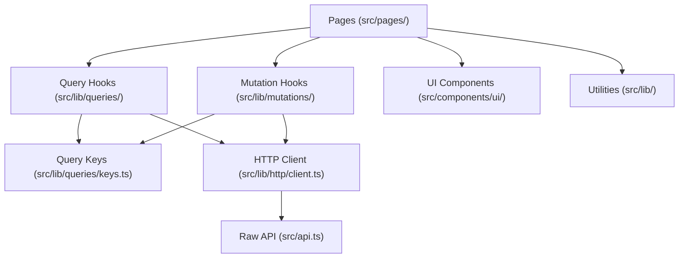

# Other — librefang-api-dashboard

# LibreFang API Dashboard

## Overview

The dashboard is a single-page application for managing and monitoring the LibreFang autonomous agent operating system. It provides real-time visibility into agents, sessions, approvals, channels, hands, workflows, schedules, and analytics through a React 19 frontend built on TanStack Router and TanStack Query.

**Entry point:** `src/main.tsx`  
**Pages:** `src/pages/`  
**Build tooling:** Vite 8 + TypeScript strict + Tailwind CSS 4

## Architecture



Pages never call `fetch()` or `src/api.ts` directly — all data access flows through the hooks layer in `src/lib/queries/` and `src/lib/mutations/`.

## Data Layer

### Directory Layout

```
src/lib/
  http/
    client.ts          # Thin wrapper over src/api.ts + typed re-exports
    errors.ts          # ApiError class
  queries/
    keys.ts            # All query-key factories
    keys.test.ts       # Smoke tests for factories
    <domain>.ts        # queryOptions + useXxx hooks per domain
  mutations/
    <domain>.ts        # useXxx mutation hooks with cache invalidation
```

### Query Key Factories

Every domain defines a hierarchical key factory in `src/lib/queries/keys.ts`. Each sub-key is anchored to `all` so broad invalidation works:

```ts
export const fooKeys = {
  all: ["foo"] as const,
  lists: () => [...fooKeys.all, "list"] as const,
  list: (filters: FooFilters = {}) => [...fooKeys.lists(), filters] as const,
  details: () => [...fooKeys.all, "detail"] as const,
  detail: (id: string) => [...fooKeys.details(), id] as const,
};
```

Current domains: `agents`, `analytics`, `approvals`, `channels`, `config`, `goals`, `hands`, `mcp`, `media`, `memory`, `models`, `network`, `overview`, `plugins`, `providers`, `runtime`, `schedules`, `sessions`, `skills`, `workflows`.

### Query Hooks

Each domain file exports a `queryOptions` factory and a `useXxx` wrapper:

```ts
export const fooQueryOptions = (filters?: FooFilters) =>
  queryOptions({
    queryKey: fooKeys.list(filters ?? {}),
    queryFn: () => listFoo(filters),
    staleTime: 30_000,
  });

export function useFoo(filters?: FooFilters, options: UseFooOptions = {}) {
  return useQuery({
    ...fooQueryOptions(filters),
    enabled: options.enabled,
    staleTime: options.staleTime,
    refetchInterval: options.refetchInterval,
  });
}
```

The optional `UseFooOptions` argument lets call sites override `enabled`, `staleTime`, and `refetchInterval` per-page. Every override carries an inline comment explaining why. Examples from the codebase:

- `useApprovals({ enabled: open })` — gates polling to when the panel is open
- `useCommsEvents(50, { refetchInterval: 5_000 })` — fast poll for live comms
- `useModels({}, { enabled: isModelArg })` — skips fetch when irrelevant
- `useApprovalCount({ refetchInterval: 5_000 })` — bell-icon badge refresh

### Mutation Hooks

Mutations live in `src/lib/mutations/<domain>.ts`. Cache invalidation is always inside the hook — callers never need to know which keys are touched.

Invalidation must target the narrowest key set that covers what changed:

| Scenario | Keys to invalidate | Example |
|----------|-------------------|---------|
| Per-id update where list projection changes | `fooKeys.lists()` + `fooKeys.detail(id)` | `usePatchAgentConfig`, `usePatchAgent` |
| List-shape change, no existing detail | `fooKeys.lists()` | `useCreateAgentSession`, `useDeleteAgentSession` |
| Scoped to one detail, list unaffected | `fooKeys.detail(id)` or nested sub-key | `useSetHandSecret` |
| Bulk import / cross-cutting reset | `fooKeys.all` | `useActivateHand` |

Fan-out trade-off: invalidating `fooKeys.all` while N items are cached refetches the list plus every cached sub-key for each of the N items. Reserve `all` for genuinely cross-cutting mutations.

Callers may attach per-call `onSuccess`/`onError` for UI feedback (toasts, modal dismissal). This is orthogonal to invalidation. See `MemoryPage` delete/cleanup and `ChannelsPage` configure/test for the pattern.

### Adding a New Endpoint

1. Add the raw call in `src/api.ts` (or re-export via `src/lib/http/client.ts`).
2. If new domain, add a factory in `src/lib/queries/keys.ts` following the hierarchical pattern.
3. Add `queryOptions` + `useXxx` in `src/lib/queries/<domain>.ts`.
4. Add mutations in `src/lib/mutations/<domain>.ts` with proper invalidation.
5. Update `src/lib/queries/keys.test.ts` — add factory to the existence list, add anchoring/hierarchy tests.

### Exceptions

Streaming/SSE, imperative fire-and-forget control channels (e.g. `TerminalTabs.tsx` terminal lifecycle), and one-shot probes that must not be cached may call `fetch` directly. Keep these narrow and comment why.

## Authentication

The dashboard uses bearer-token authentication stored in `sessionStorage` under the key `librefang-api-key`.

- **`setApiKey(token)`** — stores in `sessionStorage` only (not `localStorage`)
- **`getStoredApiKey()`** — reads from `sessionStorage`
- **`verifyStoredAuth()`** — probes a protected endpoint; returns `false` and clears the token on 401
- **`buildAuthenticatedWebSocket(path)`** — constructs a `ws://` URL and passes the token as a `Sec-WebSocket-Protocol` sub-protocol (`bearer.<token>`)

All API calls go through `buildHeaders()` → `authHeader()` → `getStoredApiKey()`. When a request returns 401, `parseError()` calls `clearApiKey()` to strip the stale token.

The sign-in dialog renders when `/api/auth/dashboard-check` returns `mode: "credentials"`.

## API Layer (`src/api.ts`)

Thin wrappers over `fetch()` that handle:

- **Bearer token injection** via `buildHeaders()`
- **Error parsing** via `parseError()` — returns typed `ApiError` instances
- **Request methods**: `get()`, `post()`, `put()`, `patch()`, `del()` with JSON serialization
- **WebSocket URL construction** via `buildAuthenticatedWebSocket()`

Notable functions:
- `patchAgentConfig(agentId, config)` — PATCH `/api/agents/{id}/config`
- `patchHandAgentRuntimeConfig(agentId, config)` — PATCH `/api/agents/{id}/hand-runtime-config` (trims whitespace-only tri-state fields before sending)
- `getAgentTools(agentId)` / `updateAgentTools(agentId, body)` — GET/PUT agent tool allowlists
- `listTools()` — handles both wrapped `{tools: [...]}` and direct array responses

## UI Components

### Modal (`src/components/ui/Modal.tsx`)

Shared modal shell supporting three variants:

| Variant | Layout | Backdrop | Dismissal |
|---------|--------|----------|-----------|
| `modal` (default) | Centered, max-h 90vh | Dim + blur | Backdrop click, Esc |
| `drawer-right` | Right-docked, full height | None | Esc, explicit close button |
| `panel-right` | Right-docked, full height | Dim + blur | Backdrop click, Esc |

All variants include focus trapping (except drawer, which leaves Tab free for list navigation), `aria-modal`/`role="dialog"`, focus restoration on close, and enter/exit animations via Framer Motion's `AnimatePresence`.

The drawer variant uses `pointer-events-none` on the container so the underlying page remains interactive — users can click another row in a list to switch the drawer content without dismissing first.

**Nesting:** Backdrop clicks call `stopPropagation()` to prevent closing an ancestor modal when a nested modal is dismissed.

### ConfirmDialog (`src/components/ui/ConfirmDialog.tsx`)

Styled replacement for `window.confirm()`. Supports a `tone` prop — `destructive` renders the confirm button in error colors and disables Enter-to-confirm to prevent accidental data loss. Non-destructive dialogs confirm on Enter (except when focus is in a textarea/input/contenteditable).

### MultiSelectCmdk (`src/components/ui/MultiSelectCmdk.tsx`)

Command-menu-based multi-select built on `cmdk`. Features:

- Chip display of selected values with remove buttons
- Backspace removes last selected item
- Type-ahead search filters the dropdown
- Already-selected items are hidden from the list
- Controlled via `value`/`onChange` props

## Agent Manifest System

The dashboard includes a full TOML-based agent manifest parser/serializer for the agent configuration editor.

### Parser (`parseManifestToml`)

Parses TOML into a structured `form` + `extras` split:

- **Form fields** are first-class properties the editor UI manages directly (name, model provider, temperature, capabilities, etc.)
- **Extras** are everything the form doesn't explicitly handle — preserved for round-trip fidelity

Handles: `response_format` (including nested JSON schemas), `exec_policy` aliases (normalizes `none`/`disabled` → `deny`, `restricted` → `allowlist`, `all`/`unrestricted` → `full`), `fallback_models` with per-model `extras` (provider-specific fields like Qwen's `enable_memory`), `schedule` variants (periodic/continuous), `thinking`, `autonomous`, `routing`, `context_injection`.

### Serializer (`serializeManifestForm`)

Produces deterministic TOML with a hand-tuned field order. Handles:

- Mutual exclusion between shorthand form fields and preserved extras tables (e.g. if user picks `exec_policy = "deny"` in the form, the preserved `[exec_policy]` table is suppressed to avoid TOML key/table redefinition conflicts)
- Negative and out-of-range integer validation (silently omits invalid values)
- Escaping special characters in strings
- Empty numeric fields are omitted entirely
- Nested-table extras never break section scoping

### Markdown Generator (`generateManifestMarkdown`)

Produces a human-readable markdown summary of an agent manifest for documentation/preview purposes. Sections (resources, capabilities, lifecycle overrides, advanced configuration) are only emitted when populated.

## Utility Modules

### Chat Utilities (`src/lib/chat.ts`)

- `normalizeRole()` — normalizes API message roles (`User` → `user`)
- `asText()` — converts unknown content blocks to text
- `formatMeta()` — formats token usage metadata
- `normalizeToolOutput()` — normalizes tool output events for persistent display, filtering malformed entries

### Chat Picker (`src/lib/chatPicker.ts`)

`groupedPicker(agents, hands, showHandAgents)` partitions agents into:

- **Standalone** — non-hand agents, always shown
- **Hand groups** — hand instances with their member agents, shown when `showHandAgents` is true

Hand groups are sorted alphabetically by name. Agents within a group are ordered: coordinator first, then alphabetical by role. Inactive hands and hands with empty `agent_ids` are hidden entirely.

### CSV Parser (`src/lib/csvParser.ts`)

RFC-4180 compliant CSV parser handling:

- UTF-8 BOM stripping
- Embedded newlines and commas in quoted fields
- Escaped double-quotes (`""`)
- CRLF and CR line endings
- No phantom records from trailing newlines

`parseUsersCsv()` validates name/role columns, flags invalid roles while still surfacing rows for preview, and maps unknown columns to `channel_bindings`.

### Agent Tools Editor

`DeliveryTargetsEditor` validates delivery targets with SSRF protection — rejects `localhost`, `127.0.0.1`, `::1`, `169.254.169.254`, `metadata.google.internal`, and non-http(s) schemes. Local file targets reject absolute paths and `..` traversal.

## Theming and Styling

### CSS Architecture (`src/index.css`)

Tailwind CSS 4 with custom semantic palette driven by CSS custom properties:

```
--color-brand          --color-success       --color-warning
--color-error          --color-accent        --color-surface
--color-surface-hover  --color-border-subtle --color-text-dim
```

Light and dark mode palettes are defined on `:root` and `:root.dark` respectively. Dark mode uses translucent surfaces (`rgba`) with a radial gradient background.

Custom breakpoints `3xl` (1920px) and `4xl` (2560px) support wide displays — card grids can go 5-wide on QHD and 6-wide on 4K.

### Animation System

Apple-style animations with CSS custom properties for easing curves (`--apple-spring`, `--apple-ease`, `--apple-bounce`). Animated components use Framer Motion (`motion/react`) with shared variants from `src/lib/motion.ts`.

Utility classes: `card-glow` (hover depth + brand glow), `animate-pulse-soft`, `animate-shimmer`, `animate-rise`, `animate-glow-ring`, `bg-grid`.

### Safe Area Insets

Utilities for iOS/Android safe areas: `pb-safe`, `pb-safe-2`, `pb-safe-4`, `pt-safe`, `pl-safe`, `pr-safe` — use `env(safe-area-inset-*)` with sensible fallbacks.

## Service Worker (`public/sw.js`)

Precaches `/dashboard/` on install. API requests (`/api/*`) are network-only. Static assets use stale-while-revalidate strategy. Only caches GET requests.

## PWA Support

`public/manifest.json` configures the dashboard as a standalone PWA with `start_url: /dashboard/#/overview`, theme color `#020617`, and icons at 192px and 512px.

## Testing

### Unit Tests

Run with `pnpm test` (Vitest). Key test files:

| Area | Files |
|------|-------|
| Query key factories | `src/lib/queries/keys.test.ts` |
| Mutation invalidation | `src/lib/mutations/agents.test.tsx`, `agents-experiments.test.tsx`, `hands.test.tsx` |
| API helpers | `src/api.test.ts` |
| Agent manifest | `src/lib/agentManifest.test.ts`, `agentManifestMarkdown.test.ts` |
| Chat utilities | `src/lib/chat.test.ts`, `chatPicker.test.ts` |
| CSV parsing | `src/lib/csvParser.test.ts` |
| UI components | `src/components/ui/*.test.tsx` |

Mutation tests use `createQueryClientWrapper` from `src/lib/test/query-client.tsx` to spy on `queryClient.invalidateQueries` and verify the exact keys each mutation touches.

### E2E Tests

Run with `pnpm e2e` (Playwright). Tests in `e2e/dashboard.spec.ts` verify:

- Dashboard shell loads with all navigation links
- Navigation between pages works
- Sign-in dialog appears when credentials are required

Playwright config (`playwright.config.ts`) starts the dev server on `127.0.0.1:4173` with 30s timeout and trace-on-first-retry.

## Build and Verification

Run all three after any change to `src/lib/queries/`, `src/lib/mutations/`, or `src/api.ts`:

```bash
pnpm typecheck          # tsc --noEmit
pnpm test --run         # vitest
pnpm build              # vite build
```

A passing typecheck alone is insufficient — the key-factory tests catch anchoring regressions that the compiler does not.

## OpenAPI Types

Generate TypeScript types from the backend's OpenAPI schema:

```bash
pnpm openapi:types      # openapi-typescript → openapi/generated.ts
```

New hooks should lean on these generated types rather than introducing `any`.

## Commit Convention

Follows the root repo pattern scoped to `dashboard`:

```
feat(dashboard/<area>): ...
refactor(dashboard/queries): ...
fix(dashboard/<area>): ...
```

Never include a `Co-Authored-By` footer.