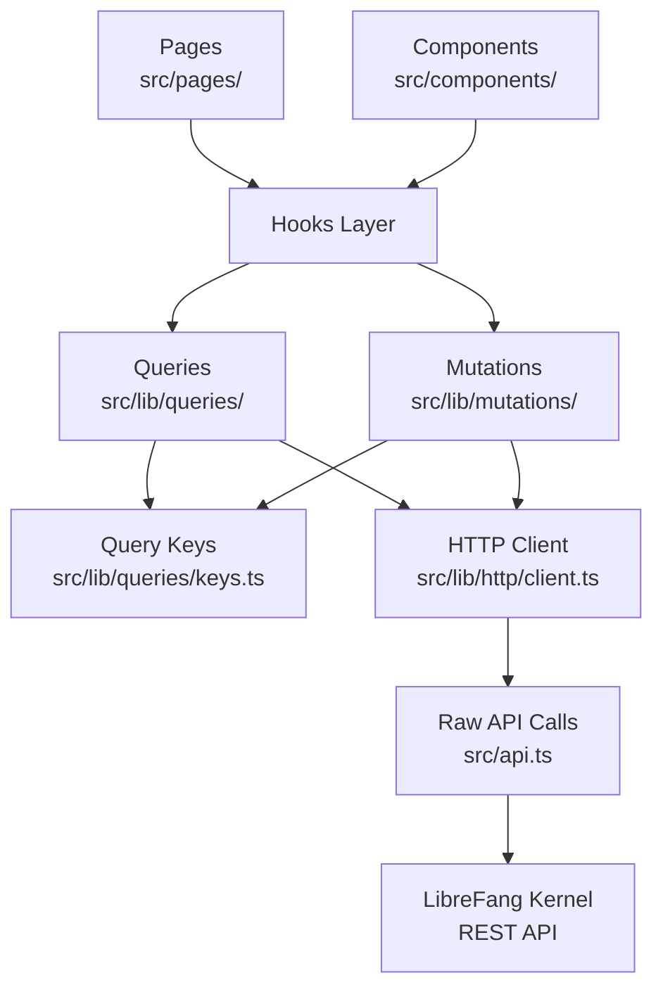

# Other — librefang-api-dashboard

# LibreFang API Dashboard

## Overview

The dashboard is a single-page application for managing and monitoring LibreFang agents. Built on **React 19**, **TanStack Router v1**, and **TanStack Query v5**, it provides a real-time interface to the LibreFang kernel's REST API for agent lifecycle management, session control, channel configuration, memory inspection, analytics, and more.

**Entry point:** `src/main.tsx`  
**Page components:** `src/pages/`  
**HTML shell:** `index.html` (mounts `<div id="root">`, registers service worker)

---

## Architecture



All data flows one direction: pages and components consume hooks from the shared queries/mutations layer, which calls through the HTTP client to `src/api.ts`, which communicates with the backend.

---

## Data Layer

### Core Rule

**Pages and components never call `fetch()` or `api.*` directly.** All data access goes through the hooks layer. The only exceptions are streaming/SSE endpoints, imperative fire-and-forget control channels (e.g., `src/components/TerminalTabs.tsx` terminal lifecycle), and one-shot probes that must not be cached. These exceptions must be narrow and commented.

### Directory Layout

```
src/lib/
  http/
    client.ts      # Thin wrapper over src/api.ts + typed re-exports
    errors.ts      # ApiError class used by the wrapper
  queries/
    keys.ts        # All query-key factories — edit when adding a domain
    keys.test.ts   # Smoke tests — add cases when adding a factory
    <domain>.ts    # queryOptions + useXxx hooks per domain
  mutations/
    <domain>.ts    # useXxx mutation hooks with cache invalidation
```

### Active Domains

`agents` · `analytics` · `approvals` · `channels` · `config` · `goals` · `hands` · `mcp` · `media` · `memory` · `models` · `network` · `overview` · `plugins` · `providers` · `runtime` · `schedules` · `sessions` · `skills` · `workflows`

---

## Adding a New Endpoint

### Step 1: Raw API Call

Add the raw call in `src/api.ts`. If needed, re-export via `src/lib/http/client.ts`.

### Step 2: Query Key Factory

If this is a new domain, add a factory in `src/lib/queries/keys.ts`. Every sub-key **must** be anchored with `...fooKeys.all` so broad invalidation works correctly:

```ts
export const fooKeys = {
  all: ["foo"] as const,
  lists: () => [...fooKeys.all, "list"] as const,
  list: (filters: FooFilters = {}) => [...fooKeys.lists(), filters] as const,
  details: () => [...fooKeys.all, "detail"] as const,
  detail: (id: string) => [...fooKeys.details(), id] as const,
};
```

### Step 3: Query Hook

Add the query in `src/lib/queries/<domain>.ts`:

```ts
export const fooQueryOptions = (filters?: FooFilters) =>
  queryOptions({
    queryKey: fooKeys.list(filters ?? {}),
    queryFn: () => listFoo(filters),
    staleTime: 30_000,
  });

export function useFoo(filters?: FooFilters) {
  return useQuery(fooQueryOptions(filters));
}
```

Accept an optional `options` argument for per-call overrides (see [Query Options Override Pattern](#query-options-override-pattern)):

```ts
type UseFooOptions = {
  enabled?: boolean;
  staleTime?: number;
  refetchInterval?: number | false;
};

export function useFoo(filters?: FooFilters, options: UseFooOptions = {}) {
  const { enabled, staleTime, refetchInterval } = options;
  return useQuery({
    ...fooQueryOptions(filters),
    enabled,
    staleTime,
    refetchInterval,
  });
}
```

### Step 4: Mutation Hook

Add mutations in `src/lib/mutations/<domain>.ts`. **Every write must invalidate**, and invalidation must live inside the hook. Call sites may attach per-call `onSuccess`/`onError` for UI feedback — that is orthogonal to invalidation.

**Prefer the narrowest matching keys.** Use `fooKeys.all` only when the mutation truly dirties every sub-key in the domain.

**Invalidation strategy guide:**

| Scenario | Keys to Invalidate | Example |
|---|---|---|
| Per-id update where list projection changes (default) | `fooKeys.lists()` + `fooKeys.detail(id)` | `usePatchAgentConfig`, experiment mutations |
| List-shape change, no existing detail stale | `fooKeys.lists()` | Create, delete, reorder |
| Change scoped to one detail or nested collection | `fooKeys.detail(id)` or nested sub-key | Detail-only update |
| Bulk import / cache reset / cross-cutting migration | `fooKeys.all` | Bulk import |

**Fan-out warning:** Invalidating `fooKeys.all` when N items are cached causes N+1 refetches (the list plus every cached sub-key for each item). Reserve this for genuinely cross-cutting changes.

```ts
// Default template: per-id patch where list projection also changes
export function useUpdateFoo() {
  const qc = useQueryClient();
  return useMutation({
    mutationFn: updateFoo,
    onSuccess: (_data, variables) => {
      qc.invalidateQueries({ queryKey: fooKeys.lists() });
      qc.invalidateQueries({ queryKey: fooKeys.detail(variables.id) });
    },
  });
}

// Lists-only: membership changed
export function useCreateFoo() {
  const qc = useQueryClient();
  return useMutation({
    mutationFn: createFoo,
    onSuccess: () => qc.invalidateQueries({ queryKey: fooKeys.lists() }),
  });
}

// Bulk — NOT the default
export function useImportFoos() {
  const qc = useQueryClient();
  return useMutation({
    mutationFn: importFoos,
    onSuccess: () => qc.invalidateQueries({ queryKey: fooKeys.all }),
  });
}
```

### Step 5: Key Factory Tests

Update `src/lib/queries/keys.test.ts`. At minimum, add the new factory to the "all factories exist" list. Add anchoring/hierarchy tests for non-trivial factories.

---

## Consuming Hooks in Pages

```tsx
import { useFoo } from "../lib/queries/foo";
import { useCreateFoo } from "../lib/mutations/foo";

function FooPage() {
  const { data, isLoading } = useFoo({ active: true });
  const createFoo = useCreateFoo();
  // ...
}
```

**Rules:**
- Never build a `queryKey` inline — always call the factory.
- Never subscribe to the same endpoint with a different key for a subset; use `select` on the shared `queryOptions`.

---

## Query Options Override Pattern

Hooks set sensible defaults via `queryOptions` (shared `staleTime` / `refetchInterval`). Call sites can override per-page needs through the `options` argument. Common patterns:

| Override | Use Case | Example |
|---|---|---|
| `enabled` | Gate query by tab visibility or modal state | `useApprovals({ enabled: open })` |
| `refetchInterval` | Fast polling for live data | `useCommsEvents(50, { refetchInterval: 5_000 })` |
| `enabled` (conditional) | Skip query until prerequisite resolved | `useModels({}, { enabled: isModelArg })` |
| `enabled` (gate) | Pause background fetch when inactive | `useAgentTemplates({ enabled })` |

Every call-site override must carry a short inline comment explaining why.

---

## Mutation Invalidation vs. UI Feedback

Mutation invalidation is encapsulated in the hook — callers never need to know which keys a mutation touches. Call sites may attach per-call `onSuccess`/`onError` handlers for UI feedback (toasts, modal dismissal, local state updates). See `MemoryPage` delete/cleanup and `ChannelsPage` configure/test for reference patterns.

---

## Navigation & Pages

The dashboard shell provides navigation links to these top-level pages:

| Link | Page Component | Purpose |
|---|---|---|
| Overview | OverviewPage | System health and KPI summary |
| Agents | AgentsPage | Agent lifecycle management |
| Sessions | SessionsPage | Session listing and control |
| Approvals | ApprovalsPage | Pending approval queue |
| Comms | CommsPage | Inter-agent communication |
| Providers | ProvidersPage | LLM provider configuration |
| Channels | ChannelsPage | Channel adapter setup |
| Skills | SkillsPage | Skill management |
| Hands | HandsPage | Hand (browser automation) instances |
| Workflows | WorkflowsPage | Workflow orchestration |
| Scheduler | SchedulesPage | Cron job management |
| Goals | GoalsPage | Goal tracking |
| Analytics | AnalyticsPage | Usage analytics and cost |
| Memory | MemoryPage | Proactive memory inspection |
| Runtime | RuntimePage | Runtime diagnostics |
| Logs | LogsPage | Audit log viewer |

---

## Authentication

The dashboard checks authentication mode via `/api/auth/dashboard-check`. When the response returns `{ mode: "credentials" }`, the app presents a sign-in dialog with username/password fields. Other modes (e.g., OAuth providers) are handled via provider-specific flows.

---

## Type System

- **TypeScript strict mode** — no `any` in new hooks.
- **Canonical types** live in `src/api.ts` — the hand-maintained type source consumed by the SPA.
- `openapi/generated.ts` is a **regenerable cross-reference only**. It is not imported anywhere in `src/`. Refresh it with `pnpm openapi:types` (requires a running daemon on port 4545) to get a typed diff against the live OpenAPI schema.

---

## Testing

The test infrastructure uses `vitest` with MSW for API mocking. A shared test utility at `src/lib/test/query-client.tsx` exports `createQueryClientWrapper` for hook tests.

### Test Categories

- **Key factory tests** (`src/lib/queries/keys.test.ts`) — validate anchoring and hierarchy for all query-key factories.
- **Hook tests** (`src/lib/queries/*.test.tsx`, `src/lib/mutations/*.test.tsx`) — verify query options, enabled guards, and mutation invalidation.
- **Page tests** (`src/pages/*.test.tsx`) — component rendering and user interaction.
- **E2E tests** (`e2e/dashboard.spec.ts`) — Playwright tests for shell loading, navigation, and auth dialog.

### Test Helpers

Pages commonly define `renderPage`, `makeQuery`, and `setMutationDefaults` helper functions within their test files to configure MSW handlers and mount components with the correct router/query context.

---

## Build & Verification

Run all three commands after any change to `src/lib/queries/`, `src/lib/mutations/`, or `src/api.ts`:

```bash
pnpm typecheck    # tsc --noEmit — must pass
pnpm test --run   # vitest — all tests must pass
pnpm build        # vite build — must succeed
```

A passing typecheck alone is insufficient — the key-factory tests catch anchoring regressions that the compiler does not detect.

---

## Commit Convention

Follows the root repo format scoped to dashboard areas:

```
feat(dashboard/<area>): ...
refactor(dashboard/queries): ...
fix(dashboard/<area>): ...
```

Never include a `Co-Authored-By` footer.